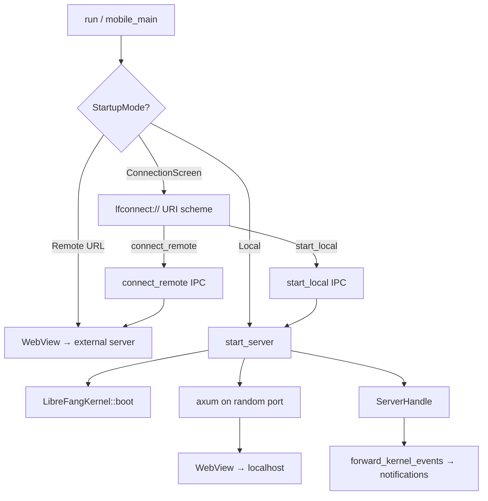

# Desktop Application

# LibreFang Desktop Application

Native desktop and mobile wrapper for the LibreFang Agent OS, built on Tauri 2.0. Boots an embedded kernel + API server or connects to a remote instance, then hosts the WebUI dashboard in a native WebView window with system tray, notifications, global shortcuts, auto-start, and auto-updates.

## Architecture Overview



## Startup Mode Resolution

The app resolves its connection mode at launch from four sources in priority order:

| Priority | Source | Flag / Location |
|----------|--------|-----------------|
| 1 | CLI argument | `--server-url <URL>` → remote mode |
| 2 | Environment variable | `LIBREFANG_SERVER_URL` → remote mode |
| 3 | Saved preference | `~/.librefang/desktop.toml` → remote or local |
| 4 | Connection screen | User picks at runtime | CLI `--local` forces local mode (desktop only) |

If none match, the app opens the connection screen — a self-contained HTML page served through the custom `lfconnect://` URI scheme protocol. This avoids the old `about:blank` + `document.write` approach that broke on WebKitGTK 2.50 (issue #3052).

On mobile (`cfg(mobile)`), local mode is always unavailable — the app is strictly a thin client connecting to a remote daemon.

## Managed State

Tauri managed state is registered once during builder setup with interior-mutable `RwLock` wrappers. State updates (e.g. switching servers) mutate through the locks rather than re-registering.

| Type | Field | Description |
|------|-------|-------------|
| `PortState` | `RwLock<Option<u16>>` | Listening port. `None` in remote mode or before boot. |
| `KernelState` | `RwLock<Option<KernelInner>>` | Kernel instance + `Instant` uptime. `None` in remote mode. |
| `ServerUrlState` | `RwLock<String>` | URL the WebView points at (local or remote). |
| `RemoteMode` | `RwLock<bool>` | `true` when connected to a remote server. |
| `ServerHandleHolder` | `Mutex<Option<ServerHandle>>` | Handle for the embedded server thread (desktop only). |

`KernelInner` holds an `Arc<LibreFangKernel>` and a `started_at: Instant` for uptime reporting.

## Module Breakdown

### `server.rs` — Embedded Server Lifecycle

Desktop-only. Boots the kernel synchronously, binds a `TcpListener` to `127.0.0.1:0` on the calling thread (guaranteeing the port is known before any window is created), then runs the axum server on a dedicated thread with its own multi-thread tokio runtime.

```
start_server()
  → LibreFangKernel::boot(None)
  → TcpListener::bind("127.0.0.1:0")
  → spawn thread → tokio runtime
    → kernel.start_background_agents()
    → kernel.spawn_approval_sweep_task()
    → run_embedded_server()  (axum + graceful shutdown via watch channel)
    → sync_dashboard()       (background, downloads latest WebUI assets)
```

`ServerHandle` owns the shutdown `watch::Sender` and server thread `JoinHandle`. Calling `shutdown()` signals the watch channel, joins the thread, and calls `kernel.shutdown()`. Drop does a best-effort signal without joining (avoids blocking in destructors). Double-shutdown is guarded by an `AtomicBool`.

### `connection.rs` — Connection Screen and Mode Switching

Provides both the connection UI and the IPC commands for runtime server switching.

**IPC commands:**

| Command | Parameters | Description |
|---------|------------|-------------|
| `test_connection` | `url: String` | GET `/api/health` on the target, returns JSON |
| `connect_remote` | `url, remember, window` | Validates URL, health-checks, saves pref, updates state, navigates WebView |
| `start_local` | `remember, app, window` | Boots local server via `crate::server::start_server()`, fills all managed state, starts event forwarding, navigates WebView (desktop only) |

**Connection preference** is serialized as TOML to `~/.librefang/desktop.toml`:

```toml
[connection]
mode = "remote"
server_url = "https://my-server.example.com"
```

**`navigation_target(daemon_url)`** handles the mobile release-build case. On iOS/Android release builds, the dashboard ships embedded in the app bundle. The function returns `tauri://localhost/index.html#api=<encoded-url>` so the bundled dashboard can proxy API/WebSocket requests to the daemon (CORS must allow `tauri://localhost`). On all other builds it returns the daemon URL directly for thin-client navigation.

**`connection_html()`** returns a complete self-contained HTML/CSS/JS page. On mobile, the `btn-local` button, divider, and its JS reference are stripped at compile time via sentinel-based string replacement with `debug_assert!` guards to catch HTML reformatting that would break the extraction.

### `commands.rs` — IPC Command Handlers

All commands are `#[tauri::command]` functions exposed to the frontend via `invoke`.

**Kernel introspection:**

| Command | Returns | Notes |
|---------|---------|-------|
| `get_port` | `u16` | Reads `PortState` |
| `get_status` | JSON `{ status, port, agents, uptime_secs }` | Combines port + kernel state |
| `get_agent_count` | `usize` | Agent registry length |

**Agent/skill import:**

`import_agent_toml` opens a native file picker (`.toml` filter), validates the content as `AgentManifest`, copies to `~/.librefang/workspaces/agents/{name}/agent.toml`, then calls `kernel.spawn_agent(manifest)`.

`import_skill_file` copies the selected file (`.md`, `.toml`, `.py`, `.js`, `.wasm`) to `~/.librefang/skills/` and calls `kernel.reload_skills()`.

**Auto-start** (desktop only):

`get_autostart` / `set_autostart(enabled)` wrap `tauri-plugin-autostart`.

**Updates** (desktop only):

`check_for_updates` returns `UpdateInfo { available, version, body }`. `install_update` downloads, installs, and restarts — does not return on success.

**Credentials** (mobile only):

`store_credentials`, `get_credentials`, `clear_credentials` use the OS keyring via the `keyring` crate. Credentials are stored as JSON `{"base_url": ..., "api_key": ...}` under service `"librefang-mobile"` / account `"daemon-credentials"`.

**File system:**

- `open_config_dir` — opens `~/.librefang/` in OS file manager
- `open_logs_dir` — opens `~/.librefang/logs/` in OS file manager

**Uninstall:**

`uninstall_app` is platform-specific:
- **Windows**: queries `HKCU\Software\Microsoft\Windows\CurrentVersion\Uninstall` for the NSIS `UninstallString`, runs it, exits.
- **macOS**: walks up from the executable to find the `.app` bundle, moves to Trash via `osascript` + Finder.
- **Linux/AppImage**: deletes the AppImage binary. System packages return a hint string (e.g. `sudo apt remove librefang`).
- **Mobile**: returns an error directing the user to the platform app store.

### `shortcuts.rs` — Global Keyboard Shortcuts

Desktop-only. Registers three system-wide shortcuts:

| Shortcut | Action |
|----------|--------|
| `Ctrl+Shift+O` | Show/focus the window |
| `Ctrl+Shift+N` | Show window + emit `"navigate"` event with `"agents"` |
| `Ctrl+Shift+C` | Show window + emit `"navigate"` event with `"chat"` |

The frontend listens for the `navigate` event to handle page transitions. Registration failure is non-fatal — the app logs a warning and continues.

### `tray.rs` — System Tray

Desktop-only. On Linux, additionally gated behind the `linux-tray` Cargo feature due to GTK3 unmaintained-crate advisories (issues RUSTSEC-2024-0411..0420, 0429).

Menu items:

- **Show Window** — focuses the main window
- **Open in Browser** — opens the current server URL (local or remote) in the default browser
- **Change Server...** — shuts down any local server, clears state, navigates back to the connection screen
- **Status info** — displays uptime (local) or remote URL, plus agent count (display-only, disabled)
- **Launch at Login** — `CheckMenuItem` toggling auto-start
- **Check for Updates...** — triggers update check + notification + install if available
- **Open Config Directory** — opens `~/.librefang/`
- **Quit LibreFang** — exits the app

Left-click on the tray icon shows/focuses the window. The close button hides to tray instead of quitting (handled in `on_window_event`).

### `updater.rs` — Auto-Update

Desktop-only. Uses `tauri-plugin-updater`.

`spawn_startup_check` runs after a 10-second delay, probes the update manifest endpoint with a HEAD request (skips the check if the manifest 404s — avoids noisy log spam when no `latest.json` exists yet), then installs silently and restarts.

`check_for_update` and `download_and_install_update` are the on-demand variants called from IPC commands and the tray menu.

### `lib.rs` — Security: URL Validation

`validate_server_url` enforces a critical security policy (issue #3673):

- `https://` is always accepted
- `http://` is **only** accepted for loopback addresses (`127.*`, `localhost`, `[::1]`)
- `http://` to any non-loopback host is rejected to prevent MITM-injected IPC abuse
- URLs with userinfo (`@`) are rejected to prevent loopback-bypass tricks like `http://[::1]@evil.com/`

This validation runs on every `connect_remote`, `test_connection`, and CLI/env URL at startup.

### Event Forwarding

`forward_kernel_events` subscribes to the kernel event bus and surfaces critical events as native OS notifications:

- **Agent Crashed** — `LifecycleEvent::Crashed { agent_id, error }`
- **Kernel Stopping** — `SystemEvent::KernelStopping`
- **Quota Enforced** — `SystemEvent::QuotaEnforced { agent_id, spent, limit }`

Uses `recv_event_skipping_lag` so consumer-side drops are counted in the event bus's `dropped_count()` metric rather than silently swallowed (issue #3630).

## Platform Differences

| Feature | Desktop | Mobile |
|---------|---------|--------|
| Embedded server | ✅ | ❌ (thin client only) |
| System tray | ✅ (Linux needs `linux-tray` feature) | ❌ |
| Global shortcuts | ✅ | ❌ |
| Auto-start | ✅ | ❌ |
| Auto-updater | ✅ | ❌ (store-managed) |
| Credential storage | N/A | OS keyring |
| Single instance | ✅ | ❌ |
| Shell plugin | ✅ | ❌ |
| Connection screen local button | Shown | Stripped |

## Adding a New IPC Command

1. Define the function in `commands.rs` with `#[tauri::command]` (and any required `cfg` gates)
2. Add it to the correct `tauri::generate_handler![]` block in `lib.rs` — one for desktop, one for mobile
3. If the command needs managed state, accept `tauri::State<'_, YourState>` as a parameter
4. The `generate_handler!` macro does not support `cfg` attributes internally, which is why two separate handler registrations exist