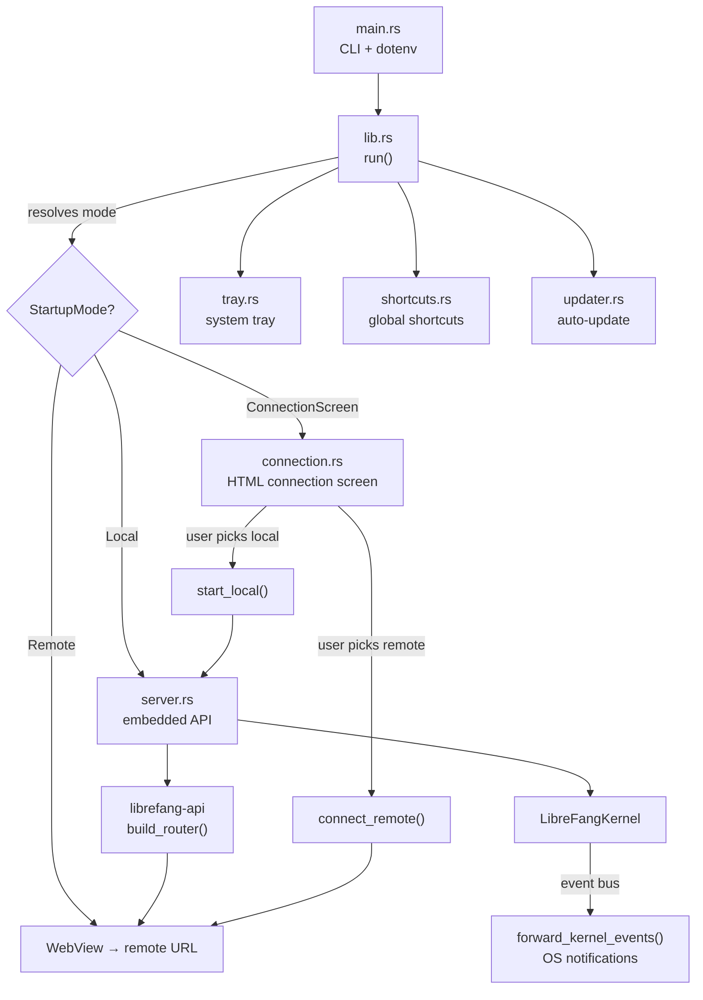

# Desktop Application

# LibreFang Desktop

Native desktop application wrapping the LibreFang Agent OS, built on **Tauri 2.0**. Boots the kernel and embedded API server, opens a native WebView window pointed at the WebUI, and provides system tray integration, global shortcuts, auto-start, single-instance enforcement, and automatic updates.

Supports two connection modes: **local** (embedded server) and **remote** (connect to an external LibreFang instance).

## Architecture Overview



## Startup Flow

Entry point is `main()` in `main.rs`, which:

1. Calls `librefang_extensions::dotenv::load_dotenv()` **synchronously** at the `main()` boundary — this must happen before any threads are spawned because `std::env::set_var` is undefined behavior once other threads exist.
2. Parses CLI arguments via `clap`.
3. Delegates to `librefang_desktop::run()`.

### Startup Mode Resolution

`run()` resolves the connection mode with this priority chain:

| Priority | Source | Behavior |
|----------|--------|----------|
| 1 (highest) | `--server-url <URL>` CLI arg | `StartupMode::Remote(url)` |
| 2 | `--local` CLI flag | `StartupMode::Local` |
| 3 | `LIBREFANG_SERVER_URL` env var | `StartupMode::Remote(url)` |
| 4 | Saved preference in `~/.librefang/desktop.toml` | Mode from file |
| 5 (lowest) | None of the above | `StartupMode::ConnectionScreen` |

For direct modes (remote or local), the server URL is resolved and the WebView navigates straight to the dashboard. For the connection screen, a self-contained HTML page is injected into an `about:blank` WebView — see [Connection Screen](#connection-screen).

## Managed State

Tauri managed state is registered once during app setup using interior-mutable `RwLock`/`Mutex` wrappers. All updates go through the locks — `manage()` is never called a second time.

| State Type | Inner Type | Purpose |
|------------|-----------|---------|
| `PortState` | `RwLock<Option<u16>>` | Local server port. `None` in remote mode. |
| `KernelState` | `RwLock<Option<KernelInner>>` | Kernel instance + startup timestamp. `None` in remote mode. |
| `ServerUrlState` | `RwLock<String>` | URL the WebView points at (local or remote). |
| `RemoteMode` | `RwLock<bool>` | Whether connected to a remote server. |
| `ServerHandleHolder` | `Mutex<Option<ServerHandle>>` | Handle to the embedded server. Filled lazily by `start_local` or during direct local boot. |

`KernelInner` holds an `Arc<LibreFangKernel>` and the `Instant` the kernel started (used for uptime display).

## Embedded Server (`server.rs`)

### `start_server() → Result<ServerHandle, Error>`

Boots the kernel and starts the API server on a background thread:

1. Calls `LibreFangKernel::boot(None)` synchronously.
2. Binds a `TcpListener` to `127.0.0.1:0` **on the calling thread** — this guarantees the port is known before any Tauri window is created.
3. Spawns a named thread (`librefang-server`) that creates its own multi-threaded tokio runtime.
4. Inside that runtime: starts background agents, spawns the approval expiry sweep task, then runs the axum server via `build_router()` from `librefang-api`.
5. Triggers dashboard asset sync in the background.

### `ServerHandle`

Owns the kernel, the shutdown watch channel, and the server thread join handle. Shutdown is idempotent — an `AtomicBool` prevents double-shutdown. The `Drop` impl sends the shutdown signal without blocking; the explicit `shutdown()` method waits for the thread to join.

The watch channel (`tokio::sync::watch`) triggers `axum::serve`'s graceful shutdown handler.

## Connection Screen (`connection.rs`)

When no startup mode can be resolved, a self-contained HTML page is injected via `document.write()` into a blank WebView. The page provides:

- **Server URL input** with "Test Connection" and "Connect" buttons
- **"Start Local Server"** button
- **"Remember this choice"** checkbox
- Status messages for success/error states

The page calls Tauri IPC commands through `window.__TAURI__.core.invoke`.

### IPC Commands

#### `test_connection(url)`

Validates the URL scheme, hits `{url}/api/health` with a 10-second timeout, and returns the health endpoint's JSON response. Used as a pre-flight check before committing to a remote connection.

#### `connect_remote(url, remember)`

1. Validates URL and runs health check (same as `test_connection`).
2. If `remember` is true, saves a `ConnectionPreference` to `~/.librefang/desktop.toml`.
3. Updates all managed state: sets `ServerUrlState` to the remote URL, sets `RemoteMode(true)`, clears `PortState` and `KernelState` to `None`.
4. Navigates the WebView via `window.location.href`.

#### `start_local(remember)`

1. Calls `server::start_server()` on a blocking thread (since kernel boot is synchronous).
2. Updates all managed state: sets port, kernel, server URL to `http://127.0.0.1:{port}`, `RemoteMode(false)`.
3. Stores the `ServerHandle` in `ServerHandleHolder`.
4. Spawns the `forward_kernel_events` task for native notifications.
5. Optionally saves the preference.
6. Navigates the WebView to the local dashboard.

### Preference Persistence

Preferences are stored as TOML in `~/.librefang/desktop.toml`:

```toml
[connection]
mode = "remote"
server_url = "http://192.168.1.100:4545"
```

Or for local mode:

```toml
[connection]
mode = "local"
```

The file is read by `load_saved_preference()` and written by `save_preference()`. Existing file contents are fully replaced on write.

## IPC Commands (`commands.rs`)

All commands return `Result<T, String>` for Tauri serialization. Commands that require a local kernel return `"No local server running"` when in remote mode.

| Command | Signature | Description |
|---------|-----------|-------------|
| `get_port` | `() → u16` | Returns the embedded server's port. |
| `get_status` | `() → JSON` | Returns `{ status, port, agents, uptime_secs }`. |
| `get_agent_count` | `() → usize` | Number of registered agents. |
| `import_agent_toml` | `() → String` | Opens native file picker, validates TOML as `AgentManifest`, copies to `~/.librefang/workspaces/agents/{name}/agent.toml`, spawns the agent. |
| `import_skill_file` | `() → String` | Opens native file picker for skill files (`.md`, `.toml`, `.py`, `.js`, `.wasm`), copies to `~/.librefang/skills/`, triggers hot-reload. |
| `get_autostart` | `() → bool` | Whether launch-at-login is enabled. |
| `set_autostart` | `(enabled: bool) → bool` | Toggle launch-at-login. Returns new state. |
| `check_for_updates` | `() → UpdateInfo` | On-demand update check. |
| `install_update` | `() → ()` | Downloads, installs, and restarts. Never returns on success. |
| `open_config_dir` | `() → ()` | Opens `~/.librefang/` in OS file manager. |
| `open_logs_dir` | `() → ()` | Opens `~/.librefang/logs/` in OS file manager. |

## System Tray (`tray.rs`)

### Menu Items

- **Show Window** — focuses the main window
- **Open in Browser** — opens the server URL in the default browser (works for both local and remote modes)
- **Change Server...** — shuts down any local server, clears state, navigates back to the connection screen
- **Agents: N running** — display-only, disabled
- **Status: Running (Xm Ys)** or **Status: Remote (url)** — display-only, disabled
- **Launch at Login** — checkbox toggle for auto-start
- **Check for Updates...** — triggers update check + install with notification feedback
- **Open Config Directory** — opens `~/.librefang/`
- **Quit LibreFang** — calls `app.exit(0)`

Left-clicking the tray icon shows and focuses the window.

### Change Server Flow

The "Change Server..." menu item:

1. Takes the `ServerHandle` from `ServerHandleHolder` and calls `shutdown()` on a background thread (to avoid blocking the tray handler).
2. Clears `PortState` and `KernelState`.
3. Re-injects the connection screen HTML into the WebView.

This allows switching between remote and local modes without restarting the application.

## Global Shortcuts (`shortcuts.rs`)

Three system-wide keyboard shortcuts, registered via `tauri-plugin-global-shortcut`:

| Shortcut | Action |
|----------|--------|
| `Ctrl+Shift+O` | Show/focus the window |
| `Ctrl+Shift+N` | Show window + emit `navigate` event with payload `"agents"` |
| `Ctrl+Shift+C` | Show window + emit `navigate` event with payload `"chat"` |

Registration failure is non-fatal — the app logs a warning and continues without shortcuts. The `navigate` events are consumed by the WebUI frontend to switch pages.

## Auto-Update (`updater.rs`)

### Startup Check

`spawn_startup_check()` runs 10 seconds after app launch:

1. Checks for an available update.
2. If found, sends an OS notification, waits 3 seconds for visibility, then downloads and installs.
3. On successful install, calls `app_handle.restart()` — the process never returns.
4. All errors are logged, never panic.

### On-Demand Check

`check_for_update()` returns an `UpdateInfo` struct:

```rust
pub struct UpdateInfo {
    pub available: bool,
    pub version: Option<String>,
    pub body: Option<String>,
}
```

`download_and_install_update()` performs the actual download. It calls `app_handle.restart()` on success, so it never returns `Ok(())`.

The updater is powered by `tauri-plugin-updater`.

## Event Forwarding

`forward_kernel_events()` subscribes to the kernel's event bus and forwards critical events as native OS notifications:

| Event | Notification Title |
|-------|--------------------|
| `LifecycleEvent::Crashed` | "Agent Crashed" |
| `SystemEvent::KernelStopping` | "Kernel Stopping" |
| `SystemEvent::QuotaEnforced` | "Quota Enforced" |

All other events are ignored. Broadcast lag is handled gracefully with a warning log. When the channel closes, the loop exits.

This task is spawned during both direct local boot and the `start_local` connection command.

## Desktop-Only Features

Several features are gated behind `#[cfg(desktop)]`:

- **Single instance** — `tauri_plugin_single_instance` focuses the existing window when a second instance launches.
- **Auto-start** — `tauri_plugin_autostart` with `--minimized` flag.
- **Global shortcuts** — system-wide hotkeys.
- **System tray** — `tray.rs` is only compiled and set up on desktop.
- **Auto-update** — `tauri_plugin_updater` and `spawn_startup_check`.
- **Close-to-tray** — `WindowEvent::CloseRequested` hides the window instead of quitting.

On mobile targets (`#[cfg(mobile)]`), the entry point is marked via `tauri::mobile_entry_point` and these features are omitted.

## Window Behavior

- Close button hides to tray (desktop) instead of quitting.
- Minimum window size: 800×600.
- Default window size: 1280×800, centered.
- Window title is "LibreFang — Connect" on the connection screen, "LibreFang" otherwise.

## Key File Locations

| Path | Purpose |
|------|---------|
| `~/.librefang/desktop.toml` | Connection preference persistence |
| `~/.librefang/workspaces/agents/{name}/agent.toml` | Imported agent manifests |
| `~/.librefang/skills/` | Imported skill files |
| `~/.librefang/logs/` | Application logs |