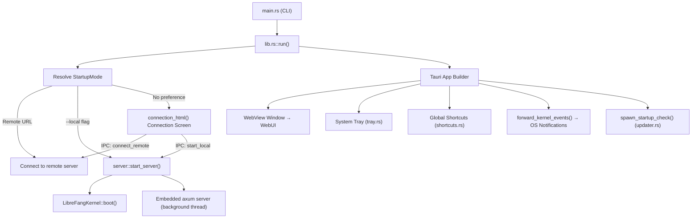

# Desktop Application

# LibreFang Desktop

Native desktop application built on Tauri 2.0 that wraps the LibreFang Agent OS. The app boots the kernel and embedded API server, opens a native WebView window pointing at the WebUI dashboard, and provides system tray integration, single-instance enforcement, native notifications, global shortcuts, auto-start, and automatic updates.

Supports both **local mode** (embedded kernel + server) and **remote mode** (connect to a running LibreFang instance elsewhere on the network).

## Architecture Overview



## Startup Flow and Connection Modes

### Mode Resolution Priority

The app determines how to start based on a priority chain:

1. **CLI `--server-url <URL>`** → `StartupMode::Remote` — connect directly to the given URL
2. **CLI `--local`** → `StartupMode::Local` — boot an embedded kernel and server immediately
3. **Environment variable `LIBREFANG_SERVER_URL`** → `StartupMode::Remote`
4. **Saved preference** from `~/.librefang/desktop.toml` → restores previous choice (remote or local)
5. **Fallback** → `StartupMode::ConnectionScreen` — show a self-contained HTML page where the user chooses

The `StartupMode` enum is private to `lib.rs` and consumed entirely during app setup.

### Startup Sequence in `run()`

1. Initialize `tracing_subscriber` with `RUST_LOG` env filter (defaults to `librefang=info,tauri=info`)
2. Load `~/.librefang/.env` into the process environment via `dotenv::load_dotenv()` (system env takes priority)
3. Resolve `StartupMode` from the priority chain
4. For direct modes, resolve the initial URL and optional `ServerHandle` immediately:
   - **Remote**: validate the URL scheme, store `None` handle
   - **Local**: call `server::start_server()`, which boots the kernel synchronously and spawns the axum server on a background thread
5. Register all managed state with Tauri (`PortState`, `KernelState`, `ServerUrlState`, `RemoteMode`, `ServerHandleHolder`)
6. Build the Tauri app with plugins (notification, shell, dialog, single-instance, autostart, updater, global shortcuts)
7. In the `.setup()` closure:
   - Create the WebView window (either pointing at the resolved URL or at the connection screen via `about:blank` + `document.write()`)
   - Set up the system tray (desktop only)
   - Start kernel event forwarding for native notifications (local mode only)
   - Spawn the startup update check (desktop only)
8. Register `on_window_event` to hide-to-tray on close (desktop) instead of quitting

## Managed State

All state is registered once at app build time using interior mutability (`RwLock`/`Mutex`). Updates happen through the locks — Tauri's `manage()` is a no-op for duplicate types.

| State Type | Inner Type | Purpose |
|---|---|---|
| `PortState` | `RwLock<Option<u16>>` | Port the embedded server listens on. `None` in remote mode. |
| `KernelState` | `RwLock<Option<KernelInner>>` | Kernel instance + `Instant` for uptime. `None` in remote mode. |
| `ServerUrlState` | `RwLock<String>` | Current URL the WebView points at (local or remote). |
| `RemoteMode` | `RwLock<bool>` | Whether connected to a remote server. |
| `ServerHandleHolder` | `Mutex<Option<ServerHandle>>` | Handle for local server shutdown. Filled after boot. |

`KernelInner` holds an `Arc<LibreFangKernel>` and the `Instant` the kernel started.

## Module Breakdown

### `main.rs` — Entry Point

Parses CLI arguments via `clap`:

```
librefang-desktop [OPTIONS]

Options:
  --server-url <URL>   Connect to a remote LibreFang server
  --local              Start local server without connection screen
```

Loads `~/.librefang/.env` synchronously before calling `run()` — environment mutation must happen before any threads are spawned (`std::env::set_var` is UB with concurrent threads).

### `server.rs` — Embedded Kernel & API Server

Responsible for booting the kernel and running the axum HTTP server.

#### `start_server() -> Result<ServerHandle, Box<dyn Error>>`

1. Calls `LibreFangKernel::boot(None)` synchronously
2. Wraps the kernel in `Arc`, calls `kernel.set_self_handle()`
3. Binds a `TcpListener` to `127.0.0.1:0` on the calling thread (guarantees port is known before any window is created)
4. Creates a `watch::channel<bool>` for shutdown signaling
5. Spawns a named thread (`"librefang-server"`) that:
   - Creates its own multi-threaded tokio runtime
   - Calls `kernel.start_background_agents().await`
   - Calls `kernel.spawn_approval_sweep_task()`
   - Runs `run_embedded_server()` which builds the axum router, syncs dashboard assets, and serves with graceful shutdown

#### `ServerHandle`

Owns the kernel `Arc`, the shutdown sender, and the server thread `JoinHandle`. Provides:

- **`shutdown(self)`** — sends the shutdown signal, joins the thread, calls `kernel.shutdown()`
- **`Drop` impl** — sends the shutdown signal without blocking (thread exits on its own)

Uses an `AtomicBool` guard to prevent double-shutdown (both explicit `shutdown()` and `Drop` can fire).

### `connection.rs` — Connection Screen & Mode Switching

Provides the self-contained HTML/CSS/JS connection page and IPC commands for switching modes at runtime.

#### Persistence

`ConnectionPreference` is serialized to `~/.librefang/desktop.toml`:

```toml
[connection]
mode = "remote"
server_url = "http://192.168.1.100:4545"
```

- `load_saved_preference()` — reads and parses the file
- `save_preference()` — writes it (non-fatal on failure)

#### IPC Commands

**`test_connection(url: String) -> Result<serde_json::Value, String>`**

Validates the URL scheme, hits `{url}/api/health` with a 10-second timeout, returns the JSON response body. Used by the connection screen's "Test Connection" button.

**`connect_remote(url: String, remember: bool, window: WebviewWindow) -> Result<(), String>`**

1. Validates URL scheme
2. Hits `/api/health` to verify reachability
3. Optionally saves the preference
4. Updates all managed state (`ServerUrlState`, `RemoteMode`, clears `PortState` and `KernelState`)
5. Navigates the WebView to the remote URL via `window.eval()`

**`start_local(remember: bool, app: AppHandle, window: WebviewWindow) -> Result<(), String>`**

1. Calls `server::start_server()` on a blocking thread via `tokio::task::spawn_blocking`
2. Updates all managed state with the new server details
3. Stores the `ServerHandle` in `ServerHandleHolder`
4. Subscribes to the kernel event bus and spawns `forward_kernel_events()`
5. Optionally saves the preference
6. Navigates the WebView to `http://127.0.0.1:{port}`

#### Connection Screen HTML

`connection_html()` returns a complete `<!DOCTYPE html>` page with:
- URL input field with "Test Connection" and "Connect" buttons
- "Start Local Server" button below a divider
- "Remember this choice" checkbox (checked by default)
- Status message area with color-coded feedback

All interaction goes through `window.__TAURI__.core.invoke()` calls to the IPC commands above.

### `commands.rs` — Tauri IPC Command Handlers

Exposes operations to the WebView frontend:

| Command | Signature | Description |
|---|---|---|
| `get_port` | `() → Result<u16, String>` | Returns the embedded server port |
| `get_status` | `() → Result<JsonValue, String>` | Returns `{ status, port, agents, uptime_secs }` |
| `get_agent_count` | `() → Result<usize, String>` | Returns number of registered agents |
| `import_agent_toml` | `() → Result<String, String>` | Native file picker for `.toml`, validates as `AgentManifest`, copies to `~/.librefang/workspaces/agents/{name}/agent.toml`, spawns the agent |
| `import_skill_file` | `() → Result<String, String>` | Native file picker for `.md/.toml/.py/.js/.wasm`, copies to `~/.librefang/skills/`, triggers `kernel.reload_skills()` |
| `get_autostart` | `() → Result<bool, String>` | Check auto-start status |
| `set_autostart` | `(enabled: bool) → Result<bool, String>` | Enable/disable auto-start |
| `check_for_updates` | `() → Result<UpdateInfo, String>` | On-demand update check |
| `install_update` | `() → Result<(), String>` | Download, install, restart |
| `open_config_dir` | `() → Result<(), String>` | Open `~/.librefang/` in OS file manager |
| `open_logs_dir` | `() → Result<(), String>` | Open `~/.librefang/logs/` in OS file manager |

All commands that access the kernel return `"No local server running"` if `KernelState` is `None` (remote mode).

### `tray.rs` — System Tray

`setup_tray(app: &tauri::App)` builds a tray icon from the embedded `32x32.png` with a context menu:

- **Show Window** — focuses the main window
- **Open in Browser** — opens `ServerUrlState` URL in the default browser
- **Change Server...** — shuts down any local server, clears local state, navigates back to the connection screen
- **Agents: N running** (disabled, informational)
- **Status: Running (Xm Ys)** or **Status: Remote (url)** (disabled, informational)
- **Launch at Login** — checkbox toggling `tauri_plugin_autostart`
- **Check for Updates...** — checks, downloads, installs, and notifies (or notifies if already up to date)
- **Open Config Directory** — opens `~/.librefang/`
- **Quit LibreFang** — calls `app.exit(0)`

Left-clicking the tray icon also shows/focuses the window.

The "Change Server..." action is the only way to switch from local to remote (or vice versa) at runtime. It takes the `ServerHandle` out of the holder and shuts it down on a separate thread to avoid blocking the UI.

### `shortcuts.rs` — Global Keyboard Shortcuts

`build_shortcut_plugin()` registers three system-wide shortcuts:

| Shortcut | Action |
|---|---|
| `Ctrl+Shift+O` | Show and focus the LibreFang window |
| `Ctrl+Shift+N` | Show window and emit `navigate` event with `"agents"` |
| `Ctrl+Shift+C` | Show window and emit `navigate` event with `"chat"` |

The `navigate` event is emitted via `app.emit()` for the WebView frontend to handle. Registration failure is non-fatal — the app logs a warning and continues without shortcuts.

### `updater.rs` — Automatic Updates

#### `UpdateInfo`

```rust
pub struct UpdateInfo {
    pub available: bool,
    pub version: Option<String>,
    pub body: Option<String>,
}
```

#### `spawn_startup_check(app_handle)`

Spawns a background task that waits 10 seconds (to avoid slowing startup), then checks for updates. If available:
1. Sends a native notification ("Installing v{version}...")
2. Waits 3 seconds for the notification to be visible
3. Calls `download_and_install_update()` — on success the app restarts (function never returns)

#### `download_and_install_update(app_handle)`

Uses `tauri_plugin_updater`. Downloads and installs the update, then calls `app_handle.restart()` which terminates the process. Errors are returned as `String` for display to the user.

### `forward_kernel_events()` — Native Notifications

Subscribes to the kernel event bus and forwards only critical events as OS notifications:

- **`LifecycleEvent::Crashed`** — "Agent Crashed: Agent {id} crashed: {error}"
- **`SystemEvent::KernelStopping`** — "Kernel Stopping: LibreFang kernel is shutting down"
- **`SystemEvent::QuotaEnforced`** — "Quota Enforced: Agent {id} quota hit: ${spent} / ${limit}"

Broadcast lag is logged but doesn't stop the listener. Channel closure terminates the loop cleanly.

## Desktop-Only Features

Several plugins and behaviors are gated behind `#[cfg(desktop)]`:

- **Single instance** — `tauri_plugin_single_instance` focuses the existing window when a second instance is launched
- **Auto-start** — `tauri_plugin_autostart` with `--minimized` flag
- **System tray** — full tray menu with status, controls, and quit
- **Hide-to-tray on close** — `on_window_event` intercepts `CloseRequested` and hides the window instead
- **Global shortcuts** — system-wide hotkeys
- **Update checker** — `tauri_plugin_updater` with startup and manual checks

On mobile targets (`#[cfg_attr(mobile, tauri::mobile_entry_point)]`), these features are omitted and `run()` serves as the entry point.

## Shutdown

When the Tauri event loop ends:

1. Tauri's managed state is dropped in arbitrary order
2. `ServerHandle`'s `Drop` impl sends the shutdown signal to the background server thread
3. The axum server's graceful shutdown fires, stops accepting connections, and cleans up channel bridges
4. The kernel's `shutdown()` is called (in explicit `shutdown()`) or left for its own `Drop`

The background thread exits on its own after receiving the signal — `Drop` doesn't block on the `JoinHandle`.

## Adding New IPC Commands

1. Write the handler in `commands.rs` with `#[tauri::command]`
2. Add it to the `tauri::generate_handler![]` macro in `run()`
3. Access managed state via `tauri::State<'_, T>` parameters
4. For commands that need the app handle or window, add `app: tauri::AppHandle` or `window: tauri::WebviewWindow` parameters

State is always read through the `RwLock`/`Mutex` — never call `manage()` a second time.