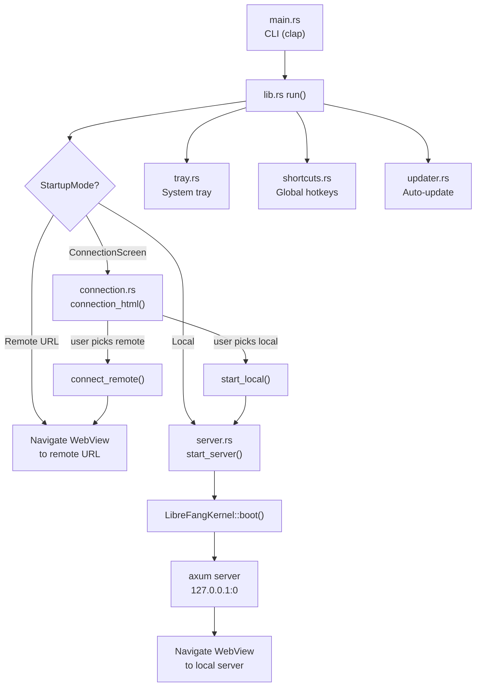

# Desktop Application

# LibreFang Desktop Application

Native desktop client for the LibreFang Agent Operating System, built on Tauri 2.0. Wraps the kernel and embedded API server in a native window with system tray integration, global shortcuts, auto-update, and support for connecting to either a local or remote LibreFang instance.

## Architecture Overview



## Startup and Connection Mode Resolution

The entry point is `main()`, which parses CLI arguments via clap and calls `librefang_desktop::run()`. Before any async work begins, `load_dotenv()` is called synchronously to populate the process environment from `~/.librefang/.env` — this must happen before spawning any threads because `std::env::set_var` is undefined safe once concurrent threads exist.

### Startup Priority Chain

`run()` resolves the connection mode in this order:

1. **CLI `--server-url <URL>`** — Immediate remote mode
2. **CLI `--local`** — Immediate local mode, skip connection screen
3. **Environment variable `LIBREFANG_SERVER_URL`** — Remote mode
4. **Saved preference** from `~/.librefang/desktop.toml` — Restores last choice
5. **Connection screen** — Interactive HTML page letting the user decide

The resolved mode is represented by the private `StartupMode` enum (`Remote(String)`, `Local`, `ConnectionScreen`). Depending on the variant, the kernel may be booted immediately or deferred until the user chooses via the connection screen.

### CLI Flags

```
librefang-desktop [--server-url <URL>] [--local]
```

- `--server-url` — Connect to a remote server (e.g., `http://192.168.1.100:4545`). Must include scheme.
- `--local` — Force local server boot, skipping the connection screen.

## Managed State

Tauri managed state is registered once at startup with interior-mutable wrappers (`RwLock`, `Mutex`). All state updates go through these locks — `manage()` is never called a second time.

| State Type | Inner Type | Purpose |
|---|---|---|
| `PortState` | `RwLock<Option<u16>>` | Local server port. `None` in remote mode or before boot. |
| `KernelState` | `RwLock<Option<KernelInner>>` | Kernel handle + startup timestamp. `None` in remote mode. |
| `ServerUrlState` | `RwLock<String>` | Current dashboard URL (local or remote) the WebView points at. |
| `RemoteMode` | `RwLock<bool>` | `true` when connected to a remote server. |
| `ServerHandleHolder` | `Mutex<Option<ServerHandle>>` | Handle to the running embedded server for shutdown. Filled after boot or by `start_local`. |

`KernelInner` holds an `Arc<LibreFangKernel>` and the `Instant` the server started (used for uptime display).

## Embedded Server Lifecycle

The `server` module handles local kernel + API server management.

### Boot Sequence (`start_server`)

1. **Kernel boot** — `LibreFangKernel::boot(None)` runs synchronously (no tokio needed)
2. **Port binding** — A `TcpListener` binds to `127.0.0.1:0` on the calling thread, guaranteeing the port is known before any Tauri window is created
3. **Background thread** — A dedicated OS thread (`librefang-server`) creates its own multi-thread tokio runtime and runs the axum server
4. **Background agents** — `kernel.start_background_agents()` is called inside the tokio context
5. **Approval sweep** — `kernel.spawn_approval_sweep_task()` starts the periodic approval expiry checker
6. **Dashboard sync** — `sync_dashboard()` downloads/updates the WebUI assets in the background

Returns a `ServerHandle` containing the port, kernel reference, shutdown channel, and thread join handle.

### Shutdown

`ServerHandle` uses `compare_exchange` on an `AtomicBool` to prevent double-shutdown. There are two paths:

- **Explicit `shutdown()`** — Sends the shutdown signal via `watch` channel, joins the background thread, calls `kernel.shutdown()`
- **Drop** — Sends the shutdown signal but does not block on the thread join (best-effort cleanup)

The graceful shutdown flow inside `run_embedded_server`:
1. The `watch` receiver waits for `true`
2. Axum's `with_graceful_shutdown` completes
3. Channel bridges are stopped via `bridge_manager.lock().await`

## IPC Commands

All commands are registered via `tauri::generate_handler![]` in `run()`. They communicate with the WebView frontend through Tauri's IPC layer.

### Status and Query Commands

| Command | Returns | Description |
|---|---|---|
| `get_port` | `u16` | Port the embedded server is listening on |
| `get_status` | `serde_json::Value` | JSON with `status`, `port`, `agents`, `uptime_secs` |
| `get_agent_count` | `usize` | Number of registered agents |
| `get_autostart` | `bool` | Whether auto-start on login is enabled |

### Import Commands

**`import_agent_toml`** — Opens a native file picker filtered to `.toml`, parses the file as an `AgentManifest`, copies it to `~/.librefang/workspaces/agents/{name}/agent.toml`, then calls `kernel.spawn_agent()`. Returns the agent name on success.

**`import_skill_file`** — Opens a file picker accepting `.md`, `.toml`, `.py`, `.js`, `.wasm` files, copies to `~/.librefang/skills/`, then calls `kernel.reload_skills()` to hot-reload the skill registry.

### Connection Commands

Defined in the `connection` module, exposed via IPC:

- **`test_connection(url)`** — HTTP GET to `{url}/api/health` with a 10-second timeout. Returns the JSON response on success.
- **`connect_remote(url, remember)`** — Validates URL, verifies health endpoint, updates all managed state (sets `RemoteMode = true`, clears `PortState` and `KernelState`), optionally saves preference, navigates the WebView via `window.location.href`.
- **`start_local(remember)`** — Spawns the embedded server via `tokio::task::spawn_blocking(start_server)`, fills all managed state, stores the `ServerHandle`, starts event forwarding, optionally saves preference, navigates the WebView.

### System Commands

| Command | Description |
|---|---|
| `set_autostart(enabled)` | Enable/disable OS login auto-start via `tauri-plugin-autostart` |
| `check_for_updates` | On-demand update check, returns `UpdateInfo` |
| `install_update` | Downloads and installs the latest update, then restarts the app |
| `open_config_dir` | Opens `~/.librefang/` in the OS file manager |
| `open_logs_dir` | Opens `~/.librefang/logs/` in the OS file manager |

## Connection Screen

When no startup mode is determined, the app renders a self-contained HTML page inside the WebView. The `connection_html()` function returns a complete HTML/CSS/JS document with:

- A URL input field for remote server connection
- "Test Connection" and "Connect" buttons for remote mode
- "Start Local Server" button for local mode
- A "Remember this choice" checkbox
- Status display area for feedback

The HTML calls Tauri IPC commands via `window.__TAURI__.core.invoke()`. On connection success, the server-side command navigates the WebView to the dashboard URL.

### Persisted Preferences

Connection preferences are stored in `~/.librefang/desktop.toml`:

```toml
[connection]
mode = "remote"        # or "local"
server_url = "http://..."  # absent for local mode
```

`load_saved_preference()` and `save_preference()` handle reading/writing this file. The preference is only saved after a successful connection (health check passes).

## System Tray

The `tray` module creates a rich context menu on the system tray icon. Menu items are built dynamically based on current state:

**Actions:**
- **Show Window** — Focuses and unhides the main window
- **Open in Browser** — Opens the current dashboard URL in the default browser
- **Change Server** — Shuts down any local server, clears state, navigates back to the connection screen

**Status (read-only):**
- Displays agent count and uptime (for local mode) or remote URL
- Uptime is formatted via `format_uptime()` (e.g., `45s`, `12m 30s`, `2h 15m`)

**Settings:**
- **Launch at Login** — Toggle via `CheckMenuItem`, backed by `tauri-plugin-autostart`
- **Check for Updates** — Triggers a manual update check and install flow with native notifications
- **Open Config Directory** — Opens `~/.librefang/`

**Quit** — Calls `app.exit(0)` for clean shutdown.

Left-click on the tray icon shows/focuses the window.

## Global Shortcuts

Three system-wide keyboard shortcuts registered via `tauri-plugin-global-shortcut`:

| Shortcut | Action |
|---|---|
| `Ctrl+Shift+O` | Show/focus the LibreFang window |
| `Ctrl+Shift+N` | Show window + emit `navigate` event with payload `"agents"` |
| `Ctrl+Shift+C` | Show window + emit `navigate` event with payload `"chat"` |

The `navigate` event is emitted via `app.emit()` — the WebView frontend listens for it to change routes. Registration failure is non-fatal (logged as a warning).

## Auto-Update System

The `updater` module wraps `tauri-plugin-updater`.

### Startup Auto-Update

`spawn_startup_check()` runs after a 10-second delay to avoid competing with startup I/O. If an update is found, it:

1. Sends a native notification ("Installing v{version}...")
2. Waits 3 seconds for the notification to be visible
3. Downloads and installs the update
4. Calls `app_handle.restart()` — the process exits and relaunches

All errors are logged; the app continues running normally if the update fails.

### On-Demand Update

The `check_for_updates` IPC command returns an `UpdateInfo` struct:

```rust
pub struct UpdateInfo {
    pub available: bool,
    pub version: Option<String>,
    pub body: Option<String>,
}
```

The `install_update` IPC command downloads and installs — on success, `restart()` is called and the function never returns `Ok`.

### Tray-Initiated Update

The "Check for Updates" tray menu item runs the same check/install flow with native notifications for each stage (downloading, success, failure).

## Event Forwarding and Notifications

`forward_kernel_events()` subscribes to the kernel's event bus and converts critical events into native OS notifications:

| Event | Notification Title | Condition |
|---|---|---|
| `LifecycleEvent::Crashed` | "Agent Crashed" | Agent terminated unexpectedly |
| `SystemEvent::KernelStopping` | "Kernel Stopping" | Kernel shutdown initiated |
| `SystemEvent::QuotaEnforced` | "Quota Enforced" | Agent hit spending limit |

All other events are ignored. The listener handles broadcast channel lag gracefully (logs a warning) and exits cleanly when the channel closes.

Event forwarding is started:
- In `run()` setup for direct local boot mode
- In `start_local()` when the user chooses local from the connection screen

## Window Behavior

- **Close** — Intercepted via `on_window_event`. The window is hidden instead of destroyed, keeping the app running in the tray.
- **Single instance** — `tauri-plugin-single-instance` focuses the existing window if a second instance is launched.
- **Minimum size** — 800×600. Default size 1280×800, centered.

## Feature Flags

| Feature | Effect |
|---|---|
| `default` | Builds `librefang-api` with default features |
| `all-channels` | Enables all channel backends in the API |
| `mini` | Minimal API feature set |
| `custom-protocol` | Uses Tauri's custom protocol scheme (production builds) |

## Key File Locations

| Path | Purpose |
|---|---|
| `~/.librefang/` | Root config directory |
| `~/.librefang/desktop.toml` | Saved connection preference |
| `~/.librefang/.env` | Environment variables loaded at startup |
| `~/.librefang/skills/` | Imported skill files |
| `~/.librefang/workspaces/agents/{name}/agent.toml` | Imported agent manifests |
| `~/.librefang/logs/` | Log files |