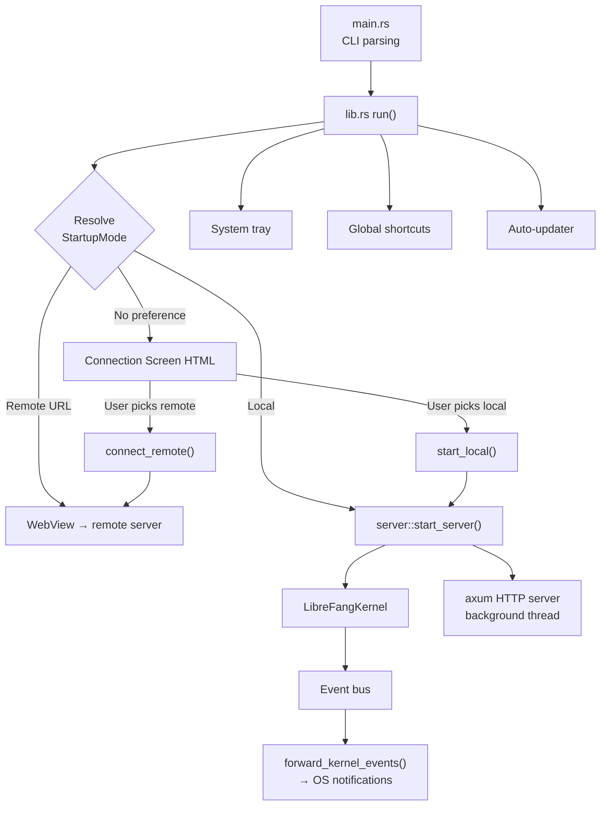

# Desktop Application

# LibreFang Desktop Application

A Tauri 2.0 native desktop wrapper for the LibreFang Agent OS. The application can either boot an embedded kernel and API server locally, or connect to a remote LibreFang instance. It provides a system tray, global keyboard shortcuts, native OS notifications, auto-start on login, and automatic updates.

## Architecture Overview

## Startup and Connection Mode Resolution

The application resolves how to connect through a priority chain:

1. **CLI `--server-url <URL>`** — immediate remote connection
2. **CLI `--local`** — skip connection screen, boot local server
3. **`LIBREFANG_SERVER_URL` environment variable** — remote connection
4. **Saved preference** in `~/.librefang/desktop.toml` — uses last choice
5. **Connection screen** — user decides at runtime

`main()` loads environment variables from `~/.librefang/.env` at the synchronous boundary (before any threads spawn, since `std::env::set_var` is UB with concurrent threads), parses CLI arguments via `clap`, and delegates to `lib::run()`.

### Connection Preference Persistence

`connection::load_saved_preference()` and `connection::save_preference()` read/write a `DesktopConfig` struct to `~/.librefang/desktop.toml`. The `ConnectionPreference` struct stores the mode (`"local"` or `"remote"`) and an optional `server_url`.

## Managed State

Tauri managed state is registered once during setup with interior-mutable wrappers (`RwLock`). All state updates go through these locks rather than re-registering state.

| State Type | Inner Type | Purpose |
|---|---|---|
| `PortState` | `RwLock<Option<u16>>` | Local server port. `None` in remote mode or before boot. |
| `KernelState` | `RwLock<Option<KernelInner>>` | Kernel handle + startup timestamp. `None` in remote mode. |
| `ServerUrlState` | `RwLock<String>` | The URL the WebView points at (local or remote). |
| `RemoteMode` | `RwLock<bool>` | `true` when connected to a remote server. |
| `ServerHandleHolder` | `Mutex<Option<ServerHandle>>` | Owning handle to the embedded server. Filled after boot. |

`KernelInner` holds an `Arc<LibreFangKernel>` and the `Instant` the server started, used for uptime calculation and agent counts.

## Embedded Server (`server.rs`)

`start_server()` boots the kernel synchronously, binds a `TcpListener` to `127.0.0.1:0` (OS-assigned port), then spawns a dedicated background thread running its own tokio runtime. Inside that runtime:

1. `kernel.start_background_agents().await` — boot agents marked for auto-start
2. `kernel.spawn_approval_sweep_task()` — periodic approval expiry cleanup
3. `run_embedded_server()` — builds the axum router via `librefang_api::server::build_router`, converts the std `TcpListener` to tokio, and serves with graceful shutdown via a `watch` channel

The background thread also spawns a task to sync dashboard assets via `librefang_api::webchat::sync_dashboard`.

### Shutdown

`ServerHandle` owns the shutdown `watch::Sender` and the server thread's `JoinHandle`. Calling `shutdown()` sends `true` on the channel, waits for the thread to join, then calls `kernel.shutdown()`. The `Drop` impl does a best-effort shutdown signal without blocking. An `AtomicBool` guard prevents double-shutdown.

## IPC Commands (`commands.rs`)

All commands are registered via `tauri::generate_handler![]` and invoked from the WebView frontend.

| Command | Parameters | Returns | Description |
|---|---|---|---|
| `get_port` | — | `u16` | Local server port |
| `get_status` | — | `JSON` | Status object: `status`, `port`, `agents`, `uptime_secs` |
| `get_agent_count` | — | `usize` | Number of registered agents |
| `import_agent_toml` | — | `String` | Opens file picker, validates TOML as `AgentManifest`, copies to `~/.librefang/workspaces/agents/{name}/agent.toml`, spawns the agent |
| `import_skill_file` | — | `String` | Opens file picker (`.md/.toml/.py/.js/.wasm`), copies to `~/.librefang/skills/`, triggers hot-reload |
| `get_autostart` | — | `bool` | Whether auto-start is enabled |
| `set_autostart` | `enabled: bool` | `bool` | Enable/disable auto-start |
| `check_for_updates` | — | `UpdateInfo` | On-demand update check |
| `install_update` | — | `()` | Download, install, restart |
| `open_config_dir` | — | `()` | Opens `~/.librefang/` in OS file manager |
| `open_logs_dir` | — | `()` | Opens `~/.librefang/logs/` in OS file manager |

## Connection Screen and Mode Switching (`connection.rs`)

### Connection Screen

When no startup mode is resolved, `connection_html()` returns a self-contained HTML/CSS/JS page injected into a blank WebView. The page provides:
- A URL input with **Test Connection** and **Connect** buttons for remote servers
- A **Start Local Server** button
- A **Remember this choice** checkbox
- Status feedback area

The frontend calls Tauri IPC commands (`test_connection`, `connect_remote`, `start_local`) via `window.__TAURI__.core.invoke`.

### IPC Commands

**`test_connection(url)`** — Validates the URL scheme, sends `GET /api/health` with a 10-second timeout, returns the JSON response body.

**`connect_remote(url, remember)`** — Validates and health-checks the URL, saves preference if requested, updates all managed state to remote mode (clears `PortState`, `KernelState`, sets `RemoteMode = true`, sets `ServerUrlState`), then navigates the WebView to the remote URL.

**`start_local(remember)`** — Spawns `crate::server::start_server()` on a blocking thread, fills all managed state with the local server's details, stores the `ServerHandle`, starts event forwarding, saves preference if requested, and navigates the WebView to `http://127.0.0.1:{port}`.

## System Tray (`tray.rs`)

`setup_tray()` builds a tray icon with a context menu:

- **Show Window** / **Open in Browser** / **Change Server...** — actions
- **Agents: N running** / **Status: Running/Remote (uptime)** — informational (disabled items)
- **Launch at Login** — toggle via `CheckMenuItem`
- **Check for Updates...** — runs `updater::check_for_update()`, installs if available, sends notifications
- **Open Config Directory** — opens `~/.librefang/`
- **Quit LibreFang** — calls `app.exit(0)`

The **Change Server** action shuts down any running local server, clears local state, and re-injects the connection screen HTML into the WebView.

Left-clicking the tray icon shows and focuses the window.

## Global Shortcuts (`shortcuts.rs`)

`build_shortcut_plugin()` registers three system-wide hotkeys:

| Shortcut | Action |
|---|---|
| `Ctrl+Shift+O` | Show/focus window |
| `Ctrl+Shift+N` | Show window + emit `navigate` event with `"agents"` |
| `Ctrl+Shift+C` | Show window + emit `navigate` event with `"chat"` |

The WebUI listens for the `navigate` event to switch pages. Registration failure is non-fatal — the app logs a warning and continues.

## Auto-Updater (`updater.rs`)

`spawn_startup_check()` runs after a 10-second delay, checks for updates via the Tauri updater plugin, and if found, sends a notification, waits 3 seconds, then installs and restarts.

`check_for_update()` returns an `UpdateInfo` struct with `available`, `version`, and `body` fields. `download_and_install_update()` performs the actual download and calls `app_handle.restart()` — on success the function never returns.

Both the tray menu's **Check for Updates** and the IPC commands `check_for_updates` / `install_update` go through the same `do_check()` / `download_and_install_update()` functions.

## Event Forwarding and Notifications

`forward_kernel_events()` subscribes to the kernel's event bus via `subscribe_all()` and converts critical events into native OS notifications:

- `LifecycleEvent::Crashed` → "Agent Crashed"
- `SystemEvent::KernelStopping` → "Kernel Stopping"
- `SystemEvent::QuotaEnforced` → "Quota Enforced" with spend details

All other events are ignored. Broadcast lag is logged but doesn't stop the listener.

## Window Lifecycle

On desktop, closing the window hides it to the system tray instead of quitting (`CloseRequested` → `api.prevent_close()` + `window.hide()`). The app only truly exits when the user selects **Quit** from the tray menu.

Single-instance enforcement (`tauri_plugin_single_instance`) focuses the existing window if a second instance is launched.