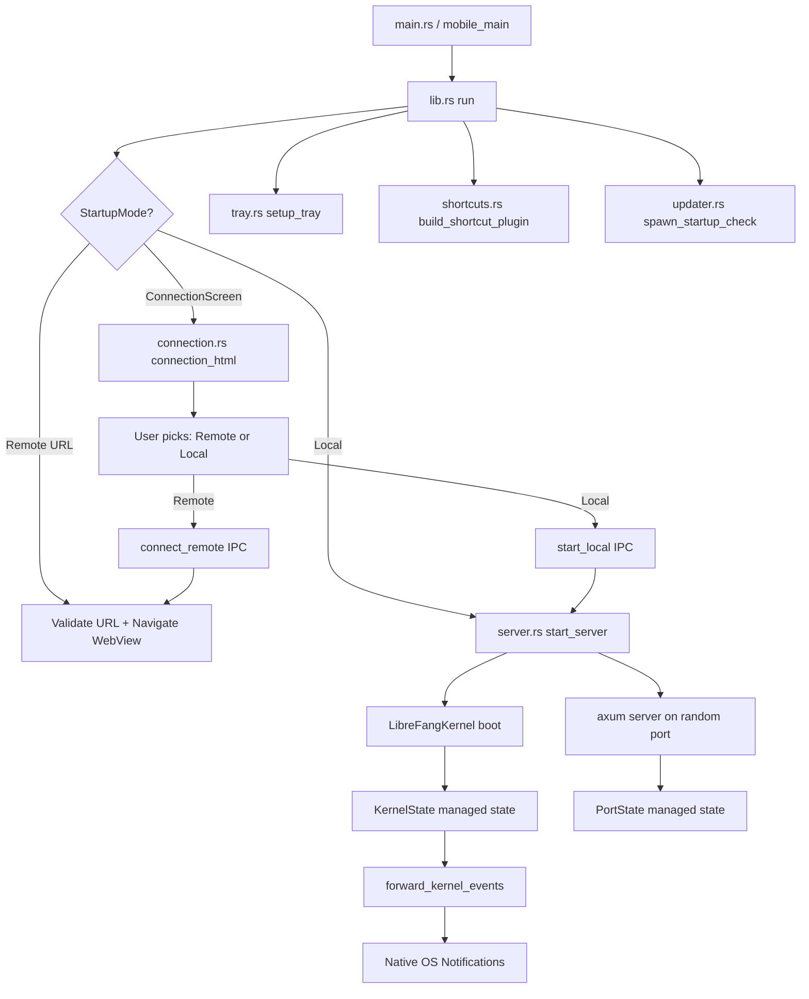

# Desktop Application

# LibreFang Desktop Application

Native desktop and mobile wrapper for the LibreFang Agent OS, built on Tauri 2.0. The app boots the kernel and embedded API server (on desktop), opens a WebView pointing at the WebUI dashboard, and provides system integration including tray icon, global shortcuts, auto-start, auto-update, and native OS notifications.

## Architecture Overview


```mermaid
graph TD
    A[main.rs / mobile_main] --> B[lib.rs run]
    B --> C{StartupMode?}
    C -->|Remote URL| D[Validate URL + Navigate WebView]
    C -->|Local| E[server.rs start_server]
    C -->|ConnectionScreen| F[connection.rs connection_html]
    E --> G[LibreFangKernel boot]
    E --> H[axum server on random port]
    G --> I[KernelState managed state]
    H --> J[PortState managed state]
    F --> K[User picks: Remote or Local]
    K -->|Remote| L[connect_remote IPC]
    K -->|Local| M[start_local IPC]
    L --> D
    M --> E
    B --> N[tray.rs setup_tray]
    B --> O[shortcuts.rs build_shortcut_plugin]
    B --> P[updater.rs spawn_startup_check]
    I --> Q[forward_kernel_events]
    Q --> R[Native OS Notifications]
```

## Startup Flow

The application entry point differs by platform:

- **Desktop**: `main.rs` parses CLI arguments (`--server-url <URL>` or `--local`) and calls `librefang_desktop::run()`.
- **Mobile**: `lib.rs::mobile_main()` is annotated with `#[tauri::mobile_entry_point]` and calls `run(None, false)` since CLI flags don't apply.

### Startup Mode Resolution

`run()` resolves the connection mode with this priority:

1. **CLI `--server-url`** → Remote mode
2. **CLI `--local`** → Local mode (desktop only; mobile falls through)
3. **`LIBREFANG_SERVER_URL` env var** → Remote mode
4. **Saved preference** from `~/.librefang/desktop.toml` → mode from `ConnectionPreference`
5. **Default** → Connection screen

### URL Validation

`validate_server_url()` enforces a security policy (issue #3673) to prevent MITM attacks via IPC-injected WebView content:

- **HTTPS** to any host is always allowed.
- **HTTP** is only allowed to loopback addresses (`127.0.0.0/8`, `::1`, `localhost`).
- **HTTP to non-loopback** is rejected with an error message explaining the risk.
- URLs with userinfo (`@`) are rejected to prevent loopback bypass via authority parsing tricks like `http://[::1]@evil.com/`.

## Managed State

Tauri managed state is registered once at startup with interior-mutable `RwLock` wrappers so IPC commands can update values when the user switches between remote and local mode:

| State Type | Inner Type | Purpose |
|---|---|---|
| `PortState` | `RwLock<Option<u16>>` | Embedded server port. `None` in remote mode. |
| `KernelState` | `RwLock<Option<KernelInner>>` | Kernel handle + startup timestamp. `None` in remote mode. |
| `ServerUrlState` | `RwLock<String>` | Current URL the WebView points at (local or remote). |
| `RemoteMode` | `RwLock<bool>` | `true` when connected to a remote server. |
| `ServerHandleHolder` | `Mutex<Option<ServerHandle>>` | Handle to the running server for shutdown. Desktop only. |

`KernelInner` holds an `Arc<LibreFangKernel>` and the `Instant` the server started (used for uptime reporting).

## Module Breakdown

### `server.rs` — Embedded Server Lifecycle

Desktop-only. Not compiled on iOS/Android.

`start_server()` performs three steps synchronously on the calling thread:

1. Boots `LibreFangKernel` via `LibreFangKernel::boot(None)`.
2. Binds a `TcpListener` to `127.0.0.1:0` (random free port), guaranteeing the port is known before any window is created.
3. Spawns a dedicated thread named `"librefang-server"` with its own multi-threaded tokio runtime.

The server thread runs `run_embedded_server()`, which:
- Calls `build_router()` from `librefang-api` to create the axum app.
- Starts background agents and approval sweep tasks on the kernel.
- Spawns dashboard asset syncing in the background.
- Runs `axum::serve()` with graceful shutdown via a `watch::channel<bool>`.

`ServerHandle` owns the shutdown sender and server thread join handle. Its `Drop` impl sends the shutdown signal (best-effort, non-blocking). The explicit `shutdown()` method sends the signal and joins the thread.

### `connection.rs` — Connection Screen and Mode Switching

Provides the connection screen UI and IPC commands for switching between remote and local mode at runtime.

#### Connection Screen

`connection_html()` returns a self-contained HTML/CSS/JS page served through the custom `lfconnect://` URI scheme (not `about:blank`, which broke on WebKitGTK 2.50 — see issue #3052). The page includes:

- A URL input field for remote server addresses.
- **Test Connection** button — calls `test_connection` IPC command.
- **Connect** button — calls `connect_remote` IPC command.
- **Start Local Server** button — calls `start_local` IPC command. **Removed on mobile** (no embedded server); the HTML and JS references are stripped with `debug_assert`-guarded sentinel replacement.
- **Remember this choice** checkbox — persists preference to `~/.librefang/desktop.toml`.
- **Uninstall** button — calls `uninstall_app` IPC command.

The JS polls for `window.__TAURI__` availability (up to 8 seconds) before invoking IPC, handling the asynchronous injection on WebView2.

#### Navigation Target

`navigation_target()` computes the URL the WebView should navigate to after connecting:

- **Mobile release builds** (`cfg(all(mobile, not(debug_assertions)))`): Returns `tauri://localhost/index.html#api=<encoded daemon URL>` so the bundled dashboard makes API/WS requests to the daemon (requires CORS on the daemon to allow `tauri://localhost`).
- **All other builds** (desktop, mobile debug): Returns the daemon URL directly (thin-client mode).

#### IPC Commands

**`test_connection(url)`** — Hits `<url>/api/health` with a 10-second timeout. Returns the parsed JSON response or an error string.

**`connect_remote(url, remember)`** — Validates the URL, health-checks the server, optionally saves the preference to `desktop.toml`, updates all managed state (sets `RemoteMode` to `true`, clears `PortState` and `KernelState`), and navigates the WebView to the resolved target.

**`start_local(remember)`** *(desktop only)* — Spawns the server on a blocking thread via `start_server()`, updates all managed state (sets `RemoteMode` to `false`, fills `PortState`/`KernelState`/`ServerHandleHolder`), starts event forwarding for notifications, optionally saves the preference, and navigates the WebView to `http://127.0.0.1:<port>`.

#### Persistence

Connection preferences are stored in `~/.librefang/desktop.toml`:

```toml
[connection]
mode = "remote"          # or "local"
server_url = "http://..." # absent for local mode
```

`load_saved_preference()` and `save_preference()` handle reading/writing this file.

### `commands.rs` — IPC Command Handlers

Exposes Tauri commands invoked from the WebView. Platform-conditional compilation gates desktop-only and mobile-only commands.

#### Status Queries

| Command | Returns |
|---|---|
| `get_port` | The embedded server port (`u16`) |
| `get_status` | JSON with `status`, `port`, `agent count`, `uptime_secs` |
| `get_agent_count` | Number of registered agents (`usize`) |

All return `"No local server running"` error when in remote mode.

#### Agent and Skill Import

**`import_agent_toml`** — Opens a native file picker filtered to `.toml`, parses the file as `AgentManifest`, copies it to `~/.librefang/workspaces/agents/<name>/agent.toml`, and calls `kernel.spawn_agent()`.

**`import_skill_file`** — Opens a native file picker filtered to `.md`, `.toml`, `.py`, `.js`, `.wasm`, copies the file to `~/.librefang/skills/`, and calls `kernel.reload_skills()`.

#### Auto-Start (desktop only)

- `get_autostart()` — Returns whether the app launches at login.
- `set_autostart(enabled)` — Enables or disables auto-start via `tauri-plugin-autostart`. Passes `--minimized` as the auto-start argument.

#### Updates (desktop only)

- `check_for_updates()` — Async. Returns `UpdateInfo` with `available`, `version`, and `body` fields.
- `install_update()` — Async. Downloads and installs the latest update, then restarts. Does not return on success.

#### Credentials (mobile only)

Uses the OS keyring via the `keyring` crate:

- `store_credentials(base_url, api_key)` — Stores JSON `{"base_url": ..., "api_key": ...}` under service `"librefang-mobile"`, account `"daemon-credentials"`.
- `get_credentials()` — Returns the stored JSON value or `null` if none stored.
- `clear_credentials()` — Deletes the stored credentials.

#### System Integration

- `open_config_dir()` — Opens `~/.librefang/` in the OS file manager.
- `open_logs_dir()` — Opens `~/.librefang/logs/` in the OS file manager.
- `uninstall_app()` — Platform-specific uninstall:
  - **Windows**: Queries `HKCU\Software\Microsoft\Windows\CurrentVersion\Uninstall` for the NSIS `UninstallString` and executes it.
  - **macOS**: Locates the `.app` bundle by walking ancestors from the executable, moves it to Trash via `osascript` + Finder.
  - **Linux/AppImage**: Removes the AppImage binary directly. For system packages, returns a hint string with the distro-specific command (`apt remove`, `dnf remove`, `pacman -R`).
  - **Mobile**: Returns an error directing the user to use the platform app store.

### `shortcuts.rs` — Global Keyboard Shortcuts

Desktop-only. Registers three system-wide shortcuts via `tauri-plugin-global-shortcut`:

| Shortcut | Action |
|---|---|
| `Ctrl+Shift+O` | Show/focus the LibreFang window |
| `Ctrl+Shift+N` | Show window + emit `"navigate"` event with payload `"agents"` |
| `Ctrl+Shift+C` | Show window + emit `"navigate"` event with payload `"chat"` |

The frontend listens for the `"navigate"` event to route accordingly. Registration failure is non-fatal — logged as a warning and the app continues without shortcuts.

### `tray.rs` — System Tray

Desktop-only. Additionally gated behind the `linux-tray` Cargo feature on Linux because Tauri's tray-icon feature pulls a deprecated GTK3 stack with multiple RUSTSEC advisories.

`setup_tray()` builds a menu with:

| Menu Item | Action |
|---|---|
| Show Window | Shows, unminimizes, and focuses the main window |
| Open in Browser | Opens `ServerUrlState` in the default browser |
| Change Server... | Shuts down local server, clears state, navigates to connection screen |
| Agents: N running | Display-only (disabled) |
| Status: Running/Remote | Display-only with uptime or remote URL |
| Launch at Login | Toggleable checkbox via `tauri-plugin-autostart` |
| Check for Updates... | Triggers update check + install with notification feedback |
| Open Config Directory | Opens `~/.librefang/` in file manager |
| Quit LibreFang | Calls `app.exit(0)` |

Left-click on the tray icon itself shows the main window.

### `updater.rs` — Auto-Update

Desktop-only. Uses `tauri-plugin-updater`.

**`spawn_startup_check(app_handle)`** — Spawns a background task that:

1. Waits 10 seconds for the app to fully initialize.
2. Probes the update manifest endpoint with a HEAD request. If the manifest is unreachable (e.g., no `latest.json` on the release), skips silently to keep logs clean.
3. Checks for an available update via `do_check()`.
4. If available, sends a notification, waits 3 seconds, then downloads and installs. On success the app restarts; the function never returns `Ok`.

**`check_for_update(app_handle)`** — On-demand check returning `UpdateInfo`.

**`download_and_install_update(app_handle)`** — Downloads and installs, then calls `app_handle.restart()`.

`UpdateInfo` is a serializable struct with `available: bool`, `version: Option<String>`, and `body: Option<String>`.

## Event Forwarding

`forward_kernel_events()` subscribes to all events on the kernel event bus and surfaces critical ones as native OS notifications:

- **`LifecycleEvent::Crashed`** — "Agent Crashed" with agent ID and error.
- **`SystemEvent::KernelStopping`** — "Kernel Stopping".
- **`SystemEvent::QuotaEnforced`** — "Quota Enforced" with spent/limit amounts.

Uses `recv_event_skipping_lag()` so dropped events are counted in `EventBus::dropped_count()` and logged at error level rather than silently (issue #3630).

Event forwarding is started:
- In `run()` setup for direct local-boot mode.
- In `start_local()` for connection-screen-initiated local mode.

## Window Behavior

- **Close button**: On desktop, hides to tray instead of quitting (`on_window_event` intercepts `CloseRequested`).
- **Single instance**: `tauri-plugin-single-instance` focuses the existing window if a second instance is launched.
- **Mobile window**: Declared in `tauri.ios.conf.json` / `tauridroid.conf.json` (label `"main"`, URL `lfconnect://localhost/`). Programmatic window creation is not used on mobile — Tauri 2 wires the root view controller to the conf-declared window.

## Platform Differences

| Feature | Desktop | Mobile |
|---|---|---|
| Embedded server | Yes | No (thin client) |
| System tray | Yes (Linux needs `linux-tray` feature) | No |
| Global shortcuts | Yes | No |
| Auto-update | Yes | No (store-managed) |
| Auto-start at login | Yes | No |
| Credential storage | — | OS keyring (`keyring` crate) |
| Shell plugin | Yes | No |
| Connection screen | Includes "Start Local Server" | Remote-only |
| Dashboard delivery | Thin-client (navigate to daemon URL) | Release: bundled + hash-encoded daemon URL; Debug: thin-client |