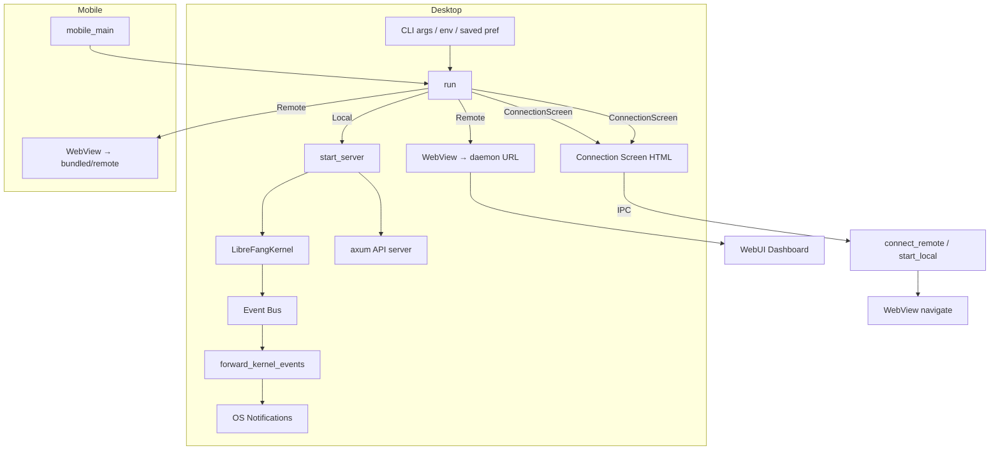

# Desktop Application

# LibreFang Desktop Application

A native desktop and mobile wrapper built on **Tauri 2.0** that hosts the LibreFang Agent OS. The application can either boot an embedded kernel + API server locally (desktop only) or operate as a thin client connecting to a remote LibreFang daemon. It provides system tray integration, native OS notifications, global keyboard shortcuts, auto-start on login, auto-updates, and a built-in connection screen for switching between modes.

## Architecture


```mermaid
graph TD
    subgraph Desktop
        CLI[CLI args / env / saved pref] --> RUN[run]
        RUN -->|ConnectionScreen| CS[Connection Screen HTML]
        RUN -->|Local| SRV[start_server]
        RUN -->|Remote| WV[WebView → daemon URL]
        SRV --> K[LibreFangKernel]
        SRV --> AX[axum API server]
        K --> EV[Event Bus]
        EV --> FWD[forward_kernel_events]
        FWD --> NOTIF[OS Notifications]
    end
    subgraph Mobile
        MOB[mobile_main] --> RUN
        RUN -->|Remote| MWV[WebView → bundled/remote]
        RUN -->|ConnectionScreen| CS
    end
    WV --> UI[WebUI Dashboard]
    CS -->|IPC| CONNECT[connect_remote / start_local]
    CONNECT --> WV2[WebView navigate]
```

## Startup Flow

Entry points:

- **Desktop**: `run(server_url, force_local)` — called from `main.rs` with parsed CLI arguments.
- **Mobile**: `mobile_main()` — zero-argument wrapper required by `tauri::mobile_entry_point`, delegates to `run(None, false)`.

The startup mode is resolved in priority order:

1. **CLI `--server-url`** → `StartupMode::Remote(url)` — skip the connection screen, connect directly.
2. **CLI `--local`** → `StartupMode::Local` — desktop only; boot the embedded server immediately.
3. **Environment variable `LIBREFANG_SERVER_URL`** → `StartupMode::Remote(url)`.
4. **Saved preference** in `~/.librefang/desktop.toml` → restores the user's last choice (remote URL or local mode).
5. **Fallback** → `StartupMode::ConnectionScreen` — loads the built-in HTML connection screen.

Before opening a window, `run()` calls `validate_server_url()` on any resolved remote URL. Invalid URLs cause an immediate exit with a diagnostic message.

## Managed State

Tauri managed state is registered once during setup with interior-mutable `RwLock` wrappers. IPC commands and tray handlers update state by writing through the locks — `manage()` is never called twice.

| State Type | Inner Type | Purpose |
|---|---|---|
| `PortState` | `RwLock<Option<u16>>` | Port the embedded server listens on. `None` in remote mode or before local boot. |
| `KernelState` | `RwLock<Option<KernelInner>>` | Kernel instance + `Instant` boot time. `None` in remote mode. |
| `ServerUrlState` | `RwLock<String>` | URL the WebView points at (local `127.0.0.1` or remote). |
| `RemoteMode` | `RwLock<bool>` | `true` when connected to a remote server. |
| `ServerHandleHolder` | `Mutex<Option<ServerHandle>>` | Handle to the running server. Desktop only — filled by `start_local` or direct boot. |

`KernelInner` holds an `Arc<LibreFangKernel>` and the `Instant` the kernel started, used for uptime reporting.

## Connection Modes

### Local Mode (Desktop Only)

`start_local` (IPC command) or direct boot calls `server::start_server()`, which:

1. Boots `LibreFangKernel` synchronously on the calling thread.
2. Binds `TcpListener` to `127.0.0.1:0` to acquire a random free port.
3. Spawns a named thread (`librefang-server`) with its own multi-threaded tokio runtime.
4. Inside that runtime: starts background agents, spawns the approval expiry sweep task, then runs `axum::serve` with graceful shutdown via a `watch` channel.

The resulting `ServerHandle` is stored in `ServerHandleHolder`. Dropping or calling `shutdown()` on it sends the shutdown signal and joins the server thread.

### Remote Mode

`connect_remote` (IPC command) or direct boot with a URL:

1. Validates the URL via `validate_server_url`.
2. Sends a `GET /api/health` request with a 10-second timeout to verify the server is reachable.
3. Optionally persists the preference to `~/.librefang/desktop.toml`.
4. Updates all managed state: sets `RemoteMode` to `true`, clears `PortState` and `KernelState` to `None`, writes the URL to `ServerUrlState`.
5. Navigates the WebView to the resolved target (see below).

### Navigation Target

On mobile release builds (`cfg(all(mobile, not(debug_assertions)))`), the dashboard is bundled into the app and loaded via `tauri://localhost/index.html#api=<encoded daemon URL>`. The dashboard's `bundleMode` then proxies API and WebSocket requests to the daemon.

On all other builds (desktop, mobile debug), the WebView navigates directly to the daemon URL.

## URL Validation

`validate_server_url` enforces a security policy to prevent MITM attacks via IPC injection (issue #3673):

- **HTTPS** — always allowed.
- **HTTP + loopback** — allowed (`localhost`, `127.x.x.x`, `[::1]`).
- **HTTP + non-loopback** — rejected with a message directing the user to HTTPS.
- **Userinfo in authority** — rejected. Patterns like `http://[::1]@evil.com/` would pass the loopback check but cause wry/reqwest to connect to the attacker host.
- **No scheme, unknown schemes, empty host** — rejected.

Tests cover case-insensitive schemes, IPv6 literals, malformed URLs, and userinfo bypass attempts.

## Event Forwarding and Notifications

`forward_kernel_events` subscribes to the kernel event bus and forwards critical events as native OS notifications:

| Event | Notification Title |
|---|---|
| `LifecycleEvent::Crashed { agent_id, error }` | "Agent Crashed" |
| `SystemEvent::KernelStopping` | "Kernel Stopping" |
| `SystemEvent::QuotaEnforced { agent_id, spent, limit }` | "Quota Enforced" |

The listener uses `recv_event_skipping_lag` from the kernel event bus, so consumer-side lag drops are counted in the bus's `dropped_count()` and surface as `error!` logs rather than silent warnings.

This task is spawned in two places:
- `run()` setup for direct local-boot mode.
- `start_local` IPC command for connection-screen-initiated local boot.

## IPC Commands (`commands.rs`)

All commands are `#[tauri::command]` functions invoked from the WebView frontend. Desktop-only commands are gated with `cfg(not(mobile))`; mobile-only commands with `cfg(mobile)`.

### Kernel Status

| Command | Returns | Notes |
|---|---|---|
| `get_port` | `u16` | Port the embedded server is listening on. |
| `get_status` | `serde_json::Value` | JSON with `status`, `port`, `agents`, `uptime_secs`. |
| `get_agent_count` | `usize` | Number of registered agents. |

### Agent and Skill Import

| Command | Description |
|---|---|
| `import_agent_toml` | Opens a native file picker (`.toml` filter), parses the file as `AgentManifest`, copies it to `~/.librefang/workspaces/agents/{name}/agent.toml`, then spawns the agent on the kernel. |
| `import_skill_file` | Opens a native file picker (`.md`, `.toml`, `.py`, `.js`, `.wasm`), copies to `~/.librefang/skills/`, then calls `kernel.reload_skills()`. |

### Desktop-Only Commands

| Command | Description |
|---|---|
| `get_autostart` / `set_autostart` | Query or toggle auto-start on login via `tauri-plugin-autostart`. |
| `check_for_updates` | On-demand update check, returns `UpdateInfo`. |
| `install_update` | Downloads and installs the latest update, then restarts. |

### Mobile-Only Commands

| Command | Description |
|---|---|
| `store_credentials` | Stores `{"base_url": ..., "api_key": ...}` in the OS keyring via the `keyring` crate. |
| `get_credentials` | Retrieves stored credentials. Returns `null` if none exist. |
| `clear_credentials` | Removes stored credentials. |

### Utility Commands

| Command | Description |
|---|---|
| `open_config_dir` | Opens `~/.librefang/` in the OS file manager. |
| `open_logs_dir` | Opens `~/.librefang/logs/` in the OS file manager. |
| `uninstall_app` | Platform-specific uninstall (see below). |

### Uninstall Behavior

`uninstall_app` runs platform-native uninstall logic:

- **Windows**: Queries the NSIS registry key for `UninstallString`, spawns it, exits.
- **macOS**: Walks up from the executable to find the enclosing `.app` bundle, moves it to Trash via `osascript` + Finder, exits.
- **Linux/AppImage**: Deletes the AppImage binary (or `$APPIMAGE` env var). For system packages, returns a hint string with the appropriate `apt`/`dnf`/`pacman` command.
- **Mobile**: Returns an error directing the user to the platform app store.

## Connection Screen (`connection.rs`)

`connection_html()` returns a self-contained HTML/CSS/JS page served via the custom `lfconnect://` URI scheme (not `about:blank` — WebKitGTK 2.50 no-ops on `document.write` from `about:blank`, issue #3052).

The page provides:

- **Server URL input** with "Test Connection" and "Connect" buttons.
- **"Start Local Server" button** — removed on mobile via literal sentinel replacement at compile time, with `debug_assert` guards to catch HTML reformats that break the sentinels.
- **"Remember this choice" checkbox** — persists to `~/.librefang/desktop.toml`.
- **"Uninstall LibreFang" button** — triggers the platform uninstaller.

JavaScript in the page polls for `window.__TAURI__` availability (up to 8 seconds) before invoking IPC, avoiding TDZ errors on `about:blank` pages where Tauri's IPC is injected asynchronously by WebView2.

### Preference Persistence

`ConnectionPreference` is serialized as TOML:

```toml
[connection]
mode = "remote"
server_url = "http://192.168.1.100:4545"
```

Or for local mode:

```toml
[connection]
mode = "local"
```

## Embedded Server (`server.rs`)

Desktop-only. `start_server()` returns a `ServerHandle` with:

- `port` — the allocated port.
- `kernel` — `Arc<LibreFangKernel>`.
- `shutdown_tx` — `watch::Sender<bool>` for graceful shutdown.
- `server_thread` — join handle for the background thread.

The `Drop` implementation sends the shutdown signal non-blocking. An `AtomicBool` guard prevents double-shutdown (explicit `shutdown()` call + `Drop` during cleanup).

The embedded server syncs dashboard assets via `librefang_api::webchat::sync_dashboard` in a background task after binding.

## System Tray (`tray.rs`)

Desktop-only, additionally gated on Linux behind the `linux-tray` Cargo feature due to GTK3 unmaintained-crate advisories (RUSTSEC-2024-0411 through 0429, issue #3667).

Menu items:

| Item | Behavior |
|---|---|
| Show Window | Shows, unminimizes, and focuses the main window. |
| Open in Browser | Opens `ServerUrlState` URL in the default browser. |
| Change Server... | Shuts down local server (if running), clears kernel state, navigates back to connection screen via `document.write`. |
| Status / Agents | Display-only items showing uptime, agent count, and remote/local status. |
| Launch at Login | Toggle via `tauri-plugin-autostart`. |
| Check for Updates... | Triggers update check + silent install if available. |
| Open Config Directory | Opens `~/.librefang/` in the file manager. |
| Quit LibreFang | Calls `app.exit(0)`. |

Left-click on the tray icon shows/focuses the window.

## Global Shortcuts (`shortcuts.rs`)

Desktop-only. Three system-wide hotkeys registered via `tauri-plugin-global-shortcut`:

| Shortcut | Action |
|---|---|
| `Ctrl+Shift+O` | Show/focus the window. |
| `Ctrl+Shift+N` | Show/focus + emit `"navigate"` event with `"agents"` payload. |
| `Ctrl+Shift+C` | Show/focus + emit `"navigate"` event with `"chat"` payload. |

The frontend listens for the `"navigate"` event to route accordingly. Registration failure is non-fatal — the app logs a warning and continues.

## Auto-Updater (`updater.rs`)

Desktop-only. On startup, `spawn_startup_check` waits 10 seconds, then probes the update manifest endpoint with a HEAD request. If the manifest is unreachable (e.g., no `latest.json` in the GitHub release), it skips silently to avoid log noise.

When an update is found:
1. A notification is shown ("Installing v{version}...").
2. After a 3-second delay for the notification to be visible, `download_and_install_update` runs.
3. On success, `app_handle.restart()` is called — the function never returns.

Manual update checks from the tray or IPC follow the same path through `check_for_update` → `do_check` → `UpdateInfo`.

## Platform Differences Summary

| Feature | Desktop | Mobile |
|---|---|---|
| Embedded server | ✅ | ❌ (thin client only) |
| System tray | ✅ (Linux needs `linux-tray` feature) | ❌ |
| Global shortcuts | ✅ | ❌ |
| Auto-start on login | ✅ | ❌ |
| Auto-updates | ✅ | ❌ (stores handle it) |
| Credential storage | — | OS keyring via `keyring` crate |
| Window management | Built in `setup()` | Declared in `tauri.{ios,android}.conf.json` |
| Close behavior | Hides to tray | Standard close |
| Single instance | ✅ via `tauri-plugin-single-instance` | ❌ |

## External Dependencies

The desktop app depends on these at the crate level:

- **`librefang-kernel`** — kernel boot, agent management, event bus, skill reload.
- **`librefang-api`** — `build_router` for the embedded axum server, `sync_dashboard` for WebUI assets.
- **`librefang-types`** — `AgentManifest`, event types (`EventPayload`, `LifecycleEvent`, `SystemEvent`).
- **`librefang-extensions`** — `dotenv::load_dotenv` for `~/.librefang/.env` loading.
- **`tauri-plugin-*`** — dialog, notification, autostart, updater, global-shortcut, shell, single-instance.
- **`keyring`** — OS keyring access (mobile only).
- **`open`** — open paths/URLs in default OS applications.