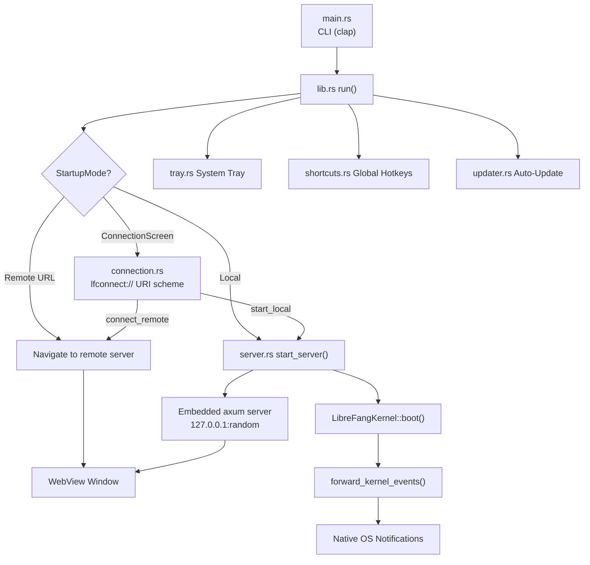

# Desktop Application

# LibreFang Desktop Application

Native desktop and mobile wrapper built on Tauri 2.0. Boots the LibreFang kernel with an embedded API server, renders the web dashboard in a native WebView, and provides system integration (tray icon, global shortcuts, auto-start, auto-updates, native notifications).

## Architecture Overview


```mermaid
graph TD
    CLI["main.rs<br/>CLI (clap)"] --> RUN["lib.rs run()"]
    RUN --> MODE{StartupMode?}
    MODE -->|Remote URL| NAV["Navigate to remote server"]
    MODE -->|Local| SRV["server.rs start_server()"]
    MODE -->|ConnectionScreen| CONN["connection.rs<br/>lfconnect:// URI scheme"]
    CONN -->|connect_remote| NAV
    CONN -->|start_local| SRV
    SRV --> KERNEL["LibreFangKernel::boot()"]
    SRV --> AXUM["Embedded axum server<br/>127.0.0.1:random"]
    NAV --> WEBVIEW["WebView Window"]
    AXUM --> WEBVIEW
    RUN --> TRAY["tray.rs System Tray"]
    RUN --> SHORTCUTS["shortcuts.rs Global Hotkeys"]
    RUN --> UPDATER["updater.rs Auto-Update"]
    KERNEL --> EVENTS["forward_kernel_events()"]
    EVENTS --> NOTIFS["Native OS Notifications"]
```

## Operating Modes

The app resolves its startup mode with this priority chain:

1. **CLI `--server-url <URL>`** — immediately connect to a remote server
2. **CLI `--local`** — boot an embedded server, skip the connection screen
3. **Environment variable `LIBREFANG_SERVER_URL`** — same as `--server-url`
4. **Saved preference** in `~/.librefang/desktop.toml` — restores last choice
5. **Connection screen** — self-contained HTML page served via a custom `lfconnect://` URI scheme where the user picks remote or local

The resolved mode is captured in the `StartupMode` enum (`lib.rs`) and determines which managed state is populated before the Tauri window opens.

### Mobile vs Desktop

| Feature | Desktop | Mobile (iOS/Android) |
|---|---|---|
| Embedded server | Yes (`server.rs`) | No — always thin client |
| System tray | Yes (Linux gated behind `linux-tray` feature) | No |
| Global shortcuts | Yes (`shortcuts.rs`) | No |
| Auto-update | Yes (`updater.rs`) | No (store-managed) |
| Credential storage | N/A | OS keyring (`commands.rs`) |
| Auto-start | Yes | No |
| Uninstall | Platform-specific native flow | "Use app store" message |

On mobile release builds, the dashboard bundles into the app and navigates to `tauri://localhost/index.html#api=<encoded daemon URL>`. Debug builds and desktop always use thin-client mode (direct navigation to the daemon URL). This logic lives in `connection::navigation_target`.

## Entry Points

### `main.rs`

Desktop-only binary entry point. Parses CLI flags via `clap`:

```
librefang-desktop --server-url http://192.168.1.100:4545   # Remote mode
librefang-desktop --local                                    # Force local server
librefang-desktop                                            # Connection screen (or saved pref)
```

Loads `~/.librefang/.env` into the process environment synchronously before any async runtime spawns, since `std::env::set_var` is UB once other threads exist.

On mobile, `mobile_main()` is declared via `tauri::mobile_entry_point` and calls `run(None, false)`.

### `run()` in `lib.rs`

Central orchestration function. Responsibilities:

1. Initializes tracing with `RUST_LOG` env filter (defaults to `librefang=info,tauri=info`)
2. Loads `.env` file
3. Resolves `StartupMode` from the priority chain
4. For local mode, calls `server::start_server()` and captures the `ServerHandle`
5. Registers all managed state types with Tauri
6. Wires up plugins (notification, dialog, single-instance, autostart, updater, global shortcuts)
7. Registers platform-specific IPC handlers via `tauri::generate_handler![]`
8. Creates the main WebView window (desktop) or navigates the conf-declared mobile window
9. Sets up event forwarding for native notifications
10. Spawns background update check (desktop)
11. Configures window-close-to-tray behavior (desktop)

## Managed State

Tauri managed state with interior mutability. All types are registered once at startup with initial values; updates go through `RwLock` writes.

| Type | Inner Type | Purpose |
|---|---|---|
| `PortState` | `RwLock<Option<u16>>` | Embedded server port; `None` in remote mode |
| `KernelState` | `RwLock<Option<KernelInner>>` | Kernel handle + `started_at` instant; `None` in remote mode |
| `ServerUrlState` | `RwLock<String>` | URL the WebView points at (local or remote) |
| `RemoteMode` | `RwLock<bool>` | `true` when connected to a remote server |
| `ServerHandleHolder` | `Mutex<Option<ServerHandle>>` | Desktop-only. Holds the server handle for graceful shutdown |

## Embedded Server (`server.rs`)

Desktop-only module that manages the kernel and API server lifecycle.

### Boot Sequence

`start_server()` runs synchronously on the calling thread:

1. `LibreFangKernel::boot(None)` — boots the kernel with default config
2. `TcpListener::bind("127.0.0.1:0")` — claims a random free port on the main thread (guarantees the port is known before any Tauri window is created)
3. Spawns a named background thread (`librefang-server`) that creates its own multi-threaded tokio runtime
4. Inside that runtime: `start_background_agents()`, `spawn_approval_sweep_task()`, then `run_embedded_server()`
5. `build_router()` constructs the axum app; `sync_dashboard()` downloads fresh dashboard assets in the background

### Shutdown

`ServerHandle` supports both explicit `shutdown()` (sends watch signal, joins thread, calls `kernel.shutdown()`) and `Drop`-based best-effort shutdown. An `AtomicBool` prevents double-shutdown.

## Connection Screen (`connection.rs`)

Self-contained HTML/CSS/JS page served through the `lfconnect://` custom URI scheme (registered in `lib.rs`). The old `about:blank` + `document.write` approach broke on WebKitGTK 2.50.

### IPC Commands

| Command | Parameters | Behavior |
|---|---|---|
| `test_connection` | `url: String` | GETs `/api/health` on the remote server, returns the JSON response |
| `connect_remote` | `url: String, remember: bool` | Validates URL, health-checks, saves preference, updates managed state, navigates WebView |
| `start_local` | `remember: bool` | Boots embedded server via `start_server()`, populates all managed state, starts event forwarding, navigates to `http://127.0.0.1:{port}` |

### Preference Persistence

`ConnectionPreference` (mode + optional server_url) is serialized as TOML to `~/.librefang/desktop.toml`. Loaded at startup via `load_saved_preference()`.

### Mobile HTML Adaptation

On `cfg(mobile)`, the connection HTML is post-processed to remove the "Start Local Server" button and its divider. `debug_assert` verifies the sentinel strings are found, so reformatted HTML fails loudly instead of silently.

## Security: URL Validation

`validate_server_url()` in `lib.rs` prevents MITM attacks via IPC injection (issue #3673):

- **HTTPS** to any host — allowed
- **HTTP** to loopback (`127.0.0.0/8`, `::1`, `localhost`) — allowed
- **HTTP** to any other host — **rejected** with a clear error message
- **Userinfo in URL** (`http://loopback@evil.com/`) — **rejected** to prevent bypass via authority parsing
- Unknown schemes, empty hosts, malformed IPv6 — rejected

This runs before the WebView navigates to any user-supplied URL, both at startup and from `connect_remote`.

## IPC Commands (`commands.rs`)

### Status & Introspection

- **`get_port`** — Returns the embedded server port or error if no local server
- **`get_status`** — JSON with `status`, `port`, `agents` count, `uptime_secs`
- **`get_agent_count`** — Number of registered agents

### Agent & Skill Import

- **`import_agent_toml`** — Opens native file picker, parses TOML as `AgentManifest`, copies to `~/.librefang/workspaces/agents/{name}/agent.toml`, spawns the agent
- **`import_skill_file`** — Opens picker filtered to `.md/.toml/.py/.js/.wasm`, copies to `~/.librefang/skills/`, triggers `kernel.reload_skills()`

### System Integration (Desktop-only)

- **`get_autostart` / `set_autostart`** — Query or toggle login auto-start via `tauri-plugin-autostart`
- **`check_for_updates`** — On-demand update check, returns `UpdateInfo`
- **`install_update`** — Downloads and installs update; calls `app.restart()` on success (never returns `Ok`)
- **`open_config_dir`** — Opens `~/.librefang/` in the OS file manager
- **`open_logs_dir`** — Opens `~/.librefang/logs/` in the OS file manager

### Credential Management (Mobile-only)

- **`store_credentials`** — JSON-encodes `{base_url, api_key}` into the OS keyring
- **`get_credentials`** — Retrieves from keyring, returns `null` if none stored
- **`clear_credentials`** — Deletes credentials, succeeds even if none exist

Uses service name `"librefang-mobile"`, account `"daemon-credentials"`.

### Uninstall (`uninstall_app`)

Platform-specific uninstall flow:

| Platform | Strategy |
|---|---|
| Windows | Queries NSIS registry key for `UninstallString`, spawns it |
| macOS | Locates enclosing `.app` bundle, moves to Trash via `osascript` + Finder |
| Linux/AppImage | Deletes the AppImage binary directly |
| Linux/system package | Returns hint (`sudo apt remove librefang`, etc.) — can't elevate from inside the app |
| Mobile | Returns message to use the platform app store |

All desktop paths call `app.exit(0)` after launching the uninstaller.

## System Tray (`tray.rs`)

Desktop-only. On Linux, gated behind the `linux-tray` Cargo feature because Tauri's tray support pulls deprecated GTK3 crates with active RUSTSEC advisories.

Menu items:
- **Show Window** / **Open in Browser** / **Change Server...**
- Status display (uptime for local, URL for remote) and agent count — disabled items
- **Launch at Login** checkbox (toggle via `tauri-plugin-autostart`)
- **Check for Updates...** — checks, notifies, and installs if available
- **Open Config Directory**
- **Quit LibreFang**

Left-click on the tray icon shows/focuses the window. "Change Server" shuts down any running local server, clears state, and re-renders the connection screen via `document.write`.

## Global Shortcuts (`shortcuts.rs`)

Desktop-only. Three system-wide hotkeys registered via `tauri-plugin-global-shortcut`:

| Shortcut | Action |
|---|---|
| `Ctrl+Shift+O` | Show and focus the window |
| `Ctrl+Shift+N` | Show window + emit `navigate` event with `"agents"` |
| `Ctrl+Shift+C` | Show window + emit `navigate` event with `"chat"` |

Registration failure is non-fatal — the app logs a warning and continues.

## Auto-Updater (`updater.rs`)

Desktop-only. Two entry points:

1. **`spawn_startup_check`** — 10-second delayed background task. Pre-flights the update manifest endpoint via HEAD request (avoids noisy error logs when no `latest.json` exists). If an update is found, sends a notification, waits 3 seconds, then installs silently and restarts.

2. **`check_for_update` / `download_and_install_update`** — On-demand commands from the tray or IPC. `check_for_update` returns structured `UpdateInfo`. `download_and_install_update` calls `app.restart()` on success (never returns `Ok`).

## Event Forwarding

`forward_kernel_events()` subscribes to the kernel event bus and surfaces critical events as native OS notifications:

- **Agent crashed** — `LifecycleEvent::Crashed`
- **Kernel stopping** — `SystemEvent::KernelStopping`
- **Quota enforced** — `SystemEvent::QuotaEnforced`

Uses `recv_event_skipping_lag()` so consumer-side drops are counted in the bus-wide `dropped_count()` rather than silently swallowed. Non-critical events are filtered out (`continue`).

Event forwarding is started both at startup (for direct-boot local mode) and from `start_local` (for connection-screen-initiated local mode).

## Window Behavior

On desktop, closing the window hides to tray instead of quitting:

```rust
.on_window_event(|window, event| {
    if let tauri::WindowEvent::CloseRequested { api, .. } = event {
        let _ = window.hide();
        api.prevent_close();
    }
})
```

Single-instance enforcement focuses the existing window when a second instance is launched.