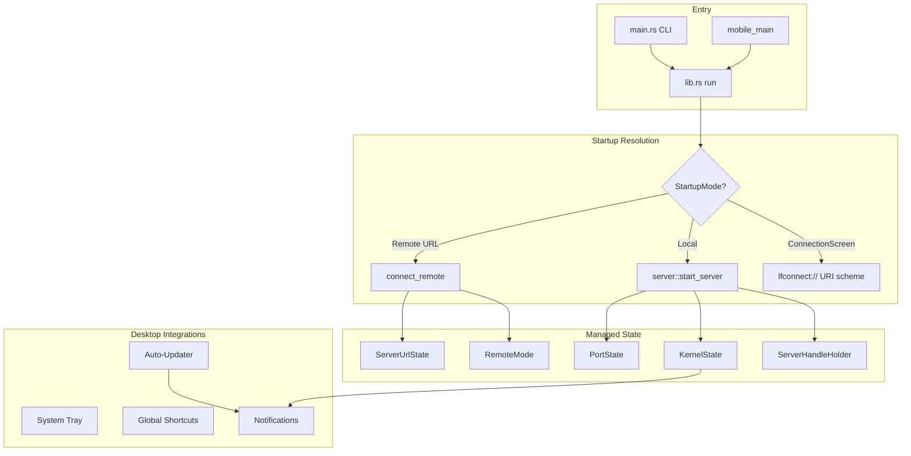

# Desktop Application

# LibreFang Desktop Application

The `librefang-desktop` crate is a Tauri 2.0 native wrapper that provides the primary user interface for LibreFang. It can either boot an embedded kernel + API server locally (desktop) or connect to a remote LibreFang instance (all platforms). The application includes system tray integration, global shortcuts, auto-update, and native OS notifications.

## Architecture Overview


```mermaid
graph TD
    subgraph Entry
        A[main.rs CLI] --> B[lib.rs run]
        M[mobile_main] --> B
    end
    subgraph "Startup Resolution"
        B --> C{StartupMode?}
        C -->|Remote URL| D[connect_remote]
        C -->|Local| E[server::start_server]
        C -->|ConnectionScreen| F[lfconnect:// URI scheme]
    end
    subgraph "Managed State"
        G[PortState]
        H[KernelState]
        I[ServerUrlState]
        J[RemoteMode]
        K[ServerHandleHolder]
    end
    subgraph "Desktop Integrations"
        L[System Tray]
        N[Global Shortcuts]
        O[Auto-Updater]
        P[Notifications]
    end
    E --> G
    E --> H
    E --> K
    D --> I
    D --> J
    H --> P
    O --> P
```

## Module Structure

| File | Purpose |
|------|---------|
| `main.rs` | CLI entry point (desktop only). Parses `--server-url` and `--local` flags, loads `.env` before spawning any threads. |
| `lib.rs` | Core orchestration. Defines managed state types, resolves startup mode, builds the Tauri app with plugins and IPC handlers, creates the main window, and forwards kernel events as native notifications. |
| `commands.rs` | Tauri IPC command handlers exposed to the WebView frontend. |
| `connection.rs` | Connection screen (self-contained HTML), connection preference persistence, and IPC commands for testing/connecting to remote servers or starting a local one. |
| `server.rs` | Kernel lifecycle — boots the kernel, binds to a random localhost port, and runs the axum API server on a background thread with its own tokio runtime. Desktop only. |
| `shortcuts.rs` | System-wide keyboard shortcuts (`Ctrl+Shift+O/N/C`). Desktop only. |
| `tray.rs` | System tray icon with context menu (show window, open in browser, change server, autostart toggle, update check, quit). Desktop only; on Linux, gated behind the `linux-tray` Cargo feature. |
| `updater.rs` | Background update checking and silent installation via `tauri-plugin-updater`. Desktop only. |

## Startup Mode Resolution

The application resolves how to connect at launch, following a strict priority chain:

1. **CLI `--server-url <URL>`** → Remote mode, connect directly to the given URL.
2. **CLI `--local`** → Local mode, boot an embedded server immediately (desktop only; ignored on mobile).
3. **`LIBREFANG_SERVER_URL` env var** → Remote mode.
4. **Saved preference** from `~/.librefang/desktop.toml` → Restores the user's previous choice (remote URL or local).
5. **Connection screen** → Interactive HTML page served via the `lfconnect://` custom URI scheme where the user picks a mode.

The resolved mode is represented by the private `StartupMode` enum in `lib.rs`: `Remote(String)`, `Local` (desktop only), or `ConnectionScreen`.

## Managed State

Tauri managed state provides shared access to runtime configuration. All state types use interior mutability (`RwLock` or `Mutex`) so they can be updated when the user switches between local and remote mode at runtime.

| State Type | Inner Type | Purpose |
|------------|-----------|---------|
| `PortState` | `RwLock<Option<u16>>` | Embedded server port. `None` in remote mode or before boot. |
| `KernelState` | `RwLock<Option<KernelInner>>` | Kernel handle + `Instant` for uptime tracking. `None` in remote mode. |
| `ServerUrlState` | `RwLock<String>` | The URL the WebView points at (local `127.0.0.1` or remote). |
| `RemoteMode` | `RwLock<bool>` | `true` when connected to a remote server. |
| `ServerHandleHolder` | `Mutex<Option<ServerHandle>>` | Holds the server handle for shutdown. Desktop only. |

`KernelInner` stores an `Arc<LibreFangKernel>` and the `Instant` the server started, enabling uptime reporting and agent registry access.

All state is registered once during `run()` with initial values derived from the startup mode. Subsequent updates (e.g., when the user connects to a different server from the connection screen) mutate the interior of the `RwLock`/`Mutex` rather than re-registering.

## IPC Commands

### Server Status

| Command | Returns | Description |
|---------|---------|-------------|
| `get_port` | `u16` | Port of the embedded server. Errors if no local server is running. |
| `get_status` | `serde_json::Value` | JSON with `status`, `port`, `agents` count, and `uptime_secs`. |
| `get_agent_count` | `usize` | Number of registered agents. |

### Agent & Skill Import

- **`import_agent_toml`** — Opens a native file picker filtered to `.toml`, validates the file as an `AgentManifest`, copies it to `~/.librefang/workspaces/agents/{name}/agent.toml`, and spawns the agent. Returns the agent name.
- **`import_skill_file`** — Opens a file picker for `.md`, `.toml`, `.py`, `.js`, `.wasm` files, copies to `~/.librefang/skills/`, and triggers a hot-reload of the skill registry. Returns the filename.

### Auto-Start (desktop only)

- **`get_autostart`** → `bool` — Whether the app is registered to launch at login.
- **`set_autostart(enabled: bool)`** → `bool` — Enable or disable login launch. Returns the new state.

### Updates (desktop only)

- **`check_for_updates`** → `UpdateInfo` — On-demand check returning availability, version, and release notes.
- **`install_update`** → `()` — Downloads and installs the latest update, then restarts. Does not return on success.

### Credentials (mobile only)

Mobile builds use the OS keyring (`librefang-mobile` / `daemon-credentials`) for daemon credentials:

- **`store_credentials(base_url, api_key)`** — JSON-encodes and stores in the keyring.
- **`get_credentials`** → `Option<serde_json::Value>` — Retrieves stored credentials. Returns `null` if none exist.
- **`clear_credentials`** — Removes stored credentials. No-ops if none exist.

### System

- **`open_config_dir`** — Opens `~/.librefang/` in the OS file manager.
- **`open_logs_dir`** — Opens `~/.librefang/logs/` in the OS file manager.
- **`uninstall_app`** — Platform-specific uninstall:
  - **Windows**: Reads `UninstallString` from the NSIS registry key and spawns it.
  - **macOS**: Moves the `.app` bundle to Trash via `osascript`.
  - **Linux/AppImage**: Deletes the AppImage binary. For system packages, returns a hint string with the distro-specific command.
  - **Mobile**: Returns an error advising the user to uninstall via the platform store.

### Connection

- **`test_connection(url)`** — Hits `{url}/api/health` with a 10-second timeout. Returns the parsed JSON response.
- **`connect_remote(url, remember)`** — Validates the URL, verifies health, updates managed state (clears `PortState` and `KernelState` to `None`, sets `RemoteMode` to `true`), optionally saves preference, and navigates the WebView.
- **`start_local(remember)`** *(desktop only)* — Calls `server::start_server` on a blocking thread, populates all managed state with the new server details, starts event forwarding for notifications, optionally saves preference, and navigates the WebView to `http://127.0.0.1:{port}`.

## Embedded Server Lifecycle

The `server` module handles the kernel and API server for local mode:

1. `start_server()` boots `LibreFangKernel::boot(None)` synchronously on the calling thread.
2. Binds a `TcpListener` to `127.0.0.1:0` on the main thread (guarantees the port is known before any Tauri window is created).
3. Spawns a dedicated OS thread named `librefang-server` with its own multi-threaded tokio runtime.
4. Inside the runtime: starts background agents, spawns the approval sweep task, then runs the axum server with graceful shutdown via a `watch` channel.

`ServerHandle` owns the shutdown sender and the server thread's `JoinHandle`. Calling `shutdown()` sends the signal and joins the thread. `Drop` sends the signal without blocking. A `shutdown_initiated` `AtomicBool` prevents double-shutdown.

When switching servers (via the tray "Change Server..." option), the existing `ServerHandle` is taken from `ServerHandleHolder` and shut down on a separate thread before navigating back to the connection screen.

## Connection Screen

Served through the `lfconnect://localhost/` custom URI scheme (registered via `register_uri_scheme_protocol`). This avoids the previous `about:blank` + `document.write` approach that broke on WebKitGTK 2.50.

The HTML includes:
- A URL input for remote server addresses
- "Test Connection" and "Connect" buttons
- An "or" divider with "Start Local Server" button (stripped on mobile via sentinel-based string replacement)
- A "Remember this choice" checkbox
- An "Uninstall LibreFang" button
- A polling-based `waitForTauri()` helper that waits up to 8 seconds for the Tauri v2 IPC bridge to initialize

On mobile release builds (iOS/Android, `not(debug_assertions)`), `navigation_target()` points at the embedded dashboard (`tauri://localhost/index.html#api=<encoded_url>`) so the dashboard can proxy API/WebSocket requests to the daemon. On all other builds, it returns the daemon URL directly.

## Security: URL Validation

`validate_server_url()` enforces that `http://` is only permitted for loopback addresses. This prevents a class of MITM attacks where an attacker-controlled server could inject IPC commands into the Tauri WebView (#3673). The check:

- Rejects unknown schemes outright.
- Allows `https://` unconditionally.
- For `http://`, parses the host (handling IPv6 brackets) and verifies it is `localhost`, `127.x.x.x`, or `::1`.
- Rejects URLs containing `@` (userinfo) to prevent bypasses like `http://[::1]@evil.com/`.

## System Tray

Available on desktop, gated behind the `linux-tray` feature on Linux due to GTK3 unmaintained-crate advisories in the tray-icon dependency chain (#3667).

The tray menu provides:
- **Show Window** — Focuses and unminimizes the main window.
- **Open in Browser** — Opens the current `ServerUrlState` URL in the system browser.
- **Change Server...** — Shuts down any local server, clears state, and navigates back to the connection screen.
- **Agents: N running** / **Status: Running/Remote** — Read-only informational items.
- **Launch at Login** — Toggle for autostart registration.
- **Check for Updates...** — Checks for updates, installs if available, notifies via OS notification.
- **Open Config Directory** — Opens `~/.librefang/`.
- **Quit LibreFang** — Calls `app.exit(0)`.

Left-clicking the tray icon shows/focuses the window. The window close button is intercepted to hide-to-tray instead of quitting.

## Global Shortcuts

Registered via `tauri_plugin_global_shortcut`:

| Shortcut | Action |
|----------|--------|
| `Ctrl+Shift+O` | Show/focus the window |
| `Ctrl+Shift+N` | Show window + emit `navigate` event with `"agents"` |
| `Ctrl+Shift+C` | Show window + emit `navigate` event with `"chat"` |

Registration failure is non-fatal — the app logs a warning and continues.

## Auto-Update

`spawn_startup_check()` runs after a 10-second delay:

1. Probes the updater endpoint with a HEAD request (`manifest_reachable`). If the manifest doesn't exist (e.g., no `latest.json` because the signing key is missing), the check is skipped silently to avoid noisy log output.
2. If the manifest is reachable, calls `do_check()` which uses `tauri-plugin-updater` to compare versions.
3. If an update is found, shows a notification, waits 3 seconds, then calls `download_and_install_update()`.
4. On successful install, calls `app_handle.restart()` — the process does not return.

The manual update path (`check_for_updates` → `install_update` IPC commands) follows the same flow but is triggered by the user.

## Event Forwarding

`forward_kernel_events()` subscribes to the kernel's event bus and surfaces critical events as native OS notifications:

- **Agent Crashed** — `LifecycleEvent::Crashed` with agent ID and error.
- **Kernel Stopping** — `SystemEvent::KernelStopping`.
- **Quota Enforced** — `SystemEvent::QuotaEnforced` with spent/limit amounts.

Uses `recv_event_skipping_lag()` so dropped events are counted in the bus's `dropped_count()` metric and logged as errors rather than silently discarded (#3630).

## Platform Differences

| Feature | Desktop | Mobile |
|---------|---------|--------|
| Embedded server | ✅ | ❌ (thin client) |
| System tray | ✅ (Linux gated) | ❌ |
| Global shortcuts | ✅ | ❌ |
| Auto-update | ✅ | ❌ (store-managed) |
| Auto-start at login | ✅ | ❌ |
| OS keyring credentials | ❌ | ✅ |
| Uninstall command | Platform-specific | Error (use store) |
| `start_local` IPC | ✅ | ❌ |
| Connection screen "Start Local" button | ✅ | Stripped via sentinel replacement |

## CLI Flags

```
librefang-desktop [OPTIONS]

Options:
  --server-url <URL>    Connect to a remote LibreFang server
  --local               Start local server without showing connection screen
```

On mobile, the entry point is `mobile_main()` (a zero-argument function required by `tauri::mobile_entry_point`) which calls `run(None, false)`.

## Configuration Files

| Path | Purpose |
|------|---------|
| `~/.librefang/desktop.toml` | Persisted `ConnectionPreference` (mode + optional server URL). |
| `~/.librefang/workspaces/agents/{name}/agent.toml` | Imported agent manifests. |
| `~/.librefang/skills/` | Imported skill files. |
| `~/.librefang/logs/` | Application logs. |
| `~/.librefang/.env` | Environment variables loaded at startup via `librefang_extensions::dotenv`. |