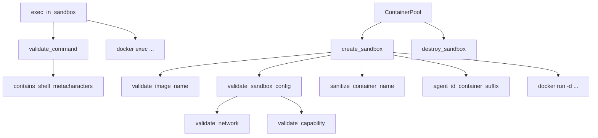

# Docker Sandbox

# Docker Sandbox Module

OS-level isolation layer that executes agent code inside Docker containers with strict security boundaries — capability dropping, network isolation, read-only filesystems, and resource limits.

## Architecture



## Data Structures

### `SandboxContainer`

Tracks a running sandbox container. Returned by `create_sandbox`, consumed by `exec_in_sandbox` and `destroy_sandbox`.

| Field | Type | Description |
|---|---|---|
| `container_id` | `String` | Docker container ID (stdout of `docker run`) |
| `agent_id` | `String` | Agent this container belongs to |
| `created_at` | `DateTime<Utc>` | Creation timestamp |

### `ExecResult`

Outcome of a command executed inside a container via `exec_in_sandbox`. stdout and stderr are truncated at 50,000 characters (UTF-8 boundary–safe) if they exceed that limit.

| Field | Type | Description |
|---|---|---|
| `stdout` | `String` | Captured standard output |
| `stderr` | `String` | Captured standard error |
| `exit_code` | `i32` | Process exit code (`-1` if unavailable) |

### `ContainerPool`

Concurrent-safe container reuse pool backed by `DashMap`. Containers are keyed by their Docker ID and matched by a config hash. See [Container Pooling](#container-pooling) for usage details.

## Public API

### Lifecycle Functions

#### `is_docker_available() -> bool`

Checks whether Docker is reachable by running `docker version --format {{.Server.Version}}`. Returns `true` if the command succeeds. Use this at startup to gate sandbox features.

#### `create_sandbox(config, agent_id, workspace) -> Result<SandboxContainer, String>`

Creates and starts a new Docker container configured per the provided `DockerSandboxConfig`. The workspace directory is mounted read-only at the container's working directory.

**Security operations performed in order:**

1. `validate_image_name` — rejects empty names and shell metacharacters in the image string.
2. `validate_sandbox_config` — rejects `host`/`container:*` network modes and capabilities outside the `SAFE_CAPS` allowlist.
3. `sanitize_container_name` — validates the derived container name is `[a-zA-Z0-9-]{1,63}`.
4. Constructs and runs `docker run -d` with:
   - `--cap-drop ALL` + `--security-opt no-new-privileges`
   - Selective `--cap-add` for each entry in `config.cap_add` (already validated against allowlist)
   - `--network` set to `config.network` (already validated)
   - Resource limits: `--memory`, `--cpus`, `--pids-limit`
   - `--read-only` if `config.read_only_root` is true
   - `--tmpfs` entries from `config.tmpfs`
   - Workspace bind-mounted read-only at `config.workdir`
   - Entrypoint: `sleep infinity` (container stays alive for `exec` calls)

#### `exec_in_sandbox(container, command, timeout) -> Result<ExecResult, String>`

Executes `sh -c <command>` inside a running container. The command is first validated by `validate_command`, which rejects shell metacharacters (pipes, semicolons, backticks, `$()`, `${}`, redirections, etc.). A `tokio::time::timeout` wraps the operation; on expiry, returns an error indicating the timeout in seconds.

Output is truncated at 50,000 bytes using `helpers::safe_truncate_str` to avoid UTF-8 boundary panics.

#### `destroy_sandbox(container) -> Result<(), String>`

Force-stops and removes the container via `docker rm -f`. Failures are logged at `warn!` level but do not propagate as errors (the container may already be gone).

### Validation Functions

#### `validate_sandbox_config(config) -> Result<(), String>`

Entrypoint for full config validation. Checks network mode and each capability in `cap_add`. Emits `error!`-level logs for every rejection so failures appear in daemon startup logs even if the caller discards the `Result`.

#### `validate_bind_mount(path, blocked) -> Result<(), String>`

Validates that a proposed bind mount path does not expose sensitive host resources:

- Requires absolute paths
- Rejects `..` path traversal components
- Blocks a hardcoded list: `/etc`, `/proc`, `/sys`, `/dev`, `/var/run/docker.sock`, `/root`, `/boot`
- Blocks user-configured paths from the `blocked` parameter
- **Symlink escape detection**: canonicalizes the path (or its nearest existing ancestor for non-existent paths) and re-checks the resolved path against all blocklists. This prevents creating a symlink at a non-existent path that later resolves into a blocked directory.

#### `config_hash(config) -> u64`

Deterministic hash of selected config fields (`image`, `network`, `memory_limit`, `workdir`) using `DefaultHasher`. Used by `ContainerPool` to match containers to configs.

### Helper Module (`helpers`)

Published as `pub mod helpers` to enable parity testing against the canonical implementations in `librefang-runtime`. These are deliberate duplicates to avoid cyclic dependencies.

#### `safe_truncate_str(s, max_bytes) -> &str`

UTF-8-safe string truncation. If the string exceeds `max_bytes`, it backs up to the nearest character boundary.

#### `contains_shell_metacharacters(command) -> Option<String>`

Scans for dangerous shell constructs. Returns `Some(reason)` if any are found, `None` if the command appears safe.

**Always scanned on the raw string** (effective inside double quotes too):
- Backticks (`` ` ``) — command substitution
- `$(` — command substitution
- `${` — variable expansion
- Newlines (`\n`, `\r`)
- Null bytes (`\0`)

**Scanned after stripping quoted regions** (only dangerous outside quotes):
- `;` — command chaining
- `|` — pipes
- `<>` — I/O redirection
- `{}` — brace expansion
- `&` — background/compound operators

## Security Model

### Capability Allowlist (`SAFE_CAPS`)

The module drops all Linux capabilities (`--cap-drop ALL`) then adds back only the 14 capabilities in the `SAFE_CAPS` constant:

```
CHOWN, DAC_OVERRIDE, FOWNER, FSETID, KILL, SETGID, SETUID,
SETPCAP, NET_BIND_SERVICE, NET_RAW, SYS_CHROOT, MKNOD,
AUDIT_WRITE, SETFCAP
```

**Explicitly excluded** (sandbox-collapse vectors):

| Capability | Risk |
|---|---|
| `SYS_ADMIN` | Mount, kexec, BPF, namespace manipulation — near-root |
| `NET_ADMIN` | Interface reconfiguration, firewall rules, raw sockets |
| `SYS_PTRACE` | Process attachment; defeats `no-new-privileges` |
| `BPF` | eBPF loading for kernel-level interference |
| `SYS_MODULE` | Kernel module insertion |
| `SYS_BOOT`, `SYS_RAWIO`, `SYS_TIME` | Hardware-level manipulation |

`NET_RAW` is retained because `ping`/`traceroute` require it, but it's documented as a minor SSRF amplifier. The network namespace boundary is the primary protection.

### Network Isolation

`validate_network` rejects three categories:

1. **`host`** — shares the host network namespace, exposing loopback, cloud metadata at `169.254.169.254`, and the daemon's listener on port 4545.
2. **`container:<name>`** — joins another container's namespace, transitively inheriting its access.
3. **Invalid characters** — anything outside `[A-Za-z0-9_-]+` fails fast rather than deferring to a `docker run` error.

Accepted values: `bridge`, `none`, or any user-defined Docker network name matching the character class. Default in `DockerSandboxConfig` is `none`.

### Container Naming

Container names are derived via `agent_id_container_suffix`, which computes `SHA-256(agent_id)[..8 hex chars]` and prepends the configured `container_prefix`. This replaced a previous lossy character-replacement scheme where agent IDs like `"foo/bar"` and `"foo-bar"` both collapsed to `"foo-bar"`, causing distinct agents to share a container.

The suffix is bijective with cryptographic confidence — the 8-character hex prefix provides a 2³² space, making collisions negligible for realistic agent counts on a single host.

## Container Pooling

`ContainerPool` enables container reuse across agent sessions to avoid the startup cost of repeated `docker run` calls.

```rust
let pool = ContainerPool::new();

// Release a container back to the pool
pool.release(container, config_hash(&config));

// Acquire a matching container (same config hash, cooled for at least N seconds)
if let Some(container) = pool.acquire(config_hash(&config), 30) {
    // reuse
}

// Periodic cleanup of stale entries
pool.cleanup(idle_timeout_secs: 300, max_age_secs: 3600).await;
```

### Pool Entry Matching

An `acquire` call matches on:
- **`config_hash`** — must be identical (same image, network, memory limit, workdir)
- **`cool_secs`** — the container must have been idle for at least this many seconds (prevents immediate reuse of a potentially contaminated container)

### Cleanup

`cleanup(idle_timeout_secs, max_age_secs)` removes containers that exceed either the idle timeout or the maximum age, destroying them via `destroy_sandbox`. Call this on a periodic timer.

## Integration Points

- **Config type**: `librefang_types::config::DockerSandboxConfig` — provides all tunables (image, network, resource limits, capabilities, tmpfs mounts).
- **Helper parity**: The `helpers` module is intentionally duplicated from `librefang-runtime` to avoid cyclic dependencies. A parity test at `crates/librefang-runtime/tests/docker_sandbox_helpers_parity.rs` asserts byte-for-byte equivalence with the canonical implementations.
- **Logging**: Uses `tracing` throughout — `debug!` for lifecycle events, `warn!` for non-fatal failures, `error!` for config validation rejections that should appear in startup logs.