# docs — architecture

# Architecture Documentation (`docs/architecture/`)

## Purpose

This directory holds the canonical architecture reference for LibreFang — the design documents that answer *why* the system is shaped the way it is and *how* specific subsystems work at a level deeper than API reference. Each file targets a single concern and is written to stand on its own, with cross-links where one document depends on another's context.

The documents here are **normative**: they define contracts, naming conventions, and migration policies. Code reviews cite them when reviewing changes to the subsystems they cover.

## Document inventory

The module currently contains 15 documents organized into several clusters:

### Logging & observability

| Document | Covers |
|---|---|
| [`access-log-fields.md`](#) | The structured-field schema emitted by the `request_logging` middleware — `request_id`, `method`, `path`, `status`, `latency_ms`, `agent_id` — and how `agent_id` travels from handler to middleware via `Response::extensions`. |
| [`audit-user-attribution.md`](#) | How the tamper-evident audit trail (`librefang-runtime-audit`) attributes events to LibreFang users, which event classes are inherently userless, and how operators filter by user. |

### API surface

| Document | Covers |
|---|---|
| [`api-conventions.md`](#) | Wire-shape contract for sum types (discriminated unions with explicit `type` tags), sentinel-value prohibition (`""` must not mean "unset"), `skip_serializing_if` usage, and the lint script that enforces it. |
| [`idempotency.md`](#) | The `Idempotency-Key` header middleware for state-creating `POST` endpoints — replay vs. conflict semantics, 24h cache window, SQLite persistence via migration v34. |

### Error model

| Document | Covers |
|---|---|
| [`error-contracts.md`](#) | The target error taxonomy across 24 crates: `LibreFangError` as the application enum, `ToolError` as the tool-runner replacement for `Result<String, String>`, per-crate domain enums, the `anyhow` ban in libraries, and the per-slice migration order. |

### Agent execution

| Document | Covers |
|---|---|
| [`message-history-trimming.md`](#) | How `safe_trim_messages` caps stored conversation history — safe cut points at turn boundaries (never mid-tool-call), the three-tier config resolution (manifest → global → constant), and interaction with token-based context-window trimming. |
| [`cron-session-sizing.md`](#) | Persistent cron session growth control: `cron_session_max_messages`, `cron_session_max_tokens`, the `SummarizeTrim` compaction mode, warn thresholds, and the concurrency caveat around the shared `(agent, "cron")` session. |
| [`hand-agent-restore.md`](#) | Why hand-managed agents restore from `hand_state.json` (not the SQLite boot path), and the operational consequence when that file is missing or unreadable. |

### Security & auth

| Document | Covers |
|---|---|
| [`mcp-oauth-host-pinning.md`](#) | The `token_endpoint_host_matches` policy that prevents OAuth code exfiltration during MCP server authorization — exact-host match (Rule 1) and eTLD+1 registrable-domain match (Rule 2), the PSL private-domain carve-out, and IP-literal short-circuit. |
| [`passkey-webauthn.md`](#) | Passkey/WebAuthn login — registration and authentication ceremonies, RP-ID/origin configuration, credential storage in `webauthn_credentials` (migration v44), TOTP interaction, and browser support matrix. |
| [`plugin-signing.md`](#) | Plugin distribution trust model — three-layer defense (HTTPS transport, SHA-256 checksum, Ed25519 signature), the pubkey resolver chain (env var → TOFU cache → HTTP fetch), and what gets signed (index metadata, not bundle bytes). |

### Infrastructure & deployment

| Document | Covers |
|---|---|
| [`multi-replica-rfc.md`](#) | The proposal (not yet accepted) for running LibreFang as multiple daemon replicas — current single-replica constraints (24 singleton workers, per-session locks, audit hash chain, budget reservations), the four-phase plan, and the seven readiness criteria. |
| [`openrouter-live-catalog.md`](#) | Runtime resolution of OpenRouter model inventory — embedded snapshot fallback, live `/models` fetch with TTL and cooldown, narrow-sync model migration, and `assistant` agent exclusion. |

### Channel adapters

| Document | Covers |
|---|---|
| [`rust-sidecar-sdk.md`](#) | The first-party Rust SDK for out-of-process channel adapters — `SidecarAdapter` trait, `run_stdio_main` entry point, `MessageBuilder` / `Schema` / `Content` types, panic isolation, and conformance corpus. |
| [`rust-telegram-sidecar.md`](#) | The first-party Telegram adapter built against the Rust sidecar SDK — feature-parity port of the Python adapter, auto-resolution of the bundled binary, capabilities, and the Markdown→HTML pipeline. |

## How these documents relate to the codebase

```mermaid
graph TD
    subgraph "Library crates"
        TYPES[librefang-types]
        KERNEL[librefang-kernel]
        RUNTIME[librefang-runtime]
        API[librefang-api]
        MEMORY[librefang-memory]
        AUDIT[librefang-runtime-audit]
        LLM[librefang-llm-driver]
        CHANNELS[librefang-channels]
    end

    subgraph "Architecture docs"
        API_CONV[api-conventions]
        ERR_CONTRACTS[error-contracts]
        ACCESS_LOG[access-log-fields]
        AUDIT_ATTR[audit-user-attribution]
        IDEMPO[idempotency]
        TRIMMING[message-history-trimming]
        CRON_SIZING[cron-session-sizing]
        MCP_OAUTH[mcp-oauth-host-pinning]
        PASSKEY[passkey-webauthn]
        PLUGIN_SIGN[plugin-signing]
        MULTI_REPLICA[multi-replica-rfc]
    end

    API_CONV --> API
    ERR_CONTRACTS --> TYPES
    ERR_CONTRACTS --> RUNTIME
    ERR_CONTRACTS --> KERNEL
    ACCESS_LOG --> API
    AUDIT_ATTR --> AUDIT
    IDEMPO --> MEMORY
    IDEMPO --> API
    TRIMMING --> RUNTIME
    CRON_SIZING --> KERNEL
    MCP_OAUTH --> API
    PASSKEY --> API
    PLUGIN_SIGN --> RUNTIME
    MULTI_REPLICA --> KERNEL
    MULTI_REPLICA --> MEMORY
    MULTI_REPLICA --> AUDIT
```

Each document explicitly names the source files it governs. For example, `error-contracts.md` points to `crates/librefang-runtime/src/tool_runner/error.rs` and the `LibreFangError` definition in `crates/librefang-types/`. When reviewing a PR that touches one of those files, the reviewer should consult the corresponding document for the contract the code must satisfy.

## Conventions used across documents

### Issue tracking

Documents reference GitHub issues with inline links (e.g. `[#3511]`, `#3576`, `#6634`). These are the canonical tracking numbers for the work the document describes. A document marked as tracking an issue is incomplete until the issue closes.

### RFC vs. reference

Most documents are **reference** — they describe a system that exists and works. `multi-replica-rfc.md` is explicitly marked as a **proposal** that is not yet accepted; it carries a `Status` header so a reader does not mistake the target architecture for the current one.

### Code excerpts

Documents embed Rust, TOML, SQL, and shell snippets directly from the codebase. These are illustrative, not generated — if the code they reference changes, the document must be updated manually. The excerpt is typically followed by a path comment or a prose pointer to the exact file.

### "What this PR ships" / migration sections

Several documents (`error-contracts.md`, `api-conventions.md`) include explicit migration sections describing what is already landed, what is in scope for the current PR, and what remains. This reflects the incremental approach: conventions are introduced, a lint is added in warn mode, and the existing inventory is migrated slice-by-slice in follow-up PRs.

## Contributing to this module

### When to add a new document

Add a document when a subsystem has a non-obvious design constraint that would be expensive to rediscover from code alone. Good candidates:

- Security-sensitive trust boundaries (see `mcp-oauth-host-pinning.md`, `plugin-signing.md`)
- Cross-crate contracts that multiple reviewers need to enforce (see `error-contracts.md`, `api-conventions.md`)
- Operational behavior operators need to reason about (see `cron-session-sizing.md`, `message-history-trimming.md`)

Do not add a document for a single function's internal logic — that belongs in code comments.

### When to update an existing document

Update when:

- The contract changes (new error variant, new log field, new config knob).
- Coverage expands (the `with_agent_id` coverage list in `access-log-fields.md` grows as more handlers are wired).
- A migration slice lands (the migration order table in `error-contracts.md` gets its checkboxes updated).

### Style

- Lead with the problem the subsystem solves, then the solution shape, then the details.
- Reference actual file paths so a reader can `grep` from the document to the code.
- Distinguish between "this is how it works" and "this is how it should work" — the latter is an RFC or a follow-up note, and must be labeled as such.
- Include the `#issue` number for tracking. When the issue closes, update or remove the tracking reference.

### Relationship to other documentation

These documents sit between the operator-facing runbooks (`docs/operations/`) and inline code comments:

| Layer | Audience | Content |
|---|---|---|
| `docs/operations/` | Operators | How to configure, deploy, and troubleshoot |
| `docs/architecture/` (this module) | Developers and advanced operators | Why the system is shaped this way, cross-cutting contracts |
| Code comments | Contributors to a specific file | Implementation detail, local invariants |

When an architecture document and an operations document cover the same knob (e.g. `max_history_messages`), the architecture document explains *why* the value exists and *how* the resolution chain works, while the operations document says *what to set it to*.