# docs — architektura

# Dokumentacja architektury (`docs/architecture/`)

## Cel

Ten katalog zawiera kanoniczne materiały referencyjne architektury LibreFang — dokumenty projektowe odpowiadające na pytanie, *dlaczego* system ma taki kształt i *jak* działają poszczególne podsystemy na poziomie głębszym niż dokumentacja API. Każdy plik dotyczy jednego zagadnienia i jest napisany tak, aby stanowić samodzielną całość, z odsyłaczami tam, gdzie jeden dokument opiera się na kontekście innego.

Dokumenty zawarte tutaj są **normatywne**: definiują kontrakty, konwencje nazewnictwa i zasady migracji. Code review powołuje się na nie przy weryfikacji zmian w podsystemach, które obejmują.

## Inwentarz dokumentów

Moduł zawiera obecnie 15 dokumentów zorganizowanych w kilka grup:

### Logowanie i obserwowalność

| Dokument | Zakres |
|---|---|
| [`access-log-fields.md`](#) | Schemat ustrukturyzowanych pól emitowanych przez middleware `request_logging` — `request_id`, `method`, `path`, `status`, `latency_ms`, `agent_id` — oraz sposób przesyłania `agent_id` z handlera do middleware'a przez `Response::extensions`. |
| [`audit-user-attribution.md`](#) | Sposób, w jaki audytowalny ślad (`librefang-runtime-audit`) przypisuje zdarzenia użytkownikom LibreFang, które klasy zdarzeń są z natury bezużytkownikowe i jak operatorzy filtrować po użytkowniku. |

### Powierzchnia API

| Dokument | Zakres |
|---|---|
| [`api-conventions.md`](#) | Kontrakt formatu przesyłania dla typów sum (unie rozróżniane z jawnymi tagami `type`), zakaz wartości wartownikowych (`""` nie może oznaczać „nieustawione"), stosowanie `skip_serializing_if` oraz skrypt lint sprawdzający przestrzeganie tych zasad. |
| [`idempotency.md`](#) | Middleware nagłówka `Idempotency-Key` dla endpointów `POST` tworzących stan — semantyka powtórki vs. konflikt, okno pamięci podręcznej 24 h, persystencja SQLite przez migrację v34. |

### Model błędów

| Dokument | Zakres |
|---|---|
| [`error-contracts.md`](#) | Docelowa taksonomia błędów w 24 createch: `LibreFangError` jako enum aplikacyjny, `ToolError` jako zamiennik `Result<String, String>` w runnerze narzędzi, domenowe enumy per crate, zakaz `anyhow` w bibliotekach oraz kolejność migracji per wycinek. |

### Wykonywanie agentów

| Dokument | Zakres |
|---|---|
| [`message-history-trimming.md`](#) | Sposób, w jaki `safe_trim_messages` ogranicza przechowywaną historię konwersacji — bezpieczne punkty cięcia na granicach tur (nigdy w trakcie wywołania narzędzia), trójpoziomowa resolucja konfiguracji (manifest → globalne → stała) oraz interakcja z przycinaniem okna kontekstowego opartym na tokenach. |
| [`cron-session-sizing.md`](#) | Kontrola wzrostu trwałych sesji cron: `cron_session_max_messages`, `cron_session_max_tokens`, tryb kompaktacji `SummarizeTrim`, progi ostrzeżeń oraz zastrzeżenie dotyczące współbieżności wokół współdzielonej sesji `(agent, "cron")`. |
| [`hand-agent-restore.md`](#) | Dlaczego agenty zarządzane ręcznie przywracają stan z `hand_state.json` (a nie ze ścieżki boot SQLite) oraz skutki operacyjne, gdy ten plik jest nieobecny lub nie do odczytu. |

### Bezpieczeństwo i autoryzacja

| Dokument | Zakres |
|---|---|
| [`mcp-oauth-host-pinning.md`](#) | Polityka `token_endpoint_host_matches` zapobiegająca eksfiltracji kodu OAuth podczas autoryzacji serwera MCP — dokładne dopasowanie hosta (Reguła 1) i dopasowanie rejestrowalnej domeny eTLD+1 (Reguła 2), wyłączenie prywatnych domen z PSL oraz obejście dla literałów IP. |
| [`passkey-webauthn.md`](#) | Logowanie passkey/WebAuthn — ceremonie rejestracji i uwierzytelniania, konfiguracja RP-ID/origin, przechowywanie danych uwierzytelniających w `webauthn_credentials` (migracja v44), interakcja z TOTP oraz macierz wsparcia przeglądarek. |
| [`plugin-signing.md`](#) | Model zaufania dystrybucji wtyczek — trzywarstwowa obrona (transport HTTPS, suma kontrolna SHA-256, podpis Ed25519), łańcuch resolwerów kluczy publicznych (zmienna środowiskowa → pamięć TOFU → pobranie HTTP) oraz to, co jest podpisywane (metadane indeksu, a nie bajty bundla). |

### Infrastruktura i wdrożenie

| Dokument | Zakres |
|---|---|
| [`multi-replica-rfc.md`](#) | Propozycja (jeszcze niezaakceptowana) uruchamiania LibreFang jako wielu replik demona — obecne ograniczenia pojedynczej repliki (24 singleton workerów, blokady per-sesja, łańcuch hashów audytu, rezerwacje budżetu), czterofazowy plan oraz siedem kryteriów gotowości. |
| [`openrouter-live-catalog.md`](#) | Resolucja w czasie wykonywania inwentarza modeli OpenRouter — wbudowany zapasowy snapshot, pobieranie na żywo z `/models` z TTL i cooldownem, wąska migracja modeli oraz wykluczenie agenta `assistant`. |

### Adaptery kanałów

| Dokument | Zakres |
|---|---|
| [`rust-sidecar-sdk.md`](#) | Autorski SDK Rust dla adapterów kanałów out-of-process — trait `SidecarAdapter`, punkt wejścia `run_stdio_main`, typy `MessageBuilder` / `Schema` / `Content`, izolacja paniki oraz korpus zgodności. |
| [`rust-telegram-sidecar.md`](#) | Autorski adapter Telegram zbudowany na SDK Rust sidecar — port z pełną parzystością funkcji względem adaptera Python, automatyczna resolucja dołączonego pliku binarnego, capabilities oraz potok Markdown→HTML. |

## Jak te dokumenty odnoszą się do bazy kodu

```mermaid
graph TD
    subgraph "Library crates"
        TYPES[librefang-types]
        KERNEL[librefang-kernel]
        RUNTIME[librefang-runtime]
        API[librefang-api]
        MEMORY[librefang-memory]
        AUDIT[librefang-runtime-audit]
        LLM[librefang-llm-driver]
        CHANNELS[librefang-channels]
    end

    subgraph "Dokumenty architektury"
        API_CONV[api-conventions]
        ERR_CONTRACTS[error-contracts]
        ACCESS_LOG[access-log-fields]
        AUDIT_ATTR[audit-user-attribution]
        IDEMPO[idempotency]
        TRIMMING[message-history-trimming]
        CRON_SIZING[cron-session-sizing]
        MCP_OAUTH[mcp-oauth-host-pinning]
        PASSKEY[passkey-webauthn]
        PLUGIN_SIGN[plugin-signing]
        MULTI_REPLICA[multi-replica-rfc]
    end

    API_CONV --> API
    ERR_CONTRACTS --> TYPES
    ERR_CONTRACTS --> RUNTIME
    ERR_CONTRACTS --> KERNEL
    ACCESS_LOG --> API
    AUDIT_ATTR --> AUDIT
    IDEMPO --> MEMORY
    IDEMPO --> API
    TRIMMING --> RUNTIME
    CRON_SIZING --> KERNEL
    MCP_OAUTH --> API
    PASSKEY --> API
    PLUGIN_SIGN --> RUNTIME
    MULTI_REPLICA --> KERNEL
    MULTI_REPLICA --> MEMORY
    MULTI_REPLICA --> AUDIT
```

Każdy dokument jawnie wymienia pliki źródłowe, którymi zarządza. Na przykład `error-contracts.md` wskazuje na `crates/librefang-runtime/src/tool_runner/error.rs` oraz definicję `LibreFangError` w `crates/librefang-types/`. Przy weryfikacji PR-a, który dotyka jednego z tych plików, recenzent powinien skorzystać z odpowiedniego dokumentu w celu sprawdzenia kontraktu, którego kod musi spełniać.

## Konwencje stosowane w dokumentach

### Śledzenie zgłoszeń

Dokumenty odwołują się do zgłoszeń GitHub za pomocą łączy w tekście (np. `[#3511]`, `#3576`, `#6634`). Są to kanoniczne numery śledzenia dla pracy opisanej w dokumencie. Dokument oznaczony jako śledzący zgłoszenie jest niekompletny, dopóki zgłoszenie nie zostanie zamknięte.

### RFC vs. dokumentacja referencyjna

Większość dokumentów to **dokumentacja referencyjna** — opisują system, który istnieje i działa. `multi-replica-rfc.md` jest jawnie oznaczony jako **propozycja**, która nie została jeszcze zaakceptowana; zawiera nagłówek `Status`, aby czytelnik nie pomylił architektury docelowej z bieżącą.

### Fragmenty kodu

Dokumenty osadzają fragmenty kodu Rust, TOML, SQL i powłoki bezpośrednio z bazy kodu. Stanowią one ilustrację, nie są generowane — jeśli kod, do którego się odnoszą, ulegnie zmianie, dokument musi zostać zaktualizowany ręcznie. Fragment jest zazwyczaj opatrzony komentarzem ze ścieżką lub opisową wskazówką do dokładnego pliku.

### Sekcje „Co dostarcza ten PR" / migracji

Niektóre dokumenty (`error-contracts.md`, `api-conventions.md`) zawierają wyraźne sekcje migracji opisujące, co zostało już wdrożone, co jest w zakresie bieżącego PR-a, a co pozostaje do zrobienia. Odbija to podejście przyrostowe: konwencje są wprowadzane, lint jest dodawany w trybie ostrzeżeń, a istniejący zasób jest migrowany wycinek po wycinku w kolejnych PR-ach.

## Wkład w ten moduł

### Kiedy dodać nowy dokument

Dodaj dokument, gdy podsystem ma nietrywialne ograniczenie projektowe, którego ponowne odkrycie wyłącznie z kodu byłoby kosztowne. Dobrzy kandydaci:

- Wrażliwe na bezpieczeństwo granice zaufania (patrz `mcp-oauth-host-pinning.md`, `plugin-signing.md`)
- Międzykrate kontrakty, które wieloma recenzentom muszą wymusić (patrz `error-contracts.md`, `api-conventions.md`)
- Zachowanie operacyjne, o którym operatorzy muszą rozumować (patrz `cron-session-sizing.md`, `message-history-trimming.md`)

Nie dodawaj dokumentu dla wewnętrznej logiki pojedynczej funkcji — to należy do komentarzy w kodzie.

### Kiedy zaktualizować istniejący dokument

Aktualizuj, gdy:

- Kontrakt ulega zmianie (nowy wariant błędu, nowe pole logu, nowy parametr konfiguracji).
- Zakres się rozszerza (lista pokrycia `with_agent_id` w `access-log-fields.md` rośnie wraz z podłączaniem kolejnych handlerów).
- Wycinek migracji zostaje wdrożony (tabela kolejności migracji w `error-contracts.md` ma zaktualizowane pola wyboru).

### Styl

- Zacznij od problemu, który podsystem rozwiązuje, potem opisz kształt rozwiązania, a następnie szczegóły.
- Powołuj się na rzeczywiste ścieżki plików, aby czytelnik mógł przejść `grep`iem z dokumentu do kodu.
- Rozróżniaj między „tak to działa" a „tak to powinno działać" — drugie to RFC lub uwaga do następnego kroku i musi być odpowiednio oznaczone.
- Podaj numer `#issue` do śledzenia. Po zamknięciu zgłoszenia zaktualizuj lub usuń odwołanie śledzące.

### Relacja z inną dokumentacją

Te dokumenty znajdują się między podręcznikami operacyjnymi (`docs/operations/`) a komentarzami w kodzie:

| Warstwa | Odbiorcy | Zawartość |
|---|---|---|
| `docs/operations/` | Operatorzy | Jak konfigurować, wdrażać i rozwiązywać problemy |
| `docs/architecture/` (ten moduł) | Programiści i zaawansowani operatorzy | Dlaczego system ma taki kształt, kontrakty przekrojowe |
| Komentarze w kodzie | Kontrybutorzy konkretnego pliku | Szczegóły implementacji, lokalne niezmienniki |

Gdy dokument architektoniczny i dokument operacyjny dotyczą tego samego parametru (np. `max_history_messages`), dokument architektoniczny wyjaśnia, *dlaczego* wartość istnieje i *jak* działa łańcuch resolucji, podczas gdy dokument operacyjny podaje, *na co go ustawić*.
