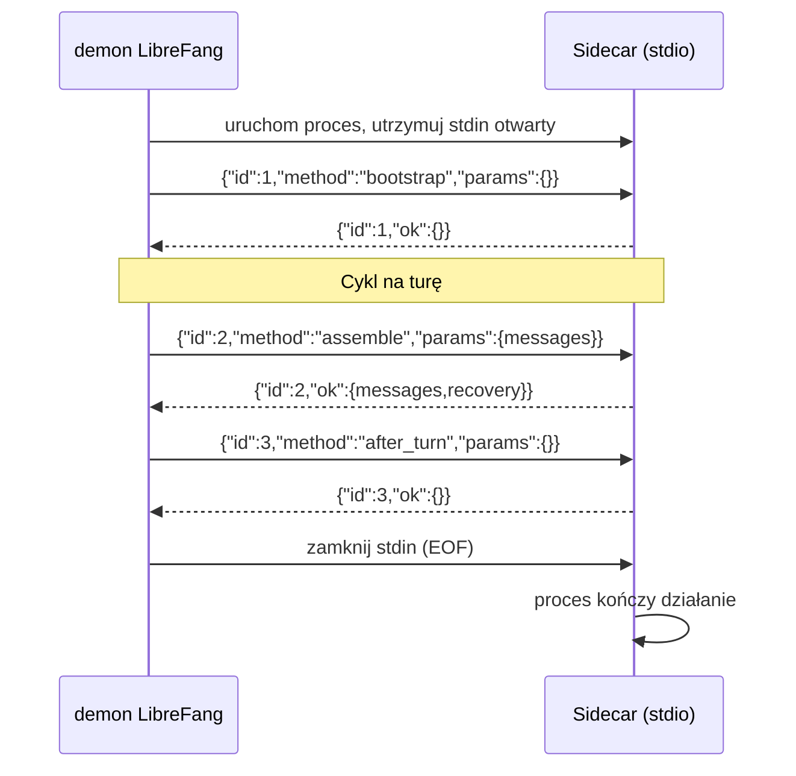

# docs — przykłady

# Przykłady — sidecary referencyjne

Katalog `docs/examples` zawiera referencyjne implementacje w Pythonie 3 (bez zależności) dwóch punktów rozszerzeń sidecar, jakie udostępnia LibreFang: **silnik kontekstowy** oraz **proaktywny ekstraktor pamięci}. Każdy skrypt to długotrwały proces stdio, który komunikuje się z demonem za pomocą protokołu JSON rozdzielonego znakami nowej linii. Są celowo minimalistyczne — ich celem jest zademonstrowanie formatu przesyłania, konfiguracji połączeń oraz dwóch dobrze znanych pułapek stdio, a nie dostarczenie logiki produkcyjnej.

## Pliki

| Plik | Zastępuje | Sekcja konfiguracji |
|---|---|---|
| `context_engine_sidecar.py` | Wbudowany silnik okienkowania/przypominania kontekstu | `[context_engine.sidecar]` |
| `memory_extractor_sidecar.py` | Wbudowany proaktywny ekstraktor pamięci | `[proactive_memory.extractor_sidecar]` |

## Protokół przesyłania

Oba sidecary współdzielą tę samą ramkę:

```
daemon  ──>{"id": N, "method": "...", "params": {...}}\n ──>  sidecar
sidecar ──>{"id": N, "ok": {...}}\n                      ──>  daemon
         ──>{"id": N, "error": "<msg>"}\n                ──>  daemon
```

- **Jeden obiekt JSON na linię**, zakończony przez `\n`.
- Każda odpowiedź powtarza `id` żądania, aby demon mógł dopasować asynchroniczne odpowiedzi.
- W przypadku sukcesu ładunek znajduje się pod kluczem `ok`. W przypadku błędu czytelny dla człowieka komunikat znajduje się pod `error`.
- Sidecar nie może zakończyć działania z powodu pojedynczego błędnego żądania — oba skrypty owijają wywołania obsługi w `try/except` i wysyłają odpowiedź `error` zamiast zamykać pętlę odczytu.

### Dwie pułapki stdio, przed którymi ostrzegają przykłady

Oba docstringi o nich wspominają, ponieważ łatwo je popełnić:

1. **Czytaj za pomocą `sys.stdin.readline()`, a nie `for line in sys.stdin`.** Forma z iteratorem buforuje z wyprzedzeniem i zablokuje się aż do EOF, co oznacza, że żadna linia nie zostanie dostarczona, dopóki proces żyje. `readline()` wraca natychmiast, gdy dostępna jest jedna nowa linia.
2. **Wywołuj `sys.stdout.flush()` po każdej odpowiedzi.** Gdy stdout jest potokiem (co ma miejsce tutaj), jest domyślnie buforowany blokowo. Bez jawnego opróżnienia demon nigdy nie otrzymałby odpowiedzi.

Oba skrypty współdzielą ten sam kształt pętli `main()`:

```python
def main():
    while True:
        line = sys.stdin.readline()
        if not line:
            break               # EOF — demon zamknął stdin
        line = line.strip()
        if not line:
            continue
        try:
            req = json.loads(line)
        except ValueError:
            continue            # pomiń źle sformułowane linie
        ...zbuduj odpowiedź...
        sys.stdout.write(json.dumps(reply) + "\n")
        sys.stdout.flush()
```

## context_engine_sidecar.py

Zastępuje wbudowany silnik kontekstowy. Demon wywołuje jedną z czterech metod na turę:

| Metoda | Kiedy wywoływana | Zachowanie referencyjne |
|---|---|---|
| `bootstrap` | Uruchomienie sidecara | Brak operacji, zwraca `{}` |
| `ingest` | Po zapisaniu pamięci | Zwraca `{"recalled_memories": []}` — brak przypominania w referencji |
| `assemble` | Przed zbudowaniem żądania LLM | Przycina do najnowszych `KEEP_RECENT` (40) wiadomości |
| `after_turn` | Po zatwierdzeniu odpowiedzi asystenta | Brak operacji, zwraca `{}` |

Obsługi są zarejestrowane w tabeli dyspozycji:

```python
HANDLERS = {
    "ingest": ingest,
    "assemble": assemble,
    "after_turn": after_turn,
    "bootstrap": bootstrap,
}
```

### Sygnalizowanie odzyskiwania

`assemble` to jedyna obsługa wykonująca właściwą pracę. Gdy przycina wiadomości z okna, zgłasza demonowi liczbę usuniętych wiadomości za pomocą pola `recovery`, aby demon wiedział, że historia została odrzucona:

```python
recovery = "None" if removed == 0 else {"AutoCompaction": {"removed": removed}}
```

Kształt odpowiedzi to `{"messages": [...], "recovery": recovery}`. Zwrócenie `"None"` (ciągu znaków) sygnalizuje „nic nie zostało usunięte"; obiekt `AutoCompaction` sygnalizuje demonowi, że nastąpiła kompakcja.

### Konfiguracja

```toml
[context_engine]
engine = "sidecar"

[context_engine.sidecar]
command = "python3"
args = ["/path/to/context_engine_sidecar.py"]
```

Ustaw `engine = "sidecar"`, aby aktywować proces zewnętrzny; w przeciwnym razie używany jest wbudowany silnik kontekstowy.

## memory_extractor_sidecar.py

Zastępuje wbudowany proaktywny ekstraktor pamięci. Demon wysyła:

```json
{"id": 7, "method": "extract_memories",
 "params": {"messages": [...], "categories": ["preference", ...]}}
```

Sidecar zwraca listę odłamków pamięci w prostym kształcie, jakiego oczekuje demon:

```json
{"id": 7, "ok": {"memories": [{"content": "...", "category": "preference"}],
                  "has_content": true}}
```

Demon odpowiada za przypisanie `id` (UUID), `created_at` i `source` — sidecar produkuje jedynie `{content, category?, level?, metadata?}`. Wyodrębnione pamięci powinny być ograniczone do kategorii dostarczonych w `params.categories`.

### Heurystyka referencyjna

Zabawkowa funkcja `extract()` skanuje tylko najnowszą wiadomość użytkownika pod kątem stałego zestawu fraz wyzwalających:

```python
TRIGGERS = ("i prefer ", "remember that ", "my name is ", "i like ", "i work ")
```

Prawdziwy ekstraktor zastąpiłby to ciało wywołaniem modelu (lokalnego lub zdalnego), potokiem osadzania lub dowolną inną strategią. Pętla bada wiadomości w odwrotnej kolejności, zatrzymuje się na pierwszej turze użytkownika i zwraca `has_content: false`, gdy nic nie pasuje — co informuje demona, że nie ma nic do utrwalenia.

### Konfiguracja

```toml
[proactive_memory.extractor_sidecar]
command = "python3"
args = ["/path/to/memory_extractor_sidecar.py"]
```

## Cykl życia i przepływ danych



## Rozszerzanie przykładów

Przewidziane punkty dostosowania to:

- **`context_engine_sidecar.py`** — zamień `ingest` (aby zwracać obiekty `MemoryFragment` do wstrzykiwania w prompt systemowy), `assemble` (aby zaimplementować własną politykę okienkowania/pobierania) i `after_turn` (aby utrwalać stan w wektorowym magazynie lub bazie danych).
- **`memory_extractor_sidecar.py`** — zamień `extract` wywołaniem modelu, zachowując ten sam kształt odpowiedzi i szanując białą listę `categories`.

Ponieważ protokół jest niezależny od języka i pozbawiony zależności, możesz przepisać dowolny sidecar w dowolnym języku; liczy się tylko ramkowanie JSON rozdzielone znakami nowej linii.
