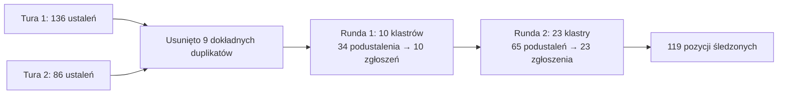

# dokumentacja — problemy

# docs/issues — Rejestr wyników audytu

## Cel

`docs/issues/` to kanoniczny indeks wszystkich ustaleń dotyczących bezpieczeństwa, niezawodności i architektury wygenerowanych przez zautomatyzowany potok audytu LibreFang. Spełnia trzy role:

1. **Aktywne śledzenie** — pliki Markdown dla poszczególnych ustaleń nadal wymagających naprawy, każdy powiązany z zgłoszeniem na GitHubie.
2. **Historyczny rejestr** — `INDEX.md` zachowuje pełny zakres audytu (119 pozycji) nawet po usunięciu poszczególnych plików po rozwiązaniu, dzięki czemu oryginalny identyfikator i jednowierszowe podsumowanie pozostają przeszukiwalne.
3. **Poradnik triażu** — priorytetyzowana kolejność napraw obejmująca obie tury audytu.

Ten katalog nie zawiera kodu wykonywalnego. Jest wykorzystywany przez programistów, recenzentów i planistów wydań.

## Struktura

```
docs/issues/
├── INDEX.md                              # Indeks główny, zestawienie, kolejność triażu
├── audit-log-cap-only-on-trim-interval.md
├── data-layer-rule-clean.md
├── i18n-escapeValue-false.md
├── phf-generator-old-rand.md
├── rustfmt-loses-spaced-paths.md
├── two-migrate-crates.md
├── wechat-bot-token-prefix-debug-log.md
└── workspace-setup-write-all-swallow.md
```

Pozostało tylko **8 aktywnych plików ustaleń**. Pozostałe 111 pozycji zostało rozwiązanych za pomocą zgłoszeń na GitHubie, a ich pliki usunięto; wpisy w `INDEX.md` są zachowane jako historyczna ślad.

## INDEX.md

Indeks główny jest punktem wejścia. Zawiera:

| Sekcja | Treść |
|---|---|
| **Nagłówek statusu** | Data migawki, liczba rozwiązanych vs aktywnych ustaleń oraz instrukcje wyszukiwania rozwiązanych pozycji (`gh issue list --state closed` lub `git log -- docs/issues/<slug>.md`). |
| **Tabela aktywnych ustaleń** | 8 pozostałych plików `.md` z ich numerami zgłoszeń na GitHubie (#5543–#5668). |
| **Pochodzenie audytu** | Hash commita (`087a0481`), data (2026-05-18), konfiguracja agenta (2 niezależne audyty × 10 równoległych agentów recenzji) oraz potok konsolidacji. |
| **Zestawienie krytyczności** | Liczba wg krytyczności dla wszystkich 119 pozycji (Krytyczne 7, Wysokie 37, Średnie 54, Niskie 22). |
| **Listy ustaleń** | Wszystkie 119 pozycji pogrupowanych wg krytyczności, a następnie wg domeny (Uwierzytelnianie i sekrety, Powierzchnia ataku API, Obsługa błędów, Wydajność, Architektura, Pokrycie testami, CI/hooks, Dashboard, Sterownik LLM i MCP, Sandbox, Współbieżność, Integralność danych, DoS, Łańcuch dostaw, Walidacja wejścia, Orkiestracja jądra). |
| **Kolejność triażu** | 14-krokowa sekwencja priorytetów obejmująca obie tury audytu. |

### Potok konsolidacji

119 pozycji to wynik deduplikacji i klasteryzacji tematycznej w obu turach audytu:



## Format pliku ustalenia

Każdy aktywny plik `.md` podąża za spójną strukturą, choć dokładne nagłówki różnią się w zależności od typu ustalenia:

### Pola standardowe

- **Tytuł** — Zawiera tag krytyczności w nawiasach kwadratowych (np. `[Medium]`) i krótki kwalifikator domeny.
- **`Severity:`** — Jedno z: `Critical`, `High`, `Medium`, `Low`.
- **`Category:` / `Domain:`** — Obszar problemu ustalenia (np. DoS / wyczerpanie zasobów, Sekrety i obsługa poświadczeń, CI / hooks).
- **`Labels:`** — Etykiety w stylu GitHuba, oddzielone spacjami.
- **`Status:`** — Obecne w skonsolidowanych ustaleniach; opisuje, które wcześniejsze zgłoszenia zostały połączone.

### Typowe sekcje

| Sekcja | Cel |
|---|---|
| **Pliki objęte** | Dokładne ścieżki plików i zakresy wierszy. |
| **Opis** | Błąd lub wada projektowa z fragmentami kodu z rzeczywistego źródła. |
| **Rekomendacja** | Konkretna naprawa z przykładami kodu. |
| **Zestawienie podustaleń** | (Tylko skonsolidowane ustalenia) Tabela mapująca każde źródłowe zgłoszenie na jego opis i lokalizację. |
| **Powód połączenia** | (Tylko skonsolidowane ustalenia) Uzasadnienie połączenia podustaleń. |
| **Połączony plan naprawy** | (Tylko skonsolidowane ustalenia) Numerowane kroki naprawy obejmujące wszystkie podustalenia. |
| **Testy** | Kroki weryfikacji potwierdzające naprawę. |
| **Weryfikacja** | Wyniki ponownego audytu; może oznaczyć ustalenie jako `DISPUTED`, jeśli pierwotna przesłanka była błędna. |

### Konwencja nazewnictwa plików

`{slug}.md` — kebab-case, opisujący przyczynę główną, nie objaw. Slugi to stabilne identyfikatory: nawet po usunięciu pliku, slug pozostaje w `INDEX.md` i w `git log`.

## Aktywne ustalenia

8 pozostałych plików śledzi problemy w 5 domenach:

| Slug | Zgłoszenie | Krytyczność | Domena | Problem główny |
|---|---|---|---|---|
| `audit-log-cap-only-on-trim-interval` | #5665 | Low | DoS | `AuditLog::record` — pojemność sprawdzana tylko w interwale przycinania. **DISPUTED** — istnieje twardy limit `MAX_AUDIT_ENTRIES = 10_000`. |
| `data-layer-rule-clean` | #5666 | Low | Dashboard | Skonsolidowane: linia bazowa warstwy danych, luka `commsKeys lists()`, surowy `localStorage`, fokus modalu. |
| `i18n-escapeValue-false` | #5561 | Medium | Dashboard | `escapeValue: false` + `dangerouslySetInnerHTML` = ryzyko XSS; obejmuje też rozbieżność kluczy magazynu i brakujące znaczniki unieważnienia. |
| `phf-generator-old-rand` | #5667 | Low | Łańcuch dostaw / Build | Skonsolidowane: `phf_generator 0.8` pinuje `rand 0.7.3`, `proc-macro-error` przez GTK, `tokio = ["full"]` w workspace, `pnpm audit` ignoruje, shims w `build.rs`, rozrost wersji. |
| `rustfmt-loses-spaced-paths` | #5664 | High | CI / hooks | Skonsolidowane: niecytowany `$STAGED_RS` w pre-commit, luka rezerwowa `sha256sum`, brakujący hook `pre-push`, nieużywany `.secrets.baseline`. |
| `two-migrate-crates` | #5668 | Low | Architektura | Skonsolidowane: zmiana nazwy crate wykonana (`librefang-import`), nieaktualne pliki `CLAUDE.md`, nakładanie się `xtask` vs `justfile`. |
| `wechat-bot-token-prefix-debug-log` | #5543 | Medium | Sekrety | Log `debug!` WeChat wysyła pierwsze 10 znaków tokena bota + ID użytkownika. |
| `workspace-setup-write-all-swallow` | #5585 | Medium | Obsługa błędów | `workspace_setup.rs` cicho połyka awarie `write_all`; uszkodzone pliki agenta stają się trwałe. |

## Priorytet triażu

Kolejność triażu w `INDEX.md` określa sekwencję napraw w obu turach:

**Tura 1 (pozycje 1–6):**
1. `api-error-generic-missing-fluent-key` — jednowierszówka na lokalizację, przywraca diagnostykę dla 41 punktów końcowych.
2. `ssrf-attachment-urls` + `skill-install-path-traversal` — konkretne ścieżki eksploitacji.
3. `state-secret-default-random` — cicho psuje wieloreplikowe wdrożenia.
4. `list-sessions-decode-on-poll` + `audit-export-401` — naprawy jednowierszowe, bezpośredni wpływ na użytkownika.
5. `write-secret-env-toctou` + `dashboard-login-logs-phc-hash` — higiena sekretów.
6. `openapi-paths-incomplete` + `config-reload-coverage` — testy odbicia blokują klasy regresji.

**Tura 2 (pozycje 7–14):**
7. Wycieki tekstu jawnego tokenów OAuth (`oauth-refresh-error-body-token-leak`, `oauth-tokens-derive-debug-serialize`).
8. `sqlite-file-permissions` — naprawa jednowierszowa, duży zasięg.
9. `agent-cascade-delete-missing-tables` — powtórka bearer-tokena wobec usuniętych agentów.
10. `comms-send-impersonation` — granica uprawnień.
11. `shell-meta-double-quote-bypass` — regresja allowlisty.
12. `channel-bridge-bypasses-lane-semaphore` — wzmacniacz DoS.
13. `upload-route-bypasses-body-limit` — trywialne wyczerpanie RAM.
14. `trigger-engine-no-per-agent-cap` — DoS na warstwie manifestów.

## Praca z tym katalogiem

### Znajdowanie rozwiązanych zgłoszeń

Rozwiązane ustalenia nie mają pliku `.md`. Użyj jednej z metod:

```bash
# Wyszukaj zamknięte zgłoszenia na GitHubie wg słowa kluczowego sluga
gh issue list --state closed --search "<slug-fragment>"

# Znajdź commit, który usunął plik
git log -- docs/issues/<slug>.md
```

### Dodawanie nowego ustalenia

1. Utwórz `{slug}.md` używając standardowego zestawu pól opisanego powyżej.
2. Dodaj wpis do odpowiedniej sekcji krytyczności/domeny w `INDEX.md`.
3. Zaktualizuj tabelę aktywnych ustaleń oraz zestawienie liczb krytyczności.
4. Otwórz zgłoszenie na GitHubie i powiąż je w pliku oraz w tabeli.

### Rozwiązywanie ustalenia

1. Usuń plik `.md`.
2. Przenieś jego wiersz z tabeli aktywnych ustaleń do listy historycznej (link będzie celowo niedziałający — tekst linku jest rekordem).
3. Zmniejsz liczbę aktywnych w nagłówku statusu oraz w zestawieniu krytyczności.

### Kwestionowanie ustalenia

Jeśli ponowny audyt wykaże, że pierwotna przesłanka jest błędna, nie usuwaj pliku po cichu. Dodaj wiersz `**Verification:** DISPUTED.` na górze z poprawioną analizą i zostaw plik na miejscu, dopóki zespół nie zgodzi się na rozwiązanie. Ustalenie `audit-log-cap-only-on-trim-interval` jest przykładem tego stanu.
