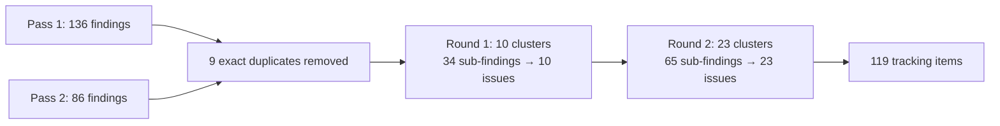

# docs — issues

# docs/issues — Audit Findings Tracker

## Purpose

`docs/issues/` is the canonical index for all security, reliability, and architecture findings produced by the LibreFang automated audit pipeline. It serves three roles:

1. **Active tracking** — per-finding Markdown files for issues still under remediation, each linked to a GitHub issue.
2. **Historical record** — `INDEX.md` preserves the full audit scope (119 items) even after individual files are deleted on resolution, so the original slug and one-line summary remain searchable.
3. **Triage guide** — a prioritized remediation order spanning both audit passes.

This directory contains no executable code. It is consumed by developers, reviewers, and release planners.

## Structure

```
docs/issues/
├── INDEX.md                              # Master index, rollup, triage order
├── audit-log-cap-only-on-trim-interval.md
├── data-layer-rule-clean.md
├── i18n-escapeValue-false.md
├── phf-generator-old-rand.md
├── rustfmt-loses-spaced-paths.md
├── two-migrate-crates.md
├── wechat-bot-token-prefix-debug-log.md
└── workspace-setup-write-all-swallow.md
```

Only **8 active finding files** remain. The other 111 items have been resolved via GitHub issues and their files deleted; their entries in `INDEX.md` are retained as a historical breadcrumb.

## INDEX.md

The master index is the entry point. It contains:

| Section | Content |
|---|---|
| **Status header** | Snapshot date, count of resolved vs. active findings, and instructions for finding resolved items (`gh issue list --state closed` or `git log -- docs/issues/<slug>.md`). |
| **Active findings table** | The 8 remaining `.md` files with their GitHub issue numbers (#5543–#5668). |
| **Audit provenance** | Commit hash (`087a0481`), date (2026-05-18), agent configuration (2 independent audits × 10 parallel review agents), and the consolidation pipeline. |
| **Severity rollup** | Count by severity across all 119 items (Critical 7, High 37, Medium 54, Low 22). |
| **Finding listings** | All 119 items grouped by severity, then by domain (Auth & secrets, API attack surface, Error handling, Performance, Architecture, Test coverage, CI/hooks, Dashboard, LLM driver & MCP, Sandbox, Concurrency, Data integrity, DoS, Supply chain, Input validation, Kernel orchestration). |
| **Triage order** | A 14-step priority sequence spanning both audit passes. |

### Consolidation Pipeline

The 119 items are the result of deduplication and thematic clustering across two audit passes:



## Per-Finding File Format

Each active `.md` file follows a consistent structure, though the exact headings vary by finding type:

### Standard fields

- **Title** — Includes severity tag in brackets (e.g., `[Medium]`) and a short domain qualifier.
- **`Severity:`** — One of `Critical`, `High`, `Medium`, `Low`.
- **`Category:` / `Domain:`** — The finding's problem area (e.g., DoS / resource exhaustion, Secrets & credential handling, CI / hooks).
- **`Labels:`** — Space-delimited GitHub-style labels.
- **`Status:`** — Present on consolidated findings; describes which earlier issues were merged.

### Common sections

| Section | Purpose |
|---|---|
| **Affected files** | Exact file paths and line ranges. |
| **Description** | The bug or design flaw, with code snippets from the actual source. |
| **Recommendation** | Concrete fix with code examples. |
| **Sub-findings rollup** | (Consolidated findings only) Table mapping each origin issue to its description and location. |
| **Why merged** | (Consolidated findings only) Rationale for combining sub-findings. |
| **Combined fix plan** | (Consolidated findings only) Numbered remediation steps covering all sub-findings. |
| **Tests** | Verification steps to confirm the fix. |
| **Verification** | Re-audit results; may mark a finding as `DISPUTED` if the original premise was incorrect. |

### Filename convention

`{slug}.md` — kebab-case, descriptive of the root cause, not the symptom. Slugs are stable identifiers: even after a file is deleted, the slug persists in `INDEX.md` and in `git log`.

## Active Findings

The 8 remaining files track issues across 5 domains:

| Slug | Issue | Severity | Domain | Core problem |
|---|---|---|---|---|
| `audit-log-cap-only-on-trim-interval` | #5665 | Low | DoS | `AuditLog::record` capacity checked only at trim interval. **DISPUTED** — hard `MAX_AUDIT_ENTRIES = 10_000` ceiling exists. |
| `data-layer-rule-clean` | #5666 | Low | Dashboard | Consolidated: data-layer baseline, `commsKeys lists()` gap, raw `localStorage`, modal focus. |
| `i18n-escapeValue-false` | #5561 | Medium | Dashboard | `escapeValue: false` + `dangerouslySetInnerHTML` = XSS risk; also covers storage key divergence and missing invalidation markers. |
| `phf-generator-old-rand` | #5667 | Low | Supply chain / Build | Consolidated: `phf_generator 0.8` pins `rand 0.7.3`, `proc-macro-error` via GTK, workspace `tokio = ["full"]`, `pnpm audit` ignores, `build.rs` shims, version sprawl. |
| `rustfmt-loses-spaced-paths` | #5664 | High | CI / hooks | Consolidated: unquoted `$STAGED_RS` in pre-commit, `sha256sum` fallback gap, missing `pre-push` hook, unconsumed `.secrets.baseline`. |
| `two-migrate-crates` | #5668 | Low | Architecture | Consolidated: crate rename done (`librefang-import`), stale `CLAUDE.md` files, `xtask` vs `justfile` overlap. |
| `wechat-bot-token-prefix-debug-log` | #5543 | Medium | Secrets | WeChat `debug!` log emits first 10 chars of bot token + user ID. |
| `workspace-setup-write-all-swallow` | #5585 | Medium | Error handling | `workspace_setup.rs` silently swallows `write_all` failures; corrupted agent files become permanent. |

## Triage Priority

The triage order in `INDEX.md` defines remediation sequence across both passes:

**Pass 1 (items 1–6):**
1. `api-error-generic-missing-fluent-key` — one-liner per locale, restores diagnostics for 41 endpoints.
2. `ssrf-attachment-urls` + `skill-install-path-traversal` — concrete exploit paths.
3. `state-secret-default-random` — silently breaks multi-replica.
4. `list-sessions-decode-on-poll` + `audit-export-401` — single-line fixes, immediate user impact.
5. `write-secret-env-toctou` + `dashboard-login-logs-phc-hash` — secret hygiene.
6. `openapi-paths-incomplete` + `config-reload-coverage` — reflection tests block regression classes.

**Pass 2 (items 7–14):**
7. OAuth token plaintext leaks (`oauth-refresh-error-body-token-leak`, `oauth-tokens-derive-debug-serialize`).
8. `sqlite-file-permissions` — one-line fix, large blast radius.
9. `agent-cascade-delete-missing-tables` — bearer-token replay against deleted agents.
10. `comms-send-impersonation` — privilege boundary.
11. `shell-meta-double-quote-bypass` — allowlist regression.
12. `channel-bridge-bypasses-lane-semaphore` — DoS amplifier.
13. `upload-route-bypasses-body-limit` — trivial RAM exhaustion.
14. `trigger-engine-no-per-agent-cap` — DoS at manifest layer.

## Working with This Directory

### Finding a resolved issue

Resolved findings have no `.md` file. Use one of:

```bash
# Search closed GitHub issues by slug keyword
gh issue list --state closed --search "<slug-fragment>"

# Find the commit that deleted the file
git log -- docs/issues/<slug>.md
```

### Adding a new finding

1. Create `{slug}.md` using the standard field set above.
2. Add an entry to the appropriate severity/domain section in `INDEX.md`.
3. Update the active findings table and the severity rollup counts.
4. Open a GitHub issue and cross-reference it in the file and the table.

### Resolving a finding

1. Delete the `.md` file.
2. Move its row from the active findings table to the historical listing (the link will be broken by design — the link text is the record).
3. Decrement the active count in the status header and the severity rollup.

### Disputing a finding

If a re-audit shows the original premise is wrong, do not silently delete the file. Add a `**Verification:** DISPUTED.` line at the top with the corrected analysis, and leave the file in place until the team agrees on resolution. The `audit-log-cap-only-on-trim-interval` finding is an example of this state.