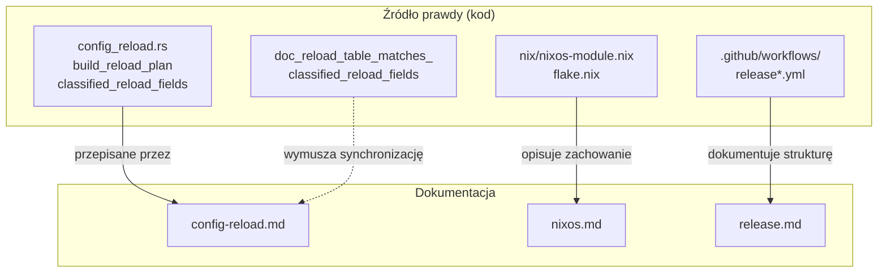

# docs — operacje

# docs — operacje

Dokumentacja przeznaczona dla operatorów, obejmująca trzy obszary operacyjne: semantyka gorącego przeładowania konfiguracji, wdrażanie na NixOS oraz potok wydawania wersji. Te dokumenty stanowią kanoniczne źródło referencyjne dla operatorów uruchamiających LibreFang w środowisku produkcyjnym oraz dla współtwórców utrzymujących opisane podsystemy.

## Cel

Moduł istnieje, ponieważ każdy poruszany w nim temat zawiera na tyle dużo nieoczywistego zachowania — ciche operacje no-op, wartości przechwytywane przy starcie, pułapki ścieżek store'u, różnice w uwierzytelnianiu między rozdzielonymi przepływami pracy — że operator nie może niezawodnie wywnioskować właściwej akcji na podstawie samego kodu źródłowego. Każdy dokument został napisany, aby odpowiedzieć na konkretne pytanie operacyjne *zanim* operator będzie musiał czytać Rust lub Nix:

| Dokument | Odpowiada na | Główna grupa odbiorców |
|---|---|---|
| `config-reload.md` | „Zmieniłem pole konfiguracji i przeładowałem — czy zmiana zadziałała, czy muszę zrestartować?" | Operatorzy edytujący `config.toml` lub wysyłający `POST /api/config` |
| `nixos.md` | „Jak uruchomić LibreFang na NixOS i na co uważać?" | Administratorzy NixOS |
| `release.md` | „Jak wydawane są wersje i jak ponownie uruchomić pojedynczy cel, który zawiódł?" | Utrzymujący wydawanie wersji |

## Struktura

### `config-reload.md`

Pojedyncza tabela klasyfikacji pola po polu dla każdego pola `KernelConfig`, przepisana z `build_reload_plan` / `build_reload_plan_with_caps` w `crates/librefang-kernel/src/config_reload.rs`.

**Strażnik rozbieżności.** Tabela jest wymuszana przez test w czasie kompilacji — `doc_reload_table_matches_classified_reload_fields` — który przerywa kompilację, jeśli pole zostało dodane do planera przeładowania, ale nie do dokumentu, lub odwrotnie. Każdy PR zmieniający klasyfikację pola w `build_reload_plan` musi zaktualizować tabelę w tym samym commicie.

**System klasyfikacji.** Każde pole należy do jednej z trzech kategorii:

- **RequiresRestart (R)** — wartość jest przechwytywana jednokrotnie przy starcie (do pola jądra, routera axum, zadania w tle lub buforowanego sterownika LLM). Żadna gorąca akcja nie odbudowuje tego konsumenta. Sam swap konfiguracji jest cichym no-opem; operator musi zrestartować.
- **HotReload (H)** — zmiana emituje `HotAction`, która re-inicjalizuje dotknięty podsystem w miejscu (ponowne łączenie kanałów, zmiana rozmiaru semaforów, opróżnienie pamięci podręcznej, zamiana migawki przez RCU).
- **Ignore / noop (N)** — wartość jest odczytywana na żywo z `config_ref()` / `self.config.load()` przy każdej wiadomości lub żądaniu. Swap konfiguracji ArcSwap sprawia, że edycja staje się skuteczna przy następnym użyciu bez dodatkowych akcji.

Dokument opisuje także trzy operacyjne pułapki wykraczające poza tabelę:

1. **Limity współbieżności dla agentów** (`agent.toml: max_concurrent_invocations`) nie są polem `KernelConfig` i wymagają ponownego uruchomienia agenta, a nie przeładowania.
2. **Rotacja poświadczeń `vault:`** wymaga przeładowania, ponieważ plik vaultu (`vault.enc`) nie jest monitorowany przez sondaż mtime pliku konfiguracji — monitorowany jest tylko `config.toml`. `POST /api/config/reload` ponownie wykonuje przekierowanie env/`vault:` poprzez `server.rs::refresh_master_credential`.
3. **`log_level`** jest warunkowo H lub R w zależności od tego, czy binaria osadzające zainstalowały `LogLevelReloader` (patrz `ReloadCapabilities`).

### `nixos.md`

Przewodnik wdrażania dla NixOS, obejmujący cztery poziomy konsumpcji: `nix run`, `nix profile install`, overlay oraz moduł NixOS `services.librefang` (`nix/nixos-module.nix`).

Dokument wyjaśnia kilka nieoczywistych decyzji projektowych w module i flake'u:

- **Dlaczego `ExecStart` używa `--foreground`** — `librefang start` bez tej flagi ponownie wykonuje przez `spawn_detached_daemon` i wywołuje `libc::setsid()`, co spowodowałoby, że główny proces jednostki `Type=exec` zakończyłby się i zabił odłączonego potomka.
- **Dlaczego nie generuje się `config.toml`** — demon zapisuje ten plik sam (migrator MCP przy starcie w `mcp_migrate.rs:383`, atomowe zapisy konfiguracji z handlerów API). Tylko do odczytu ścieżka store'u zepsułaby obydwie ścieżki.
- **Dlaczego `environmentFile` nie może być ścieżką store'u** — ścieżki store'u Nixa są odczytywalne dla wszystkich; moduł asercuje przeciwko literałom ścieżek Nixa, aby zapobiec przypadkowej ekspozycji poświadczeń.
- **Dlaczego `MemoryDenyWriteExecute` jest wyłączone** — sandbox wtyczek WASM wymaga stron zapisywalno-wykonywalnych.
- **Dlaczego `stateDir` w katalogach `/home`, `/root` lub `/run/user` powoduje błąd ewaluacji** — `ProtectHome=true` sprawia, że te drzewa są niedostępne.

Dokument kataloguje również dawne awarie ścieżek Nixa (#2937, #3052, #3156, #3197, #6081) i regresje filtrów źródła (#5714, #6547) jako pamięć instytucjonalną, ponieważ CI nie testuje ścieżki Nixa przy każdym PR.

### `release.md`

Dokumentuje stan przejściowy potoku wydawania wersji po #3304 1/N: monolityczny `release.yml` (~2500 linii, ~30 zadań) pozostaje kanonicznym punktem wejścia, z pięcioma rozdzielonymi przepływami pracy `workflow_dispatch`-only dodanymi jako szkielet dla późniejszego przejścia.

Dokument obejmuje:

- Kiedy używać ścieżki monolitycznej vs rozdzielonego przepływu pracy dla ponownych uruchomień pojedynczego celu.
- Różnice w uwierzytelnianiu: rozdzielone przepływy pracy są skonfigurowane dla OIDC trusted publishing (npm, PyPI), gdzie monolityczny plik używa długotrwałych PATów (`NPM_TOKEN`, `CARGO_REGISTRY_TOKEN`).
- Wymagania konfiguracji środowiska GitHub (wymagani recenzenci, timery oczekiwania), które muszą być ustawione ręcznie przed możliwością polegania na rozdzielonych przepływach pracy.
- Trzyfazowy plan migracji od obecnego stanu szkieletu przez konwersję do przepływów wielokrotnego użytku po ostateczne przejście na OIDC.

## Jak dokumenty łączą się z kodem źródłowym

Dokument `config-reload.md` jest unikalnie sprzężony z kodem: test strażnika rozbieżności `doc_reload_table_matches_classified_reload_fields` tworzy dwukierunkową umowę. Dokumenty NixOS i wydawania wersji nie mają mechanizmu automatycznej synchronizacji — polegają na sumienności współtwórców i są dlatego bardziej podatne na rozbieżności.

## Wytyczne utrzymaniowe

**Przy dodawaniu lub przeklasyfikowaniu pola `KernelConfig`:**

1. Zaktualizuj `build_reload_plan` / `build_reload_plan_with_caps` w `crates/librefang-kernel/src/config_reload.rs`.
2. Zaktualizuj odpowiadający wiersz w `config-reload.md` — test strażnika rozbieżności przerywie kompilację, jeśli zapomnisz.
3. Jeśli pole ma podpola z różnymi klasyfikacjami (jak `external_auth` lub `registry`), dodaj notatkę do wiersza określającą, które podpole ma jaką klasę.

**Przy zmianie modułu NixOS lub flake'a:**

- Zaktualizuj `nixos.md` w tym samym PR, jeśli zmiana wpływa na zachowanie widoczne dla operatora (nowe opcje, zmienione domyślne, dyrektywy utwardzania, nowe znane ostre krawędzie).
- Jeśli nowe zasoby osadzane w czasie kompilacji zostały dodane do źródła Rusta, dodaj je do unii `fileset` w `flake.nix:66-94`, w przeciwnym razie kompilacja Nixa zawiedzie, podczas gdy każda inna ścieżka kompilacji zakończy się sukcesem.

**Przy zmianie przepływów pracy wydawania wersji:**

- Zaktualizuj `release.md`, jeśli dodajesz, usuwasz lub zmieniasz nazwę rozdzielonego przepływu pracy, zmieniasz mechanizmy uwierzytelniania lub modyfikujesz plan migracji.
- Dokument jest jedynym miejscem, które rejestruje racjonalność decyzji o pokryciu CI (dlaczego `nixos-vm-test` jest opcjonalny, dlaczego ścieżka pull-request uruchamia `--no-build`), więc zachowaj ten kontekst podczas edycji.

## Odsyłane lokalizacje w kodzie źródłowym

Dokumenty w tym module odwołują się do kodu w kilku kratkach. Kluczowe referencje:

| Dokument | Kluczowe referencje w kodzie źródłowym |
|---|---|
| `config-reload.md` | `crates/librefang-kernel/src/config_reload.rs` (planer, `HotAction`, `ReloadCapabilities`, test strażnika rozbieżności), `crates/librefang-api/src/server.rs` (`refresh_master_credential`) |
| `nixos.md` | `flake.nix` (pakiety, overlay, filtry źródła), `nix/nixos-module.nix`, `crates/librefang-cli/src/commands/daemon.rs` (flaga foreground, ścieżka init), `crates/librefang-kernel/src/kernel/boot.rs` (nadpisanie `LIBREFANG_LISTEN`), `crates/librefang-api/src/server.rs` (`check_bind_auth_safety`, `any_auth_configured`), `deploy/librefang.service` (referencyjna jednostka utwardzania) |
| `release.md` | `.github/workflows/release*.yml`, `.github/workflows/nix-build.yml`, `xtask/src/publish_npm_binaries.rs` |
