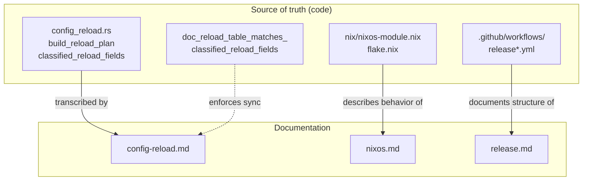

# docs — operations

# docs — operations

Operator-facing documentation covering three operational concerns: configuration hot-reload semantics, NixOS deployment, and the release pipeline. These documents are the canonical reference for operators running LibreFang in production and for contributors who maintain the subsystems they describe.

## Purpose

The module exists because each topic it covers has enough non-obvious behavior — silent no-ops, boot-captured values, store-path footguns, split-workflow authentication deltas — that an operator cannot reliably infer the right action from the source code alone. Each document is written to answer a specific operational question *before* the operator has to read Rust or Nix:

| Document | Answers | Primary audience |
|---|---|---|
| `config-reload.md` | "I changed a config field and reloaded — did it take effect, or do I need to restart?" | Operators editing `config.toml` or hitting `POST /api/config` |
| `nixos.md` | "How do I run LibreFang on NixOS, and what will bite me?" | NixOS administrators |
| `release.md` | "How do releases ship, and how do I re-run a single target that failed?" | Release maintainers |

## Structure

### `config-reload.md`

A single field-by-field classification table for every `KernelConfig` field, transcribed from `build_reload_plan` / `build_reload_plan_with_caps` in `crates/librefang-kernel/src/config_reload.rs`.

**Drift guard.** The table is enforced by a compile-time test — `doc_reload_table_matches_classified_reload_fields` — that fails the build if a field is added to the reload planner but not to the doc, or vice-versa. Any PR that changes a field's classification in `build_reload_plan` must update the table in the same commit.

**Classification system.** Every field falls into one of three buckets:

- **RequiresRestart (R)** — the value is captured once at boot (into a kernel field, the axum router, a background task, or a cached LLM driver). No hot action rebuilds that consumer. A bare config swap silently no-ops; the operator must restart.
- **HotReload (H)** — the change emits a `HotAction` that re-initialises the affected subsystem in place (reconnect channels, resize semaphores, flush a cache, RCU a snapshot).
- **Ignore / noop (N)** — the value is read live from `config_ref()` / `self.config.load()` on every message or request. The ArcSwap config swap makes the edit effective on the next use with no extra action.

The document also documents three operational gotchas that fall outside the table:

1. **Per-agent concurrency caps** (`agent.toml: max_concurrent_invocations`) are not a `KernelConfig` field and need an agent respawn, not a reload.
2. **`vault:` credential rotation** needs a reload because the vault file (`vault.enc`) is not watched by the config-file mtime poller — only `config.toml` is. `POST /api/config/reload` re-runs the env/`vault:` indirection via `server.rs::refresh_master_credential`.
3. **`log_level`** is conditionally H or R depending on whether the embedding binary installed a `LogLevelReloader` (see `ReloadCapabilities`).

### `nixos.md`

Deployment guide for NixOS, covering four consumption levels: `nix run`, `nix profile install`, overlay, and the `services.librefang` NixOS module (`nix/nixos-module.nix`).

The document explains several non-obvious design decisions in the module and flake:

- **Why `ExecStart` uses `--foreground`** — `librefang start` without that flag re-execs through `spawn_detached_daemon` and calls `libc::setsid()`, which would cause a `Type=exec` unit's main process to exit and kill the detached child.
- **Why no `config.toml` is generated** — the daemon writes that file itself (boot-time MCP migrator at `mcp_migrate.rs:383`, atomic config writes from API handlers). A read-only store path would break both paths.
- **Why `environmentFile` must not be a store path** — Nix store paths are world-readable; the module asserts against Nix path literals to prevent accidental credential exposure.
- **Why `MemoryDenyWriteExecute` is off** — the WASM plugin sandbox needs writable-executable pages.
- **Why a `stateDir` under `/home`, `/root`, or `/run/user` fails evaluation** — `ProtectHome=true` makes those trees inaccessible.

The document also catalogs past Nix-path breakages (#2937, #3052, #3156, #3197, #6081) and source-filter regressions (#5714, #6547) as institutional memory, since CI does not exercise the Nix path on every PR.

### `release.md`

Documents the transitional state of the release pipeline after #3304 1/N: a monolithic `release.yml` (~2,500 lines, ~30 jobs) remains the canonical entrypoint, with five `workflow_dispatch`-only split workflows added as scaffolding for a later cutover.

The document covers:

- When to use the monolithic path vs. a split workflow for single-target reruns.
- Authentication deltas: split workflows are wired for OIDC trusted publishing (npm, PyPI) where the monolithic file uses long-lived PATs (`NPM_TOKEN`, `CARGO_REGISTRY_TOKEN`).
- GitHub environment configuration requirements (required reviewers, wait timers) that must be set manually before the split workflows can be relied upon.
- A three-phase migration plan from the current scaffolded state through reusable-workflow conversion to the final OIDC cutover.

## How the docs connect to the codebase

The `config-reload.md` document is uniquely coupled to code: the drift-guard test `doc_reload_table_matches_classified_reload_fields` creates a bidirectional contract. The NixOS and release documents have no automated sync mechanism — they rely on contributor diligence and are therefore more drift-prone.

## Maintenance guidelines

**When adding or reclassifying a `KernelConfig` field:**

1. Update `build_reload_plan` / `build_reload_plan_with_caps` in `crates/librefang-kernel/src/config_reload.rs`.
2. Update the corresponding row in `config-reload.md` — the drift-guard test will fail the build if you forget.
3. If the field has sub-fields with different classifications (like `external_auth` or `registry`), add a row note spelling out which sub-field is which class.

**When changing the NixOS module or flake:**

- Update `nixos.md` in the same PR if the change affects operator-visible behavior (new options, changed defaults, hardening directives, new known sharp edges).
- If a new compile-time-embedded asset is added to the Rust source, add it to the `fileset` union at `flake.nix:66-94` or the Nix build will fail while every other build path succeeds.

**When changing release workflows:**

- Update `release.md` if you add, remove, or rename a split workflow, change authentication mechanisms, or modify the migration plan.
- The document is the only place that records the rationale for CI coverage decisions (why `nixos-vm-test` is opt-in, why the pull-request lane runs `--no-build`), so preserve that context when editing.

## Referenced source locations

The documents in this module cite code across several crates. Key references:

| Document | Key source references |
|---|---|
| `config-reload.md` | `crates/librefang-kernel/src/config_reload.rs` (planner, `HotAction`, `ReloadCapabilities`, drift-guard test), `crates/librefang-api/src/server.rs` (`refresh_master_credential`) |
| `nixos.md` | `flake.nix` (packages, overlay, source filters), `nix/nixos-module.nix`, `crates/librefang-cli/src/commands/daemon.rs` (foreground flag, init path), `crates/librefang-kernel/src/kernel/boot.rs` (`LIBREFANG_LISTEN` override), `crates/librefang-api/src/server.rs` (`check_bind_auth_safety`, `any_auth_configured`), `deploy/librefang.service` (reference hardening unit) |
| `release.md` | `.github/workflows/release*.yml`, `.github/workflows/nix-build.yml`, `xtask/src/publish_npm_binaries.rs` |