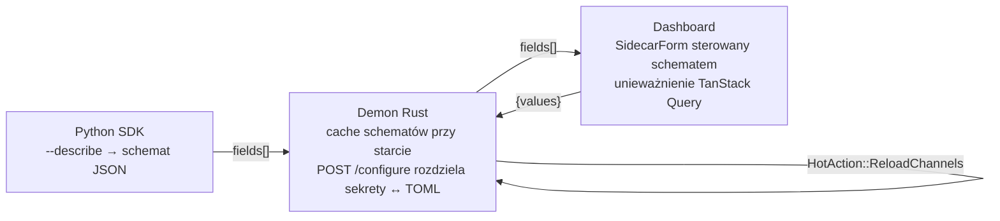

# docs — plany

# docs/plans

Dokumenty planów wdrożeniowych dla rozbudowanych, wielofazowych funkcji. Każdy plik to samodzielna specyfikacja: określa cel, wymienia dotykane pliki, układa pracę w zadania i dostarcza szkielet z test-wpierw a egzekutor (człowiek lub subagent) podąża za nim, aby dowieźć zmianę.

---

## Układ modułu

```
docs/plans/
├── YYYY-MM-DD-nazwa-funkcji.md   # jeden plik na plan
└── ...
```

- **Jeden plik na funkcję.** Brak indeksu, brak manifestu — odkrywanie przez `ls`.
- **Z prefiksem daty.** Data w nazwie pliku to *data sporządzenia planu*, a nie data wydania lub termin. Ustala kolejność w katalogu i pomaga recenzentom szybko ocenić aktualność.
- **Temat w kebab-case.** Krótki, małymi literami z myślnikami identyfikator funkcji (`sidecar-channel-configure`, `everyapi-auto-detection`).

## Anatomia dokumentu planu

Każdy plan w tym katalogu ma rozpoznawalną strukturę. Przeczytaj tę sekcję raz, a reszta dowolnego planu stanie się łatwa do skanowania.

| Sekcja | Cel |
|---|---|
| **Dyrektywa nagłówkowa** | `> For <assistant>: REQUIRED SUB-SKILL: Use superpowers:executing-plans...` — mówi egzekutorowi, który sub-skill odpowiada za implementację zadanie-po-zadaniu. |
| **Cel** | Jedno lub dwa zdania opisujące rezultat widoczny dla użytkownika. |
| **Architektura** | Projekt przekrojowy — które warstwy się łączą, co jest ponownie wykorzystywane, co jest nowe. |
| **Stos technologiczny** | Ustala wersje języków i głównych crate/bibliotek (np. Rust 1.83, axum/tokio, React 19 + TanStack Query v5). |
| **Wykorzystuje istniejącą infrastrukturę** | Jawne wskazanie ścieżek kodu, na których opiera się plan, z ścieżkami plików i numerami linii. Tutaj plan pozostaje uczciwy co do *braku reinwentowania*. |
| **Fazy / Zadania** | Główna część dokumentu. Fazy grupują powiązane zadania; zadania to atomowa jednostka pracy. |
| **Ryzyka / Na co uważać** | Tryby awarii przewidziane przez autora, z działaniami łagodzącymi lub werdyktami „akceptowalne dla v1". |
| **Wykonanie** | Sposób dyspatchowania — subagent-per-zadanie czy osobna sesja ze skillem `executing-plans`. |

### Kształt zadania (jednostka TDD planu)

Zadania są pisane w kolejności najpierw-test-nieprzechodzący i kończą się `git commit`, aby każde zadanie wylądowało jako jeden commit do recenzji:

1. **Napisz nieprzechodzący test** — pełny plik lub diff, z zaznaczonym oczekiwanym błędem (`ImportError: …`, błąd kompilacji itd.).
2. **Uruchom test, aby zweryfikować, że nie przechodzi** — dokładna komenda powłoki i oczekiwany tryb awarii.
3. **Zaimplementuj** — kod produkcyjny, ze ścieżkami plików i otaczającym kontekstem.
4. **Uruchom test, aby zweryfikować, że przechodzi** — dokładna komenda powłoki.
5. **Zatwierdź** — gotowy blok `git add … && git commit -m "…"` z komunikatem w formacie conventional-commit.

> **Dlaczego ta kolejność ma znaczenie:** egzekutor nigdy nie pisze kodu produkcyjnego przed testem. Jeśli zadanie zostanie pominięte lub wykonane źle, „Krok 2" następnego zadania (uruchom test, oczekuj niepowodzenia) jest kanarkiem — przechodzący test, gdzie oczekiwano niepowodzenia, oznacza, że zmiana z poprzedniego zadania się wyciekła.

---

## Aktywne plany

### Sidecar Channel Configure (2026-05-19)

**Status:** Tylko plan — jeszcze niezaimplementowany.

**Cel:** Pozwala operatorowi skonfigurować własny kanał sidecar (telegram, ntfy) z dashboardu — wypełnij formularz, kliknij Zapisz, zobacz efekt — zamiast ręcznej edycji `~/.librefang/config.toml`.

**Trzy warstwy, sześć faz, ~3 dni pracy:**



| Faza | Rezultat | Dotyka |
|---|---|---|
| 1 | Protokół CLI SDK `--describe`; typy `Field`/`Schema`; SCHEMA zadeklarowane na telegram + ntfy | `sdk/python/librefang/sidecar/{protocol,runtime,__init__}.py`, `adapters/{telegram,ntfy}.py` |
| 2 | Demon uruchamia każdy adapter katalogu z `--describe` przy starcie, cache'uje wynik, udostępnia `fields[]` w `/api/channels` | `crates/librefang-api/src/routes/{sidecar_describe,channels}.rs`, `lib.rs` |
| 3 | `POST /api/channels/sidecar/{name}/configure` — rozdziela ładunek między `~/.librefang/secrets.env` (sekrety) a blok `[[sidecar_channels]]` w `config.toml` (nie-sekrety) | nowe `routes/{secrets_env,sidecar_toml}.rs`, handler w `channels.rs` |
| 4 | Rozszerzenie diff w `config_reload.rs`, aby wykryć zmiany `sidecar_channels` i ponownie użyć istniejącej ścieżki `HotAction::ReloadChannels` | `crates/librefang-kernel/src/config_reload.rs`, audyt ścieżki re-init w `channel_bridge.rs` |
| 5 | Dashboard: komponent `SidecarForm` renderujący pola sterowane schematem, mutacja `useSaveSidecarConfig`, routing pickera | `crates/librefang-api/dashboard/src/{api.ts,pages/ChannelsPage.tsx,lib/mutations/channels.ts}` |
| 6 | Weryfikacja workspace (`cargo check`/`clippy`/`test`, `pnpm typecheck`/`test`/`build`, Python `pytest`) oraz PR | — |

**Kluczowa infrastruktura ponownie wykorzystana:**
- `crates/librefang-extensions/src/dotenv.rs` już ładuje `~/.librefang/secrets.env` do `std::env` przy starcie; procesy potomne sidecar dziedziczą to. Bez nowego kodu przekazywania env.
- `HotAction::ReloadChannels` już czyści `mesh.channel_adapters` w `crates/librefang-kernel/src/kernel/config_reload_ops.rs:246-256`. Cykl bridge re-inicjalizuje z `kernel.config_ref().sidecar_channels` — Faza 4 tylko poszerza diff, nie akcję.
- `toml_edit = "0.25"` już w `crates/librefang-api/Cargo.toml:35`.

**Kluczowa niezmiennik:** pola `type=secret` *nigdy* nie trafiają do `config.toml`. Są zapisywane wyłącznie do `secrets.env`. Handler zwraca `{ status, hot_actions_applied, restart_required }` — nigdy nie echo'uje przesłanych `values`. Zadanie 3.1 `upsert_secret` wymusza tryb `0600` i odrzuca wartości zawierające nową linię.

**Udokumentowane ryzyka** (patrz sekcja *Risks / Watch-outs* w planie): blokowanie startu przez `--describe` (5 s × N adapterów), przestarzały cache schematu po późnej instalacji SDK, pierwszeństwo zmiennych env (`system env > vault > .env > secrets.env`) oraz utrata komentarzy TOML w zastępowanym bloku `[[sidecar_channels]]`.

### EveryAPI Auto-Detection (2026-07-29)

**Status:** Tylko plan — jeszcze niezaimplementowany. Rozciąga się na dwa repozytoria (EveryAPI Go CLI/SDK, LibreFang Rust).

**Cel:** Automatycznie uwidocznić lokalnie uwierzytelnione konto EveryAPI jako dostawcę LibreFang zgodnego z OpenAI *bez kopiowania jego relay key do plików należących do LibreFang*.

Pięć zadań:

| # | Właściciel | Rezultat |
|---|---|---|
| 1 | EveryAPI | `everyapi auth credential --format=json [--invalidate]` — wersjonowana umowa JSON z URL `/v1` świadomym regionu, wygaśnięciem, cache'em relay-key i stabilnymi kodami błędów maszyny. |
| 2 | LibreFang | Ograniczony resolver poświadczeń w `crates/librefang-kernel/src/everyapi_credentials.rs`. Preferuje `EVERYAPI_CLI_PATH`, potem PATH/standardowe ścieżki instalacji. Fallback do `credentials.json` + `settings.json` tylko dla starych wersji CLI. |
| 3 | LibreFang | Rotujący driver HTTP `crates/librefang-kernel/src/everyapi_driver.rs`, który resolwuje świeże poświadczenia per żądanie i wykonuje jedno unieważniające ponowienie przy 401. |
| 4 | LibreFang | Rejestracja dostawców w pamięci (warstwa `AutoDetected`) pomijana, gdy obecne są jawne klucze LibreFang lub nadpisywania endpointów. Odświeżenie katalogu resolwuje żywe poświadczenia zamiast czytać `EVERYAPI_API_KEY`. |
| 5 | Obie | Diagnostyka + weryfikacja cross-repo + dwa celne PRy (po jednym na repo). |

**Kluczowy niezmiennik:** LibreFang nigdy nie utrwala relay key EveryAPI. Poświadczenia są resolwowane przez proces potomny przy każdym użyciu; pojedynczy 401 unieważnia i re-resolwuje dokładnie raz, po czym kończy się awarią. Jawne klucze/URLy należące do LibreFang zawsze mają pierwszeństwo przed auto-detekcją.

W przeciwieństwie do planu sidecar, ten *nie jest* rozpisany z granularnością kroków TDD per zadanie — specyfikuje pliki, kolejność i zakres weryfikacji, ale zostawia naprzemienność test/kod egzekutorowi.

---

## Przepływ wykonania

Plany są konsumowane przez sub-skill `superpowers:executing-plans`. Dwa tryby dyspatchowania są zazwyczaj oferowane na dole każdego planu:

1. **Sterowany subagentem (ta sama sesja)** — świeży subagent per zadanie, recenzja między zadaniami, szybka iteracja. Dobre, gdy autor planu jest obecny i koryguje kurs.
2. **Sesja równoległa (osobna)** — otwórz nową sesję ze skillem `executing-plans`, wykonanie wsadowe z punktami kontrolnymi. Dobre do przekazania dojrzałego planu.

Niezależnie od trybu, egzekutor pracuje zadanie-po-zadaniu: nigdy nie pomijaj kroku „zweryfikuj, że test nie przechodzi", nigdy nie łącz zadań w jeden commit i nigdy nie wyciszaj nieprzechodzącego testu przez `#[ignore]` lub `.todo()`. Jeśli oczekiwana awaria zadania staje się powodzeniem, to sygnał, że coś wcześniejszego się wyciekło — zbadaj przed kontynuacją.

## Konwencje dla autorów planów

Podczas dodawania nowego pliku do tego katalogu:

- **Nazwa pliku:** `YYYY-MM-DD-slug.md`, gdzie data to *dziś*.
- **Zacznij od dyrektywy sub-skilla** w blokquote — egzekutorzy się na niej opierają.
- **Podaj cel w jednym lub dwóch zdaniach**, potem architekturę. Recenzent, który wyskoczy po pierwszym ekranie, powinien już wiedzieć *co* i *dlaczego*.
- **Wymień ponownie wykorzystywaną infrastrukturę ze ścieżkami plików i numerami linii.** To sekcja najbardziej podatna na zepsucie — przypnij ją precyzyjnie, aby późniejszy czytelnik mógł zweryfikować, że ponowne wykorzystanie nadal trzyma.
- **Każde zadanie kończy się `git commit`.** Jedno zadanie = jeden commit. Komunikaty conventional-commit są gotowe, aby egzekutor nie musiał ich wymyślać.
- **Wymień ryzyka na końcu.** Jeśli rozważyłeś i zaakceptowałeś kompromis, zapisz go — inaczej następna osoba odkryje go na nowo.
- **Oznacz status.** Plany w tym katalogu opisują pracę do wykonania. Gdy plan trafi na produkcję, zostaw plik na miejscu (to zapis *dlaczego* kod wygląda tak, jak wygląda), ale rozważ dodanie jednej linii `**Status:** Wdrożony w #<PR>` niedaleko góry.
