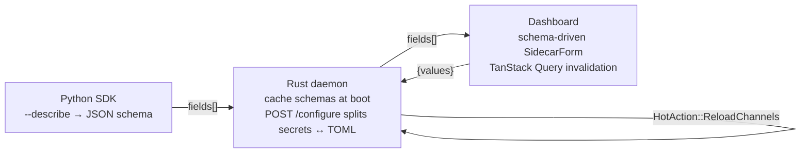

# docs — plans

# docs/plans

Implementation plan documents for substantial, multi-phase features. Each file is a self-contained blueprint: it states a goal, names the files touched, sequences the work into tasks, and provides the failing-test-first scaffolding an executor (human or subagent) follows to land the change.

---

## Module Layout

```
docs/plans/
├── YYYY-MM-DD-feature-name.md   # one file per plan
└── ...
```

- **One file per feature.** No index, no manifest — discovery is by `ls`.
- **Date-prefixed.** The date in the filename is the *plan authoring date*, not a release or due date. It establishes ordering in the directory and helps reviewers quickly gauge currency.
- **Kebab-case topic.** A short, lowercase-with-hyphens slug for the feature (`sidecar-channel-configure`, `everyapi-auto-detection`).

## Plan Document Anatomy

Every plan in this directory follows a recognizable shape. Read this section once and the rest of any plan becomes skimmable.

| Section | Purpose |
|---|---|
| **Header directive** | `> For <assistant>: REQUIRED SUB-SKILL: Use superpowers:executing-plans...` — tells the executor which sub-skill owns task-by-task implementation. |
| **Goal** | One or two sentences describing the user-visible outcome. |
| **Architecture** | The cross-cutting design — which layers wire together, what's reused, what's new. |
| **Tech Stack** | Pins languages and major crate/library versions (e.g., Rust 1.83, axum/tokio, React 19 + TanStack Query v5). |
| **Reuses existing infrastructure** | Explicit callout of code paths the plan leans on, with file paths and line numbers. This is where the plan stays honest about *not reinventing*. |
| **Phases / Tasks** | The bulk of the document. Phases group related tasks; tasks are the atomic unit of work. |
| **Risks / Watch-outs** | Failure modes the author anticipated, with mitigations or "acceptable for v1" verdicts. |
| **Execution** | How to dispatch — subagent-per-task vs. a separate session with the `executing-plans` skill. |

### Task shape (the TDD unit of a plan)

Tasks are written in failing-test-first order and end with a `git commit` so each task lands as one reviewable commit:

1. **Write the failing test** — full file or diff, with the expected failure noted (`ImportError: …`, compile error, etc.).
2. **Run the test to verify it fails** — exact shell command and the failure mode to expect.
3. **Implement** — the production code, with file paths and surrounding context.
4. **Run the test to verify it passes** — exact shell command.
5. **Commit** — pre-written `git add … && git commit -m "…"` block with a conventional-commit message.

> **Why this ordering matters:** the executor never writes production code before the test. If a task is skipped or botched, the next task's "Step 2" (run the test, expect it to fail) is the canary — a passing test where failure was expected means a previous task's change leaked.

---

## Active Plans

### Sidecar Channel Configure (2026-05-19)

**Status:** Plan only — not yet implemented.

**Goal:** Let an operator configure a first-party sidecar channel (telegram, ntfy) from the dashboard — fill a form, click Save, see it work — instead of hand-editing `~/.librefang/config.toml`.

**Three layers, six phases, ~3 days of work:**



| Phase | Deliverable | Touches |
|---|---|---|
| 1 | SDK `--describe` CLI protocol; `Field`/`Schema` types; SCHEMA declared on telegram + ntfy | `sdk/python/librefang/sidecar/{protocol,runtime,__init__}.py`, `adapters/{telegram,ntfy}.py` |
| 2 | Daemon spawns each catalog adapter with `--describe` at boot, caches result, surfaces `fields[]` on `/api/channels` | `crates/librefang-api/src/routes/{sidecar_describe,channels}.rs`, `lib.rs` |
| 3 | `POST /api/channels/sidecar/{name}/configure` — splits payload across `~/.librefang/secrets.env` (secrets) and `config.toml` `[[sidecar_channels]]` block (non-secrets) | new `routes/{secrets_env,sidecar_toml}.rs`, handler in `channels.rs` |
| 4 | Extend `config_reload.rs` diff to notice `sidecar_channels` changes and reuse the existing `HotAction::ReloadChannels` path | `crates/librefang-kernel/src/config_reload.rs`, audit of `channel_bridge.rs` re-init path |
| 5 | Dashboard: `SidecarForm` component rendering schema-driven fields, `useSaveSidecarConfig` mutation, picker routing | `crates/librefang-api/dashboard/src/{api.ts,pages/ChannelsPage.tsx,lib/mutations/channels.ts}` |
| 6 | Workspace verification (`cargo check`/`clippy`/`test`, `pnpm typecheck`/`test`/`build`, Python `pytest`) and PR | — |

**Key reused infrastructure:**
- `crates/librefang-extensions/src/dotenv.rs` already loads `~/.librefang/secrets.env` into `std::env` at startup; sidecar children inherit it. No new env-passing code.
- `HotAction::ReloadChannels` already clears `mesh.channel_adapters` at `crates/librefang-kernel/src/kernel/config_reload_ops.rs:246-256`. The bridge cycle re-inits from `kernel.config_ref().sidecar_channels` — Phase 4 only widens the diff, not the action.
- `toml_edit = "0.25"` already in `crates/librefang-api/Cargo.toml:35`.

**Critical invariant:** `type=secret` fields *never* reach `config.toml`. They are written to `secrets.env` only. The handler returns `{ status, hot_actions_applied, restart_required }` — never echoes submitted `values`. Task 3.1's `upsert_secret` enforces mode `0600` and rejects newline-bearing values.

**Documented risks** (see the plan's *Risks / Watch-outs* section): blocking boot on `--describe` (5 s × N adapters), stale schema cache after late SDK install, env-var precedence (`system env > vault > .env > secrets.env`), and TOML comment loss inside the replaced `[[sidecar_channels]]` block.

### EveryAPI Auto-Detection (2026-07-29)

**Status:** Plan only — not yet implemented. Spans two repositories (EveryAPI Go CLI/SDK, LibreFang Rust).

**Goal:** Automatically expose a locally authenticated EveryAPI account as a LibreFang OpenAI-compatible provider *without copying its relay key into LibreFang-owned files*.

The five tasks:

| # | Owner | Deliverable |
|---|---|---|
| 1 | EveryAPI | `everyapi auth credential --format=json [--invalidate]` — versioned JSON contract with region-aware `/v1` URL, expiration, relay-key cache, and stable machine error codes. |
| 2 | LibreFang | Bounded credential resolver at `crates/librefang-kernel/src/everyapi_credentials.rs`. Prefers `EVERYAPI_CLI_PATH`, then PATH/common install paths. Falls back to `credentials.json` + `settings.json` only for old CLI versions. |
| 3 | LibreFang | Rotating HTTP driver `crates/librefang-kernel/src/everyapi_driver.rs` that resolves fresh credentials per request and does one invalidating retry on 401. |
| 4 | LibreFang | In-memory provider registration (`AutoDetected` tier) suppressed when explicit LibreFang keys or endpoint overrides are present. Catalog refresh resolves live credentials instead of reading `EVERYAPI_API_KEY`. |
| 5 | Both | Diagnostics + cross-repo verification + two focused PRs (one per repo). |

**Key invariant:** LibreFang never persists the EveryAPI relay key. Credentials are resolved through the child process per use; a single 401 invalidates and re-resolves exactly once, then fails through. Explicit LibreFang-owned keys/URLs always take precedence over auto-detection.

Unlike the sidecar plan, this one is *not* laid out in TDD-step granularity per task — it specifies files, order, and verification scope but leaves the test/code alternation to the executor.

---

## Execution Workflow

Plans are consumed by the `superpowers:executing-plans` sub-skill. Two dispatch modes are typically offered at the bottom of each plan:

1. **Subagent-driven (same session)** — fresh subagent per task, review between tasks, fast iteration. Good when the plan's author is present to course-correct.
2. **Parallel session (separate)** — open a new session with the `executing-plans` skill, batch execution with checkpoints. Good for handing off a mature plan.

Either way, the executor works task-by-task: never skip the "verify the test fails" step, never batch tasks into a single commit, and never mute a failing test with `#[ignore]` or `.todo()`. If a task's expected failure becomes a pass, that's a signal something earlier leaked — investigate before continuing.

## Conventions for Plan Authors

When adding a new file to this directory:

- **Filename:** `YYYY-MM-DD-slug.md` where the date is *today*.
- **Lead with the sub-skill directive** in a blockquote — executors key off it.
- **State the goal in one or two sentences**, then the architecture. A reviewer who bounces after the first screen should already know *what* and *why*.
- **List reused infrastructure with file paths and line numbers.** This is the section most likely to rot — pin it precisely so a later reader can verify the reuse still holds.
- **Each task ends with a `git commit`.** One task = one commit. Conventional-commit messages are pre-written so the executor doesn't have to invent them.
- **Call out risks at the end.** If you considered and accepted a trade-off, write it down — the next person will rediscover it otherwise.
- **Mark status.** Plans in this directory describe work to be done. When a plan ships, leave the file in place (it's a record of *why* the code looks the way it does) but consider adding a one-line `**Status:** Shipped in #<PR>` near the top.