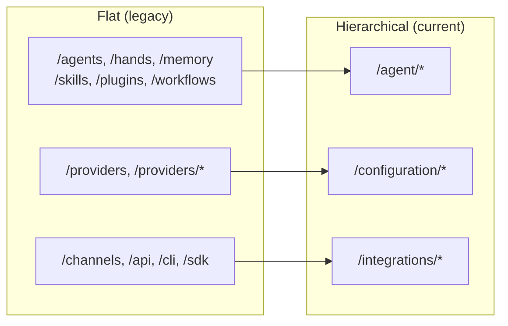

# docs — public

# docs — public

The `docs/public` module contains static hosting configuration for the documentation site. Its primary artifact is the `_redirects` file, which enforces backward-compatible URL routing after the 2026-04 documentation restructure that migrated all pages from flat URL paths to a hierarchical, group-based hierarchy.

## Purpose

Before the restructure, documentation pages lived at flat top-level paths (e.g. `/hands`, `/memory`, `/providers`). The new information architecture organizes content into thematic groups:

- **Getting Started** — introductory and onboarding material
- **Configuration** — provider setup and configuration
- **Architecture** — system design and security
- **Agent** — agent internals: hands, memory, skills, plugins, templates, prompt intelligence, workflows
- **Integrations** — channels, API, SDK, CLI, MCP/A2A, desktop, migration, development tooling
- **Operations** — troubleshooting, production guidance, FAQ

The `_redirects` file ensures that every pre-restructure URL — including deep wildcard paths — resolves to its new location with a permanent `301` redirect, preserving inbound links, search indexing, and bookmarks.

## How It Works

The file follows the standard `_redirects` syntax used by static-site hosts (Netlify, Cloudflare Pages, etc.):

```
/source-path    /destination-path    status-code
```

### Redirect rules

| Rule type | Syntax | Behavior |
|---|---|---|
| Exact match | `/hands  /agent/hands  301` | Redirects the single specified path |
| Wildcard (splat) | `/providers/*  /configuration/providers/:splat  301` | Captures the trailing path segment(s) and appends them to the destination |

### Ordering constraint

Wildcard splat rules **must** appear after their exact-match counterparts. For example:

```
/providers            /configuration/providers         301
/providers/*          /configuration/providers/:splat  301
```

If the wildcard rule came first, it would shadow the exact match and the `/providers` (no trailing slash) request would be caught by the splat pattern, producing incorrect routing. This ordering is enforced throughout the file for every group that has both exact and wildcard paths.

### Locale handling

The file defines a parallel set of rules prefixed with `/zh/` for the Chinese locale. Every English redirect has a corresponding `/zh/` redirect pointing to the equivalent localized path:

```
/zh/hands    /zh/agent/hands    301
```

The group hierarchy is identical between locales.

## URL Group Mapping



## Adding or Modifying Redirects

When updating this file:

1. **Always use `301`** — these are permanent moves. Search engines and caches need to consolidate link equity at the new URL.
2. **Place wildcard rules after exact matches** for the same path prefix.
3. **Update both locales** — if you add or change an English redirect, add or change the `/zh/` counterpart in the same commit.
4. **Comment your group sections** using the existing `# --- Group Name ---` convention so the file remains scannable.
5. **Do not remove redirects** unless you have confirmed no inbound traffic or indexed URLs remain for the legacy path.

## Key Redirect Groups Reference

### Getting Started

| Legacy | New |
|---|---|
| `/librefang` | `/getting-started` |
| `/roadmap` | `/getting-started/roadmap` |
| `/examples` | `/getting-started/examples` |
| `/glossary` | `/getting-started/glossary` |
| `/comparison` | `/getting-started/comparison` |

### Configuration

| Legacy | New |
|---|---|
| `/providers` | `/configuration/providers` |
| `/providers/*` | `/configuration/providers/:splat` |

### Architecture

| Legacy | New |
|---|---|
| `/security` | `/architecture/security` |

### Agent

| Legacy | New |
|---|---|
| `/agents` | `/agent/templates` |
| `/hands` | `/agent/hands` |
| `/memory` | `/agent/memory` |
| `/skills` | `/agent/skills` |
| `/plugins` | `/agent/plugins` |
| `/prompt-intelligence` | `/agent/prompt-intelligence` |
| `/workflows` | `/agent/workflows` |

> **Note:** `/agents` (plural) redirects specifically to `/agent/templates`, not to `/agent`. This is an intentional consolidation — the legacy agents index page now lives under the templates sub-section.

### Integrations

| Legacy | New |
|---|---|
| `/channels`, `/channels/*` | `/integrations/channels`, `/integrations/channels/:splat` |
| `/api`, `/api/*` | `/integrations/api`, `/integrations/api/:splat` |
| `/sdk` | `/integrations/sdk` |
| `/cli`, `/cli/*` | `/integrations/cli`, `/integrations/cli/:splat` |
| `/android-termux` | `/integrations/android-termux` |
| `/mcp-a2a` | `/integrations/mcp-a2a` |
| `/migration` | `/integrations/migration` |
| `/desktop` | `/integrations/desktop` |
| `/development` | `/integrations/development` |

### Operations

| Legacy | New |
|---|---|
| `/troubleshooting` | `/operations/troubleshooting` |
| `/production` | `/operations/production` |
| `/faq` | `/operations/faq` |

## Integration with the Codebase

This module is deployment-only configuration. It contains no executable code, no imports, and no runtime dependencies. It is consumed by the static-site host at deploy time and has no relationship to application source modules.

The actual content these redirects point to lives elsewhere in the docs tree under the group directories (`getting-started/`, `agent/`, `integrations/`, etc.). If you reorganize content within those directories, update the destination paths in `_redirects` accordingly — but avoid changing source (legacy) paths, since those are the stable contract with external links.