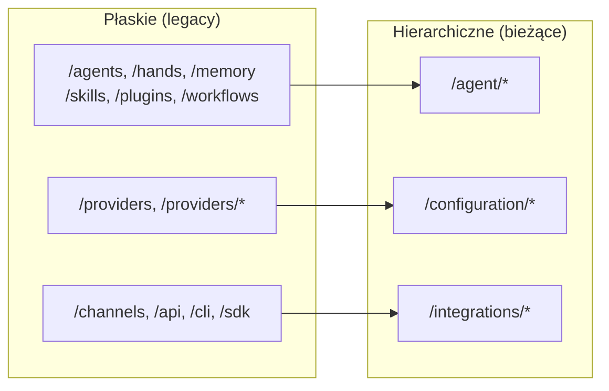

# docs — public

Moduł `docs/public` zawiera konfigurację hostingu statycznego dla witryny dokumentacji. Głównym artefaktem jest plik `_redirects`, który wymusza wstecznie kompatybilne routowanie URL po reorganizacji dokumentacji z kwietnia 2026 r., kiedy to wszystkie strony zostały przeniesione z płaskich ścieżek URL do hierarchicznej struktury opartej na grupach.

## Przeznaczenie

Przed reorganizacją strony dokumentacji znajdowały się pod płaskimi ścieżkami najwyższego poziomu (np. `/hands`, `/memory`, `/providers`). Nowa architektura informacyjna organizuje treść w grupy tematyczne:

- **Getting Started** — materiały wprowadzające i onboardingowe
- **Configuration** — konfiguracja i ustawienia dostawców
- **Architecture** — projekt systemu i bezpieczeństwo
- **Agent** — wnętrzności agenta: hands, pamięć, umiejętności, wtyczki, szablony, prompt intelligence, workflows
- **Integrations** — kanały, API, SDK, CLI, MCP/A2A, desktop, migracja, narzędzia deweloperskie
- **Operations** — rozwiązywanie problemów, wytyczne produkcyjne, FAQ

Plik `_redirects` zapewnia, że każdy URL sprzed reorganizacji — w tym ścieżki z symbolami wieloznacznymi — przekierowuje do nowej lokalizacji za pomocą stałego przekierowania `301`, zachowując linki przychodzące, indeksowanie w wyszukiwarkach oraz zakładki.

## Jak to działa

Plik korzysta ze standardowej składni `_redirects` używanej przez hosty stron statycznych (Netlify, Cloudflare Pages itd.):

```
/ścieżka-źródłowa    /ścieżka-docelowa    kod-statusu
```

### Reguły przekierowań

| Typ reguły | Składnia | Zachowanie |
|---|---|---|
| Dopasowanie dokładne | `/hands  /agent/hands  301` | Przekierowuje pojedynczą, wskazaną ścieżkę |
| Symbol wieloznaczny (splat) | `/providers/*  /configuration/providers/:splat  301` | Przechwytuje końcowy segment(y) ścieżki i dołącza je do celu |

### Kolejność reguł

Reguły ze splatem wieloznacznym **muszą** znajdować się po ich dokładnych odpowiednikach. Na przykład:

```
/providers            /configuration/providers         301
/providers/*          /configuration/providers/:splat  301
```

Gdyby reguła ze splatem była pierwsza, zasłoniłaby dopasowanie dokładne, a żądanie `/providers` (bez ukośnika na końcu) zostałoby przechwycone przez wzorzec splat, co prowadziłoby do błędnego routingu. Ta kolejność jest egzekwowana w całym pliku dla każdej grupy posiadającej zarówno ścieżki dokładne, jak i ze splatem.

### Obsługa języków (locale)

Plik definiuje równoległy zestaw reguł z prefiksem `/zh/` dla języka chińskiego. Każde przekierowanie angielskie ma odpowiedni odpowiednik `/zh/` wskazujący na zlokalizowaną ścieżkę:

```
/zh/hands    /zh/agent/hands    301
```

Hierarchia grup jest identyczna między językami.

## Mapowanie grup URL



## Dodawanie lub modyfikowanie przekierowań

Podczas aktualizacji tego pliku:

1. **Zawsze używaj `301`** — to są stałe przeniesienia. Wyszukiwarki i pamięć podręczna muszą skonsolidować wartość linków pod nowym adresem URL.
2. **Umieszczaj reguły ze splatem po dopasowaniach dokładnych** dla tego samego prefiksu ścieżki.
3. **Aktualizuj oba języki** — jeśli dodajesz lub zmieniasz przekierowanie angielskie, dodaj lub zmień odpowiednik `/zh/` w tym samym commicie.
4. **Komentuj sekcje grup** używając istniejącej konwencji `# --- Nazwa grupy ---`, aby plik pozostał łatwy do przeglądania.
5. **Nie usuwaj przekierowań** chyba że potwierdzono brak ruchu przychodzącego lub zaindeksowanych URL-i dla ścieżki legacy.

## Zestawienie kluczowych grup przekierowań

### Getting Started

| Legacy | Nowy |
|---|---|
| `/librefang` | `/getting-started` |
| `/roadmap` | `/getting-started/roadmap` |
| `/examples` | `/getting-started/examples` |
| `/glossary` | `/getting-started/glossary` |
| `/comparison` | `/getting-started/comparison` |

### Configuration

| Legacy | Nowy |
|---|---|
| `/providers` | `/configuration/providers` |
| `/providers/*` | `/configuration/providers/:splat` |

### Architecture

| Legacy | Nowy |
|---|---|
| `/security` | `/architecture/security` |

### Agent

| Legacy | Nowy |
|---|---|
| `/agents` | `/agent/templates` |
| `/hands` | `/agent/hands` |
| `/memory` | `/agent/memory` |
| `/skills` | `/agent/skills` |
| `/plugins` | `/agent/plugins` |
| `/prompt-intelligence` | `/agent/prompt-intelligence` |
| `/workflows` | `/agent/workflows` |

> **Uwaga:** `/agents` (liczba mnoga) przekierowuje konkretnie do `/agent/templates`, a nie do `/agent`. To celowa konsolidacja — legacy strona indeksowa agentów znajduje się teraz w podsekcji szablonów.

### Integrations

| Legacy | Nowy |
|---|---|
| `/channels`, `/channels/*` | `/integrations/channels`, `/integrations/channels/:splat` |
| `/api`, `/api/*` | `/integrations/api`, `/integrations/api/:splat` |
| `/sdk` | `/integrations/sdk` |
| `/cli`, `/cli/*` | `/integrations/cli`, `/integrations/cli/:splat` |
| `/android-termux` | `/integrations/android-termux` |
| `/mcp-a2a` | `/integrations/mcp-a2a` |
| `/migration` | `/integrations/migration` |
| `/desktop` | `/integrations/desktop` |
| `/development` | `/integrations/development` |

### Operations

| Legacy | Nowy |
|---|---|
| `/troubleshooting` | `/operations/troubleshooting` |
| `/production` | `/operations/production` |
| `/faq` | `/operations/faq` |

## Integracja z kodem źródłowym

Ten moduł jest konfiguracją wyłącznie wdrożeniową. Nie zawiera kodu wykonywalnego, importów ani zależności uruchomieniowych. Jest konsumowany przez host strony statycznej w momencie wdrożenia i nie ma związku z modułami źródłowymi aplikacji.

Rzeczywista treść, do której prowadzą te przekierowania, znajduje się w innym miejscu drzewa dokumentacji w katalogach grup (`getting-started/`, `agent/`, `integrations/` itd.). Jeśli reorganizujesz treść wewnątrz tych katalogów, zaktualizuj odpowiednio ścieżki docelowe w `_redirects` — ale unikaj zmiany ścieżek źródłowych (legacy), ponieważ stanowią one stabilną umowę z linkami zewnętrznymi.
