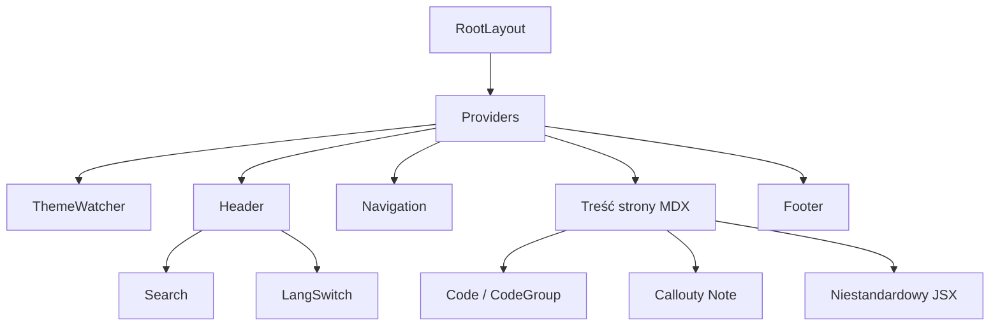

# docs — src

# `docs/src` — Witryna dokumentacji LibreFang

## Przegląd

Moduł `docs/src` to drzewo źródłowe witryny dokumentacji deweloperskiej LibreFang. Jest to aplikacja Next.js korzystająca z App Routera, z całą treścią tworzoną w MDX. Witryna obejmuje każdy podsystem platformy LibreFang dostępný użytkownikowi — ręce agentów, pamięć, wtyczki, umiejętności, hooki, inteligencję promptów i autoewolucję — i jest zorganizowana pod kątem bezpośredniego współtworzenia przez deweloperów.

Budowa opiera się na MDX (Markdown + osadzony JSX/Tailwind), co oznacza, że strony dokumentacji mogą łączyć tekst z bogatymi komponentami, blokami kodu, tabelami i niestandardowymi calloutami.

---

## Struktura tras

Witryna korzysta z konwencji App Routera Next.js. Każda strona dokumentacji to plik `page.mdx` wewnątrz segmentu trasy w katalogu `docs/src/app/`.

```
docs/src/app/
├── layout.tsx                  # Główny układ (Providers, ThemeWatcher)
├── providers.tsx               # Dostawcy kontekstu dla całej aplikacji
├── (home)/
│   ├── layout.tsx              # Układ segmentu home — eksportuje metadane strony
│   └── page.mdx                # Strona główna / przegląd funkcjonalności
└── agent/
    ├── hands/
    │   └── page.mdx            # Autonomiczne Ręce
    ├── hooks/
    │   └── page.mdx            # System hooków zdarzeń
    ├── memory/
    │   └── page.mdx            # System pamięci
    ├── plugins/
    │   └── page.mdx            # Wtyczki silnika kontekstu
    ├── prompt-intelligence/
    │   └── page.mdx            # Wersjonowanie promptów i eksperymenty A/B
    ├── skills/
    │   └── page.mdx            # Tworzenie umiejętności
    └── auto-evolution/
        └── page.mdx            # Autoewolucja Ręki DevOps
```

### Grupy tras

Katalog `(home)` to **grupa tras** — nawiasy w nazwie folderu informują Next.js, aby wykluczyć go z adresu URL. Strona główna znajduje się pod `/`, a nie `/(home)/`. Dzięki temu strona główna może mieć własny dedykowany `layout.tsx` bez wpływu na strukturę adresów URL.

---

## Metadane poszczególnych stron

W Next.js 16 strona MDX nie może eksportować `metadata`, gdy jej graf zależności zawiera dostawcę komponentów MDX z dyrektywą `"use client"`. Witryna dokumentacji omija ten problem, umieszczając metadane w serwerowym `layout.tsx` dla każdego segmentu trasy.

```tsx
// docs/src/app/(home)/layout.tsx
export const metadata: Metadata = {
  title: "LibreFang - Documentation",
};

export default function HomeLayout({ children }: { children: React.ReactNode }) {
  return children;
}
```

Układ jest bezpośrednim przekaźnikiem — renderuje `children` bezpośrednio. Jego jedynym zadaniem jest przenoszenie eksportu `metadata`. Podczas dodawania nowej dokumentacji najwyższego poziomu wymagającej niestandardowego tytułu, należy:

1. Umieścić ją we własnym segmencie trasy z `layout.tsx` eksportującym `metadata`, lub
2. Polegać na domyślnym tytule z głównego układu.

---

## Tworzenie treści

Wszystkie strony dokumentacji to pliki MDX. Obsługują:

- **Standardowy Markdown** — nagłówki, listy, tabele, bloki kodu, cytaty blokowe
- **Osadzony JSX / Tailwind** — używany do kart funkcjonalności, calloutów i stylizowanych układów (patrz siatka funkcjonalności strony głównej)
- **Importy** — komponenty takie jak ikony `Bot` mogą być importowane i używane osadzone

### Przykład: importowanie komponentu w MDX

```mdx
import { Bot } from '@/components/icons/Bot'

<div className="not-prose grid grid-cols-2 ...">
  <Bot className="h-5 w-5" />
</div>
```

### Callout `<Note>`

Na kilku stronach używany jest komponent `<Note>` do wyróżnionych wskazówek i ostrzeżeń. Jest to część współdzielonego zestawu komponentów MDX wstrzykiwanych globalnie — nie wymaga importowania na każdej stronie.

---

## Ekosystem komponentów

Witryna dokumentacji jest zbudowana na współdzielonej warstwie komponentów zapewniającej nawigację, wyszukiwanie, motywy i renderowanie kodu. Komponenty te znajdują się w `docs/src/components/` i są podłączone do potoku MDX przez dostawcę `mdx-components`.

### Kluczowe komponenty

| Komponent | Lokalizacja | Przeznaczenie |
|-----------|-------------|---------------|
| `Header` | `components/Header.tsx` | Górny pasek nawigacji, zawiera `Search` i `LangSwitch` |
| `Search` | `components/Search.tsx` | Nakładka wyszukiwania po stronie klienta ze stanem ładowania |
| `Navigation` | `components/Navigation.tsx` | Panel boczny z zwijalnymi grupami sekcji |
| `SectionProvider` | `components/SectionProvider.tsx` | Magazyn Zustand śledzący widoczne sekcje strony do scroll-spy |
| `Footer` | `components/Footer.tsx` | Dolna nawigacja z linkami do poprzedniej/następnej strony |
| `Code` / `CodeGroup` | `components/Code.tsx` | Wielopanelowe bloki kodu z zakładkowanymi nagłówkami |
| `ThemeToggle` | `components/ThemeToggle.tsx` | Przełącznik motywu jasny/ciemny |
| `HeroPattern` | `components/HeroPattern.tsx` | Dekoracyjne tło siatki |

### Kompozycja układu



Główny `layout.tsx` otacza każdą stronę w `Providers`, co ustanawia kontekst motywu, śledzenie sekcji i magazyn nawigacji. `Header` i `Footer` renderują się na każdej trasie.

### Śledzenie sekcji

`SectionProvider` tworzy magazyn Zustand dla każdej strony, który śledzi, która sekcja nagłówka jest obecnie w widocznym obszarze. Panel boczny `Navigation` wykorzystuje to do podświetlenia aktywnej sekcji (`VisibleSectionHighlight`), a komponent `Heading` rejestruje się w magazynie, aby umożliwić linki kotwicowe. To właśnie zasila zachowanie scroll-spy.

---

## Indeksowanie wyszukiwania

Wyszukiwanie jest budowane w czasie kompilacji. Wtyczka webpack (`docs/src/mdx/search.mjs`) przetwarza wszystkie pliki MDX podczas budowania, wyodrębniając nagłówki i treść tekstową do przeszukiwalnego indeksu. W czasie działania `Search.tsx` odpytuje ten indeks po stronie klienta — nie są wymagane żadne żądania serwerowe.

---

## Mapa treści dokumentacji

Katalog `docs/src/app/agent/` zawiera główną dokumentację platformy. Każda strona to samodzielne źródło informacji:

| Strona | Trasa | Zakres |
|--------|-------|--------|
| **Ręce** | `/agent/hands` | 15 wbudowanych agentów autonomicznych, format manifestu `HAND.toml`, semantyka harmonogramów, polityka wykonania, CLI i REST API |
| **Autoewolucja** | `/agent/auto-evolution` | Opcjonalne monitorowanie repozytoriów przez Rękę DevOps: recenzje PR, triage zgłoszeń, potok BMAD, limit bezpieczeństwa |
| **Hooki** | `/agent/hooks` | Format `HOOK.yaml`, cykl życia zdarzeń, ładunki zmiennych środowiskowych, zachowanie w przypadku timeoutu/błędu |
| **Pamięć** | `/agent/memory` | Persystencja SQLite, wyszukiwanie wektorowe, graf wiedzy, kompaktowanie sesji, auto-sny, API wtyczki dostawcy |
| **Wtyczki** | `/agent/plugins` | Protokół wtyczki silnika kontekstu (JSON przez stdin/stdout), 7 typów hooków, `plugin.toml`, stosowanie, 11 środowisk uruchomieniowych |
| **Inteligencja promptów** | `/agent/prompt-intelligence` | Wersjonowanie promptów, eksperymenty A/B, dzielenie ruchu, autoaktywacja |
| **Umiejętności** | `/agent/skills` | Manifest `skill.toml`, środowiska uruchomieniowe Python/WASM/Node/prompt-only, publikacja w FangHub, zmienne konfiguracyjne, przekazywanie zmiennych env |

### Odsyłacze międzystronicowe

Strony linkują do siebie za pomocą standardowych relatywnych linków Markdown. Na przykład, strona Rąk linkuje do strony Autoewolucji:

```mdx
[auto-evolution](/agent/auto-evolution)
```

Te linki są rozwiązywane do tras opartych na plikach w App Routerze. Nie jest potrzebna żadna konfiguracja tras — dodanie nowego `page.mdx` pod dowolnym katalogiem automatycznie tworzy odpowiadający mu URL.

---

## Dodawanie nowej strony dokumentacji

1. **Utwórz katalog trasy i plik MDX:**

   ```bash
   mkdir -p docs/src/agent/new-feature
   touch docs/src/agent/new-feature/page.mdx
   ```

2. **Napisz treść** — zacznij od nagłówka H1 (tytuł strony), następnie sekcje z H2/H3.

3. **(Opcjonalnie) Dodaj metadane dla strony** — jeśli strona potrzebuje niestandardowego tytułu w karcie przeglądarki, utwórz `layout.tsx` obok `page.mdx`:

   ```tsx
   import type { Metadata } from "next";

   export const metadata: Metadata = {
     title: "Nowa funkcjonalność - Dokumentacja LibreFang",
   };

   export default function Layout({ children }: { children: React.ReactNode }) {
     return children;
   }
   ```

4. **Dodaj stronę do panelu nawigacji bocznego** — zaktualizuj konfigurację nawigacji (zazwyczaj w `docs/src/config` lub w pliku danych nawigacji konsumowanym przez `Navigation.tsx`), aby nowa strona pojawiła się w panelu bocznym.

5. **Dodaj odsyłacze** — zaktualizuj linki poprzednia/następna w stopce na sąsiednich stronach, jeśli ma znaczenie sekwencyjny porządek czytania.

---

## Motywy

Witryna obsługuje motywy jasny i ciemny za pomocą `ThemeToggle`. Stan motywu jest śledzony przez `ThemeWatcher` (komponent klienta w `providers.tsx`), który synchronizuje się z `prefers-color-scheme` i `localStorage`. Wszystkie klasy Tailwind używają wariantów `dark:` do stylowania w trybie ciemnym, a karty funkcjonalności strony głównej ilustrują ten wzorzec:

```tsx
className="border-zinc-200 dark:border-zinc-800 hover:border-zinc-300 dark:hover:border-zinc-700"
```

---

## Budowa i rozwój

```bash
# Instalacja zależności
cd docs && npm install

# Uruchomienie serwera deweloperskiego
npm run dev

# Budowa produkcyjna
npm run build
```

Serwer deweloperski obsługuje gorące przeładowanie treści MDX — edycja dowolnego `page.mdx` wywołuje natychmiastowe odświeżenie przeglądarki.
