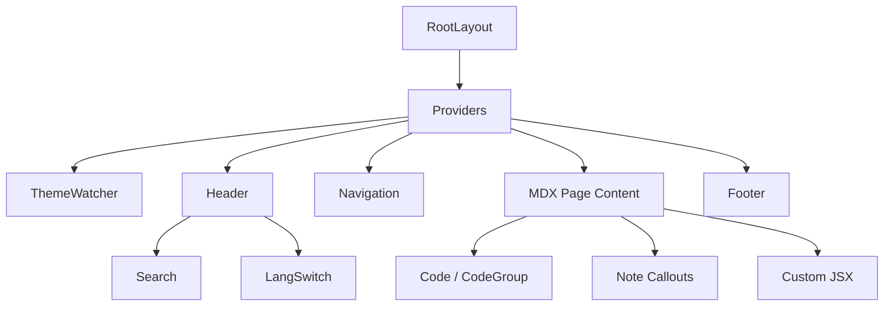

# docs — src

# `docs/src` — LibreFang Documentation Site

## Overview

The `docs/src` module is the source tree for LibreFang's developer documentation website. It is a Next.js application using the App Router, with all content authored in MDX. The site covers every user-facing subsystem of the LibreFang platform — agent hands, memory, plugins, skills, hooks, prompt intelligence, and auto-evolution — and is structured for direct contribution by developers.

The build is powered by MDX (Markdown + inline JSX/Tailwind), meaning documentation pages can mix prose with rich components, code fences, tables, and custom callouts.

---

## Route Structure

The site uses Next.js App Router conventions. Each documentation page is a `page.mdx` file inside a route segment under `docs/src/app/`.

```
docs/src/app/
├── layout.tsx                  # Root layout (Providers, ThemeWatcher)
├── providers.tsx               # App-wide context providers
├── (home)/
│   ├── layout.tsx              # Home-segment layout — exports page metadata
│   └── page.mdx                # Landing page / feature overview
└── agent/
    ├── hands/
    │   └── page.mdx            # Autonomous Hands
    ├── hooks/
    │   └── page.mdx            # Event Hook System
    ├── memory/
    │   └── page.mdx            # Memory System
    ├── plugins/
    │   └── page.mdx            # Context Engine Plugins
    ├── prompt-intelligence/
    │   └── page.mdx            # Prompt versioning & A/B experiments
    ├── skills/
    │   └── page.mdx            # Skill Development
    └── auto-evolution/
        └── page.mdx            # DevOps Hand auto-evolution
```

### Route Groups

The `(home)` directory is a **route group** — parentheses in the folder name tell Next.js to exclude it from the URL. The home page lives at `/`, not `/(home)/`. This allows the home page to have its own dedicated `layout.tsx` without affecting the URL structure.

---

## Per-Page Metadata

Under Next.js 16, an MDX page cannot export `metadata` when its dependency graph pulls in a `"use client"` MDX components provider. The docs site works around this by placing metadata in a server-side `layout.tsx` for each route segment.

```tsx
// docs/src/app/(home)/layout.tsx
export const metadata: Metadata = {
  title: "LibreFang - Documentation",
};

export default function HomeLayout({ children }: { children: React.ReactNode }) {
  return children;
}
```

The layout is a passthrough — it renders `children` directly. Its only job is to carry the `metadata` export. When adding a new top-level documentation page that needs a custom title, either:

1. Place it in its own route segment with a `layout.tsx` that exports `metadata`, or
2. Rely on the root layout's default title.

---

## Content Authoring

All documentation pages are MDX files. They support:

- **Standard Markdown** — headings, lists, tables, code fences, blockquotes
- **Inline JSX / Tailwind** — used for feature cards, callouts, and styled layouts (see the home page's feature grid)
- **Imports** — components like `Bot` icons can be imported and used inline

### Example: Importing a Component in MDX

```mdx
import { Bot } from '@/components/icons/Bot'

<div className="not-prose grid grid-cols-2 ...">
  <Bot className="h-5 w-5" />
</div>
```

### The `<Note>` Callout

Several pages use a `<Note>` component for highlighted tips and warnings. This is part of the shared MDX component set injected globally — it does not need to be imported per-page.

---

## Component Ecosystem

The documentation site is built on a shared component layer that provides navigation, search, theming, and code rendering. These components live in `docs/src/components/` and are wired into the MDX pipeline via the `mdx-components` provider.

### Key Components

| Component | Location | Purpose |
|-----------|----------|---------|
| `Header` | `components/Header.tsx` | Top navigation bar, includes `Search` and `LangSwitch` |
| `Search` | `components/Search.tsx` | Client-side search overlay with loading state |
| `Navigation` | `components/Navigation.tsx` | Sidebar with collapsible section groups |
| `SectionProvider` | `components/SectionProvider.tsx` | Zustand store tracking visible page sections for scroll-spy |
| `Footer` | `components/Footer.tsx` | Bottom navigation with prev/next page links |
| `Code` / `CodeGroup` | `components/Code.tsx` | Multi-panel code blocks with tabbed headers |
| `ThemeToggle` | `components/ThemeToggle.tsx` | Light/dark theme switcher |
| `HeroPattern` | `components/HeroPattern.tsx` | Decorative grid background |

### Layout Composition



The root `layout.tsx` wraps every page in `Providers`, which establishes theme context, section tracking, and the navigation store. The `Header` and `Footer` render on every route.

### Section Tracking

`SectionProvider` creates a Zustand store per page that tracks which heading section is currently in the viewport. The `Navigation` sidebar uses this to highlight the active section (`VisibleSectionHighlight`) and the `Heading` component registers itself with the store to enable anchor links. This is what powers the scroll-spy behavior.

---

## Search Indexing

The search is built at compile time. A webpack plugin (`docs/src/mdx/search.mjs`) processes all MDX files during the build, extracting headings and text content into a searchable index. At runtime, `Search.tsx` queries this index client-side — no server requests required.

---

## Documentation Content Map

The `docs/src/app/agent/` directory contains the core platform documentation. Each page is a self-contained reference:

| Page | Route | Covers |
|------|-------|--------|
| **Hands** | `/agent/hands` | The 15 built-in autonomous agents, `HAND.toml` manifest format, scheduling semantics, exec policy, CLI and REST API |
| **Auto-Evolution** | `/agent/auto-evolution` | DevOps Hand's opt-in repo monitoring: PR reviews, issue triage, BMAD pipeline, safety floor |
| **Hooks** | `/agent/hooks` | `HOOK.yaml` format, event lifecycle, environment variable payloads, timeout/error behavior |
| **Memory** | `/agent/memory` | SQLite persistence, vector search, knowledge graph, session compaction, auto-dream, provider plugin API |
| **Plugins** | `/agent/plugins` | Context engine plugin protocol (JSON-over-stdin/stdout), 7 hook types, `plugin.toml`, stacking, 11 runtimes |
| **Prompt Intelligence** | `/agent/prompt-intelligence` | Prompt versioning, A/B experiments, traffic splitting, auto-activation |
| **Skills** | `/agent/skills` | `skill.toml` manifest, Python/WASM/Node/prompt-only runtimes, FangHub publishing, config vars, env passthrough |

### Cross-Page References

Pages link to each other using standard relative Markdown links. For example, the Hands page links to the Auto-Evolution page:

```mdx
[auto-evolution](/agent/auto-evolution)
```

These resolve to the App Router's file-based routes. No route configuration is needed — adding a new `page.mdx` under any directory automatically creates the corresponding URL.

---

## Adding a New Documentation Page

1. **Create the route directory and MDX file:**

   ```bash
   mkdir -p docs/src/agent/new-feature
   touch docs/src/agent/new-feature/page.mdx
   ```

2. **Write the content** — start with an H1 heading (the page title), then sections with H2/H3.

3. **(Optional) Add per-page metadata** — if the page needs a custom browser tab title, create a `layout.tsx` alongside the `page.mdx`:

   ```tsx
   import type { Metadata } from "next";

   export const metadata: Metadata = {
     title: "New Feature - LibreFang Docs",
   };

   export default function Layout({ children }: { children: React.ReactNode }) {
     return children;
   }
   ```

4. **Add the page to the navigation sidebar** — update the navigation configuration (typically in `docs/src/config` or the navigation data file that `Navigation.tsx` consumes) so the new page appears in the sidebar.

5. **Add cross-links** — update the prev/next footer links in adjacent pages if sequential reading order matters.

---

## Theming

The site supports light and dark themes via `ThemeToggle`. The theme state is tracked by `ThemeWatcher` (a client component in `providers.tsx`) which syncs with `prefers-color-scheme` and `localStorage`. All Tailwind classes use `dark:` variants for dark-mode styling, and the home page's feature cards demonstrate the pattern:

```tsx
className="border-zinc-200 dark:border-zinc-800 hover:border-zinc-300 dark:hover:border-zinc-700"
```

---

## Build and Development

```bash
# Install dependencies
cd docs && npm install

# Start the dev server
npm run dev

# Build for production
npm run build
```

The dev server supports hot-reloading of MDX content — editing any `page.mdx` triggers an instant browser refresh.