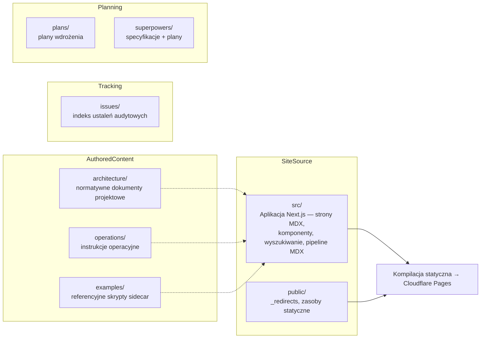

# docs

# `docs/` — Dokumentacja LibreFang

## Przeznaczenie

Moduł `docs/` obejmuje całościowo dokumentację: witrynę Next.js opublikowaną pod adresem [docs.librefang.io](https://docs.librefang.io), normatywne odniesienia architektoniczne i operacyjne, które deweloperzy i operatorzy przywołują podczas code review, referencyjne implementacje punktów rozszerzeń, śledzenie ustaleń audytowych oraz dokumenty planistyczne dla istotnych funkcji. Nie zawiera żadnego produkcyjnego kodu uruchomieniowego — wyłącznie źródła witryny (`src/`), konfigurację hostingu statycznego (`public/`) oraz autorskie treści Markdown/MDX.

## Jak sub-moduły się ze sobą łączą

### Silnik witryny — [`src`](src.md) i [`public`](public.md)

Drzewo **`src/`** to statycznie eksportowana aplikacja Next.js App Router. Wszystkie strony dostępne użytkownikowi to pliki MDX w katalogu `src/app/`, przetwarzane przez łańcuch wtyczek remark → rehype → recma (`src/mdx/`). Współdzielone komponenty — `Layout`, `Header`, `Navigation`, `Search`, `Code`, `Heading` — stanowią otoczenie interfejsu, natomiast `SectionProvider` oraz pipeline `search.mjs` napędzają śledzenie sekcji na stronie i indeks pełnotekstowego wyszukiwania. `ErrorBoundary` z funkcją `classifyMDXError` elegancko obsługuje błędy MDX z czasu kompilacji.

Katalog **`public/`** zawiera plik `_redirects`, który mapuje wszystkie płaskie adresy URL sprzed restrukturyzacji (`/hands`, `/providers/*`) na obecną strukturę hierarchiczną (`/agent/hands`, `/configuration/providers/:splat`) za pomocą trwałych przekierowań 301 dla lokaliz angielskiej oraz `/zh/`.

### Odniesienia normatywne — [`architecture`](architecture.md) i [`operations`](operations.md)

Te katalogi zawierają dokumenty **przywoływane podczas code review**:

- **`architecture/`** — 15 samodzielnych dokumentów obejmujących logowanie, obserwowalność, granice bezpieczeństwa, konwencje nazewnictwa oraz polityki migracji. Każdy z nich definiuje kontrakty, których kod podsystemów musi przestrzegać.
- **`operations/`** — instrukcje operacyjne dla operatorów dotyczące semantyki hot-reload, wdrożeń NixOS oraz potoku wydawania. Odpowiadają na pytania, których operator nie może wywnioskować z samego kodu źródłowego.

Treści z obu katalogów są udostępniane jako strony w witrynie dokumentacyjnej za pośrednictwem pipeline'u MDX w `src/`.

### Implementacje referencyjne — [`examples`](examples.md)

Dwa niezależne od zależności skrypty Python 3 (`context_engine_sidecar.py`, `memory_extractor_sidecar.py`) demonstrujące protokół łącza stdio JSON dla dwóch punktów rozszerzeń sidecar w LibreFang. Są one osadzone w przykładach typu „pierwsze kroki" w witrynie.

### Śledzenie audytu — [`issues`](issues.md)

Strukturyzowany indeks 119 ustaleń z automatycznego pipeline'u audytowego. `INDEX.md` zachowuje pełny zakres audytu jako rejestr historyczny; pliki Markdown dla poszczególnych ustaleń istnieją tylko dla problemów nadal podlegających naprawie, a każdy z nich jest powiązany z odpowiednim zgłoszeniem GitHub.

### Planowanie funkcji — [`plans`](plans.md) i [`superpowers`](superpowers.md)

Dwa równoległe ścieżki planistyczne, obie wykorzystujące nazwy plików w formacie kebab-case z prefiksem daty:

- **`plans/`** — Samodzielne plany wdrożenia: cel, modyfikowane pliki, ułożone sekwencyjnie zadania, szkieletowanie oparte na testach nieprzechodzących. Jeden plik na funkcję, odkrywany za pomocą `ls`.
- **`superpowers/`** — Parami łączy **specyfikacje** (architektoniczne źródło prawdy) z **planami** (mapami drogowymi zadań), powiązane poprzez zbieżność dat i kluczy gałęzi funkcyjnych.

## Kluczowe przepływy pracy obejmujące sub-moduły

| Przepływ pracy | Ścieżka |
|---|---|
| **Tworzenie strony dokumentacji** | Napisz MDX w `src/app/` → komponenty i pipeline MDX w `src/` renderują ją → wdrożona przez Cloudflare Pages |
| **Dodanie przekierowania** | Zaktualizuj `public/_redirects` dla reguł angielskich i `/zh/`, symbole wieloznaczne po dokładnych dopasowaniach |
| **Planowanie funkcji** | Napisz specyfikację w `superpowers/specs/` → pasujący plan w `superpowers/plans/` lub `plans/` → implementuj na podstawie szkieletu opartego na testach nieprzechodzących |
| **Śledzenie ustalenia audytowego** | Dodaj wpis do `issues/INDEX.md` → utwórz plik Markdown dla ustalenia powiązany ze zgłoszeniem GitHub → usuń plik po rozwiązaniu (indeks zachowuje rejestr) |
| **Przywołanie kontraktu projektowego** | Powołaj się na dokument w `architecture/` lub `operations/` podczas code review — są one normatywne, nie doradcze |
