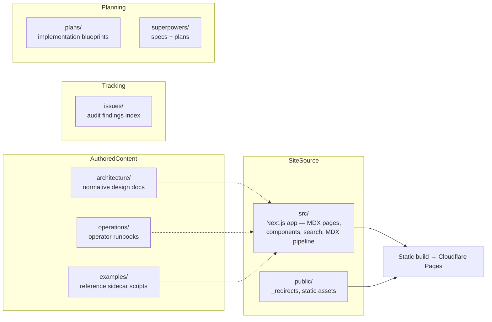

# docs

# `docs/` — LibreFang Documentation

## Purpose

The `docs/` module is everything documentation: the Next.js website published at [docs.librefang.io](https://docs.librefang.io), the normative architecture and operations references that developers and operators cite in code review, reference implementations of extension points, audit-finding tracking, and planning documents for substantial features. It contains no production runtime code — only the site source tree (`src/`), static hosting config (`public/`), and authored Markdown/MDX content.

## How the sub-modules fit together

### Site engine — [`src`](src.md) & [`public`](public.md)

The **`src/`** tree is a statically exported Next.js App Router application. All user-facing pages are MDX files under `src/app/`, processed through a remark → rehype → recma plugin chain (`src/mdx/`). Shared components — `Layout`, `Header`, `Navigation`, `Search`, `Code`, `Heading` — provide the chrome, while `SectionProvider` and the `search.mjs` pipeline power the in-page section tracking and full-text search index. An `ErrorBoundary` with `classifyMDXError` surfaces build-time MDX failures gracefully.

The **`public/`** directory holds the `_redirects` file that maps all pre-restructure flat URLs (`/hands`, `/providers/*`) to the current hierarchical structure (`/agent/hands`, `/configuration/providers/:splat`) with permanent 301s for both English and `/zh/` locales.

### Normative references — [`architecture`](architecture.md) & [`operations`](operations.md)

These directories hold documents that are **cited in code review**:

- **`architecture/`** — 15 standalone documents covering logging, observability, security boundaries, naming conventions, and migration policies. Each defines contracts that subsystem code must follow.
- **`operations/`** — Operator-facing runbooks for hot-reload semantics, NixOS deployment, and the release pipeline. These answer questions an operator can't infer from source alone.

Content from both directories is surfaced as pages on the documentation site through the `src/` MDX pipeline.

### Reference implementations — [`examples`](examples.md)

Two dependency-free Python 3 scripts (`context_engine_sidecar.py`, `memory_extractor_sidecar.py`) that demonstrate the stdio JSON wire protocol for LibreFang's two sidecar extension points. These are embedded in the site's getting-started examples.

### Audit tracking — [`issues`](issues.md)

A structured index of 119 findings from the automated audit pipeline. `INDEX.md` preserves the full audit scope as a historical record; per-finding Markdown files exist only for issues still under remediation, each linked to its GitHub issue.

### Feature planning — [`plans`](plans.md) & [`superpowers`](superpowers.md)

Two parallel planning tracks, both using date-prefixed kebab-case filenames:

- **`plans/`** — Self-contained implementation blueprints: goal, files touched, sequenced tasks, failing-test-first scaffolding. One file per feature, discovered by `ls`.
- **`superpowers/`** — Pairs **specs** (architectural source of truth) with **plans** (task roadmaps), linked by matching dates and feature-branch keys.

## Key workflows spanning sub-modules

| Workflow | Path |
|---|---|
| **Author a doc page** | Write MDX under `src/app/` → components and MDX pipeline in `src/` render it → deployed via Cloudflare Pages |
| **Add a redirect** | Update `public/_redirects` for both English and `/zh/` rules, wildcards after exact matches |
| **Plan a feature** | Write a spec in `superpowers/specs/` → matching plan in `superpowers/plans/` or `plans/` → implement against failing-test scaffolding |
| **Track an audit finding** | Add entry to `issues/INDEX.md` → create per-finding Markdown linked to GitHub issue → delete file on resolution (index preserves the record) |
| **Cite a design contract** | Reference a document in `architecture/` or `operations/` during code review — these are normative, not advisory |