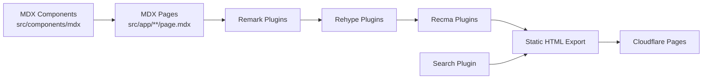

# Documentation — docs

# Documentation Site (`docs/`)

The LibreFang documentation website — a statically exported Next.js application powered by MDX, Tailwind CSS, and a custom content pipeline. It serves as the official docs hub with full-text search, dark mode, and bilingual support (Chinese + English).

## Architecture Overview



Content is authored as `.mdx` files under `src/app/`. Next.js processes them through a three-stage MDX pipeline (remark → rehype → recma), wraps them with shared UI components via `mdx-components.tsx`, and produces a static site deployed to Cloudflare Pages.

## Key Configuration Files

| File | Purpose |
|------|---------|
| `next.config.mjs` | Next.js config — MDX pipeline, static export, Shiki for syntax highlighting |
| `tsconfig.json` | TypeScript paths — aliases `@/*`, `@web/ui`, `@web/shared`, `@web/config` |
| `postcss.config.js` | PostCSS with `@tailwindcss/postcss` plugin |
| `typography.ts` | Tailwind Typography theme — custom colors, spacing, dark mode variants |
| `mdx-components.tsx` | MDX component provider — maps all `@/components/mdx` exports into every MDX page |
| `package.json` | Dependencies, scripts, engine requirements |

## Static Export Configuration

The site is configured for full static export in `next.config.mjs`:

```js
output: "export",
images: { unoptimized: true },
```

This means no server-side rendering or API routes — everything precompiles to flat HTML/CSS/JS at build time.

## MDX Processing Pipeline

The content pipeline is assembled in `next.config.mjs` and applied in a specific order:

```js
const finalConfig = withMDX(withSearch(nextConfig));
```

1. **`withSearch`** wraps the config to enhance search indexing (defined in `src/mdx/search.mjs`)
2. **`withMDX`** applies `@next/mdx` with three plugin layers:
   - **Remark plugins** (`src/mdx/remark.mjs`) — transform the Markdown AST
   - **Rehype plugins** (`src/mdx/rehype.mjs`) — transform the HTML AST
   - **Recma plugins** (`src/mdx/recma.mjs`) — transform the JavaScript AST output

Shiki is registered as a `serverExternalPackage` for server-side syntax highlighting during build.

### Component Injection

`mdx-components.tsx` exports `useMDXComponents`, which merges the shared component set from `@/components/mdx` into every MDX page. This provides consistent rendering for code blocks, callouts, tables, and other custom elements.

## Typography Theme

`typography.ts` defines a comprehensive prose theme for `@tailwindcss/typography`:

- **Light mode**: zinc-based neutrals with emerald accent links
- **Dark mode** (`invert` variant): inverted palette with adjusted opacity values
- Covers body text, headings (h1–h3), lists, blockquotes, tables, inline code, horizontal rules, and media elements
- Responsive horizontal rule margins at `sm` and `lg` breakpoints

To apply the theme, import and spread it into your Tailwind typography config:

```js
import typographyConfig from './typography';
```

## Adding New Pages

1. Create a directory under `src/app/`, e.g. `src/app/new-topic/`
2. Add a `page.mdx` file inside it
3. Export a `sections` array at the end of the file for sidebar navigation:

```mdx
# New Topic

Content here...

export const sections = [
  { title: "Section Title", id: "section-id" }
];
```

The `pageExtensions` config in `next.config.mjs` includes `mdx`, so Next.js automatically routes these files.

## Multilingual Structure

- `/` — Chinese (default locale)
- `/en/` — English content synced from the LibreFang repository

Both locales live under `src/app/` using Next.js file-system routing conventions.

## Development Commands

| Command | Description |
|---------|-------------|
| `pnpm dev` | Start dev server on port 3001 |
| `pnpm build` | Produce static export |
| `pnpm start` | Serve the built site on port 3001 |
| `pnpm lint` | Run Biome checks |
| `pnpm lint:fix` | Run Biome with auto-fix |
| `pnpm typecheck` | TypeScript type checking (no emit) |
| `pnpm format` | Format `src/` with Biome |

**Requirements**: Node ≥ 18, pnpm ≥ 9.

## Monorepo Path Aliases

`tsconfig.json` maps several monorepo package paths for cross-package imports:

| Alias | Target |
|-------|--------|
| `@/*` | `./src/*` |
| `@/components/*` | `./src/components/*` |
| `@/lib/*` | `./src/lib/*` |
| `@/app/*` | `./src/app/*` |
| `@web/ui` | `../../packages/react/src/index.ts` |
| `@web/shared` | `../../packages/shared/src/index.ts` |
| `@web/config` | `../../packages/config/src/index.ts` |

This allows the docs site to import shared UI components and utilities from sibling packages in the monorepo.

## Deployment

The site auto-deploys to **Cloudflare Pages**. The static export output from `next build` is served directly — no Node.js runtime required.