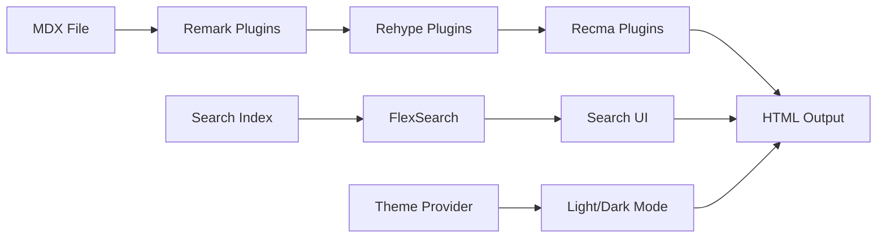

# Documentation — docs

# LibreFang Documentation Site

The `docs/` directory contains the official LibreFang documentation website, a Next.js application that renders MDX content with syntax highlighting, search, and multi-language support.

## Overview

This is a static documentation site that:

- Renders MDX (Markdown + JSX) content from `src/app/`
- Supports Chinese (default) and English locales
- Provides full-text search via FlexSearch
- Uses Shiki for syntax highlighting with custom themes
- Exports as a fully static site for Cloudflare Pages deployment

## Architecture



## Directory Structure

```
docs/
├── src/
│   ├── app/              # Next.js App Router pages (MDX files)
│   ├── components/       # Reusable React components
│   ├── lib/              # Utility functions
│   └── mdx/              # MDX processing plugins
│       ├── remark.mjs    # Remark plugins (GFM, etc.)
│       ├── rehype.mjs    # Rehype plugins (Shiki, etc.)
│       └── recma.mjs     # Recma plugins
├── next.config.mjs       # Next.js + MDX configuration
├── postcss.config.js     # Tailwind CSS processing
├── typography.ts         # Prose styling configuration
└── package.json
```

## Key Components

### MDX Processing Pipeline (`next.config.mjs`)

The MDX pipeline transforms Markdown files into React components through three stages:

1. **Remark** — Markdown-aware transforms (GFM tables, footnotes)
2. **Rehype** — HTML-aware transforms (Shiki syntax highlighting)
3. **Recma** — AST transforms specific to MDX

```javascript
const withMDX = nextMDX({
  extension: /\.mdx?$/,
  options: {
    remarkPlugins: remarkPlugins,
    rehypePlugins: rehypePlugins,
    recmaPlugins: recmaPlugins,
  },
});
```

### Custom MDX Components (`mdx-components.tsx`)

Provides custom React components that override default MDX rendering. The `useMDXComponents` hook merges custom components with the defaults:

```tsx
import * as mdxComponents from '@/components/mdx';

export function useMDXComponents(components: MDXComponents) {
  return {
    ...components,
    ...mdxComponents,
  };
}
```

Place custom components in `src/components/mdx/` to override elements like `pre`, `code`, `a`, etc.

### Typography Configuration (`typography.ts`)

Defines prose styling using Tailwind Typography with custom color tokens:

- **Body text**: `zinc-700` (light) / `zinc-400` (dark)
- **Headings**: `zinc-900` (light) / `white` (dark)
- **Links**: `emerald-500` accent with hover state
- **Code blocks**: `zinc-100` background with inset ring border

The configuration supports both light and dark modes through CSS variable inheritance.

### Search Integration (`src/mdx/search.mjs`)

Adds FlexSearch-based full-text search to the site. The plugin indexes MDX content at build time and provides search UI components.

## Content Structure

### Adding New Documentation

1. Create a directory under `src/app/`, e.g., `src/app/new-feature/`
2. Add `page.mdx` with your content
3. Export a `sections` array for navigation:

```mdx
# New Feature

Documentation content here...

export const sections = [
  { title: "Overview", id: "overview" },
  { title: "Usage", id: "usage" },
];
```

### Multi-Language Support

| Route | Language |
|-------|----------|
| `/` | Chinese (default) |
| `/en/` | English (synced from LibreFang repo) |

## Build Configuration

### Static Export

The site uses Next.js static export for Cloudflare Pages:

```javascript
output: "export",
```

This generates pure HTML/CSS/JS with no server-side rendering.

### Shiki Integration

Shiki provides syntax highlighting with server-side processing (disabled `mdxRs`):

```javascript
serverExternalPackages: ['shiki'],
experimental: { mdxRs: false },
```

Shiki runs at build time to transform code blocks into highlighted HTML.

### Path Aliases

TypeScript path aliases simplify imports across the monorepo:

```json
{
  "paths": {
    "@/*": ["./src/*"],
    "@web/ui": ["../../packages/react/src/index.ts"],
    "@web/config": ["../../packages/config/src/index.ts"]
  }
}
```

## Development Workflow

```bash
# Install dependencies
pnpm install

# Start development server (port 3001)
pnpm dev

# Build static site
pnpm build

# Type checking
pnpm typecheck

# Lint with Biome
pnpm lint
pnpm lint:fix

# Format code
pnpm format
```

## Dependencies

### Production

| Package | Purpose |
|---------|---------|
| `next` 15.5.14 | Framework with App Router |
| `@next/mdx` | MDX integration |
| `shiki` 2.x | Syntax highlighting |
| `flexsearch` | Full-text search |
| `tailwindcss` 4.x | Styling |
| `next-themes` | Dark/light mode |
| `prism-react-renderer` | Code block components |
| `motion` | Animations |

### Development

| Package | Purpose |
|---------|---------|
| `@tailwindcss/postcss` | Tailwind v4 processing |
| `@tailwindcss/typography` | Prose styling |
| `biome` | Linting and formatting |
| `typescript` | Type checking |

## Theme System

The site uses `next-themes` to manage light/dark mode. The typography configuration defines separate color sets for each mode:

```javascript
typography: ({ theme }) => ({
  DEFAULT: { /* light mode colors */ },
  invert: { /* dark mode colors */ },
})
```

## Deployment

The site auto-deploys to Cloudflare Pages via the static export. Cloudflare reads the `output: "export"` configuration and serves the generated `out/` directory.

## CLI Profile Rotation Documentation

The `cli-profile-rotation.md` file demonstrates the site's documentation format with:

- Conceptual explanation with ASCII diagrams
- Step-by-step setup instructions
- Reference tables for error handling
- FAQ section for common questions

This pattern is used for all feature documentation within the site.