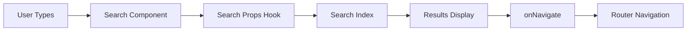

# Documentation — src

# LibreFang Documentation Site

The `docs/src/` directory contains the LibreFang documentation website built with Next.js and MDX. This is a comprehensive developer documentation portal that covers the entire LibreFang Agent Operating System, from core concepts to advanced configuration.

## Overview

The documentation site serves as the primary reference for developers and users working with LibreFang. It covers:

- **Agent System**: Templates, lifecycle, capabilities, and security
- **Hands**: Pre-built autonomous agent packages
- **Memory**: Persistent storage, vector search, and knowledge graphs
- **Skills**: Pluggable tool bundles extending agent capabilities
- **Plugins**: Context engine hooks for memory recall and context assembly
- **Workflows**: Multi-step agent pipelines with branching and loops
- **Architecture**: Internal system design and crate structure

## Project Structure

```
docs/
├── src/
│   ├── app/                    # Next.js App Router pages
│   │   ├── agent/             # Agent documentation pages
│   │   │   ├── hands/         # Autonomous hands guide
│   │   │   ├── memory/        # Memory system docs
│   │   │   ├── plugins/        # Context engine plugins
│   │   │   ├── prompt-intelligence/  # A/B testing for prompts
│   │   │   ├── skills/         # Skill development guide
│   │   │   ├── templates/      # Agent template catalog
│   │   │   └── workflows/     # Workflow engine guide
│   │   ├── architecture/      # System architecture docs
│   │   ├── layout.tsx         # Root layout with providers
│   │   ├── page.tsx           # Home page
│   │   └── providers.tsx      # Theme and section providers
│   ├── components/             # React components
│   │   ├── Layout.tsx         # Main layout wrapper
│   │   ├── Navigation.tsx     # Sidebar navigation
│   │   ├── MobileNavigation.tsx
│   │   ├── Search.tsx         # Search interface
│   │   ├── Header.tsx         # Page header
│   │   ├── Code.tsx           # Code blocks with tabs
│   │   ├── Heading.tsx        # Section headings
│   │   ├── SectionProvider.tsx # Scroll tracking
│   │   ├── NotificationCenter.tsx
│   │   ├── ErrorBoundary.tsx
│   │   └── ui/                # Reusable UI primitives
│   ├── lib/                   # Utilities
│   │   ├── utils.ts           # Helper functions
│   │   ├── remToPx.ts         # CSS unit conversion
│   │   └── useKeyboardShortcuts.ts
│   ├── mdx/                   # MDX processing
│   │   ├── search.mjs         # Search index generation
│   │   └── rehype.mjs         # MDX transformation
│   └── styles/                # Global styles
├── public/                    # Static assets
├── package.json
└── next.config.js
```

## Core Components

### Layout System

The layout system manages the overall page structure with persistent navigation:

```
┌─────────────────────────────────────────────────────────┐
│                    Header                               │
│  [Logo]  [Search]                    [GitHub] [Theme]  │
├─────────────┬───────────────────────────────────────────┤
│             │                                           │
│ Navigation  │           Content Area                     │
│             │                                           │
│ - Getting   │   # Page Title                            │
│   Started   │                                           │
│ - Agents    │   Documentation content rendered from      │
│ - Hands     │   MDX files with custom components.        │
│ - Memory    │                                           │
│ - Skills    │                                           │
│ - ...       │                                           │
│             │                                           │
└─────────────┴───────────────────────────────────────────┘
```

**Layout.tsx** wraps the application with theme providers and navigation. It integrates with the section tracking system to highlight the current page in the sidebar.

### Navigation System

The navigation consists of three coordinated components:

**Navigation.tsx** renders the sidebar with collapsible sections. It uses `useSectionStore` to track which sections are expanded and highlights the active page based on scroll position.

**MobileNavigation.tsx** provides a drawer-style navigation for smaller screens. It shares state with the desktop navigation through `useIsInsideMobileNavigation`.

**VisibleSectionHighlight** tracks which documentation section is currently visible in the viewport using scroll detection, updating the active navigation item accordingly.

### Search System

Search provides full-text search across all documentation:



**Search.tsx** implements the search interface with keyboard navigation. It uses `useSearchProps` to interface with the search index generated at build time.

**Search index generation** (`mdx/search.mjs`):
- Scans all MDX files
- Extracts headings and content
- Builds a searchable index
- Excludes object expressions to reduce noise

### Code Display

**Code.tsx** handles syntax-highlighted code blocks with several features:

- **Tab groups**: Multiple code samples in tabs (e.g., Bash, Python, JSON)
- **Copy button**: One-click copy with visual feedback
- **Panel titles**: Optional headers for code blocks
- **Layout shift prevention**: Reserves space before content loads

The `useTabGroupProps` hook manages tab state, while `usePreventLayoutShift` ensures the UI doesn't jump when code loads.

## Theming

The site supports light and dark themes through **providers.tsx**:

```typescript
ThemeWatcher → onMediaChange → theme state → CSS variables
```

**ThemeWatcher** listens for system theme changes via `matchMedia` and updates the theme state accordingly. Theme classes are applied to the root element, and CSS variables define the color palette.

## Section Tracking

**SectionProvider.tsx** tracks which documentation sections are visible as users scroll:

```typescript
SectionProvider → useVisibleSections → Navigation highlight
                         ↓
              checkVisibleSections → scroll events
```

This enables the sidebar to automatically expand the relevant section and highlight the current heading.

## MDX Processing

The documentation uses MDX for rich content:

**rehype.mjs** transforms MDX with:
- Heading extraction for navigation
- Code block processing
- Custom component mapping

Custom components available in MDX:
- `<Note>` - Callout boxes for tips
- `<Warning>` - Important warnings
- Tables - Styled markdown tables
- API endpoint tables - Specialized endpoint documentation

## Key Execution Flows

### Navigation Flow

```
User clicks link → onNavigate → navigate function → router.push()
                                       ↓
                            Sidebar highlights section
                            Content area updates
```

### Search Flow

```
User opens search → type query → useSearchProps → search index
                                                     ↓
                              results displayed → select result
                                                     ↓
                                          onNavigate → navigate
```

### Page Load Flow

```
Request → Layout → SectionProvider → Navigation
                            ↓
                    Page component → MDX render
                            ↓
                    Headings registered → Navigation updates
```

## Styling Approach

The documentation uses Tailwind CSS with CSS variables for theming. Custom styles in `src/styles/` handle:
- Syntax highlighting theme
- Custom scrollbar styling
- Print styles
- Responsive adjustments

## Development Commands

```bash
cd docs
npm install
npm run dev      # Start development server
npm run build    # Production build
npm run lint     # ESLint checks
```

## Adding Documentation

### New Page

1. Create MDX file in appropriate `app/` subdirectory:

```mdx
# Page Title

Content with **markdown** and custom components.
```

2. The page automatically appears in navigation based on file location.

### Custom Components

Add reusable components to `src/components/`:

```typescript
// src/components/CustomComponent.tsx
export function CustomComponent({ children }) {
  return <div className="custom-styling">{children}</div>;
}
```

Import in MDX files:

```mdx
import { CustomComponent } from '@/components/CustomComponent';

<CustomComponent>
  Content here
</CustomComponent>
```

### Code Examples

Use fenced code blocks with language identifiers:

````mdx
```typescript
const example = "with syntax highlighting";
```
````

For multi-language examples, use the tab syntax:

````mdx
```bash Tab="Bash"
echo "Hello"
```

```typescript Tab="TypeScript"
console.log("Hello");
```
````

## Configuration

Key configuration files:

- **next.config.js**: Next.js configuration, MDX support
- **tailwind.config.js**: Theme colors, custom utilities
- **tsconfig.json**: TypeScript path aliases (`@/` maps to `src/`)

## Deployment

The documentation deploys to Vercel (or similar static hosting):

```bash
npm run build  # Generates static output in .next/
```

The site is fully static after build, suitable for CDN distribution.