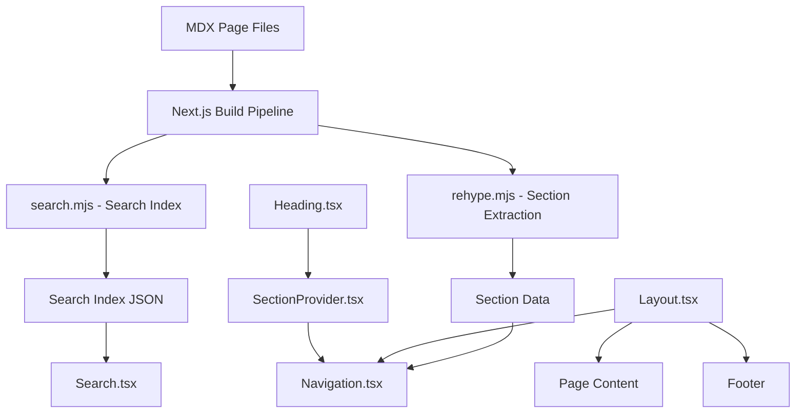

# Documentation — src

# Documentation Site (`docs/src`)

The documentation site is a Next.js application with MDX support that renders LibreFang's product documentation. It provides full-text search, scroll-tracked navigation, syntax-highlighted code blocks, and a responsive layout with mobile support.

## Architecture Overview



## Component Hierarchy

The rendering pipeline flows through these layers:

1. **`Layout`** (`src/components/Layout.tsx`) — wraps every documentation page. Uses `withPrefix` (`src/lib/utils.ts`) to resolve URL paths, accounting for configured base paths.

2. **`Navigation`** (`src/components/Navigation.tsx`) — sidebar with collapsible section groups. Each `NavigationGroup` reads section metadata from `SectionProvider` and renders expandable link lists.

3. **`SectionProvider`** (`src/components/SectionProvider.tsx`) — shared state for tracking which headings are visible in the viewport. Uses `createSectionStore` to produce a Zustand-like store, consumed via `useSectionStore`.

4. **`Heading`** (`src/components/Heading.tsx`) — registers each `<h2>`/`<h3>` with the section store and provides the scroll anchor that `VisibleSectionHighlight` and `ActivePageMarker` use to track reading position.

5. **`CodeGroup`** (`src/components/Code.tsx`) — tabbed code block renderer. `getPanelTitle` infers tab labels from filenames or language identifiers. `useTabGroupProps` calls `usePreventLayoutShift` to avoid visual jumps when switching tabs.

6. **`Search`** (`src/components/Search.tsx`) — full-text search modal. `useSearchProps` manages query state, keyboard navigation through results, and calls `onNavigate` on selection. A separate `MobileSearch` variant shares the same hook.

7. **`MobileNavigation`** (`src/components/MobileNavigation.tsx`) — slide-out drawer for small screens. Exposes `useIsInsideMobileNavigation` so nested components can suppress desktop-only behaviors (e.g., scroll tracking, hover states).

8. **`ThemeWatcher`** (`src/app/providers.tsx`) — listens for `prefers-color-scheme` changes via `onMediaChange` and applies the user's theme preference.

## Scroll Tracking System

The documentation site highlights the currently visible section in the sidebar. This involves three cooperating pieces:

- **`useVisibleSections`** — a `useEffect` hook in `SectionProvider.tsx` that sets up an `IntersectionObserver` on all registered headings. On each intersection event it calls `checkVisibleSections` to update the store.

- **`VisibleSectionHighlight`** — reads the visible section IDs from `useSectionStore` and renders a positioned highlight bar behind the active navigation item. Uses `remToPx` (`src/lib/remToPx.ts`) for unit conversion.

- **`ActivePageMarker`** — marks the current page's link in the sidebar, using `remToPx` for positioning.

The `NavigationGroup` component uses `useInitialValue` to determine whether its section list should start expanded (if the current page is inside that group).

## MDX Processing Pipeline

### Section Extraction (`src/mdx/rehype.mjs`)

A custom rehype plugin (`getSections`) walks the MDX AST at build time and extracts heading text, IDs, and nesting depth. This produces the structured data that populates the sidebar's collapsible section lists.

### Search Index Generation (`src/mdx/search.mjs`)

The `extractSections` function walks MDX content and produces a searchable index. It calls `excludeObjectExpressions` to strip out JSX object expressions (like `<Note>` component props) that shouldn't appear in search results. The output is a JSON file consumed at runtime by the `Search` component.

## Navigation Integration

The `navigate` function from `Search.tsx` is the central routing primitive. It calls `onNavigate` internally and is consumed throughout the dashboard and documentation pages:

| Caller | Trigger |
|--------|---------|
| `ChatPage` | Cross-community navigation events |
| `HandsPage`, `AgentsPage` | Card clicks and list interactions |
| `WorkflowsPage` | `openWorkflow`, `handleNewWorkflow`, `handleUseTemplate` |
| `CanvasPage` | Internal page transitions |
| `NotificationCenter` | `goToAgent`, `handleAction` |
| `CommandPalette` | Keyboard-driven navigation |
| `useKeyboardShortcuts` | `handleKeyDown` for global shortcuts |

## Utility Modules

### `src/lib/remToPx.ts`

Converts `rem` values to pixel values by reading the document root font size. Used by `ActivePageMarker`, `VisibleSectionHighlight`, and `Heading` for precise pixel-based positioning.

### `src/lib/utils.ts`

Exports `withPrefix`, which prepends the configured base path to URLs. Called by `Layout`, `Navigation`, and other components that render links.

### `src/lib/useKeyboardShortcuts.ts`

Registers global keyboard event listeners. `handleKeyDown` invokes `navigate` from Search to support keyboard-driven page transitions.

## Key Design Decisions

**Subprocess-per-hook for plugins** — the documentation for context engine plugins (`docs/src/app/agent/plugins/page.mdx`) explains that each hook invocation spawns a fresh subprocess. This is reflected in the docs site's own architecture: the MDX build pipeline isolates content processing from runtime rendering.

**Scroll-based navigation state** — rather than tracking URL hash fragments, the section highlight system uses `IntersectionObserver`. This means the highlight updates continuously as the user scrolls, without requiring hash changes or history entries.

**Search index at build time** — the search index is generated during the Next.js build by `search.mjs`, keeping the runtime bundle small. The `Search` component loads the index on demand when the search modal opens.

## File Map

```
docs/src/
├── app/
│   ├── providers.tsx              # ThemeWatcher, global providers
│   ├── agent/
│   │   ├── hands/page.mdx         # Autonomous Hands docs
│   │   ├── memory/page.mdx        # Memory System docs
│   │   ├── plugins/page.mdx       # Context Engine Plugins docs
│   │   ├── prompt-intelligence/page.mdx  # Prompt A/B testing docs
│   │   ├── skills/page.mdx        # Skill Development docs
│   │   ├── templates/page.mdx     # Agent Templates Catalog
│   │   └── workflows/page.mdx     # Workflow Engine Guide
│   └── architecture/page.mdx      # Architecture overview
├── components/
│   ├── Code.tsx                   # CodeGroup, useTabGroupProps, getPanelTitle
│   ├── Heading.tsx                # Section-aware heading with anchor
│   ├── Layout.tsx                 # Page layout wrapper
│   ├── MobileNavigation.tsx       # Mobile drawer + useIsInsideMobileNavigation
│   ├── Navigation.tsx             # Sidebar: NavigationGroup, VisibleSectionHighlight, ActivePageMarker
│   ├── NotificationCenter.tsx     # Toast/notification rendering
│   ├── Search.tsx                 # Search modal + useSearchProps + navigate
│   └── SectionProvider.tsx        # useVisibleSections, createSectionStore, useSectionStore
├── lib/
│   ├── remToPx.ts                 # rem → px conversion
│   ├── useKeyboardShortcuts.ts    # Global keyboard handler
│   └── utils.ts                   # withPrefix URL helper
└── mdx/
    ├── rehype.mjs                 # Section extraction plugin (getSections)
    └── search.mjs                 # Search index builder (extractSections, excludeObjectExpressions)
```

## Adding New Documentation Pages

1. Create a new `page.mdx` file under the appropriate route directory in `docs/src/app/`.
2. Write MDX content using standard Markdown plus the available components (`Note`, `CodeGroup`, etc.).
3. The build pipeline automatically runs `rehype.mjs` to extract sections and `search.mjs` to index the page content.
4. Add a navigation entry in the documentation config (typically a navigation JSON or TOML file referenced by `Navigation.tsx`) so the page appears in the sidebar.

No changes to the component layer are required for new content pages — the section extraction, search indexing, and scroll tracking all work automatically based on the MDX heading structure.