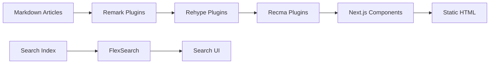

# Documentation

# Documentation

The Documentation module encompasses the complete tooling and content infrastructure for the LibreFang developer documentation portal at [docs.librefang.ai](https://docs.librefang.ai).

## Structure

The module spans three interconnected areas:

- **[src](documentation---src.md)** — Next.js application source code, including UI components, MDX processing pipeline, search integration, and internationalization
- **[docs](documentation---docs.md)** — Static site export and configuration for Cloudflare Pages deployment
- **[articles](documentation---articles.md)** — Markdown source files for blog posts, release notes, and announcements

## How the Sub-modules Connect

The documentation system follows a straightforward content pipeline: articles are written as Markdown, processed through the MDX pipeline in `src/mdx/`, and rendered by Next.js components into a static site.

The `src` module owns the rendering and processing logic. `docs` contains the deployment configuration and static export. `articles` provides the raw content that flows through both.

## Key Cross-Module Workflows

### Search Indexing

Content flows from MDX files through `extractSections` in `src/mdx/search.mjs` into FlexSearch. The `Search` component (`src/components/Search.tsx`) uses `useSearchProps` to provide the search interface, while `onKeyDown` handles keyboard navigation.

### Navigation

`SectionProvider` creates and manages section state via `createSectionStore`. `Navigation` components subscribe to this store through `useSectionStore`. The `NavigationGroup` component coordinates multiple navigation elements, using `lookupSections` to resolve section hierarchy and `toggleSections` for collapsible sections.

Active page tracking flows from `ChatPage` and `OverviewPage` through the `navigate` function in Search component to `onNavigate`, updating the `ActivePageMarker` to reflect current location.

### Internationalization

The site supports Chinese (default) and English locales. `withPrefix` in `src/lib/utils.ts` handles locale-aware path prefixing across `Layout`, `Navigation`, and related components.

## Components with Cross-Module Dependencies

| Component | Dependencies |
|-----------|--------------|
| `Search.tsx` | `useSearchProps`, `onKeyDown`, `navigate`, `onNavigate`, `MobileSearch` |
| `Navigation.tsx` | `NavigationGroup`, `ActivePageMarker`, `VisibleSectionHighlight`, `withPrefix`, `remToPx` |
| `SectionProvider.tsx` | `useVisibleSections`, `checkVisibleSections`, `createSectionStore` |
| `Code.tsx` | `CodeGroup`, `useTabGroupProps`, `getPanelTitle`, `preventLayoutShift` |

These dependencies form the core UX layer that processes content and presents it to readers.