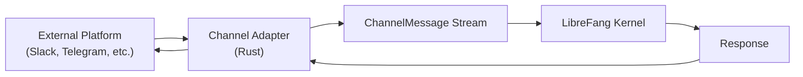
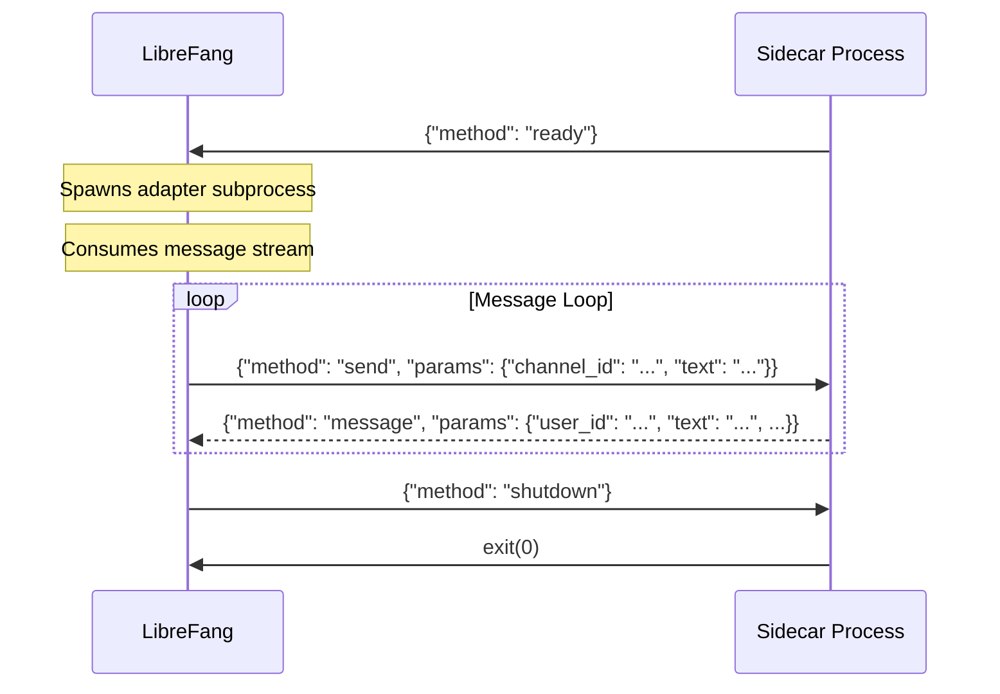
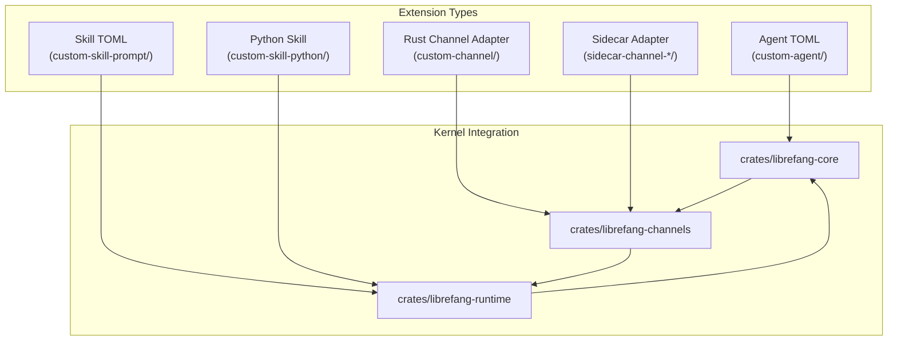

# Examples

# LibreFang Examples Module

This module provides reference implementations and templates for extending LibreFang. It covers three extension points: agents, channel adapters, and skills. Each subdirectory is self-contained and designed to be copied and modified.

## Module Structure

```
examples/
├── custom-agent/              # Minimal agent template
├── custom-channel/            # Guide for Rust channel adapters
├── custom-skill-prompt/       # Prompt-only skill (TOML)
├── custom-skill-python/       # Python skill with external runtime
└── sidecar-channel-*/         # Language-agnostic adapters (Bash, Go, Node, Python)
```

## Agent Templates

### `custom-agent/`

A minimal agent configuration template in TOML format. Agents in LibreFang are configured declaratively—the TOML defines the model, system prompt, capabilities, and resource limits.

**Key configuration sections:**

```toml
[model]
provider = "groq"
model = "llama-3.3-70b-versatile"
system_prompt = """..."""

[capabilities]
tools = ["web_fetch", "file_read", "file_list"]
memory_read = ["self.*"]
memory_write = ["self.*"]
```

To spawn this agent:
```bash
librefang agent spawn examples/custom-agent/agent.toml
```

The `module` field (`builtin:chat`) references a built-in skill that handles the actual message processing. Custom agent modules would point to a skill registered in the skill registry.

## Channel Adapters (Rust)

### `custom-channel/`

A comprehensive guide to implementing a new channel adapter in Rust. This integrates directly into `crates/librefang-channels/src/` and is gated behind a Cargo feature flag.

**Architecture overview:**



**Required trait methods:**

| Method | Purpose |
|--------|---------|
| `name()` | Identifier (e.g., `"slack"`) |
| `channel_type()` | `ChannelType` enum variant |
| `start()` | Returns `Stream<Item = ChannelMessage>` |
| `send()` | Deliver response to platform |
| `stop()` | Clean shutdown |

**Security pattern for credentials:**

```rust
use zeroize::Zeroizing;

pub struct MyPlatformAdapter {
    // Zeroized so memory is wiped on drop
    api_key: Zeroizing<String>,
    shutdown_tx: Arc<watch::Sender<bool>>,
    // ...
}
```

**Shutdown coordination:**

```rust
let (shutdown_tx, shutdown_rx) = watch::channel(false);

// In start():
tokio::select! {
    _ = shutdown_rx.changed() => return,
    // poll/platform logic
}

// In stop():
let _ = self.shutdown_tx.send(true);
```

**Feature gate registration** in `librefang-channels/Cargo.toml`:

```toml
[features]
channel-myplatform = []
all-channels = ["channel-myplatform", "channel-slack", ...]
```

## Skills

Skills are executable units that process messages. LibreFang supports two runtime types: `promptonly` (pure LLM) and `python` (external interpreter).

### Prompt-Only Skill: `custom-skill-prompt/`

Uses only prompt engineering—no code. The template fills in user-provided variables:

```toml
[runtime]
type = "promptonly"

[input]
topic = { type = "string", required = true }
duration_minutes = { type = "string", required = true }

[prompt]
template = """
Create a structured meeting agenda for:
Topic: {{topic}}
Duration: {{duration_minutes}} minutes
..."""
```

Test with:
```bash
librefang skill test ./examples/custom-skill-prompt \
  --input '{"topic": "Q1 planning", "duration_minutes": "30"}'
```

### Python Skill: `custom-skill-python/`

A skill with an external Python runtime. The skill loads `main.py` and calls `run(input: dict) -> str`:

```python
def run(input: dict) -> str:
    text = input.get("text", "")
    words = len(text.split())
    return f"Words: {words}\n..."
```

Configuration:
```toml
[runtime]
type = "python"
entry = "main.py"

[input]
text = { type = "string", description = "The text to analyze", required = true }
```

## Sidecar Channel Adapters

Sidecar adapters provide a **language-agnostic** way to bridge external platforms. Instead of writing Rust, you write a simple subprocess that communicates via JSON-RPC over stdin/stdout.

### Protocol Overview



### Events (Adapter → LibreFang)

```json
{"method": "ready"}
{"method": "message", "params": {"user_id": "...", "user_name": "...", "text": "...", "channel_id": "..."}}
{"method": "error", "params": {"message": "..."}}
```

### Commands (LibreFang → Adapter)

```json
{"method": "send", "params": {"channel_id": "...", "text": "..."}}
{"method": "shutdown"}
```

### Language Implementations

All four implementations follow the same pattern:

1. Signal readiness via stdout
2. Read JSON commands from stdin (one per line)
3. Handle `send` by delivering to the platform
4. Handle `shutdown` by exiting cleanly

| Language | File | Notes |
|----------|------|-------|
| Python | `adapter.py` | Stdlib only, minimal echo adapter |
| Python | `telegram_adapter.py` | Long-polling Telegram Bot API |
| Python | `webhook_adapter.py` | HTTP server receiving webhooks |
| Node.js | `adapter.js` | Echo adapter using `readline` |
| Go | `adapter.go` | Echo adapter using `bufio.Scanner` |
| Bash | `adapter.sh` | Minimal implementation using `jq` |

### Configuration

Add to `config.toml`:

```toml
[[sidecar_channels]]
name = "telegram"
command = "python3"
args = ["examples/sidecar-channel-python/telegram_adapter.py"]
env = { TELEGRAM_BOT_TOKEN = "..." }
```

### Python: Telegram Adapter

Demonstrates a real-world integration with long-polling:

```python
def poll_updates(allowed_ids):
    offset = 0
    while True:
        resp = requests.get(f"{API_BASE}/getUpdates", params={
            "offset": offset,
            "timeout": 30,
        }, timeout=35)
        for update in data.get("result", []):
            offset = update["update_id"] + 1
            send_event("message", {
                "user_id": str(msg["from"]["id"]),
                "user_name": user.get("first_name", "unknown"),
                "text": msg["text"],
                "channel_id": str(msg["chat"]["id"]),
                "platform": "telegram",
            })
```

Whitelist enforcement:
```python
if allowed_ids and user_id not in allowed_ids:
    continue
```

### Python: Webhook Adapter

Demonstrates receiving via HTTP server:

```python
class WebhookHandler(BaseHTTPRequestHandler):
    def do_POST(self):
        body = self.rfile.read(content_length)
        if WEBHOOK_SECRET:
            sig = self.headers.get("X-Signature", "")
            expected = hmac.new(WEBHOOK_SECRET.encode(), body, hashlib.sha256).hexdigest()
            if not hmac.compare_digest(sig, expected):
                self.send_response(401)
                return
        send_event("message", {...})
```

**Sending outbound** is a no-op for webhook-only integrations—acknowledge and log:

```python
elif method == "send":
    sys.stderr.write(f"[webhook] outbound (no-op): {text}\n")
```

## Connecting the Examples

The extension points connect through the LibreFang kernel:



- **Agents** configure model selection, system prompts, and resource limits at the kernel level
- **Channel adapters** (Rust or sidecar) feed messages into `ChannelBridge` in `librefang-channels`
- **Skills** execute within `librefang-runtime`, which handles prompt rendering and response formatting

## Testing Examples

```bash
# Build with a specific channel feature
cargo build --workspace --features channel-myplatform

# Test a Python skill
librefang skill test ./examples/custom-skill-python \
  --input '{"text": "Hello world"}'

# Lint the workspace
cargo clippy --workspace --all-targets -- -D warnings
```

## Reference Adapters by Complexity

When implementing a Rust channel adapter, study these in order:

1. **ntfy** — SSE subscription + plain POST publishing
2. **webhook** — HTTP server with HMAC-SHA256 verification
3. **gotify** — WebSocket subscription + REST API publishing
4. **slack** — WebSocket (Socket Mode) + Web API
5. **telegram** — Long-polling + Bot API

For sidecar adapters, start with `adapter.py` (Python) or `adapter.sh` (Bash) for the minimal pattern, then extend to `telegram_adapter.py` or `webhook_adapter.py` for real-world platform integration.