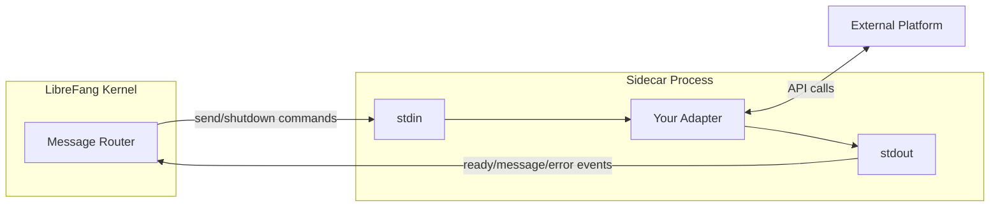

# Examples

# Examples Module

This module provides ready-to-use templates and reference implementations for extending LibreFang. Each example is self-contained and can be copied as a starting point for custom agents, skills, and channel adapters.

## What's Included

| Example | Language | Purpose |
|---------|----------|---------|
| `custom-agent/` | TOML | Minimal agent configuration template |
| `custom-skill-prompt/` | TOML | Pure prompt-engineering skill (no code) |
| `custom-skill-python/` | Python + TOML | Code-based skill with Python runtime |
| `custom-channel/` | Rust | Native channel adapter implementation guide |
| `sidecar-channel-bash/` | Bash | Sidecar adapter using the JSON-RPC stdin/stdout protocol |
| `sidecar-channel-go/` | Go | Sidecar adapter in Go |
| `sidecar-channel-node/` | JavaScript | Sidecar adapter in Node.js |
| `sidecar-channel-python/` | Python | Three sidecar adapters: echo, Telegram, and webhook |

---

## Custom Agent

**Directory:** `custom-agent/`

A minimal agent template defined in a single `agent.toml` file. Agents are the core conversational entities in LibreFang — each one configures a model, system prompt, resource limits, and capabilities.

```bash
librefang agent spawn examples/custom-agent/agent.toml
```

### Key Configuration Sections

- **`[model]`** — Provider, model name, and system prompt. The example uses Groq's `llama-3.3-70b-versatile`.
- **`[resources]`** — Rate limits such as `max_llm_tokens_per_hour`.
- **`[capabilities]`** — Declares which tools the agent can use (`web_fetch`, `file_read`, `file_list`), memory scopes (`self.*`), and whether it can spawn sub-agents.

Copy `agent.toml`, modify the fields, and spawn it. See `docs/agent-templates.md` for the full schema.

---

## Custom Skills

Skills are reusable capabilities that agents can invoke. There are two runtime types: `promptonly` (pure prompt templates) and `python` (code-based).

### Prompt-Only Skill

**Directory:** `custom-skill-prompt/`

No code required — the skill is entirely defined in `skill.toml`. The example generates a meeting agenda from a topic and duration using Jinja-style `{{variable}}` interpolation in the prompt template.

```bash
librefang skill test ./examples/custom-skill-prompt \
  --input '{"topic": "Q1 planning", "duration_minutes": "30"}'
```

The `[input]` section declares typed parameters. The `[prompt]` section contains the template with placeholders. Set `runtime.type = "promptonly"`.

### Python Skill

**Directory:** `custom-skill-python/`

A code-based skill with a `main.py` entry point. The Python file must export a `run(input: dict) -> str` function. The example counts words, sentences, and characters in input text.

```bash
librefang skill test ./examples/custom-skill-python --input '{"text": "Hello world"}'
```

Configuration in `skill.toml` sets `runtime.type = "python"` and `runtime.entry = "main.py"`.

---

## Native Channel Adapters

**Directory:** `custom-channel/`

A complete guide for implementing channel adapters in Rust as part of the `librefang-channels` crate. Channel adapters bridge external messaging platforms into LibreFang by converting platform-specific messages into unified `ChannelMessage` events.

### The `ChannelAdapter` Trait

All native adapters implement `ChannelAdapter` from `crates/librefang-channels/src/types.rs`. Five methods are required; the rest have defaults:

| Method | Required | Purpose |
|--------|----------|---------|
| `name()` | Yes | Human-readable adapter identifier |
| `channel_type()` | Yes | Returns a `ChannelType` enum variant |
| `start()` | Yes | Returns a `Stream<Item = ChannelMessage>` of incoming messages |
| `send()` | Yes | Delivers a response to a user on the platform |
| `stop()` | Yes | Graceful shutdown and cleanup |
| `send_typing()` | No | Typing indicator |
| `send_reaction()` | No | Emoji reaction to a message |
| `send_in_thread()` | No | Threaded reply (falls back to `send()`) |
| `status()` | No | Health status reporting |

### Implementation Patterns

The `MyPlatformAdapter` example in the README demonstrates the standard patterns:

- **Secret management** — Use `Zeroizing<String>` for API keys and tokens so they are wiped from memory on drop.
- **Shutdown signaling** — Use `watch::channel(false)` to broadcast a shutdown signal to all spawned tasks.
- **Message bridging** — Use `mpsc::channel` to feed incoming platform messages into the `Stream` that the kernel consumes via `ReceiverStream`.
- **Long messages** — Use `split_message(text, MAX_LEN)` from `crate::types` to chunk replies that exceed platform limits.

### Integration Steps

1. Create the adapter source file in `crates/librefang-channels/src/`.
2. Add a `#[cfg(feature = "channel-myplatform")] pub mod myplatform;` gate in `lib.rs`.
3. Add the feature flag to `Cargo.toml` (and to `all-channels` / `default` if appropriate).
4. Write unit tests covering creation, parsing, and serialization.
5. Build and test: `cargo build --workspace --features channel-myplatform`.

### Reference Adapters

Study existing adapters from simplest to most complex:

- **ntfy** (`ntfy.rs`) — SSE subscription + plain POST
- **webhook** (`webhook.rs`) — HTTP server with HMAC-SHA256 verification
- **gotify** (`gotify.rs`) — WebSocket + REST
- **slack** (`slack.rs`) — Socket Mode WebSocket + Web API
- **telegram** (`telegram.rs`) — Long-polling + Bot API

---

## Sidecar Channel Adapters

Sidecar adapters let you write channel integrations in **any language** without modifying the Rust codebase. LibreFang spawns your adapter as a subprocess and communicates via newline-delimited JSON over stdin/stdout.

### Architecture



### Protocol

Communication is one JSON object per line.

**Events** (adapter → LibreFang via stdout):

| Method | Purpose |
|--------|---------|
| `{"method": "ready"}` | Signal initialization complete |
| `{"method": "message", "params": {...}}` | Incoming message from the platform |
| `{"method": "error", "params": {"message": "..."}}` | Report an error |

**Commands** (LibreFang → adapter via stdin):

| Method | Purpose |
|--------|---------|
| `{"method": "send", "params": {"channel_id": "...", "text": "..."}}` | Deliver a message to the platform |
| `{"method": "shutdown"}` | Graceful termination request |

`stderr` output is forwarded to LibreFang's logs for debugging.

### Configuration

Add to `~/.librefang/config.toml`:

```toml
[[sidecar_channels]]
name = "my-adapter"
command = "python3"
args = ["path/to/adapter.py"]
env = { API_KEY = "..." }        # optional environment variables
# channel_type = "custom-name"   # optional, defaults to name
```

### Provided Implementations

#### Bash (`sidecar-channel-bash/adapter.sh`)

The simplest possible adapter — requires only `bash` and `jq`. Echoes messages back. Useful as a minimal reference for the protocol.

#### Go (`sidecar-channel-go/adapter.go`)

A compiled adapter with proper JSON marshaling. Build with `go build -o adapter adapter.go`. Demonstrates typed structs for events and commands.

#### Node.js (`sidecar-channel-node/adapter.js`)

Uses Node's built-in `readline` module. Shows the same echo pattern with `process.stdout.write()` for explicit flushing.

#### Python — Echo (`sidecar-channel-python/adapter.py`)

The canonical reference implementation. The core structure used by all Python sidecars:

```python
def send_event(method, params=None):
    event = {"method": method}
    if params:
        event["params"] = params
    print(json.dumps(event), flush=True)
```

- `send_event("ready")` on startup
- Read stdin line-by-line, parse JSON, dispatch to `handle_command()`
- `handle_command()` processes `"send"` and `"shutdown"` methods
- Always `flush=True` on stdout writes

#### Python — Telegram (`sidecar-channel-python/telegram_adapter.py`)

A real-world adapter bridging the Telegram Bot API. Uses long-polling in a background thread (`poll_updates()`) while the main thread reads commands from stdin. Features:

- Configurable user whitelist via `ALLOWED_USERS` environment variable
- Long-polling with 30-second timeout
- Automatic error reporting back to LibreFang via `send_event("error", ...)`

#### Python — Webhook (`sidecar-channel-python/webhook_adapter.py`)

An HTTP server that receives POST requests and forwards them as messages. Useful for integrating GitHub, Stripe, or any webhook-capable service. Features:

- Stdlib-only HTTP server (no dependencies)
- Optional HMAC-SHA256 signature validation via `WEBHOOK_SECRET`
- Receive-only (outbound `send` commands are logged to stderr as no-ops)

### Writing Your Own Sidecar

Every adapter follows the same lifecycle:

1. **Initialize** — Set up connections, parse environment variables.
2. **Signal ready** — Write `{"method": "ready"}` to stdout.
3. **Main loop** — Read commands from stdin, handle platform I/O, write events to stdout.
4. **Shutdown** — On receiving `{"method": "shutdown"}`, clean up resources and exit.

Key rules:
- Write **one JSON object per line** to stdout, always flushing.
- Never write non-JSON to stdout (use stderr for logs).
- Exit cleanly on `shutdown` — the kernel may send SIGKILL after a timeout.