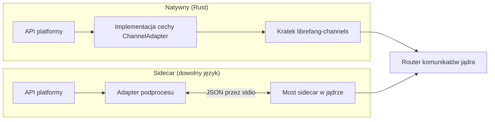

# examples

# Moduł przykładów

Szablony referencyjne i samouczki dla trzech powierzchni rozszerzeń LibreFang: **agenta**, **umiejętności** i **adapterów kanałów**. Każdy podkatalog to samodzielny punkt wyjścia typu „kopiuj i modyfikuj".

## Układ

| Katalog | Powierzchnia rozszerzenia | Język / Format |
|-----------|------------------|-------------------|
| `custom-agent/` | Definicja agenta | Manifest TOML |
| `custom-skill-prompt/` | Umiejętność (tylko prompt) | Manifest TOML |
| `custom-skill-python/` | Umiejętność (obliczeniowa) | Python + TOML |
| `custom-skill-wasm/` | Umiejętność (obliczeniowa) | Rust → WASM + TOML |
| `custom-channel/` | Adapter kanału (natywny) | Przewodnik po cechach Rusta |
| `sidecar-channel-bash/` | Adapter kanału (sidecar) | Bash + jq |
| `sidecar-channel-go/` | Adapter kanału (sidecar) | Go |
| `sidecar-channel-node/` | Adapter kanału (sidecar) | Node.js |
| `sidecar-channel-python/` | Adapter kanału (sidecar) | Python |

---

## Agenci

### `custom-agent/agent.toml`

Minimalny szablon agenta. Skopiuj go, edytuj pola i uruchom:

```bash
librefang agent spawn examples/custom-agent/agent.toml
```

Kluczowe pola w manifeście:

| Sekcja | Pole | Przeznaczenie |
|---------|-------|---------|
| najwyższy poziom | `module` | Moduł środowiska uruchomieniowego agenta (tutaj `builtin:chat`) |
| `[model]` | `provider` / `model` | Ustaw na `"default"`, aby dziedziczyć z konfiguracji globalnej, lub przypnij do konkretnego dostawcy/modelu |
| `[model]` | `system_prompt` | Wstrzykiwany jako komunikat systemowy przy każdej rozmowie |
| `[resources]` | `max_llm_tokens_per_hour` | Budżet limitu szybkości dla pojedynczego agenta |
| `[capabilities]` | `tools`, `memory_read`, `memory_write`, `agent_spawn` | Uprawnienia w trybie piaskownicy; zakresy pamięci używają wzorców glob (`self.*`) |
| `[workspaces]` | nazwane ścieżki | Opcjonalne katalogi współdzielone między agentami, względne wobec `workspaces_dir` |

---

## Umiejętności

Umiejętności to jednostki obliczeniowe/promptowe, które agenci wywołują jako narzędzia. Zademonstrowano trzy środowiska uruchomieniowe.

### Tylko prompt (`custom-skill-prompt/`)

Brak kodu — czysta inżynieria promptów. Manifest deklaruje `[runtime] type = "promptonly"`, schemat `[input]` oraz szablon `[prompt]` z interpolacją w stylu Jinja `{{zmienna}}`. Testowanie za pomocą:

```bash
librefang skill test ./examples/custom-skill-prompt \
  --input '{"topic": "Planowanie Q1", "duration_minutes": "30"}'
```

### Python (`custom-skill-python/`)

Plik `main.py` z punktem wejścia `run(input: dict) -> str`. Manifest deklaruje `[runtime] type = "python"` z `entry = "main.py"`. Schemat wejścia w `[input]` mapuje się bezpośrednio na klasy słownika `input`.

### WASM (`custom-skill-wasm/`)

Kratek Rusta `cdylib` używający SDK [`librefang-skill`](../../sdk/rust/librefang-skill). Obsługa jest rejestrowana za pomocą makra `skill!`:

```rust
fn handle(req: Request) -> Result<Value, String> {
    // req.tool to nazwa narzędzia; req.input to serde_json::Value
}

skill!(handle);
```

`[lib] name = "skill"` w `Cargo.toml` zapewnia, że artefakt nazywa się zawsze `skill.wasm`. Manifest deklaruje `[runtime] type = "wasm"` z `entry = "skill.wasm"`. Umiejętności wykonujące czyste obliczenia nie deklarują żadnych możliwości:

```toml
[requirements]
capabilities = []
```

Kompilacja i testowanie:

```bash
rustup target add wasm32-unknown-unknown
cargo build --release --target wasm32-unknown-unknown
cp target/wasm32-unknown-unknown/release/skill.wasm skill.wasm
librefang skill test . --input '{"text": "Witaj świecie. Cześć!"}'
```

Artefakt `.wasm` znajduje się w katalogu głównym umiejętności (nie w `target/`), ponieważ pakiet wyklucza `target/`.

---

## Adaptery kanałów

Adaptery kanałów mostują zewnętrzne platformy komunikacyjne do jądra. Istnieją dwie ścieżki integracji:


```mermaid
flowchart LR
    subgraph Native["Natywny (Rust)"]
        A[API platformy] --> B[Implementacja cechy ChannelAdapter]
        B --> C[Kratek librefang-channels]
    end
    subgraph Sidecar["Sidecar (dowolny język)"]
        D[API platformy] --> E[Adapter podprocesu]
        E <-- "JSON przez stdio" --> F[Most sidecar w jądrze]
    end
    C --> G[Router komunikatów jądra]
    F --> G
```

### Adaptery natywne — `custom-channel/`

Kompletny przewodnik krok po kroku implementacji cechy `ChannelAdapter` (zdefiniowanej w `crates/librefang-channels/src/types.rs`). Wymagane jest pięć metod; pozostałe mają domyślne implementacje:

| Metoda | Wymagana | Przeznaczenie |
|--------|----------|---------|
| `name()` | tak | Statyczny ciąg identyfikacyjny |
| `channel_type()` | tak | Zwraca wariant `ChannelType` |
| `start()` | tak | Zwraca `Stream<Item = ChannelMessage>` dla komunikatów przychodzących |
| `send()` | tak | Dostarcza odpowiedź `ChannelContent` do `ChannelUser` |
| `stop()` | tak | Sygnalizuje zamknięcie, czyści zasoby |
| `send_typing()` | nie | Domyślnie operacja pusta; nadpisz dla wskaźników pisania |
| `send_reaction()` | nie | Domyślnie operacja pusta; nadpisz dla reakcji cyklu życia |
| `send_in_thread()` | nie | Domyślnie deleguje do `send()` |
| `status()` | nie | Domyślnie zwraca `ChannelStatus::default()` |

**Kluczowe wzorce** zademonstrowane w przykładzie:

- **Higiena tajemnic**: przechowuj klucze/tokeny API w `Zeroizing<String>`, aby były kasowane z pamięci przy operacji drop.
- **Łagodne zamykanie**: użyj pary `watch::channel(false)`; uruchomione zadanie oczekuje na `shutdown_rx.changed()`.
- **Mostkowanie strumieni**: utwórz `mpsc::channel::<ChannelMessage>(256)`, uruchom zadanie odpytywania/websocket wysyłające do kanału i zwróć `Box::pin(ReceiverStream::new(rx))` z `start()`.
- **Dzielenie komunikatów**: użyj `split_message(text, MAX_LEN)` z `crate::types` do dzielenia długich odpowiedzi na fragmenty.

Rejestracja obejmuje trzy pliki:

1. **Deklaracja modułu** w `crates/librefang-channels/src/lib.rs` za flagą funkcji:
   ```rust
   #[cfg(feature = "channel-myplatform")]
   pub mod myplatform;
   ```

2. **Flaga funkcji** w `crates/librefang-channels/Cargo.toml`:
   ```toml
   channel-myplatform = []
   ```
   Dodaj `"channel-myplatform"` do listy `all-channels` (oraz `default`, jeśli ma się kompilować domyślnie).

3. **Testy jednostkowe** na dole pliku adaptera, obejmujące tworzenie, asercje nazwy/typu i logikę parsowania.

Adaptery referencyjne według złożoności: `webhook.rs` (HTTP + weryfikacja HMAC) → `discord.rs` (WebSocket bramy) → `slack.rs` (Socket Mode) → `matrix.rs` (API klient-serwer).

### Adaptery sidecar

Alternatywa dla natywnego Rusta: LibreFang uruchamia adapter jako podproces i komunikuje się za pomocą **oznaczanego nową linią JSON** przez stdio. Nie wymaga kompilacji Rusta.

#### Protokół

**Zdarzenia** (adapter → LibreFang przez stdout):

| `method` | `params` | Kiedy |
|----------|----------|------|
| `ready` | *(brak)* | Wysyłane raz przy starcie w celu sygnalizacji gotowości |
| `message` | `user_id`, `user_name`, `text`, `channel_id`, `platform` | Komunikat przychodzący z platformy |
| `error` | `message` | Raportowanie błędu niekrytycznego |

**Polecenia** (LibreFang → adapter przez stdin):

| `method` | `params` | Akcja |
|----------|----------|--------|
| `send` | `channel_id`, `text` | Dostarczenie komunikatu na platformę |
| `shutdown` | *(brak)* | Czyszczenie i wyjście |

`stderr` jest przekierowane do logów LibreFang w celu debugowania.

#### Cykl życia

Każdy adapter podąża za tym samym przepływem niezależnie od języka:

1. Emituj `{"method": "ready"}` na stdout.
2. Czytaj stdin linia po linii; parsuj każdą linię jako polecenie JSON.
3. Obsługuj `send`, dostarczając na platformę (przykłady odsyłają zdarzenie `message` jako echo).
4. Obsługuj `shutdown`, kończąc działanie poprawnie.

#### Implementacje w różnych językach

Dołączone są cztery przykłady, wszystkie implementujące ten sam adapter echo:

| Katalog | Punkt wejścia | Zależności |
|-----------|-------------|--------------|
| `sidecar-channel-bash/` | `adapter.sh` | `jq` |
| `sidecar-channel-go/` | `adapter.go` | tylko stdlib |
| `sidecar-channel-node/` | `adapter.js` | stdlib (`readline`) |
| `sidecar-channel-python/` | `adapter.py` | stdlib (`json`, `sys`) |

Każdy definiuje pomocniczą funkcję `sendEvent`/`send_event`/`sendEvent`, która serializuje obiekt `{method, params}` do stdout z końcową nową linią, oraz obsługę poleceń, która rozgałęzia się na podstawie pola `method`.

#### Konfiguracja

Zarejestruj adapter sidecar w `~/.librefang/config.toml`:

```toml
[[sidecar_channels]]
name = "echo-test"
command = "python3"
args = ["path/to/adapter.py"]
channel_type = "custom-echo"  # opcjonalne, domyślnie przyjmuje wartość name
env = {}                       # opcjonalne zmienne środowiskowe
```

#### Adaptery sidecar pierwszej strony

Adaptery produkcyjne (`ntfy`, `telegram`, `webhook`) wcześniej znajdowały się w tym katalogu jako samodzielne skrypty. Teraz są dołączane w pakiecie Pythona `librefang-sdk` pod `librefang.sidecar.adapters`. Odnosisz się do nich przez moduł:

```toml
[[sidecar_channels]]
name = "ntfy"
command = "python3"
args = ["-m", "librefang.sidecar.adapters.ntfy"]
channel_type = "ntfy"
[sidecar_channels.env]
NTFY_TOPIC = "my-topic"
```

---

## Relacja z resztą bazy kodu

Te przykłady są wykorzystywane przez CLI `librefang` — nie są dołączane do przestrzeni roboczej jądra. Dwa wyjątki:

- **`custom-skill-wasm/`** używa zależności ścieżkowej (`../../sdk/rust/librefang-skill`) i deklaruje własny korzeń `[workspace]`, aby nie zostać wciągniętym do przestrzeni roboczej jądra (celuje w `wasm32-unknown-unknown`).
- **`custom-channel/`** opisuje dodawanie plików bezpośrednio do `crates/librefang-channels/src/`, co czyni go jedynym przykładem modyfikującym kod źródłowy jądra.

Wszystkie pozostałe przykłady są samodzielne: skopiuj katalog, edytuj i wskaż CLI na niego.
