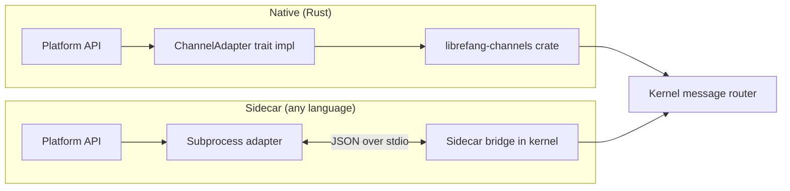

# examples

# Examples Module

Reference templates and tutorials for the three extension surfaces of LibreFang: **agents**, **skills**, and **channel adapters**. Each subdirectory is a self-contained, copy-and-modify starting point.

## Layout

| Directory | Extension Surface | Language / Format |
|-----------|------------------|-------------------|
| `custom-agent/` | Agent definition | TOML manifest |
| `custom-skill-prompt/` | Skill (prompt-only) | TOML manifest |
| `custom-skill-python/` | Skill (compute) | Python + TOML |
| `custom-skill-wasm/` | Skill (compute) | Rust → WASM + TOML |
| `custom-channel/` | Channel adapter (native) | Rust trait guide |
| `sidecar-channel-bash/` | Channel adapter (sidecar) | Bash + jq |
| `sidecar-channel-go/` | Channel adapter (sidecar) | Go |
| `sidecar-channel-node/` | Channel adapter (sidecar) | Node.js |
| `sidecar-channel-python/` | Channel adapter (sidecar) | Python |

---

## Agents

### `custom-agent/agent.toml`

A minimal agent template. Copy it, edit the fields, and spawn:

```bash
librefang agent spawn examples/custom-agent/agent.toml
```

Key fields in the manifest:

| Section | Field | Purpose |
|---------|-------|---------|
| top-level | `module` | The agent runtime module (here `builtin:chat`) |
| `[model]` | `provider` / `model` | Set to `"default"` to inherit from global config, or pin to a specific provider/model |
| `[model]` | `system_prompt` | Injected as the system message on every conversation |
| `[resources]` | `max_llm_tokens_per_hour` | Per-agent rate-limit budget |
| `[capabilities]` | `tools`, `memory_read`, `memory_write`, `agent_spawn` | Sandboxed permissions; memory scopes use glob patterns (`self.*`) |
| `[workspaces]` | named paths | Optional shared directories between agents, relative to `workspaces_dir` |

---

## Skills

Skills are the compute/prompt units that agents invoke as tools. Three runtimes are demonstrated.

### Prompt-Only (`custom-skill-prompt/`)

No code — pure prompt engineering. The manifest declares `[runtime] type = "promptonly"`, an `[input]` schema, and a `[prompt] template` with Jinja-style `{{variable}}` interpolation. Test with:

```bash
librefang skill test ./examples/custom-skill-prompt \
  --input '{"topic": "Q1 planning", "duration_minutes": "30"}'
```

### Python (`custom-skill-python/`)

A `main.py` with a `run(input: dict) -> str` entry point. The manifest declares `[runtime] type = "python"` with `entry = "main.py"`. The input schema in `[input]` maps directly to the keys of the `input` dict.

### WASM (`custom-skill-wasm/`)

A Rust `cdylib` crate using the [`librefang-skill`](../../sdk/rust/librefang-skill) SDK. The handler is registered via the `skill!` macro:

```rust
fn handle(req: Request) -> Result<Value, String> {
    // req.tool is the tool name; req.input is a serde_json::Value
}

skill!(handle);
```

The `[lib] name = "skill"` in `Cargo.toml` ensures the artifact is always `skill.wasm`. The manifest declares `[runtime] type = "wasm"` with `entry = "skill.wasm"`. Skills that perform pure compute declare no capabilities:

```toml
[requirements]
capabilities = []
```

Build and test:

```bash
rustup target add wasm32-unknown-unknown
cargo build --release --target wasm32-unknown-unknown
cp target/wasm32-unknown-unknown/release/skill.wasm skill.wasm
librefang skill test . --input '{"text": "Hello world. Bye!"}'
```

The `.wasm` artifact lives at the skill root (not in `target/`) because the packager excludes `target/`.

---

## Channel Adapters

Channel adapters bridge external messaging platforms into the kernel. There are two integration paths:


```mermaid
flowchart LR
    subgraph Native["Native (Rust)"]
        A[Platform API] --> B[ChannelAdapter trait impl]
        B --> C[librefang-channels crate]
    end
    subgraph Sidecar["Sidecar (any language)"]
        D[Platform API] --> E[Subprocess adapter]
        E <-- "JSON over stdio" --> F[Sidecar bridge in kernel]
    end
    C --> G[Kernel message router]
    F --> G
```

### Native Adapters — `custom-channel/`

A complete walkthrough for implementing the `ChannelAdapter` trait (defined in `crates/librefang-channels/src/types.rs`). Five methods are required; the rest have default implementations:

| Method | Required | Purpose |
|--------|----------|---------|
| `name()` | yes | Static identifier string |
| `channel_type()` | yes | Returns a `ChannelType` variant |
| `start()` | yes | Returns a `Stream<Item = ChannelMessage>` for incoming messages |
| `send()` | yes | Delivers a `ChannelContent` response to a `ChannelUser` |
| `stop()` | yes | Signals shutdown, cleans up resources |
| `send_typing()` | no | Default no-op; override for typing indicators |
| `send_reaction()` | no | Default no-op; override for lifecycle reactions |
| `send_in_thread()` | no | Default falls back to `send()` |
| `status()` | no | Default returns `ChannelStatus::default()` |

**Key patterns** the example demonstrates:

- **Secret hygiene**: store API keys/tokens in `Zeroizing<String>` so they are wiped from memory on drop.
- **Graceful shutdown**: use a `watch::channel(false)` pair; the spawned task selects on `shutdown_rx.changed()`.
- **Stream bridging**: create an `mpsc::channel::<ChannelMessage>(256)`, spawn a polling/websocket task that sends into the channel, and return `Box::pin(ReceiverStream::new(rx))` from `start()`.
- **Message splitting**: use `split_message(text, MAX_LEN)` from `crate::types` to chunk long replies.

Registration involves three files:

1. **Module declaration** in `crates/librefang-channels/src/lib.rs` behind a feature gate:
   ```rust
   #[cfg(feature = "channel-myplatform")]
   pub mod myplatform;
   ```

2. **Feature flag** in `crates/librefang-channels/Cargo.toml`:
   ```toml
   channel-myplatform = []
   ```
   Add `"channel-myplatform"` to the `all-channels` list (and `default` if it should compile by default).

3. **Unit tests** at the bottom of the adapter file covering creation, name/type assertions, and any parsing logic.

Reference adapters by complexity: `webhook.rs` (HTTP + HMAC verification) → `discord.rs` (Gateway WebSocket) → `slack.rs` (Socket Mode) → `matrix.rs` (client-server API).

### Sidecar Adapters

An alternative to native Rust: LibreFang spawns your adapter as a subprocess and communicates via **newline-delimited JSON** over stdio. No Rust compilation required.

#### Protocol

**Events** (adapter → LibreFang via stdout):

| `method` | `params` | When |
|----------|----------|------|
| `ready` | *(none)* | Sent once on startup to signal readiness |
| `message` | `user_id`, `user_name`, `text`, `channel_id`, `platform` | An incoming message from the platform |
| `error` | `message` | Report a non-fatal error |

**Commands** (LibreFang → adapter via stdin):

| `method` | `params` | Action |
|----------|----------|--------|
| `send` | `channel_id`, `text` | Deliver a message to the platform |
| `shutdown` | *(none)* | Clean up and exit |

`stderr` is forwarded to LibreFang's logs for debugging.

#### Lifecycle

Every adapter follows the same flow regardless of language:

1. Emit `{"method": "ready"}` on stdout.
2. Read stdin line-by-line; parse each line as a JSON command.
3. Handle `send` by delivering to the platform (the examples echo back a `message` event).
4. Handle `shutdown` by exiting cleanly.

#### Language Implementations

Four examples ship, all implementing the same echo adapter:

| Directory | Entry Point | Dependencies |
|-----------|-------------|--------------|
| `sidecar-channel-bash/` | `adapter.sh` | `jq` |
| `sidecar-channel-go/` | `adapter.go` | stdlib only |
| `sidecar-channel-node/` | `adapter.js` | stdlib (`readline`) |
| `sidecar-channel-python/` | `adapter.py` | stdlib (`json`, `sys`) |

Each defines a `sendEvent`/`send_event`/`sendEvent` helper that serializes a `{method, params}` object to stdout with a trailing newline, and a command handler that switches on the `method` field.

#### Configuration

Register a sidecar adapter in `~/.librefang/config.toml`:

```toml
[[sidecar_channels]]
name = "echo-test"
command = "python3"
args = ["path/to/adapter.py"]
channel_type = "custom-echo"  # optional, defaults to name
env = {}                       # optional environment variables
```

#### First-Party Sidecar Adapters

Production adapters (`ntfy`, `telegram`, `webhook`) previously lived in this directory as standalone scripts. They now ship inside the `librefang-sdk` Python package under `librefang.sidecar.adapters`. Reference them by module:

```toml
[[sidecar_channels]]
name = "ntfy"
command = "python3"
args = ["-m", "librefang.sidecar.adapters.ntfy"]
channel_type = "ntfy"
[sidecar_channels.env]
NTFY_TOPIC = "my-topic"
```

---

## Relationship to the Rest of the Codebase

These examples are consumed via the `librefang` CLI — they are not linked into the kernel workspace. Two exceptions:

- **`custom-skill-wasm/`** uses a path dependency (`../../sdk/rust/librefang-skill`) and declares its own `[workspace]` root to avoid being pulled into the kernel workspace (it targets `wasm32-unknown-unknown`).
- **`custom-channel/`** describes adding files directly into `crates/librefang-channels/src/`, making it the only example that modifies kernel source.

All other examples are standalone: copy the directory, edit, and point the CLI at it.