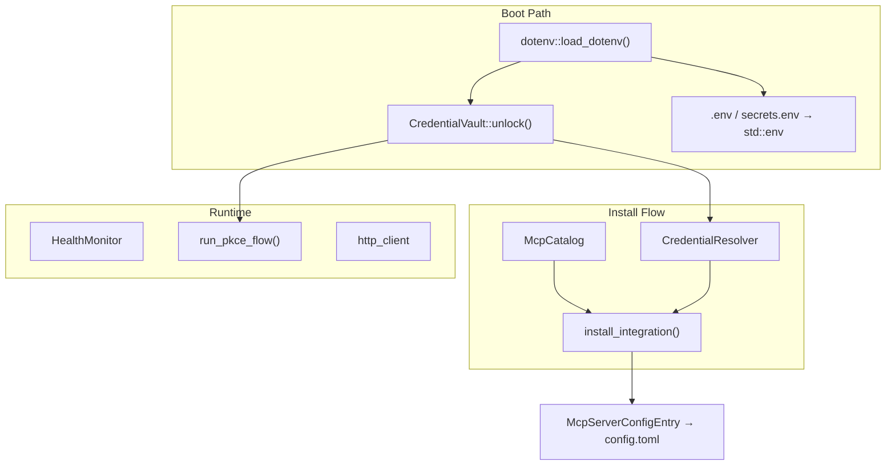

# Extensions & Credential Vault

# Extensions & Credential Vault

The `librefang-extensions` crate manages MCP server lifecycle — from catalog discovery through credential storage to health monitoring. It owns the *behaviour* of loading, installing, and monitoring MCP integrations, while schema types live in `librefang_types::mcp` and `librefang_types::oauth`.

## Architecture Overview



## Module Layout

| Module | Responsibility |
|---|---|
| `vault` | AES-256-GCM encrypted secret storage at `~/.librefang/vault.enc` |
| `credentials` | Multi-source credential resolution chain |
| `dotenv` | Process-wide env loading from vault + `.env` + `secrets.env` |
| `catalog` | Read-only MCP server template cache |
| `installer` | Pure transforms: catalog entry → `McpServerConfigEntry` |
| `oauth` | OAuth2 PKCE localhost-callback flows |
| `health` | MCP server health tracking with auto-reconnect |
| `http_client` | Shared `reqwest` client with bundled CA roots |

---

## Credential Vault (`vault`)

AES-256-GCM encrypted secret storage persisted at `~/.librefang/vault.enc`. Master key resolution chain:

1. **Cached key** — in-memory `cached_key` from a prior `unlock()` or `init()`
2. **`LIBREFANG_VAULT_KEY` env var** — base64-encoded 32-byte key (preferred in CI/headless)
3. **OS keyring** — Windows Credential Manager, macOS Keychain, or Linux Secret Service (via the `keyring` crate)
4. **File fallback** — `<data_local_dir>/librefang/.keyring` (0600, AES-256-GCM wrapped with Argon2id-derived machine fingerprint)

### Key APIs

```rust
let mut vault = CredentialVault::new(home.join("vault.enc"));

// First-time setup — generates a random key, persists to keyring
vault.init()?;

// Subsequent opens — resolves key from env/keyring/file
vault.unlock()?;

vault.set("GITHUB_TOKEN".into(), Zeroizing::new("ghp_...".into()))?;
let token = vault.get("GITHUB_TOKEN"); // Option<Zeroizing<String>>
vault.remove("GITHUB_TOKEN")?;

// Key rotation
vault.rewrap_with_new_key(new_key)?;
```

### Startup Sentinel

Every vault contains a reserved `__sentinel__` key with known plaintext `librefang-vault-sentinel-v1`. The daemon boot path calls `verify_or_install_sentinel()` after `unlock()` — if decryption succeeds but the sentinel doesn't match, the boot aborts with `VaultKeyMismatch`. This prevents silent credential loss from a changed master key.

The sentinel key is write-protected: `set()` and `remove()` reject operations on `SENTINEL_KEY`. `list_keys()` filters it out; use `list_keys_including_internal()` for key rotation workflows.

### OS Keyring Behaviour

On macOS, the OS keyring is **disabled by default** because the Keychain ACL is bound to the per-binary code signature — every `cargo build` invalidates it and triggers another prompt. Set `LIBREFANG_VAULT_NO_KEYRING=1` on other platforms to force the file fallback. `CredentialVault::init_with_config(use_os_keyring)` sets the process-global preference (first call wins).

### Atomic Writes

The vault file is written atomically: data goes to `<path>.tmp.<pid>` with mode 0600, `fsync`'d, then `rename`'d over the target. Post-init verification re-opens the file through a fresh `CredentialVault` instance to catch init/unlock key divergence (#5069).

---

## Credential Resolver (`credentials`)

Resolves secrets from multiple sources in priority order:

1. **Encrypted vault** (`~/.librefang/vault.enc`) — if unlocked
2. **Dotenv file** (`~/.librefang/.env`) — boot-time snapshot
3. **Process environment variable** (`std::env::var`)
4. **Interactive prompt** — CLI only, opt-in via `.with_interactive(true)`

### Vault Backing: Owned vs Shared

The resolver wraps a `VaultSource` enum:

- **`Owned(CredentialVault)`** — for short-lived callers (CLI subcommands, tests). Created via `CredentialResolver::new()`.
- **`Shared(Arc<RwLock<CredentialVault>>)`** — for long-lived callers (API request handlers). Created via `CredentialResolver::with_vault_handle()`. Routes through the kernel's cached, already-unlocked vault so the Argon2id KDF doesn't run on every request.

### Batch Operations

```rust
let resolver = CredentialResolver::new(Some(vault), Some(dotenv_path.as_path()));

// Resolve all required keys for an integration
let creds = resolver.resolve_all(&["GITHUB_TOKEN", "SLACK_WEBHOOK"]);

// Check what's missing before attempting install
let missing = resolver.missing_credentials(&["GITHUB_TOKEN", "SLACK_WEBHOOK"]);

// Store a credential for future use
resolver.store_in_vault("GITHUB_TOKEN", Zeroizing::new("ghp_...".into()))?;
```

`clear_dotenv_cache(key)` removes an entry from the in-memory dotenv snapshot — call this when a key is deleted via the dashboard so stale values don't surface.

---

## Dotenv Loader (`dotenv`)

Called once from synchronous `main()` **before** the tokio runtime starts (Rust 1.80+ makes `std::env::set_var` UB once other threads exist). Idempotent via `Once`.

### Loading Order

```
load_dotenv() {
    1. preseed_vault_key_from(".env")       // only LIBREFANG_VAULT_KEY
    2. preseed_vault_key_from("secrets.env") // only LIBREFANG_VAULT_KEY
    3. load_vault()                          // vault secrets → std::env
    4. load_env_file(".env")                 // all remaining keys → std::env
    5. load_env_file("secrets.env")          // all remaining keys → std::env
}
```

**Priority** (highest wins, never overridden):

| Source | Priority |
|---|---|
| System environment variables | Highest |
| Credential vault (`vault.enc`) | |
| `~/.librefang/.env` | |
| `~/.librefang/secrets.env` | Lowest |

The vault key pre-seed (#5139) is a special case: `LIBREFANG_VAULT_KEY` must be extracted from `.env`/`secrets.env` *before* `load_vault()` runs, because `Vault::resolve_master_key()` reads it from `std::env`. Only that single key is pre-seeded; all other entries maintain vault-first priority.

### File Mutation API

```rust
// Upsert (also sets in current process env)
dotenv::save_env_key("OPENAI_API_KEY", "sk-...")?;

// Remove
dotenv::remove_env_key("OPENAI_API_KEY")?;
```

Files are written atomically (tmp file + `fsync` + `rename`, mode 0600). Values containing special characters are double-quoted with escape sequences (`\\`, `\n`, `\r`, `\"`). Single-quoted values are literal (no escape processing). Round-trip correctness is enforced by tests.

### Entry Points

`load_dotenv()` is called from:
- `librefang-desktop` — both `lib.rs` and `main.rs`
- Any binary that needs secrets before spawning async work

---

## MCP Catalog (`catalog`)

Read-only in-memory view of MCP server templates cached at `~/.librefang/mcp/catalog/`. Templates are refreshed from the upstream `librefang-registry` by `librefang_runtime::registry_sync`.

### File Layout

Two valid layouts per template:

```
catalog/
├── github.toml          # Flat file — id = filename minus .toml
├── brave-search/
│   └── MCP.toml         # Directory-backed — id = directory name
```

### API

```rust
let mut catalog = McpCatalog::new(&home_dir);
let count = catalog.load(&home_dir); // Full reload — clears stale entries

catalog.get("github");                    // Option<&McpCatalogEntry>
catalog.list();                           // Vec<&McpCatalogEntry>, sorted by id
catalog.list_by_category(&McpCategory::DevTools);
catalog.search("search");                 // Matches id, name, description, tags
```

`load()` performs a full reload (clear + re-read) so deleted files don't linger. Malformed TOML files are skipped with a `tracing::warn`.

---

## Installer (`installer`)

Pure transforms from a `McpCatalogEntry` to a `McpServerConfigEntry` that callers persist into `config.toml` under `[[mcp_servers]]`. No side effects — the caller decides when to store results and trigger a kernel reload.

### Install Flow

```rust
let result = install_integration(&catalog, &mut resolver, "github", &provided_keys)?;
// result.id              — "github"
// result.server          — McpServerConfigEntry (persist to config.toml)
// result.status           — McpStatus::Ready or McpStatus::Setup
// result.missing_credentials — env vars still unconfigured
// result.message          — human-readable summary
```

Steps:
1. Look up the template by id from the catalog
2. Store any user-provided keys in the vault (best-effort)
3. Check which required env vars still lack credentials
4. Map template transport + env requirements into a `McpServerConfigEntry`
5. Set `template_id` on the entry so the dashboard knows its origin

The returned `InstallResult` converts to `librefang_types::integration::IntegrationOutcome` via `From`.

### Scaffolding

`scaffold_integration(dir)` and `scaffold_skill(dir)` generate template files for new custom MCP servers or prompt-only skills.

---

## OAuth (`oauth`)

OAuth2 PKCE flows for Google, GitHub, Microsoft, and Slack. Launches a temporary localhost HTTP server on a random port, opens the browser, receives the callback, and exchanges the authorization code for tokens.

### State Security

State tokens are HMAC-signed and bind to `(provider_auth_url, client_id, redirect_uri, nonce, expiry)`. The HMAC key is a process-scoped random value (re-seeded on every daemon restart, invalidating in-flight flows from prior processes). Verification rejects:

- Bad HMAC / truncated signature
- Expired payloads (10-minute TTL)
- Provider, client_id, or redirect_uri mismatch
- Nonce mismatch (redundant with HMAC binding)
- Replay (only the first valid callback wins; subsequent hits get a "Gone" response)

### Usage

```rust
let tokens = run_pkce_flow(&oauth_template, &client_id).await?;
// tokens.access_token, tokens.refresh_token, tokens.expires_in, tokens.scope
```

Client IDs are resolved from `OAuthConfig` with defaults as fallback. Tokens are returned as `OAuthTokens` (re-exported from `librefang_types`).

---

## Health Monitor (`health`)

Tracks MCP server health with auto-reconnect. Thread-safe via `DashMap<String, McpHealth>`.

```rust
let monitor = HealthMonitor::new(HealthMonitorConfig::default());

monitor.register("github");
monitor.report_ok("github", 12);           // 12 tools available
monitor.report_error("github", "timeout".into());

monitor.should_reconnect("github");        // true if error && attempts < max
monitor.mark_reconnecting("github");

let health = monitor.get_health("github"); // Option<McpHealth>
let all = monitor.all_health();            // Vec<McpHealth>
```

### Backoff

Exponential: 5s → 10s → 20s → 40s → 80s → 160s → 300s (capped). Configurable via `HealthMonitorConfig::max_backoff_secs` (default 300) and `max_reconnect_attempts` (default 10).

### McpHealth Fields

| Field | Meaning |
|---|---|
| `status` | `Available`, `Ready`, `Error(msg)`, `Setup` |
| `tool_count` | Tools available from this MCP server |
| `last_ok` | Timestamp of last successful check |
| `consecutive_failures` | Reset to 0 on success |
| `reconnect_attempts` | Incremented by `mark_reconnecting()` |
| `connected_since` | Set on first `mark_ok`, cleared on error |

---

## HTTP Client (`http_client`)

Shared `reqwest::Client` builder with:

- **Bundled CA roots**: native certs first (`rustls_native_certs`), falls back to Mozilla's `webpki_roots`
- **Timeouts**: 10s connect, 30s read
- **Redirect limit**: 5 hops max (SSRF mitigation)
- **TLS**: `rustls` with `aws_lc_rs` provider

```rust
let client = new_client(); // Panics only if TLS setup fails (shouldn't)
let builder = client_builder(); // For custom configuration
```

---

## Error Handling

`ExtensionError` covers all failure modes:

| Variant | Typical Source |
|---|---|
| `NotFound(id)` | Catalog lookup miss |
| `AlreadyInstalled(id)` | Duplicate install |
| `Vault(msg)` | Vault I/O or format errors |
| `VaultLocked` | Operation on locked vault |
| `VaultKeyMismatch { hint }` | Sentinel verification failure |
| `OAuth(msg)` | PKCE flow errors |
| `Io(err)` | File system errors |
| `Http(msg)` | Network errors |

`ExtensionError` converts to `librefang_types::integration::IntegrationError` — `NotFound` preserves its discriminant (API returns 404), vault variants fold into `Vault`, and everything else collapses into `Other` with the original message.

---

## Integration with the Rest of the System

**Boot sequence**: `dotenv::load_dotenv()` is the first call in `main()`, seeding the process environment before any async work. The kernel then opens the vault, verifies the sentinel, and builds a `CredentialResolver` backed by the shared vault handle.

**Auth flow**: Dashboard credential checks (`resolve_dashboard_credential`) call `vault.unlock()` and `vault.get()` — this is why the vault must be functional for the daemon to start.

**Install flow**: The API layer calls `install_integration()` with the catalog and a shared `CredentialResolver`. The returned `McpServerConfigEntry` is persisted to `config.toml` and the kernel is reloaded.

**TUI / CLI**: `save_env_key()` is called from the init wizard (`tui/screens/init_wizard.rs`) and free provider guide to persist API keys before the daemon starts.