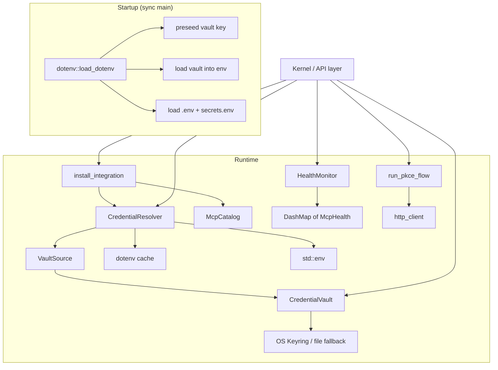

# Extensions & Credentials

# Extensions & Credentials Module

The `librefang-extensions` crate provides the credential management layer, MCP server catalog, OAuth2 flows, health monitoring, and installation logic for LibreFang. It sits between the type definitions in `librefang-types` and the kernel/API layer that drives it at runtime.

## Architecture Overview



---

## Credential Vault (`vault.rs`)

AES-256-GCM encrypted secret storage at `~/.librefang/vault.enc`. The vault holds API keys, OAuth tokens, and other secrets that must survive process restarts in encrypted form.

### Master Key Resolution

`CredentialVault::resolve_master_key()` tries sources in order:

1. **Cached key** — if the vault instance was previously unlocked or initialized, the key is reused from memory.
2. **`LIBREFANG_VAULT_KEY` env var** — a base64-encoded 32-byte key. Takes precedence over the keyring so CI/headless deployments have a stable source of truth.
3. **OS keyring** — Windows Credential Manager, macOS Keychain, or Linux Secret Service via the `keyring` crate.
4. **File fallback** — `<data_local_dir>/librefang/.keyring` (mode 0600), AES-256-GCM wrapped with an Argon2id-derived machine-fingerprint key. Used automatically when the OS keyring is unavailable or disabled.

The `LIBREFANG_VAULT_NO_KEYRING` env var forces the file fallback regardless of platform. On macOS the file fallback is the default because the Keychain ACL is per-binary-signature (every `cargo build` invalidates it).

### On-Disk Format

The vault file is a TOML-serialised `VaultFile` struct containing:

| Field | Description |
|-------|-------------|
| `version` | File format version (always `1`) |
| `salt` | Argon2 salt, base64-encoded |
| `nonce` | AES-256-GCM 12-byte nonce, base64-encoded |
| `ciphertext` | Encrypted `VaultEntries` JSON, base64-encoded |
| `schema_version` | AAD schema version; `0` = legacy path-only, `1` = schema version bytes + path bytes |

The Additional Authenticated Data (AAD) binds the ciphertext to the vault file path, preventing an attacker from swapping `vault.enc` with a different file that decrypts under the same key. Legacy vaults (`schema_version: 0`) use path-only AAD for backward compatibility.

### Startup Sentinel (#3651)

Every vault contains a reserved key `__sentinel__` with the plaintext value `librefang-vault-sentinel-v1`. This sentinel is:

- Written during `init()` and `init_with_key()`.
- Verified on every `unlock()` via `verify_or_install_sentinel()` — backfilled on legacy vaults that predate the feature.
- Checked on daemon boot: a mismatch causes a `VaultKeyMismatch` error and the daemon refuses to start, preventing silent credential loss from a wrong `LIBREFANG_VAULT_KEY`.

External callers cannot write to or delete the sentinel key — `set()` and `remove()` reject it before any side effects.

### Key Operations

| Method | Description |
|--------|-------------|
| `init()` | Create a new vault, generate/store master key, write sentinel, verify round-trip |
| `unlock()` | Load and decrypt entries using the resolved master key |
| `get(key)` | Retrieve a secret (returns `Zeroizing<String>`) |
| `set(key, value)` | Store a secret; lazy-inits the vault on first write if needed |
| `remove(key)` | Delete a secret |
| `list_keys()` | List user-visible keys (sentinel filtered out) |
| `iter_all_entries()` | Iterate all keys including sentinel (for `rotate-key`) |
| `rewrap_with_new_key(key)` | Re-encrypt everything under a new master key |
| `verify_or_install_sentinel()` | Boot-path validation of the sentinel value |

### Thread Safety

The vault itself is not `Sync`. Long-lived callers (API request handlers) access it through `Arc<RwLock<CredentialVault>>` via `CredentialResolver::with_vault_handle()`. This avoids re-running the Argon2id KDF on every request.

---

## Credential Resolution (`credentials.rs`)

`CredentialResolver` provides a unified interface that tries multiple credential sources in priority order:

1. **Encrypted vault** (`~/.librefang/vault.enc`) — only if unlocked.
2. **Dotenv cache** — parsed from `~/.librefang/.env` at construction time.
3. **Process environment variable** — `std::env::var`.
4. **Interactive prompt** — CLI only, gated by `with_interactive(true)`.

### Vault Backing

The resolver holds the vault through `VaultSource`, which is either:

- `VaultSource::Owned(CredentialVault)` — for short-lived CLI subcommands and tests, where there's no shared kernel cache.
- `VaultSource::Shared(Arc<RwLock<CredentialVault>>)` — for the API layer, routing through the kernel's cached vault handle to avoid repeated Argon2id unlocks.

Construct with `CredentialResolver::new()` for owned, or `CredentialResolver::with_vault_handle()` for shared.

### Key Methods

| Method | Description |
|--------|-------------|
| `resolve(key)` | Try all sources, return first hit as `Zeroizing<String>` |
| `has_credential(key)` | Non-prompting availability check |
| `resolve_all(keys)` | Bulk resolution, returns a `HashMap` |
| `missing_credentials(keys)` | Returns keys with no source available |
| `store_in_vault(key, value)` | Write to the backing vault |
| `clear_dotenv_cache(key)` | Evict a stale entry from the boot-time snapshot |

---

## Dotenv Loader (`dotenv.rs`)

Called once from synchronous `main()` **before** spawning the tokio runtime. The `load_dotenv()` function is gated by a `Once` guard so repeated calls are no-ops.

### Loading Order

```
1. preseed_vault_key_from(~/.librefang/.env)        — only LIBREFANG_VAULT_KEY
2. preseed_vault_key_from(~/.librefang/secrets.env)  — only LIBREFANG_VAULT_KEY
3. load_vault()                                       — inject vault secrets into std::env
4. load_env_file(~/.librefang/.env)                   — remaining keys
5. load_env_file(~/.librefang/secrets.env)            — remaining keys
```

The vault key must be pre-seeded before `load_vault()` because the vault's `resolve_master_key()` reads `LIBREFANG_VAULT_KEY` directly from `std::env`. Without pre-seeding, the vault silently fails to unlock and all vault-stored credentials become unavailable for the process lifetime (#5139).

**Existing environment variables are never overridden** — system env always wins.

### Atomic File Writes

`write_env_file()` uses an atomic write pattern to prevent data loss:

1. Create `<path>.tmp.<pid>` with mode 0600 (Unix) via `create_new(true)`.
2. `write_all` + `flush` + `sync_all`.
3. `rename(tmp, final)`.

This prevents crash-mid-write truncation, closes a TOCTOU permissions window, and avoids concurrent-save collisions.

### Escape Handling

Values containing special characters are double-quoted with escape sequences (`\\`, `\n`, `\r`, `\"`). Single-quoted values are treated as literal. The escape ordering processes backslash first to avoid double-decoding bugs (#3790).

### Key Management Functions

| Function | Description |
|----------|-------------|
| `save_env_key(key, value)` | Upsert a key in `.env`, set in process env |
| `remove_env_key(key)` | Remove a key from `.env` and process env |
| `list_env_keys()` | List key names (no values) from `.env` |
| `env_file_exists()` | Check if `.env` file is present |

---

## MCP Catalog (`catalog.rs`)

Read-only in-memory view of MCP server templates cached at `~/.librefang/mcp/catalog/`. Templates are refreshed from the upstream `librefang-registry` by `librefang_runtime::registry_sync`. The catalog is **not** the user's installed servers — those live in `config.toml` under `[[mcp_servers]]`.

### File Layout

Two valid layouts per template:

- **Flat**: `<id>.toml` — ID derived from filename minus extension.
- **Directory**: `<id>/MCP.toml` — ID derived from directory name. Used for multi-file MCP packages.

`McpCatalog::load()` performs a full reload: it clears the in-memory map first so deleted/renamed entries on disk don't linger.

### Query Methods

| Method | Description |
|--------|-------------|
| `get(id)` | Look up by exact ID |
| `list()` | All entries sorted by ID |
| `list_by_category(cat)` | Filter by `McpCategory` |
| `search(query)` | Case-insensitive match against ID, name, description, tags |

---

## Installer (`installer.rs`)

Pure transforms from catalog entries to `McpServerConfigEntry` values. **No side effects** — callers (API, CLI) decide when to persist the result to `config.toml`.

### `install_integration()` Flow

1. Look up the catalog template by ID.
2. Store any provided credentials in the vault (best effort — failures are logged, not fatal).
3. Check which required env vars still have no credential source.
4. Map the template's transport and required env into a `McpServerConfigEntry`.
5. Return an `InstallResult` with status (`Ready` or `Setup` if credentials are missing).

The resulting `McpServerConfigEntry` has `template_id` set so the dashboard can trace it back to its catalog origin.

### Scaffolding

- `scaffold_integration(dir)` — writes a starter `mcp.toml` template for custom MCP servers.
- `scaffold_skill(dir)` — writes `skill.toml` + `SKILL.md` for prompt-only skills.

### Error Bridge

`InstallResult` and `ExtensionError` implement `From` for `librefang_types::integration::{IntegrationOutcome, IntegrationError}`. This lets the kernel's HTTP layer `.map(Into::into)` cleanly while mocks and alternate kernels construct the type directly.

---

## Health Monitor (`health.rs`)

Tracks the operational status of configured MCP servers with auto-reconnect support. State is held in a `DashMap<String, McpHealth>` for lock-free concurrent access from background health-check tasks.

### `McpHealth` Fields

| Field | Description |
|-------|-------------|
| `id` | MCP server ID (matches `McpServerConfigEntry.name`) |
| `status` | `Available`, `Ready`, or `Error(msg)` |
| `tool_count` | Number of tools the server exposes |
| `last_ok` | Timestamp of last successful check |
| `consecutive_failures` | Running error count, reset on success |
| `reconnecting` | Whether a reconnect attempt is in flight |
| `reconnect_attempts` | Total reconnect tries for this incident |

### Auto-Reconnect

When `should_reconnect(id)` returns true (server is in `Error` state, under max attempts, and auto-reconnect is enabled), the background task triggers reconnection with exponential backoff:

```
5s → 10s → 20s → 40s → 80s → 160s → 300s (capped) → ...
```

Max 10 attempts by default (`HealthMonitorConfig::max_reconnect_attempts`).

### Key Methods

| Method | Description |
|--------|-------------|
| `register(id)` / `unregister(id)` | Add/remove servers from monitoring |
| `report_ok(id, tool_count)` | Mark healthy |
| `report_error(id, error)` | Record failure |
| `should_reconnect(id)` | Check if reconnect should be attempted |
| `backoff_duration(attempt)` | Calculate exponential backoff |
| `health_map()` | Get the `Arc<DashMap>` for background tasks |

---

## OAuth (`oauth.rs`)

Implements OAuth2 Authorization Code + PKCE flows for Google, GitHub, Microsoft, and Slack. The flow:

1. Binds a temporary localhost HTTP server on a random port.
2. Opens the browser to the provider's authorization URL.
3. Receives the callback with an authorization code.
4. Exchanges the code for tokens via the provider's token endpoint.

### State Token Security (#3791)

The `state` parameter is an HMAC-signed token binding the flow to a specific `(provider, client_id, redirect_uri)` tuple with a random nonce and 10-minute expiry. The HMAC key is per-process (`OnceLock` + `rand::random`), so daemon restarts invalidate any in-flight flows.

Verification rejects:
- Bad HMAC / truncated signature
- Expired payloads
- Provider, client_id, or redirect_uri mismatches
- Nonce mismatches (redundant with HMAC, defense-in-depth)

Only the first valid callback wins; subsequent hits to the same listener are rejected as already-redeemed.

### Client ID Resolution

Default client IDs are embedded (safe for public PKCE flows — no client secret). Users can override per-provider via `OAuthConfig` fields (`google_client_id`, etc.) resolved by `resolve_client_ids()`.

---

## HTTP Client (`http_client.rs`)

Shared `reqwest::ClientBuilder` with:

- **CA root fallback**: tries native system certs first, falls back to `webpki-roots` if none are found.
- **Timeouts**: 10s connect, 30s read — prevents hung requests and SSRF amplification.
- **Redirect limit**: 5 hops max.
- **rustls**: uses `aws_lc_rs` crypto provider with safe default protocol versions.

Use `client_builder()` for custom configuration or `new_client()` for the default built client.

---

## Error Handling (`lib.rs`)

`ExtensionError` is the crate-level error enum with variants for all subsystems. It implements `From<ExtensionError>` for `librefang_types::integration::IntegrationError`, preserving discriminants the API layer uses for HTTP status codes (`NotFound` → 404, vault family → 500 with descriptive message, everything else → `Other`).

Key variants:

| Variant | When |
|---------|------|
| `NotFound(id)` | Catalog entry doesn't exist |
| `AlreadyInstalled(id)` | Duplicate install attempt |
| `CredentialNotFound(key)` | Required credential unavailable |
| `Vault(msg)` | Generic vault error |
| `VaultLocked` | Attempted operation on locked vault |
| `VaultKeyMismatch { hint }` | Sentinel verification failed — daemon refuses to start |
| `OAuth(msg)` | PKCE flow failure |

---

## Integration with the Rest of the Codebase

**Startup sequence** — `dotenv::load_dotenv()` is called from synchronous `main()` in `librefang-desktop` before any async runtime. It seeds the vault key, unlocks the vault, and injects all secrets into `std::env`.

**Daemon boot** — `run_daemon` in `librefang-api` calls `resolve_dashboard_credential` which calls `vault.unlock()` and `vault.get()` to check if dashboard auth is configured.

**Request auth** — Terminal routes (`delete_window`, `rename_window`) flow through `authorize_terminal_request` → `valid_api_tokens` → `dashboard_session_token` → `resolve_dashboard_credential` → `vault.get()`.

**MCP installation** — The API layer calls `install_integration()` with a `McpCatalog` and `CredentialResolver`, then persists the returned `McpServerConfigEntry` to `config.toml`.

**Init wizard** — The TUI's `init_wizard::run` calls `dotenv::save_env_key()` to persist user-provided API keys.