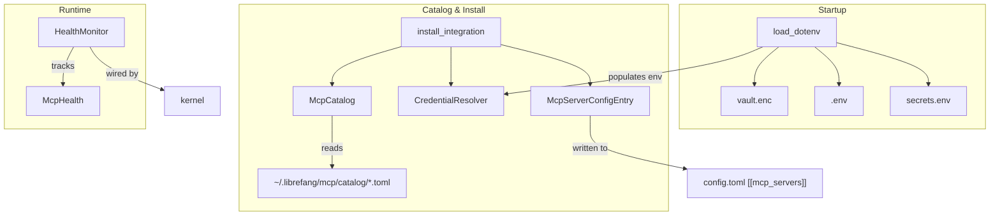

# Extensions & Hands — librefang-extensions-src

# LibreFang Extensions (`librefang-extensions`)

The extensions crate is the infrastructure layer that sits between LibreFang's configuration system and the outside world. It handles everything related to MCP server templates, credential storage, environment variable loading, and runtime health tracking.

## Architecture Overview



## Module Layout

| Module | Visibility | Purpose |
|--------|-----------|---------|
| `catalog` | `pub` | In-memory index of MCP server templates loaded from disk |
| `credentials` | `pub` | Resolves secrets from env, vault, or keyring |
| `dotenv` | `pub` | Loads `.env`/`secrets.env`/vault into process environment |
| `health` | `pub` | Tracks MCP server health with auto-reconnect backoff |
| `installer` | `pub` | Pure transform: catalog entry → `McpServerConfigEntry` |
| `oauth` | `pub` | OAuth2 PKCE localhost callback flows |
| `vault` | `pub` | AES-256-GCM encrypted credential storage |
| `http_client` | `pub(crate)` | Shared HTTP client internals |

## Core Types

### `McpCatalogEntry`

The central data structure. Each TOML file in the catalog directory deserializes into one of these. Key fields:

- **`id`** — unique slug like `"github"`, `"slack"`
- **`transport`** — how to launch the server (`Stdio`, `Sse`, or `Http` via `McpCatalogTransport`)
- **`required_env`** — list of `McpCatalogRequiredEnv` structs declaring what credentials the server needs
- **`oauth`** — optional `OAuthTemplate` for providers that use OAuth2 instead of API keys
- **`health_check`** — `HealthCheckConfig` with `interval_secs` and `unhealthy_threshold`
- **`template_id`** — on the *installed* `McpServerConfigEntry`, this field records which catalog entry it came from

The catalog transport enum (`McpCatalogTransport`) intentionally omits the `HttpCompat` variant that exists on `McpTransportEntry` in `librefang_types`. `HttpCompat` is a power-user transport that doesn't ship as a template.

### `McpStatus`

The lifecycle states an MCP server can be in:

| State | Meaning |
|-------|---------|
| `Ready` | Configured, credentials present, server running |
| `Setup` | Configured but credentials are missing |
| `Available` | Exists in catalog only — not yet installed |
| `Error(String)` | Server errored |
| `Disabled` | User disabled it |

### `ExtensionError`

All fallible operations return `ExtensionResult<T>` which is `Result<T, ExtensionError>`. Variants cover catalog lookups (`NotFound`, `AlreadyInstalled`, `NotInstalled`), credential issues (`CredentialNotFound`, `VaultLocked`), I/O, HTTP, TOML parsing, and health checks.

## MCP Catalog (`catalog`)

`McpCatalog` is the read-only index of all template TOML files under `~/.librefang/mcp/catalog/`. It's refreshed from the upstream registry by `librefang_runtime::registry_sync` — this crate never writes to the catalog directory.

### Directory layout

Two layouts are supported:

```
catalog/
  github.toml          # (A) flat file — id from filename
  slack/
    MCP.toml           # (B) directory-backed — id from directory name
```

### Loading

```rust
let mut catalog = McpCatalog::new(&home_dir);
let count = catalog.load(&home_dir);
```

`load()` performs a full reload — it clears the internal `HashMap` first so deleted files don't linger. It returns the count of entries loaded.

### Querying

- **`get(id)`** — look up a single entry by ID
- **`list()`** — all entries sorted by ID
- **`list_by_category(&McpCategory)`** — filter by category
- **`search(query)`** — case-insensitive search across `id`, `name`, `description`, and `tags`

## Installer (`installer`)

The installer is a **pure transform** — it has no side effects on disk. Callers (the CLI's `cmd_mcp_add`, the API's `install_extension` and `add_mcp_server`) decide when to persist the results.

### `install_integration`

```rust
pub fn install_integration(
    catalog: &McpCatalog,
    resolver: &mut CredentialResolver,
    id: &str,
    provided_keys: &HashMap<String, String>,
) -> ExtensionResult<InstallResult>
```

The flow:

1. Look up the catalog template by `id`
2. Store any `provided_keys` into the vault (best-effort — failures are logged but don't block installation)
3. Check which `required_env` vars still have no credential (checking both vault and process environment)
4. Convert the template into a `McpServerConfigEntry` via `catalog_entry_to_mcp_server`
5. Return an `InstallResult` with the final `McpStatus` (`Ready` if all creds present, `Setup` if missing) and a user-facing message

The returned `InstallResult` contains:
- `server` — the `McpServerConfigEntry` to persist in `config.toml`
- `status` — current readiness
- `missing_credentials` — env var names still needed
- `message` — human-readable summary

### Transport mapping

`catalog_entry_to_mcp_server` converts `McpCatalogTransport` to `McpTransportEntry` one-to-one (Stdio→Stdio, Sse→Sse, Http→Http). The resulting config entry gets `template_id` set so the dashboard can trace it back to the catalog.

### Scaffolding

Two helper functions generate template files for users creating custom integrations:

- **`scaffold_integration(dir)`** — writes a `mcp.toml` template into the given directory
- **`scaffold_skill(dir)`** — writes `skill.toml` + `SKILL.md` for a new prompt-only skill

These are called from the CLI's `cmd_scaffold`.

## Health Monitor (`health`)

`HealthMonitor` tracks the runtime status of all configured MCP servers using a `DashMap<String, McpHealth>` for lock-free concurrent access from background tasks.

### `McpHealth`

Per-server record with:
- `status`, `tool_count`, `last_ok`, `last_error`
- `consecutive_failures` — reset to 0 on success
- `reconnecting`, `reconnect_attempts` — set during auto-reconnect
- `connected_since` — timestamp of last successful connect

State transitions happen through methods:
- `mark_ok(tool_count)` — sets `Ready`, clears failures, sets `connected_since` on first success
- `mark_error(error)` — sets `Error(error)`, increments `consecutive_failures`, clears `connected_since`
- `mark_reconnecting()` — sets `reconnecting = true`, increments `reconnect_attempts`

### Auto-reconnect backoff

The exponential backoff formula:

```
backoff = 5 * 2^attempt seconds, capped at max_backoff_secs (default 300s)
```

| Attempt | Delay |
|---------|-------|
| 0 | 5s |
| 1 | 10s |
| 2 | 20s |
| 3 | 40s |
| ... | ... |
| 6+ | 300s (capped) |

Reconnection is attempted up to `max_reconnect_attempts` (default 10). After that, `should_reconnect()` returns `false` and the server stays in `Error` until manually restarted.

### `HealthMonitorConfig`

| Field | Default | Description |
|-------|---------|-------------|
| `auto_reconnect` | `true` | Enable automatic reconnection |
| `max_reconnect_attempts` | `10` | Give up after this many attempts |
| `max_backoff_secs` | `300` | Cap on exponential backoff |
| `check_interval_secs` | `60` | Base health check interval |

## Dotenv (`dotenv`)

Loads secrets into the process environment at startup. Called from `main()` in both `librefang-cli` and `librefang-desktop` **before** spawning the tokio runtime, because `std::env::set_var` is undefined behavior once other threads exist (Rust 1.80+).

### Priority order (highest to lowest)

1. System environment variables (already present in `std::env`) — **never overridden**
2. Credential vault (`vault.enc`) secrets
3. `~/.librefang/.env`
4. `~/.librefang/secrets.env`

### `load_dotenv()`

Idempotent — gated by `Once` so repeated calls are no-ops. The sequence:

1. Try to unlock `~/.librefang/vault.enc` and inject its keys into the process environment
2. Parse `~/.librefang/.env` (skipping comments and blank lines)
3. Parse `~/.librefang/secrets.env`

At each step, keys that already exist in the environment are left untouched.

### File management functions

- **`save_env_key(key, value)`** — upsert into `.env`, set 0600 permissions on Unix, also sets in current process
- **`remove_env_key(key)`** — remove from `.env` and from process env
- **`list_env_keys()`** — list key names (without values) from `.env`

The `.env` file format supports `KEY=VALUE`, `KEY="quoted value"`, and `KEY='single quoted'`. Lines starting with `#` are comments.

## Integration Points

### From the CLI

The CLI calls into extensions at several points:
- `main()` → `load_dotenv()` at startup
- `cmd_mcp_catalog` → `McpCatalog::load()` + `list()` / `search()`
- `cmd_mcp_add` → `McpCatalog::get()` + `install_integration()`
- `cmd_scaffold` → `scaffold_integration()` / `scaffold_skill()`
- `cmd_config_set_key` / `cmd_config_delete_key` → `save_env_key()` / `remove_env_key()`
- `cmd_channel_setup` → `save_env_key()`
- `cmd_doctor` → `McpCatalog::load()`

### From the API / Web UI

- `install_extension` / `add_mcp_server` → `McpCatalog::load()` + `install_integration()`
- `list_extensions` / `get_extension` / `status_str_for_catalog` → `HealthMonitor::get_health()`

### From the Desktop App

- `main()` → `load_dotenv()` at startup

### From the TUI

- `submit_key` (free provider guide) → `save_env_key()`
- `run` (init wizard) → `save_env_key()`

## Adding a New Catalog Entry

To add a new MCP server template, create a TOML file at `~/.librefang/mcp/catalog/<id>.toml`:

```toml
id = "my-service"
name = "My Service"
description = "Integration with My Service"
category = "devtools"       # devtools, productivity, communication, data, cloud, ai
icon = "🔧"
tags = ["example", "custom"]

[transport]
type = "stdio"              # stdio, sse, or http
command = "npx"
args = ["-y", "my-service-mcp"]

[[required_env]]
name = "MY_SERVICE_API_KEY"
label = "API Key"
help = "Get your key at https://my.service/settings/api-keys"
is_secret = true
get_url = "https://my.service/settings/api-keys"

[health_check]
interval_secs = 60
unhealthy_threshold = 3

setup_instructions = """
1. Sign up at https://my.service
2. Generate an API key
3. Run: librefang mcp add my-service --key=<your-key>
"""
```

For OAuth-based integrations, add an `[oauth]` section with `provider`, `scopes`, `auth_url`, and `token_url`.