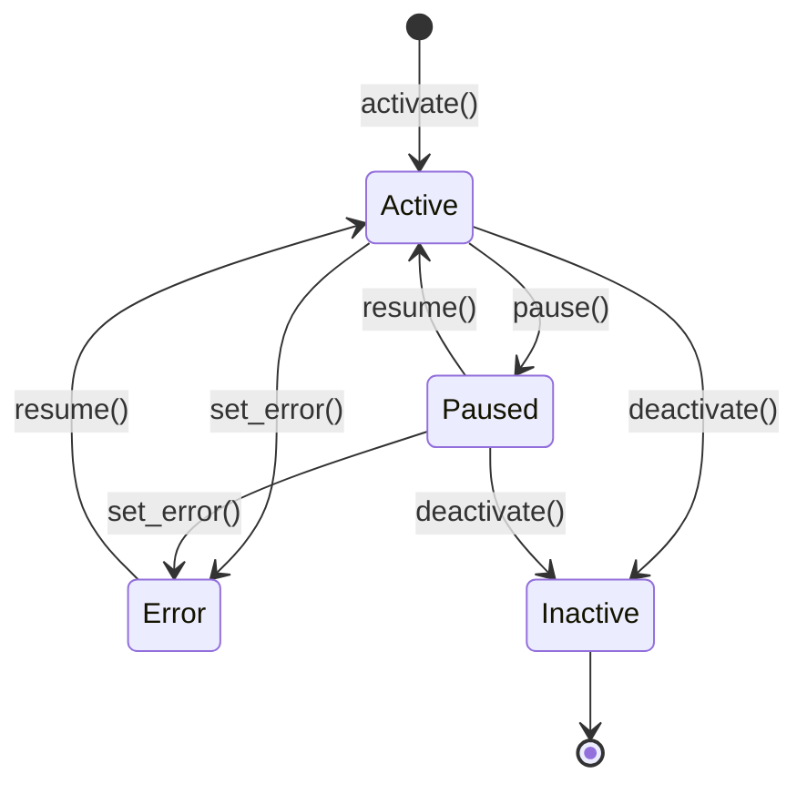

# Extensions & Hands — librefang-hands-src

# LibreFang Hands — Autonomous Capability Packages

## Overview

A **Hand** is a pre-built, domain-complete autonomous agent configuration that users activate from a marketplace. Unlike regular agents (which users chat with interactively), Hands work autonomously — users check in on them periodically.

This crate provides:
- **Type definitions** for hand definitions, instances, requirements, settings, and i18n
- **TOML parsing** with legacy format fallback and agent template inheritance
- **A concurrent-safe registry** (`HandRegistry`) that manages definitions and tracks active instances
- **Requirement checking** (binaries on PATH, environment variables, API keys)
- **State persistence** across daemon restarts

## Architecture

```mermaid
graph TD
    subgraph "HAND.toml (disk)"
        HT[HAND.toml]
        SKILL[SKILL.md]
        ASKILL[SKILL-{role}.md]
        BASE[agents/{template}/agent.toml]
    end

    subgraph "Core Types (lib.rs)"
        HD[HandDefinition]
        HAM[HandAgentManifest]
        HS[HandSetting]
        HR[HandRequirement]
        HI[HandInstance]
    end

    subgraph "Registry (registry.rs)"
        REG[HandRegistry]
        DEFS[definitions: DashMap]
        INST[instances: DashMap]
        AIDX[agent_index: DashMap]
        RIDX[active_index: DashMap]
    end

    HT -->|parse| HD
    SKILL -->|attach| HD
    ASKILL -->|attach per-role| HD
    BASE -->|deep merge| HAM
    HAM -->|keyed by role| HD
    HD -->|register| DEFS
    DEFS -->|activate| INST
    INST -->|reverse lookup| AIDX
    INST -->|hand_id → instance| RIDX
```

## Key Types

### `HandDefinition`

The complete specification of a hand, parsed from a `HAND.toml` file. Lives in the registry's `definitions` map.

Supports two agent layout formats:

| Format | TOML | Use case |
|--------|------|----------|
| **Single-agent** | `[agent]` section | Auto-converted to `agents: {"main": ...}` with `coordinator: true` |
| **Multi-agent** | `[agents.planner]`, `[agents.analyst]` | Each role gets its own `HandAgentManifest` |

The **coordinator** is the agent that receives user messages. Determined by:
1. An agent with `coordinator = true` explicitly set
2. Fallback: first agent by role name (BTreeMap ordering)

```rust
let def: HandDefinition = toml::from_str(toml_str)?;
let (role, agent) = def.coordinator().unwrap(); // ("main", &HandAgentManifest)
let manifest = def.agent().unwrap(); // shortcut to coordinator's AgentManifest
```

### `HandInstance`

A runtime record linking a `HandDefinition` to its spawned agents. Tracks status, config overrides, timestamps, and agent ID mappings.

```rust
let instance = HandInstance::new("clip", user_config, None);
let coord_id = instance.coordinator_agent_id(); // AgentId of coordinator
```

Instances support explicit UUID assignment (for daemon restart recovery) and timestamp preservation.

### `HandRequirement`

A prerequisite the user must satisfy before activating a hand. Types:

- `Binary` — a binary must exist on PATH
- `EnvVar` — an environment variable must be set
- `ApiKey` — an API key env var must be set
- `AnyEnvVar` — any one of several comma-separated env vars

Requirements can be marked `optional: true`. Optional requirements don't block activation, but an active hand with unmet optional requirements reports **degraded** status.

### `HandSetting`

A configurable control shown in the activation modal. Three types:

| Type | Behavior |
|------|----------|
| `Select` | Choose from `options` list; matched option's `provider_env` is collected |
| `Toggle` | Boolean on/off |
| `Text` | Freeform text; `env_var` field exposes it to the agent's subprocess |

Settings are resolved against user config via `resolve_settings()`, which produces:
- A `prompt_block` (markdown appended to the system prompt)
- A list of `env_vars` the agent subprocess needs

## TOML Parsing Pipeline

### Format Detection

The parser handles two TOML layouts:

1. **Flat format**: all fields at the document root
2. **Wrapped format**: fields under a `[hand]` section

The parser tries flat first, falls back to wrapped:

```
parse_hand_toml() → try flat → fail → extract [hand] sub-table → retry
```

### Legacy Agent Format

Older `HAND.toml` files place model fields (`provider`, `model`, `system_prompt`, `max_tokens`, `temperature`, `api_key_env`, `base_url`) at the top level of `[agent]`. The parser detects this via the presence of a `model` sub-table and auto-converts through `LegacyHandAgentConfig` → `AgentManifest`.

When `base` template resolution is active, `normalize_flat_to_nested()` restructures flat fields into a `[model]` sub-table before deep-merging, preventing orphaned fields.

### Base Template Inheritance

Agents in `[agents.*]` sections can reference a shared template via `base = "template-name"`:

```toml
[agents.writer]
coordinator = true
base = "my-writer"

[agents.writer.model]
system_prompt = "Override: you are a blog writer."
```

Resolution flow:
1. Load `{agents_dir}/{template_name}/agent.toml`
2. `normalize_flat_to_nested()` on the base template
3. `deep_merge_toml()` — overlay fields win, base fields preserved
4. Parse the merged result as `AgentManifest`

Template names are validated to prevent path traversal (no `/`, `\`, or `..`).

### Deep Merge Semantics

`deep_merge_toml(base, overlay)`:
- **Tables**: merged recursively
- **Scalars/arrays in overlay**: replace base values entirely
- **Keys only in base**: preserved
- **Keys only in overlay**: added

## HandRegistry

The central runtime store, built on `DashMap` for lock-free concurrent reads. All fields are `Send + Sync`.

### Internal Indexes

| Index | Key → Value | Purpose |
|-------|------------|---------|
| `definitions` | `hand_id` → `HandDefinition` | All known hand specs |
| `instances` | `instance_id` (Uuid) → `HandInstance` | All live instances |
| `agent_index` | `agent_id` (string) → `instance_id` | O(1) agent-to-hand lookup |
| `active_index` | `hand_id` → `instance_id` | O(1) "is hand active?" check |

### Activation Serialization

A `Mutex` (`activate_lock`) serializes the check-then-insert sequence to prevent two concurrent requests from both passing the "already active" guard.

When `instance_id` is `Some` (daemon restart recovery), the duplicate-active check is bypassed — the explicit UUID is treated as a multi-instance request.

### Instance Lifecycle



### Install Methods

| Method | Source | Disk persistence | Base templates |
|--------|--------|-----------------|----------------|
| `reload_from_disk()` | Scans `registry/hands/` + `workspaces/` | No (reads existing) | ✅ Resolved |
| `install_from_path()` | Directory with `HAND.tomL` | No (in-memory only) | ✅ Resolved |
| `install_from_content()` | Raw TOML + skill strings | No (in-memory only) | ❌ Rejected |
| `install_from_content_persisted()` | Raw TOML + skill strings | Yes (`workspaces/{id}/`) | ✅ Resolved |

`install_from_content()` rejects hands with `base` references because it has no filesystem access for template resolution. Use the persisted variant or `install_from_path()` instead.

### Uninstall Guards

`uninstall_hand()` refuses in three cases:

1. **`NotFound`** — hand ID not in registry
2. **`BuiltinHand`** — hand lives under `registry/hands/` (would be recreated on next sync). Detected by the absence of `workspaces/{id}/HAND.toml`.
3. **`AlreadyActive`** — hand has live instances. Deactivate first.

### State Persistence

`persist_state()` writes Active, Paused, and Error instances to `hand_state.json`. `load_state()` reads them back, handling four format versions:

| Version | Format | Notes |
|---------|--------|-------|
| v1 | Bare JSON array | `agent_id` as single value → converted to `{"main": id}` |
| v2 | `{"version": 2, "instances": [...]}` | Same single `agent_id` |
| v3 | `{"version": 3, "instances": [...]}` | `agent_ids` as map, `instance_id` added |
| v4 (current) | `{"version": 4, "instances": [...]}` | Full `PersistedInstance` with `activated_at`, `updated_at`, `coordinator_role` |

Errored and Inactive instances from persisted state are skipped during load (logged but not restored).

### Readiness

`readiness()` computes a `HandReadiness` snapshot:

- **`requirements_met`**: all *non-optional* requirements satisfied
- **`active`**: at least one Active-status instance exists
- **`degraded`**: active but any requirement (including optional) is unmet

```rust
let readiness = registry.readiness("browser");
// HandReadiness { requirements_met: false, active: true, degraded: true }
```

## Requirement Checking

### Binary Detection

`which_binary()` scans PATH segments, checking for the file with platform-appropriate extensions (`.exe`, `.cmd`, `.bat` on Windows). On Unix, verifies the execute bit. Empty PATH segments are treated as the current directory (POSIX convention).

Special cases:
- **`python3`**: runs `python3 --version` / `python --version` and checks for "Python 3" in output. Results are cached via `OnceLock` for the process lifetime. This avoids false positives from Windows Store shims.
- **`chromium`**: falls back to `chromium-browser`, `google-chrome`, `google-chrome-stable`, `chrome`, and `CHROME_PATH` env var.

### Environment Variable Aliases

`env_aliases()` maps known aliases for requirement checking. Currently supports `GEMINI_API_KEY` also accepting `GOOGLE_API_KEY`.

### Settings Availability

`check_settings_availability()` returns per-option availability based on:
- `provider_env` (with alias expansion) being set and non-empty
- `binary` being found on PATH
- Neither set → always available

## I18n

Hands support optional localized strings keyed by language code:

```toml
[i18n.zh]
name = "线索生成"
description = "自主线索生成"

[i18n.zh.agents.main]
name = "主协调器"

[i18n.zh.settings.target_industry]
label = "目标行业"
description = "聚焦的行业领域"
```

All i18n fields are optional — missing translations fall back to English defaults. `check_settings_availability()` accepts a `lang` parameter and returns translated labels/descriptions when available.

## Default Provider/Model Sentinel

When a `HAND.toml` omits `provider` or `model`, the defaults are the string `"default"` — not a concrete provider name. The kernel resolves this sentinel to the user's configured `default_model.provider` at driver-build time. This ensures hands respect global user configuration rather than being pinned to whatever the hand author specified.

## File Layout

A hand on disk consists of:

```
workspaces/{hand_id}/
├── HAND.toml              # Required: hand definition
├── SKILL.md               # Optional: shared skill content (all agents)
├── SKILL-{role}.md        # Optional: per-agent skill override
└── ...
```

Registry hands live under `registry/hands/{id}/` with the same structure. Both locations are scanned on `reload_from_disk()`, with registry entries taking precedence on ID collisions.