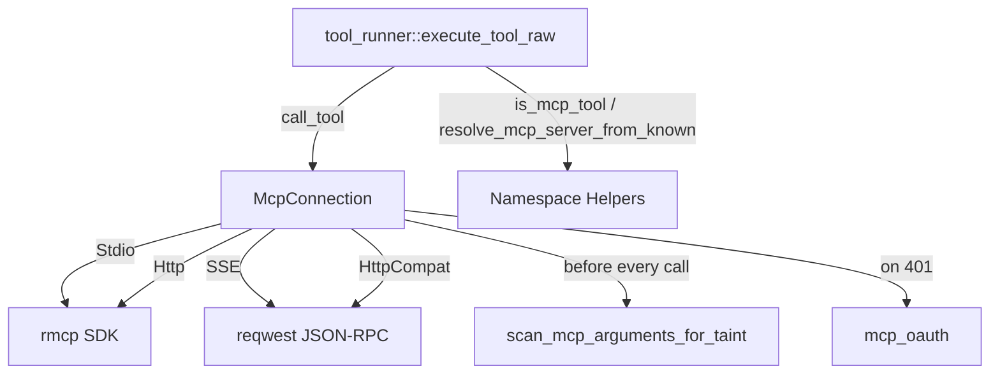

# Extensions & Hands — librefang-runtime-mcp-src

# librefang-runtime-mcp — MCP Client

## Purpose

This crate implements the Model Context Protocol (MCP) client layer. It connects to external MCP servers, discovers the tools they expose, and executes tool calls on behalf of the agent runtime — all behind a security envelope that taint-scans outbound arguments and sandboxes subprocess environments.

Every tool discovered from an MCP server is namespaced as `mcp_{server}_{tool}` so tools from different servers never collide in the agent's tool table.

## Architecture



## Transport Types

`McpTransport` is a tagged enum with four variants:

| Variant | Protocol | Handshake | Tool Discovery |
|---|---|---|---|
| `Stdio` | Subprocess stdin/stdout via rmcp SDK | rmcp automatic | `client.list_all_tools()` |
| `Sse` | HTTP POST + JSON-RPC 2.0 | Manual `initialize` / `notifications/initialized` | Manual `tools/list` |
| `Http` | Streamable HTTP (MCP 2025-03-26+) via rmcp SDK | rmcp automatic | `client.list_all_tools()` |
| `HttpCompat` | Plain HTTP adapter (GET/POST/PUT/PATCH/DELETE) | Probe GET on base URL | Statically declared in config |

**Stdio** and **Http** both use the `rmcp` SDK and share the same `DynRmcpClient` inner type. **Sse** manages JSON-RPC itself with a `reqwest::Client`. **HttpCompat** is a built-in adapter that translates tool calls into plain HTTP requests against a configurable backend.

## Connection Lifecycle

`McpConnection::connect(config)` is the single entry point. It:

1. Dispatches to the transport-specific `connect_*` method.
2. Performs SSRF validation on any URL-based transport (`check_ssrf`).
3. Completes the MCP handshake and discovers tools.
4. Registers every discovered tool under its namespaced name via `register_tool`.
5. Returns a fully initialized `McpConnection`.

For **Streamable HTTP**, if the server responds with a 401 and has OAuth metadata, the connection returns the sentinel error `"OAUTH_NEEDS_AUTH"`. The API layer then drives the PKCE flow before retrying.

## Security

### Outbound Taint Scanning

Before every `call_tool`, the arguments tree is walked by `scan_mcp_arguments_for_taint`. This is a best-effort pattern-matching filter — not a full information-flow tracker.

The scanner runs two checks on every leaf:

1. **Value heuristic** — `check_outbound_text_violation` from `librefang_types::taint` tests each string leaf against the denylist for credential/PII patterns.
2. **Key-name blocklist** — `MCP_SENSITIVE_KEY_NAMES` lists object keys (`authorization`, `api_key`, `secret`, `password`, etc.) that are treated as credential-shaped regardless of the value's appearance. This catches patterns like `{"Authorization": "Bearer sk-…"}` that the text heuristic alone would miss.

Violations produce a redacted error containing only the JSON path — never the offending payload itself, since the error flows back to the LLM and into logs.

Recursion is hard-capped at `MCP_TAINT_SCAN_MAX_DEPTH` (64).

`McpServerConfig::taint_scanning` can be set to `false` to disable the value heuristic for trusted local servers (browser automation, database adapters). Key-name blocking remains active regardless.

### Subprocess Sandboxing (Stdio)

- **No shell interpreters** — the command is checked against `BLOCKED_SHELLS` (bash, sh, zsh, powershell, etc.). MCP servers must use a specific runtime (`npx`, `node`, `python`).
- **No path traversal** — commands containing `..` are rejected.
- **Minimal environment** — the subprocess does not inherit the parent environment. Only variables in `SAFE_ENV_VARS` (PATH, HOME, language/runtime essentials) plus explicitly declared `env` entries from config are passed through.
- **Environment expansion** — `$VAR` and `${VAR}` references in args are expanded via `expand_env_vars` so templates can reference `$HOME` without needing a shell wrapper.

### SSRF Protection

`check_ssrf` rejects URLs targeting cloud metadata endpoints (`169.254.169.254`, `metadata.google`).

## Tool Namespacing

All MCP tools are prefixed to prevent collisions across servers:

```
server "github", tool "create_issue" → "mcp_github_create_issue"
server "my-server", tool "do_thing"  → "mcp_my_server_do_thing"
```

Key functions:

- **`format_mcp_tool_name(server, tool)`** — produces the namespaced name. Hyphens in server/tool names are replaced with underscores.
- **`is_mcp_tool(name)`** — checks for the `mcp_` prefix.
- **`resolve_mcp_server_from_known(tool_name, server_names)`** — given a namespaced tool name and the set of configured server names, returns the matching server. This is the robust variant that handles multi-segment server names correctly by preferring the longest prefix match.
- **`extract_mcp_server(tool_name)`** — lightweight heuristic that splits on the first underscore after `mcp_`. Only reliable for single-word server names.

`call_tool` accepts either the namespaced name or the raw tool name (it tries `original_names` lookup first, then strips the prefix).

## HttpCompat Adapter

The `HttpCompat` transport adapts non-MCP HTTP backends into the tool interface. It is configured declaratively:

- **`tools`** — each tool declares a `path` (with `{param}` placeholders), HTTP `method`, `request_mode` (json body / query / none), and `response_mode` (text / json).
- **`headers`** — static values or values loaded from environment variables (`value_env`).
- **Path rendering** — `{param}` placeholders in the tool path are substituted from arguments and percent-encoded via `encode_http_compat_path_value`. Used parameters are removed from the remaining arguments.
- **Config validation** — `validate_http_compat_config` runs at connect time to catch empty names, missing paths, and headers with neither `value` nor `value_env`.

## OAuth

The `mcp_oauth` submodule handles OAuth 2.0 + PKCE for Streamable HTTP servers that require authentication. When `connect_streamable_http` hits a 401, it:

1. Extracts the `WWW-Authenticate` header from the rmcp error chain via `extract_auth_header_from_error`.
2. Calls `discover_oauth_metadata` for three-tier resolution (WWW-Authenticate → `.well-known` → config fallback).
3. Returns `"OAUTH_NEEDS_AUTH"` to signal the API layer to drive the browser-based PKCE flow.

Cached tokens are injected as `Authorization: Bearer` headers on subsequent connections via the `oauth_provider`'s `load_token` method.

## Key Types Reference

| Type | Role |
|---|---|
| `McpServerConfig` | Connection configuration (name, transport, timeout, env, headers, taint_scanning, oauth) |
| `McpTransport` | Tagged enum: `Stdio`, `Sse`, `Http`, `HttpCompat` |
| `McpConnection` | Active connection — holds config, discovered tools, namespace map, and transport handle |
| `McpInner` | Private enum wrapping the transport-specific handle (`DynRmcpClient` or `reqwest::Client`) |
| `JsonRpcRequest` / `JsonRpcResponse` | JSON-RPC 2.0 types used only by the SSE transport |

## Integration Points

The runtime calls into this crate from `librefang-runtime/src/tool_runner.rs`:

- **`execute_tool_raw`** calls `is_mcp_tool` to decide if a tool name belongs to an MCP server, then `resolve_mcp_server_from_known` to find the right `McpConnection`, then `call_tool` to execute it.

Route handlers (`src/routes/agents.rs`) and the TUI event loop (`src/tui/event.rs`) also call `resolve_mcp_server_from_known` when mapping tool names to servers.