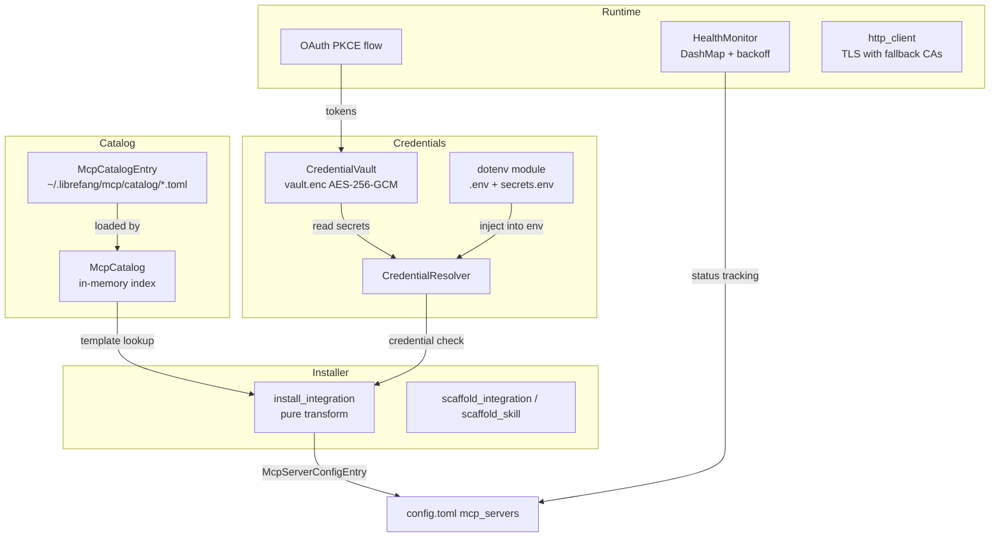
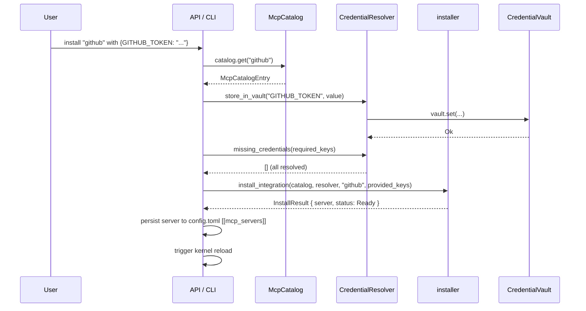

# Extensions & MCP — librefang-extensions-src

# librefang-extensions

MCP server lifecycle management: catalog browsing, credential storage, OAuth flows, health monitoring, and installation of MCP integrations into `config.toml`.

## Architecture



## Core Types (`lib.rs`)

The crate root defines the shared vocabulary used across all modules.

### `McpCatalogEntry`

A bundled MCP server template deserialized from TOML files under `~/.librefang/mcp/catalog/`. Each entry describes how to configure and launch an MCP server:

| Field | Purpose |
|---|---|
| `id` | Unique identifier (e.g., `"github"`) — also used as the filename key |
| `name` | Human-readable name (e.g., `"GitHub"`) |
| `category` | One of `DevTools`, `Productivity`, `Communication`, `Data`, `Cloud`, `AI` |
| `transport` | `McpCatalogTransport` — `Stdio { command, args }`, `Sse { url }`, or `Http { url }` |
| `required_env` | `Vec<McpCatalogRequiredEnv>` — env vars needed, with labels and help text |
| `oauth` | `Option<OAuthTemplate>` — present when the server uses OAuth instead of API keys |
| `health_check` | `HealthCheckConfig` — interval and failure threshold |

### `McpStatus`

Lifecycle state of a configured server:

- **`Available`** — exists in the catalog, not yet installed
- **`Setup`** — installed in `config.toml` but missing required credentials
- **`Ready`** — running and healthy
- **`Error(String)`** — failed health check or connection error
- **`Disabled`** — user-disabled

### `ExtensionError`

Unified error enum covering vault operations (`Vault`, `VaultLocked`), OAuth failures, TOML parse errors, HTTP errors, and not-found conditions. All fallible operations return `ExtensionResult<T> = Result<T, ExtensionError>`.

---

## Module Reference

### `catalog` — MCP Template Catalog

`McpCatalog` provides a read-only, in-memory index of all template TOML files under `~/.librefang/mcp/catalog/`. Templates are refreshed from the upstream registry by `librefang_runtime::registry_sync`; the catalog itself never writes to disk.

**Loading.** `McpCatalog::load(&mut self, home_dir)` performs a full reload — it clears the in-memory map and re-scans the catalog directory. Two directory layouts are supported:

- **Flat:** `<id>.toml` — ID derived from filename minus extension
- **Directory-backed:** `<id>/MCP.toml` — ID derived from directory name, for multi-file MCP packages

This mirrors the layout produced by the upstream `fetch-registry.ts` script so the catalog, live API, and UI agree on template identity.

**Querying:**

```rust
let mut catalog = McpCatalog::new(&home_dir);
catalog.load(&home_dir);

// By ID
let github = catalog.get("github"); // Option<&McpCatalogEntry>

// All entries, sorted by ID
let all = catalog.list(); // Vec<&McpCatalogEntry>

// By category
let devtools = catalog.list_by_category(&McpCategory::DevTools);

// Fuzzy search across id, name, description, and tags
let results = catalog.search("search");
```

Catalog entries are purely templates — the user's installed MCP servers live in `config.toml` under `[[mcp_servers]]` with an optional `template_id` pointing back to the catalog entry.

### `credentials` — Credential Resolution Chain

`CredentialResolver` tries multiple credential sources in strict priority order:

1. **Encrypted vault** (`vault.enc`) — if unlocked
2. **Dotenv file** (`~/.librefang/.env`) — boot-time snapshot
3. **Process environment variable** (`std::env::var`)
4. **Interactive prompt** — CLI only, when `with_interactive(true)` is set

All returned values are wrapped in `Zeroizing<String>` to minimize secret lifetime in memory.

```rust
let resolver = CredentialResolver::new(Some(vault), Some(dotenv_path))
    .with_interactive(true);

// Single credential
let token = resolver.resolve("GITHUB_TOKEN"); // Option<Zeroizing<String>>

// Batch resolution — returns only found keys
let creds = resolver.resolve_all(&["API_KEY", "API_SECRET"]);

// Pre-flight check — which keys are missing?
let missing = resolver.missing_credentials(&["API_KEY", "API_SECRET"]);
```

**Storing credentials.** `store_in_vault` writes a key-value pair to the vault (if configured). The vault is persisted immediately via AES-256-GCM encryption.

**Cache invalidation.** `clear_dotenv_cache(&mut self, key)` removes a key from the in-memory dotenv snapshot. Call this when a credential is deleted through the dashboard so the resolver doesn't return a stale boot-time value.

### `dotenv` — Process Environment Bootstrap

Shared environment loader used by the CLI, desktop app, and kernel. Must be called from synchronous `main()` **before** spawning any tokio runtime — `std::env::set_var` is UB in Rust 1.80+ once other threads exist.

`load_dotenv()` is guarded by a `Once` gate so repeated calls are no-ops.

**Priority order** (highest first — nothing overrides what's already set):

1. System environment variables (already present)
2. Credential vault (`vault.enc`) — auto-unlocked if available
3. `~/.librefang/.env`
4. `~/.librefang/secrets.env`

**File management helpers:**

| Function | Purpose |
|---|---|
| `save_env_key(key, value)` | Upsert into `.env`, set in process env, 0600 permissions on Unix |
| `remove_env_key(key)` | Delete from `.env` and process env |
| `list_env_keys()` | List key names (values omitted) |
| `env_file_exists()` | Check if `.env` is present |

### `vault` — Encrypted Credential Storage

AES-256-GCM encrypted file at `~/.librefang/vault.enc` with an `OFV1` magic header. The master key is resolved from:

1. **OS keyring** (macOS Keychain / Windows Credential Manager / Linux Secret Service) — stored as an AES-256-GCM wrapped blob keyed by a machine fingerprint (Argon2id-derived from username + hostname)
2. **`LIBREFANG_VAULT_KEY` env var** — base64-encoded 32-byte key, for headless/CI use

If neither source has a key, `init()` generates a random 32-byte key, attempts to store it in the OS keyring, and falls back to printing a warning with instructions to set the env var manually.

**On-disk format:** JSON (`VaultFile`) with base64-encoded salt, nonce, and ciphertext. The plaintext is a JSON map of string keys to string values. The encryption key is derived from the master key + per-save random salt via Argon2id.

```rust
let mut vault = CredentialVault::new(home.join("vault.enc"));

// First-time setup
vault.init()?; // or vault.init_with_key(explicit_key)?

// Unlock for use
vault.unlock()?;

// CRUD
vault.set("API_KEY".into(), Zeroizing::new("secret".into()))?;
let val = vault.get("API_KEY"); // Option<Zeroizing<String>>
vault.remove("API_KEY")?;
let keys = vault.list_keys(); // Vec<&str>
```

**Legacy compatibility:** Files without the `OFV1` magic header are treated as legacy JSON vaults and loaded normally.

**Keyring migration:** The file-based keyring fallback auto-migrates from a legacy XOR-obfuscated v1 format to the current AES-256-GCM wrapped v2 format on first successful load.

### `oauth` — OAuth2 PKCE Flows

Runs a complete Authorization Code flow with PKCE (S256) for providers like Google, GitHub, Microsoft, and Slack.

`run_pkce_flow(&OAuthTemplate, client_id)` performs the full flow:

1. Generates a PKCE verifier/challenge pair and a random CSRF state
2. Binds a temporary localhost TCP listener on a random port
3. Opens the browser to the authorization URL (falls back to printing the URL)
4. Serves an axum callback handler at `/callback` that validates the state parameter
5. Exchanges the authorization code for tokens via POST to the token endpoint
6. Returns `OAuthTokens` with access/refresh tokens

The callback server times out after 5 minutes. Client IDs default to placeholder values and should be overridden via `OAuthConfig` in the main config.

```rust
let tokens = run_pkce_flow(&template.oauth.unwrap(), &client_id).await?;
// Store in vault
vault.set("GOOGLE_ACCESS_TOKEN".into(), tokens.access_token_zeroizing())?;
```

### `health` — Health Monitoring & Auto-Reconnect

`HealthMonitor` tracks the status of all configured MCP servers using a `DashMap<String, McpHealth>` for lock-free concurrent access from background tasks.

**Health record fields:** `status`, `tool_count`, `last_ok` timestamp, `last_error`, `consecutive_failures`, `reconnecting` state, `reconnect_attempts`, `connected_since`.

**Backoff:** Exponential backoff starting at 5 seconds (5 → 10 → 20 → 40 → ...), capped at `max_backoff_secs` (default 300s). Reconnect is attempted up to `max_reconnect_attempts` (default 10) times before giving up.

```rust
let monitor = HealthMonitor::new(HealthMonitorConfig::default());

monitor.register("github");
monitor.report_ok("github", 12);   // marks Ready, records tool count
monitor.report_error("github", "Connection refused".into()); // increments failures

if monitor.should_reconnect("github") {
    let backoff = monitor.backoff_duration(entry.reconnect_attempts);
    monitor.mark_reconnecting("github");
    // schedule reconnect after backoff
}
```

### `installer` — Catalog-to-Config Transform

Pure functions that transform a catalog template into a `McpServerConfigEntry` suitable for persisting into `config.toml`. No side effects — callers decide when to write and reload.

`install_integration(catalog, resolver, id, provided_keys)`:

1. Looks up the catalog template by ID
2. Stores any provided credentials in the vault (best-effort)
3. Checks which required env vars are still missing
4. Returns `InstallResult` with the `McpServerConfigEntry`, final status (`Ready` or `Setup`), missing credentials list, and a user-facing message

The resulting `McpServerConfigEntry` has `template_id` set so the dashboard can trace it back to its catalog origin.

**Scaffolding:**

- `scaffold_integration(dir)` — writes a template `mcp.toml` with commented examples
- `scaffold_skill(dir)` — writes `skill.toml` + `SKILL.md` for a new prompt-only skill

### `http_client` — Shared TLS Client

Provides `client_builder()` and `new_client()` functions that build a `reqwest::Client` with:

- Native CA roots loaded via `rustls_native_certs`
- Fallback to `webpki_roots` bundled TLS roots if no native certs are found
- `aws_lc_rs` crypto backend for rustls

---

## Data Flow: Installing an MCP Server



## Configuration on Disk

```
~/.librefang/
├── config.toml              # [[mcp_servers]] with optional template_id
├── vault.enc                # AES-256-GCM encrypted secrets (OFV1 header)
├── .env                     # key=value secrets (0600 on Unix)
├── secrets.env              # additional secrets (lower priority)
└── mcp/
    └── catalog/
        ├── github.toml      # flat template
        ├── slack.toml
        └── filesystem/      # directory-backed template
            └── MCP.toml
```