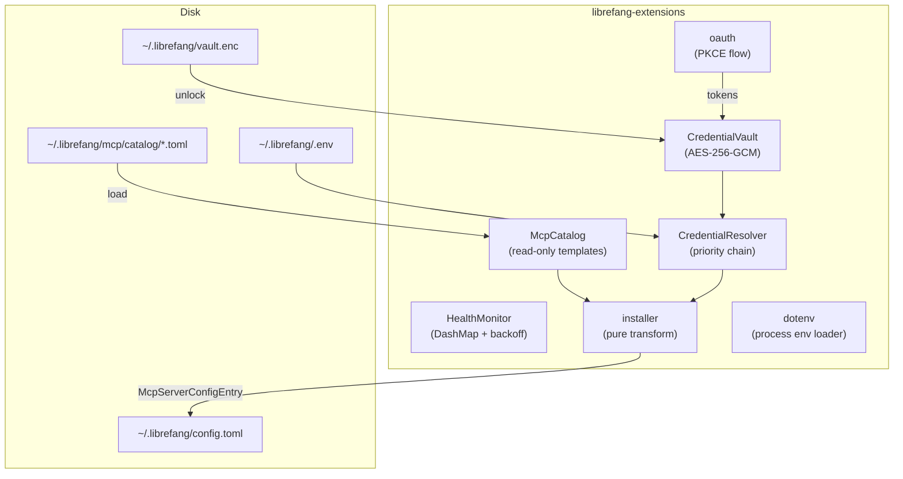

# Extensions & MCP — librefang-extensions-src

# librefang-extensions

MCP server lifecycle management: catalog templates, encrypted credential storage, OAuth2 PKCE flows, health monitoring, and installation transforms.

## Architecture



## Module Overview

| Module | Purpose |
|---|---|
| [`lib.rs`](#core-types) | Shared types: `McpCatalogEntry`, `McpStatus`, `McpCategory`, error enums |
| [`catalog`](#catalog) | In-memory index of MCP server templates from `~/.librefang/mcp/catalog/` |
| [`vault`](#credential-vault) | AES-256-GCM encrypted secret storage at `~/.librefang/vault.enc` |
| [`credentials`](#credential-resolution) | Priority-chain resolver: vault → dotenv → env → interactive prompt |
| [`dotenv`](#dotenv-loader) | Boot-time injection of vault secrets + `.env` files into `std::env` |
| [`health`](#health-monitor) | Per-server health tracking with exponential-backoff auto-reconnect |
| [`installer`](#installer) | Pure function: catalog entry + credentials → `McpServerConfigEntry` |
| [`oauth`](#oauth2-pkce) | Browser-based OAuth2 PKCE flows with localhost callback |
| [`http_client`](#http-client) | Shared `reqwest::Client` with native + bundled CA roots |

---

## Core Types

Defined in `lib.rs`. These are the data structures shared across the crate and consumed by `librefang-kernel`, `librefang-api`, and the CLI.

### `McpCatalogEntry`

A bundled MCP server template. Lives on disk as TOML under `~/.librefang/mcp/catalog/`.

Key fields:
- **`id`** — unique identifier (e.g. `"github"`)
- **`transport`** — `McpCatalogTransport` enum (`Stdio`, `Sse`, `Http`)
- **`required_env`** — list of `McpCatalogRequiredEnv` describing needed credentials
- **`oauth`** — optional `OAuthTemplate` for browser-based auth flows
- **`i18n`** — `HashMap<String, McpCatalogI18n>` keyed by BCP-47 tag, with optional overrides for `name`, `description`, and `setup_instructions`

Two valid on-disk layouts:
1. `<id>.toml` — flat file, id derived from filename
2. `<id>/MCP.toml` — directory-backed for multi-file MCP packages

### `McpStatus`

```rust
pub enum McpStatus {
    Ready,           // Configured and running
    Setup,           // Configured but credentials missing
    Available,       // Catalog entry only, not configured
    Error(String),   // MCP server errored
    Disabled,        // User-disabled
}
```

### `ExtensionError`

Unified error type covering vault, OAuth, IO, catalog lookup, and health check failures. All fallible operations in this crate return `ExtensionResult<T> = Result<T, ExtensionError>`.

---

## Catalog

`McpCatalog` is an in-memory, read-only view of all MCP server templates cached at `~/.librefang/mcp/catalog/`. Templates are refreshed from the upstream `librefang-registry` by `librefang_runtime::registry_sync`.

### Loading

```rust
let mut catalog = McpCatalog::new(&home_dir);
let count = catalog.load(&home_dir);
```

`load` performs a full reload — it clears the internal `HashMap` before scanning the directory, so deleted/renamed files don't linger. Two disk layouts are supported:

- **Flat:** `<id>.toml` → id from filename minus extension
- **Directory:** `<id>/MCP.toml` → id from directory name

Malformed TOML files are warned and skipped (never panic).

### Querying

| Method | Returns |
|---|---|
| `get(id)` | `Option<&McpCatalogEntry>` |
| `list()` | All entries sorted by id |
| `list_by_category(&McpCategory)` | Filtered entries |
| `search(query)` | Matches against id, name, description, tags (case-insensitive) |

The catalog is purely read-only. User-installed MCP servers live in `config.toml` under `[[mcp_servers]]` with an optional `template_id` pointing back into the catalog.

---

## Credential Vault

AES-256-GCM encrypted file at `~/.librefang/vault.enc`. Master key is sourced from (in order):

1. **OS keyring** — Windows Credential Manager, macOS Keychain, or Linux Secret Service (libsecret). Only available on glibc Linux, macOS, and Windows targets.
2. **File-based fallback** — AES-256-GCM wrapped key at `$LOCAL_DATA/librefang/.keyring`, derived from machine fingerprint via Argon2id. Used when OS keyring is unavailable (headless Linux, musl targets).
3. **Environment variable** — `LIBREFANG_VAULT_KEY` (base64-encoded 32-byte key), for CI/headless.

### File Format

On disk, the vault starts with a 4-byte magic header `OFV1`, followed by a JSON `VaultFile`:

```json
{
  "version": 1,
  "salt": "<base64>",
  "nonce": "<base64>",
  "ciphertext": "<base64>"
}
```

Encryption pipeline: `master_key` + `salt` → Argon2id → derived key → AES-256-GCM encrypt the serialized `VaultEntries` JSON.

Legacy vault files without the `OFV1` header (raw JSON starting with `{`) are still loadable for backwards compatibility.

### Key Operations

```rust
let mut vault = CredentialVault::new(path);

// Initialize new vault
vault.init()?;              // generates random key, stores in keyring
vault.init_with_key(key)?;  // explicit key (for testing)

// Unlock before use
vault.unlock()?;            // resolves key from keyring → env
vault.unlock_with_key(key)?; // explicit key

// Read/write
vault.set("API_KEY".into(), Zeroizing::new("secret".into()))?;
let val = vault.get("API_KEY");  // Option<Zeroizing<String>>
vault.remove("API_KEY")?;
let keys = vault.list_keys();    // Vec<&str>
```

### Keyring Migration

`load_keyring_key` detects legacy v1 XOR-obfuscated keyring files and automatically migrates them to v2 AES-256-GCM wrapped format on first successful load.

### Memory Safety

All secret values use `Zeroizing<String>` or `Zeroizing<[u8; 32]>` from the `zeroize` crate. `CredentialVault::drop` explicitly clears the entries map and cached key.

---

## Credential Resolution

`CredentialResolver` tries multiple sources in priority order:

```
1. CredentialVault (if unlocked)
2. ~/.librefang/.env file
3. Process environment variable
4. Interactive prompt (CLI only, when enabled)
```

### Usage

```rust
let resolver = CredentialResolver::new(
    Some(vault),
    Some(Path::new("~/.librefang/.env")),
).with_interactive(true);

// Resolve a single key
let api_key = resolver.resolve("GITHUB_TOKEN");

// Check availability without prompting
if resolver.has_credential("GITHUB_TOKEN") { ... }

// Batch resolve
let creds = resolver.resolve_all(&["KEY_A", "KEY_B", "KEY_C"]);

// Find what's missing
let missing = resolver.missing_credentials(&["KEY_A", "KEY_B"]);
```

`store_in_vault` persists a new credential through the vault. `clear_dotenv_cache` removes a key from the in-memory dotenv snapshot — call this when the dashboard deletes a key so the resolver doesn't return stale values.

The `.env` loader strips comments, handles `KEY=VALUE` with optional single or double quotes, and skips blank lines.

---

## Dotenv Loader

`dotenv::load_dotenv()` is the single entry point called from the synchronous `main()` of every binary (CLI, desktop, kernel) **before** spawning any tokio runtime. This is critical because `std::env::set_var` is undefined behavior in Rust 1.80+ once other threads exist.

It uses a `Once` guard so repeated calls are no-ops.

### Priority (highest first)

1. System environment variables (already present) — **never overridden**
2. Credential vault (`vault.enc`) — loaded and injected if unlockable
3. `~/.librefang/.env`
4. `~/.librefang/secrets.env`

The never-override invariant is enforced: `load_env_file` only calls `std::env::set_var` when `std::env::var(&key).is_err()`.

### Programmatic Key Management

| Function | Description |
|---|---|
| `save_env_key(key, value)` | Upsert into `.env`, sets in process env, creates file with 0600 perms on Unix |
| `remove_env_key(key)` | Remove from `.env` and process env |
| `list_env_keys()` | Key names only (no values) |
| `env_file_exists()` | Check if `.env` is present |

---

## Health Monitor

`HealthMonitor` tracks the status of configured MCP servers using a `DashMap<String, McpHealth>` for lock-free concurrent access from background health-check tasks.

### `McpHealth` Record

| Field | Purpose |
|---|---|
| `status` | Current `McpStatus` |
| `tool_count` | Number of tools the server exposes |
| `last_ok` | Timestamp of last successful check |
| `last_error` | Most recent error message |
| `consecutive_failures` | Running count, reset on success |
| `reconnect_attempts` | Incremented by `mark_reconnecting` |
| `connected_since` | Set on first `mark_ok`, cleared on error |

### Reporting

```rust
let monitor = HealthMonitor::new(HealthMonitorConfig::default());
monitor.register("github");

// From health-check task:
monitor.report_ok("github", 12);           // 12 tools available
monitor.report_error("github", "refused");  // connection failed

// Check reconnect eligibility
if monitor.should_reconnect("github") {
    monitor.mark_reconnecting("github");
    // attempt reconnect...
}
```

### Auto-Reconnect Backoff

Exponential backoff: 5s → 10s → 20s → 40s → ... → capped at `max_backoff_secs` (default 300s). Maximum attempts configurable via `max_reconnect_attempts` (default 10).

```rust
let duration = monitor.backoff_duration(attempt_number);
```

`should_reconnect` returns `true` only when: auto-reconnect is enabled, status is `Error`, and attempt count hasn't been exhausted.

---

## Installer

Pure functions that transform a catalog entry into a `McpServerConfigEntry` suitable for persisting into `config.toml`. No side effects — callers (API routes, CLI commands) decide when to write the result.

### `install_integration`

```rust
let result = install_integration(
    &catalog,
    &mut resolver,
    "github",
    &provided_keys,   // HashMap<String, String> from user input
)?;
```

Steps:
1. Look up the catalog template by id (returns `ExtensionError::NotFound` if missing)
2. Store provided credentials in the vault (best effort — warns on failure)
3. Check which required env vars are still missing
4. Build `McpServerConfigEntry` via `catalog_entry_to_mcp_server`
5. Return `InstallResult` with status, missing credentials, and user-facing message

Status is `Ready` if all required credentials are present, `Setup` otherwise.

### `catalog_entry_to_mcp_server`

Maps `McpCatalogTransport` → `McpTransportEntry`, copies required env var names, and sets `template_id` so the kernel/dashboard can trace back to the catalog entry. OAuth templates are also converted if present.

### Scaffolding

- `scaffold_integration(dir)` — generates a template `mcp.toml` for a custom MCP server
- `scaffold_skill(dir)` — generates `skill.toml` + `SKILL.md` for a custom skill

---

## OAuth2 PKCE

Browser-based OAuth2 Authorization Code flow with PKCE (Proof Key for Code Exchange) for Google, GitHub, Microsoft, and Slack. No client secret required.

### `run_pkce_flow`

```rust
let tokens: OAuthTokens = run_pkce_flow(&oauth_template, &client_id).await?;
```

Flow:
1. Generate PKCE verifier + S256 challenge, random state parameter
2. Bind a temporary localhost TCP listener on a random port
3. Open the user's browser to the authorization URL (falls back to printing the URL)
4. Serve an axum callback handler at `/callback` that validates `state` and extracts the `code`
5. Exchange the authorization code for tokens via POST to the token endpoint
6. Return `OAuthTokens` (includes `access_token`, `refresh_token`, `expires_in`, `scope`)

The callback server has a 5-minute timeout. Success and error pages are served as HTML to the browser.

### Client ID Resolution

`resolve_client_ids(config)` merges defaults with per-provider overrides from `OAuthConfig`. Default IDs are placeholders — production deployments should configure real IDs.

---

## HTTP Client

Shared `reqwest::Client` builder that handles environments with non-standard CA certificates:

```rust
let client = new_client();  // reqwest::Client with native + bundled roots
```

Builds a `rustls` client config with:
1. Native system certificates via `rustls_native_certs`
2. Falls back to Mozilla's `webpki_roots` bundled certificates if native loading returns nothing

---

## Integration with the Rest of the Codebase

**Called by `librefang-runtime`:** `registry_sync` refreshes the catalog files on disk that `McpCatalog::load` reads. The plugin manager, model catalog, and Python runtime all use `vault::exists` for path checks.

**Called by `librefang-kernel`:** The kernel's `mcp_oauth_provider` calls `vault_get` → `CredentialVault::unlock` → `resolve_master_key` → `load_keyring_key` → `machine_fingerprint` during TOTP setup/confirm/revoke flows and dashboard session validation.

**Called by `librefang-api`:** The API server calls `resolve_dashboard_credential` which chains through vault unlock for session token validation.

**Called by CLI/desktop main():** `dotenv::load_dotenv()` must be called from synchronous `main()` before any async runtime starts, to safely inject secrets into the process environment.