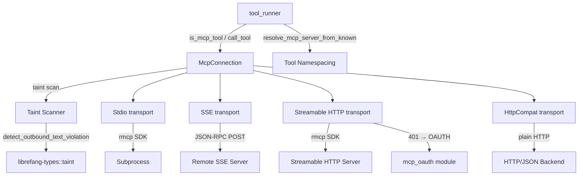

# Extensions & MCP — librefang-runtime-mcp-src

# librefang-runtime-mcp

MCP (Model Context Protocol) client for connecting librefang agents to external tool servers. Handles connection establishment, tool discovery, outbound argument taint scanning, and tool invocation across four transport strategies.

All MCP tools surfaced to the agent are namespaced as `mcp_{server}_{tool}` to prevent collisions between servers and built-in tools.

## Architecture



## Connection Lifecycle

`McpConnection::connect(config)` orchestrates the full handshake:

1. **Transport selection** — dispatches on `McpTransport` variant
2. **SSRF check** — `check_ssrf()` rejects URLs targeting cloud metadata endpoints (`169.254.169.254`, `metadata.google`)
3. **Handshake** — Stdio/HTTP transports use the rmcp SDK's MCP `initialize` exchange; SSE sends a manual JSON-RPC `initialize` + `notifications/initialized`
4. **Tool discovery** — `tools/list` via rmcp or manual JSON-RPC; HttpCompat uses static declarations from config
5. **Registration** — each discovered tool is registered with a namespaced name (`mcp_{server}_{tool}`) and prefixed description (`[MCP:{server}] …`)
6. **Annotation translation** — MCP `readOnlyHint`/`destructiveHint` annotations are injected as `metadata.tool_class` in the schema for the runtime tool classifier

## Transport Types

### Stdio

Spawns a subprocess communicating MCP over stdin/stdout via the rmcp SDK. Security controls:

- **Shell blocking** — `bash`, `sh`, `powershell`, etc. are rejected; operators must specify a concrete runtime (`npx`, `node`, `python`)
- **Path traversal rejection** — commands containing `..` are rejected
- **Environment sandboxing** — the subprocess does **not** inherit the parent environment. Only `SAFE_ENV_VARS` (PATH, HOME, language/locale vars, runtime-specific paths for Node/Python/Rust/Ruby/Go, Windows essentials) plus explicitly declared `env` entries are passed through
- **Windows adaptation** — `.cmd` variants are auto-detected for npm/npx
- **Variable expansion** — `$VAR`/`${VAR}` references in args are expanded from the process environment so templates can reference `$HOME` without `sh -c`
- **Roots capability** — when `roots` directories are configured, a `RootsClientHandler` advertises them during the MCP handshake (file:// URIs, percent-encoded)

### SSE (Server-Sent Events)

Legacy HTTP POST with JSON-RPC 2.0 for backward compatibility. Bidirectional communication is not possible, so:

- Roots capability is never declared (server cannot send `roots/list` back)
- `sse_send_request` / `sse_send_notification` manage an incrementing JSON-RPC `id` counter
- Custom headers from `config.headers` are sent with every request

### Streamable HTTP

MCP 2025-03-26+ transport using rmcp's `StreamableHttpClientTransport`. Handles:

- Accept header negotiation (`application/json`, `text/event-stream`)
- `Mcp-Session-Id` tracking
- SSE stream parsing and content-type negotiation

When a server returns 401, the connection attempts OAuth discovery:

1. `extract_auth_header_from_error` pulls `WWW-Authenticate` from rmcp's `StreamableHttpError::AuthRequired`
2. Falls back to substring matching on the error Display string if structured extraction fails
3. Calls `mcp_oauth::discover_oauth_metadata` for three-tier resolution
4. Returns `"OAUTH_NEEDS_AUTH"` error string to signal the API layer to drive PKCE via the UI

Roots are only advertised for local URLs (determined by `is_local_url`, which uses proper `url::Url` host parsing to avoid false positives on attacker-controlled domains like `127.0.0.1.evil.com`).

### HttpCompat

Built-in adapter for plain HTTP/JSON backends that don't speak MCP. Tools are statically declared in config with:

- `path` — URL path template with `{param}` placeholders (percent-encoded on render)
- `method` — GET, POST, PUT, PATCH, DELETE
- `request_mode` — `JsonBody`, `Query`, or `None`
- `response_mode` — `Text` or `Json` (pretty-printed)
- `headers` — static values or `value_env` (resolved from process environment at call time)

`validate_http_compat_config` enforces non-empty `base_url`, at least one tool, and that every header defines either `value` or `value_env`.

## Tool Invocation

`McpConnection::call_tool(name, arguments)` is the primary entry point called from `tool_runner::execute_tool_raw`:

1. **Name resolution** — the namespaced tool name is mapped back to the raw server-side name via `original_names` or `strip_mcp_prefix`
2. **Taint scanning** — if `config.taint_scanning` is enabled, the full argument tree is walked before sending
3. **Dispatch** — routes to the appropriate transport handler
4. **Timeout** — enforced via `tokio::time::timeout` using `config.timeout_secs`

For rmcp transports, the response is extracted from `CallToolResult.content` text nodes. The `is_error` flag on the result is checked — if `true`, the output text is returned as `Err`.

## Taint Scanning

The outbound taint scanner prevents credential and PII exfiltration through MCP tool calls. When an LLM is manipulated into smuggling secrets into arguments, this best-effort filter catches the payload before it reaches the out-of-process server.

### How It Works

`scan_mcp_arguments_for_taint_with_policy` walks every string leaf in the JSON argument tree against `TaintSink::mcp_tool_call()`:

- **String values** — checked via `detect_outbound_text_violation_rules_with_skip`
- **Sensitive key names** — object keys matching `MCP_SENSITIVE_KEY_NAMES` (authorization, api_key, password, secret, etc.) with non-empty string values are blocked regardless of value shape (catches `{"Authorization": "Bearer sk-…"}` which the text heuristic alone misses due to whitespace and scheme prefix)
- **Non-string leaves** — numbers, bools, null are skipped
- **Depth cap** — recursion stops at `MCP_TAINT_SCAN_MAX_DEPTH` (64) to prevent pathological payloads from blowing the stack

### Policy Layers

Three configuration layers control scanning behavior, from coarsest to finest:

**1. Server-level kill switch** (`taint_scanning = false`)

Disables the content-based heuristic entirely for a server. Sensitive key-name blocking remains active. Escape hatch for trusted local servers (browser automation, database adapters) whose results contain opaque session handles.

**2. Tool-level kill switch** (`taint_policy.tools.{tool}.default = "skip"`)

Bypasses all scanning — including sensitive key-name blocking — for a specific tool. Used as a single-line override for noisy tools.

**3. Per-path skip rules** (`taint_policy.tools.{tool}.paths`)

Individual taint rules can be disabled for specific JSON paths using a minimal JSONPath matcher:

| Pattern | Matches |
|---|---|
| `$.a.b` | Exact nested property |
| `$.a.*` | Any direct child of `$.a` |
| `$.a[*]` | Any array element of `$.a` |
| `$.*` | Any top-level property |

Known limitation: object keys containing `.` or `[` cannot be addressed precisely. The matcher fails closed (errs toward blocking) when this limitation is hit.

**4. Named rule sets** (`taint_policy.tools.{tool}.rule_sets` + `[[taint_rules]]`)

Rules can be downgraded from `Block` to `Warn` or `Log` via named rule sets in the global `[[taint_rules]]` config. When multiple sets cover the same rule, the most permissive action wins: `Log > Warn > Block`.

The rule set registry is accessed via `TaintRuleSetsHandle` (`Arc<ArcSwap<Vec<NamedTaintRuleSet>>>`), enabling hot-reload: the kernel owns a single swap and clones it into every connected server. A `.load()` snapshot at scan start ensures stability for the entire argument-tree walk.

### Multi-Rule Firing

A single string value can trip multiple rules simultaneously (e.g., both `KeyValueSecret` and `PiiEmail` for `"api_key=alice@example.com"`). The scanner iterates **every** fired rule, not just the first — a rule set that downgrades rule A must not silently mask an unauthorized rule B. The call is blocked as soon as any fired rule is not downgraded.

### Error Safety

Violation messages are carefully redacted — they contain only the JSON path of the offending leaf, never the payload value. These messages flow back to the LLM as tool-call errors and to logs; echoing the secret would defeat the filter.

Unknown rule set names trigger a one-shot `WARN` via `warn_unknown_rule_set_once` (per-process dedup) so operator typos don't sit silent in production.

## Tool Namespacing

All MCP tools are prefixed to prevent collisions:

- `format_mcp_tool_name("github", "create_issue")` → `"mcp_github_create_issue"`
- Server names are normalized: lowercase, hyphens → underscores (`"my-server"` → `"mcp_my_server_..."`)
- Hyphens in tool names are preserved as underscores after normalization

Resolution functions:

- `is_mcp_tool(name)` — checks `mcp_` prefix
- `extract_mcp_server(tool_name)` — heuristic, first segment after `mcp_`; only reliable for single-word server names
- `resolve_mcp_server_from_known(tool_name, server_names)` — robust runtime dispatch; matches the longest prefix against known server names to handle multi-segment names like `"another-mcp-server"` → `"mcp_another_mcp_server_..."`

## Configuration

### McpServerConfig

| Field | Type | Default | Description |
|---|---|---|---|
| `name` | `String` | required | Display name, used in namespacing |
| `transport` | `McpTransport` | required | Stdio, Sse, Http, or HttpCompat |
| `timeout_secs` | `u64` | 60 | Per-request timeout |
| `env` | `Vec<String>` | `[]` | `"KEY=VALUE"` or legacy `"KEY"` (looked up from parent env) |
| `headers` | `Vec<String>` | `[]` | `"Header-Name: value"` for SSE/HTTP |
| `oauth_provider` | `Option<Arc<dyn McpOAuthProvider>>` | `None` | Runtime-only, `#[serde(skip)]` |
| `oauth_config` | `Option<McpOAuthConfig>` | `None` | Discovery fallback from config.toml |
| `taint_scanning` | `bool` | `true` | Server-level toggle |
| `taint_policy` | `Option<McpTaintPolicy>` | `None` | Per-tool, per-path exemptions |
| `taint_rule_sets` | `TaintRuleSetsHandle` | empty | Runtime-only, hot-reloadable |
| `roots` | `Vec<String>` | `[]` | Runtime-only, filesystem roots for MCP Roots capability |

### McpTransport Variants

```rust
// Subprocess via rmcp SDK
Stdio { command: String, args: Vec<String> }

// Legacy HTTP POST / JSON-RPC
Sse { url: String }

// MCP 2025-03-26+ Streamable HTTP
Http { url: String }

// Plain HTTP/JSON adapter
HttpCompat {
    base_url: String,
    headers: Vec<HttpCompatHeaderConfig>,
    tools: Vec<HttpCompatToolConfig>,
}
```

## Integration Points

**Inbound callers:**

- `tool_runner::execute_tool_raw` — calls `is_mcp_tool()`, `resolve_mcp_server_from_known()`, and `McpConnection::call_tool()`
- `routes::agents::get_agent_mcp_servers` and `tui::event::spawn_fetch_agent_mcp_servers` — use `resolve_mcp_server_from_known()` to map tool names to servers
- `routes::mcp_auth::auth_start` — calls `mcp_oauth::discover_oauth_metadata()` for OAuth discovery
- `kernel::mcp_oauth_provider::load_token` — calls `mcp_oauth::store_tokens()` for token persistence

**Outbound dependencies:**

- `librefang-types` — `ToolDefinition`, taint types (`TaintSink`, `TaintRuleId`), config types (`McpTaintPolicy`, `McpServerConfig` shapes)
- `librefang-http` — `proxied_client_builder()` for HTTP client construction
- `rmcp` — MCP protocol handling for Stdio and Streamable HTTP transports
- `reqwest` — raw HTTP for SSE and HttpCompat transports
- `arc-swap` — lock-free hot-reload of taint rule set registry