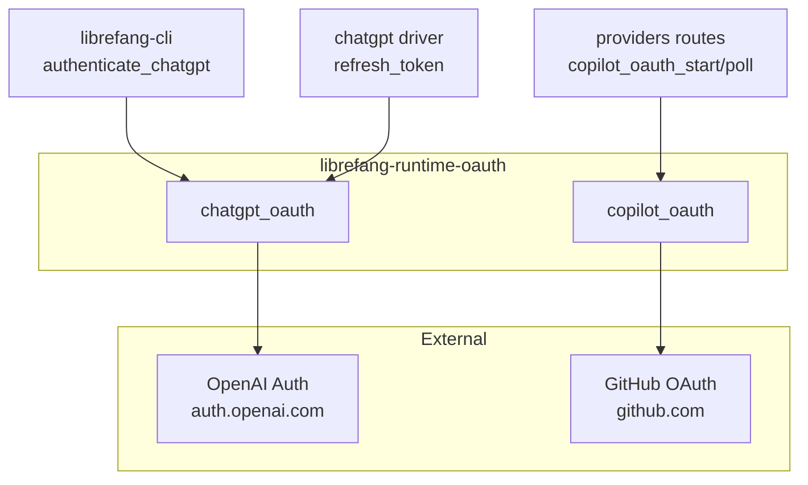

# Extensions & MCP — librefang-runtime-oauth-src

# librefang-runtime-oauth

OAuth 2.0 authentication runtime for LibreFang. Provides browser-based and device-flow authentication for **ChatGPT (OpenAI)** and **GitHub Copilot**, producing bearer tokens consumed by LLM drivers and the CLI.

## Module Layout

```
librefang-runtime-oauth/
├── lib.rs                # Re-exports: chatgpt_oauth, copilot_oauth
├── chatgpt_oauth.rs      # OpenAI Codex OAuth — browser callback + device flow
└── copilot_oauth.rs      # GitHub Copilot OAuth — RFC 8628 device flow only
```

## Architecture



## Integration Points

| Caller | Function Called | Purpose |
|--------|----------------|---------|
| `librefang-cli` → `authenticate_chatgpt` | `start_oauth_flow`, `run_oauth_callback_server`, `exchange_code_for_tokens`, `start_device_auth_flow`, `poll_device_auth_flow` | Full ChatGPT login flow (browser or device) |
| `librefang-cli` → `persist_chatgpt_auth` | `fetch_best_codex_model` | Resolve the highest-priority Codex model after auth |
| `chatgpt driver` → `refresh_token` | `refresh_access_token` | Silent token refresh during sessions |
| `providers routes` → `copilot_oauth_start` | `start_device_flow` | Begin GitHub device authorization |
| `providers routes` → `copilot_oauth_poll` | `poll_device_flow` | Poll GitHub for device auth completion |

All HTTP calls go through `librefang_http::proxied_client()` (or `proxied_client_builder()`) to respect system proxy settings.

---

## chatgpt_oauth — OpenAI Codex OAuth

Provides two mutually exclusive authentication paths:

1. **Browser callback flow** — Opens the user's browser to `auth.openai.com`, waits for a redirect to `localhost:1455/auth/callback`, and exchanges the authorization code for tokens.
2. **Device auth flow** — Headless-friendly alternative. Requests a one-time code, the user visits `auth.openai.com/codex/device` and enters it, and the app polls until completion. Falls back to browser flow if device auth is not enabled for the account.

Both flows use **PKCE (S256)** to protect the authorization code exchange.

### Constants

| Constant | Value | Notes |
|----------|-------|-------|
| `CHATGPT_BASE_URL` | `https://chatgpt.com/backend-api` | API base for OAuth-scoped requests (Responses API, not `/v1/chat/completions`) |
| `CLIENT_ID` | `app_EMoamEEZ73f0CkXaXp7hrann` | OpenAI Codex CLI registered client |
| `CALLBACK_BIND` | `127.0.0.1:1455` | Matches the registered redirect URI |
| `AUTH_TIMEOUT_SECS` | 300 | Browser callback timeout (5 min) |
| `DEVICE_AUTH_TIMEOUT_SECS` | 900 | Device flow polling timeout (15 min) |
| `DEVICE_AUTH_URL` | `https://auth.openai.com/codex/device` | Verification page shown to users |
| `DEVICE_AUTH_REDIRECT_URI` | `https://auth.openai.com/deviceauth/callback` | Redirect used in device flow token exchange |

### Key Types

#### `ChatGptAuthResult`

Result of a completed OAuth flow. All sensitive fields use `Zeroizing<String>` for memory safety:

```rust
pub struct ChatGptAuthResult {
    pub access_token: Zeroizing<String>,
    pub refresh_token: Option<Zeroizing<String>>,
    pub expires_in: Option<u64>,
}
```

#### `DeviceAuthPrompt`

Details returned by `start_device_auth_flow()` that must be displayed to the user:

```rust
pub struct DeviceAuthPrompt {
    pub device_auth_id: String,   // Server-issued identifier for polling
    pub user_code: String,        // One-time code the user types at DEVICE_AUTH_URL
    pub interval_secs: u64,       // Recommended poll interval (defaults to 5s)
}
```

#### `DeviceAuthFlowError`

Distinguishes between recoverable and fatal device auth failures:

- **`BrowserFallback { message }`** — Device auth is not enabled for the account (HTTP 404 from the usercode endpoint). The caller should fall back to the browser flow.
- **`Fatal(String)`** — Any other failure that should be surfaced to the user without silent retry.

#### `PkceChallenge`

PKCE verifier/challenge pair:

```rust
pub struct PkceChallenge {
    pub verifier: String,    // 64 random bytes, base64url-encoded (86 chars)
    pub challenge: String,   // SHA-256 of verifier, base64url-encoded
}
```

### Public Functions

#### PKCE and URL helpers

| Function | Returns | Description |
|----------|---------|-------------|
| `generate_pkce()` | `PkceChallenge` | Generates a random PKCE S256 pair |
| `create_state()` | `String` | 16 random bytes hex-encoded (32 chars), CSRF protection |
| `build_authorization_url(port, code_challenge, state)` | `String` | Full authorization URL with all query parameters |
| `chatgpt_session_available()` | `bool` | Checks if `CHATGPT_SESSION_TOKEN` env var is set and non-empty |

#### Browser callback flow

```
start_oauth_flow()          → (auth_url, port, pkce_verifier, state)
     ↓  open browser
run_oauth_callback_server() → authorization_code
     ↓
exchange_code_for_tokens()  → ChatGptAuthResult
```

**`start_oauth_flow()`** — Binds port 1455 temporarily to confirm availability, generates PKCE and state, and returns the authorization URL along with the PKCE verifier and state for later validation. The listener is dropped immediately so the async callback server can re-bind.

**`run_oauth_callback_server(port, expected_state)`** — Spawns a tokio TCP server that:
1. Accepts connections on `127.0.0.1:{port}`
2. Parses `GET /auth/callback?code=...&state=...`
3. Validates the `state` parameter against `expected_state` (CSRF check)
4. Sends the authorization code through a oneshot channel
5. Serves a success or error HTML page to the browser
6. Times out after 5 minutes

**`exchange_code_for_tokens(code, code_verifier, port)`** — Posts to the OpenAI token endpoint with the authorization code, PKCE verifier, and the browser redirect URI (`http://localhost:{port}/auth/callback`). Returns `ChatGptAuthResult`.

#### Device auth flow

```
start_device_auth_flow()    → DeviceAuthPrompt  (or DeviceAuthFlowError::BrowserFallback)
     ↓  user visits DEVICE_AUTH_URL, enters user_code
poll_device_auth_flow()     → ChatGptAuthResult
```

**`start_device_auth_flow()`** — POSTs to `auth.openai.com/api/accounts/deviceauth/usercode`. On HTTP 404, returns `DeviceAuthFlowError::BrowserFallback` (device auth not enabled). On success, parses the response into a `DeviceAuthPrompt`. The response supports both `user_code` and `usercode` field names via serde aliasing.

**`poll_device_auth_flow(prompt)`** — Polls `auth.openai.com/api/accounts/deviceauth/token` with the `device_auth_id` and `user_code`. Treats HTTP 403/404 as "still pending". On success, receives an `authorization_code` and `code_verifier` from the server, then calls `exchange_code_for_tokens_with_redirect_uri()` with `DEVICE_AUTH_REDIRECT_URI` to complete the exchange. Times out after 15 minutes.

#### Token refresh

**`refresh_access_token(refresh_token)`** — Posts a `refresh_token` grant to the OpenAI token endpoint. Returns a fresh `ChatGptAuthResult` with new access and refresh tokens.

#### Model resolution

**`fetch_best_codex_model(access_token)`** — Calls `GET {CHATGPT_BASE_URL}/codex/models?client_version={VERSION}` with the bearer token. Parses the response's `models` array, sorts by `priority` descending, and returns the highest-priority model slug. Falls back to `"gpt-5.1-codex-mini"` on any failure. This is not authentication per se but is called immediately after auth to determine which model to use.

---

## copilot_oauth — GitHub Copilot Device Flow

Implements OAuth 2.0 Device Authorization Grant (RFC 8628) using GitHub's endpoints. Uses the same public client ID as the VSCode Copilot extension (`Iv1.b507a08c87ecfe98`).

### Key Types

#### `DeviceCodeResponse`

Parsed response from the device code initiation:

```rust
pub struct DeviceCodeResponse {
    pub device_code: String,
    pub user_code: String,
    pub verification_uri: String,
    pub expires_in: u64,
    pub interval: u64,
}
```

#### `DeviceFlowStatus`

Enum representing the result of each polling attempt:

| Variant | Meaning |
|---------|---------|
| `Pending` | User hasn't completed authorization yet |
| `Complete { access_token }` | Success — `Zeroizing<String>` bearer token |
| `SlowDown { new_interval }` | Server requested longer poll interval |
| `Expired` | Device code expired, must restart |
| `AccessDenied` | User explicitly denied |
| `Error(String)` | Unexpected error |

### Public Functions

**`start_device_flow()`** — POSTs to `https://github.com/login/device/code` with the Copilot client ID and `read:user` scope. Returns a `DeviceCodeResponse` with the user code and verification URI.

**`poll_device_flow(device_code)`** — POSTs to `https://github.com/login/oauth/access_token`. GitHub returns 200 with an `error` field during pending states, so error handling checks the JSON body rather than HTTP status. Maps `authorization_pending`, `slow_down`, `expired_token`, and `access_denied` to their respective `DeviceFlowStatus` variants. On success, extracts and returns the access token wrapped in `Zeroizing<String>`.

---

## Security Considerations

- **Zeroizing** — All tokens (`access_token`, `refresh_token`) are wrapped in `Zeroizing<String>` so they are overwritten in memory when dropped.
- **PKCE** — The browser flow uses S256 code challenges, preventing authorization code interception.
- **State parameter** — The callback server validates the `state` query parameter to prevent CSRF attacks.
- **No secrets in client** — Both flows use public clients (no client secret). The Copilot client ID is the same one shipped in VSCode.

## Error Handling Patterns

Both submodules use `Result<T, String>` for most public functions, with the exception of `DeviceAuthFlowError` in the ChatGPT device flow (which distinguishes `BrowserFallback` from `Fatal` errors) and `DeviceFlowStatus` in the Copilot flow (which encodes all possible states including errors as enum variants).

The caller in `librefang-cli::authenticate_chatgpt` handles `DeviceAuthFlowError::BrowserFallback` by transparently switching to the browser callback flow.