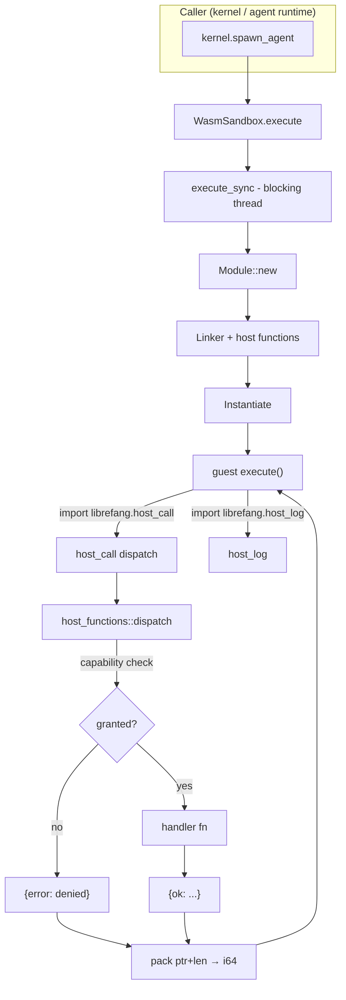

# Extensions & MCP — librefang-runtime-wasm-src

# librefang-runtime-wasm

WASM sandbox for secure execution of untrusted skills and plugins. Built on Wasmtime with deny-by-default capability gating, deterministic fuel metering, and wall-clock epoch interruption.

## Architecture



## Sandbox Engine — `WasmSandbox`

`WasmSandbox` wraps a Wasmtime `Engine` configured with fuel consumption and epoch interruption. Create **one** per kernel lifetime — the engine is expensive to build but compiles and instantiates many modules.

### Execution flow

```
execute(wasm_bytes, input_json, config, kernel, agent_id)
  → spawn_blocking
    → execute_sync
      1. Compile module (accepts .wasm binary or .wat text)
      2. Create Store<GuestState> with capabilities and fuel budget
      3. Start watchdog thread (epoch-based wall-clock timeout)
      4. Register host function imports via Linker
      5. Instantiate — links imports, no WASI
      6. Write input JSON into guest memory via guest's alloc export
      7. Call guest's execute export
      8. Read output JSON from guest memory
      9. Join watchdog, report fuel consumed
```

### Resource limits

| Mechanism | Controls | Default | Config field |
|---|---|---|---|
| **Fuel** | Total WASM instructions executed | 1,000,000 | `SandboxConfig::fuel_limit` |
| **Epoch interruption** | Wall-clock seconds | 30 | `SandboxConfig::timeout_secs` |
| **Memory** | Linear memory cap (reserved) | 16 MiB | `SandboxConfig::max_memory_bytes` |

The watchdog thread uses `park_timeout` + an `AtomicBool` done flag rather than a sleeping loop. It wakes immediately when the main thread finishes (via `Thread::unpark`) rather than waiting for a poll interval. An RAII guard (`WatchdogGuard`) signals the flag and joins the thread on every exit path — normal return, trap, or panic — so no OS threads leak.

## Guest ABI

WASM modules **must** export three items:

| Export | Signature | Purpose |
|---|---|---|
| `memory` | `(memory ...)` | Linear memory for data exchange |
| `alloc` | `(func (param i32) (result i32))` | Allocate N bytes, return pointer |
| `execute` | `(func (param i32 i32) (result i64))` | Entry point: receives `(input_ptr, input_len)` |

The `execute` function returns a packed `i64`: `(result_ptr << 32) | result_len`. Both input and result are UTF-8 JSON bytes.

### Minimal guest (WAT)

```wat
(module
    (memory (export "memory") 1)
    (global $bump (mut i32) (i32.const 1024))

    (func (export "alloc") (param $size i32) (result i32)
        (local $ptr i32)
        (local.set $ptr (global.get $bump))
        (global.set $bump (i32.add (global.get $bump) (local.get $size)))
        (local.get $ptr)
    )

    (func (export "execute") (param $ptr i32) (param $len i32) (result i64)
        (i64.or
            (i64.shl (i64.extend_i32_u (local.get $ptr)) (i64.const 32))
            (i64.extend_i32_u (local.get $len))))
    )
)
```

## Host ABI

The sandbox provides two imports under the `"librefang"` module:

### `host_call(request_ptr: i32, request_len: i32) -> i64`

Single RPC dispatch for all capability-checked operations. The request is JSON:

```json
{"method": "fs_read", "params": {"path": "/data/config.toml"}}
```

The response is a packed `(ptr, len)` pointing to one of:

```json
{"ok": "..."}
{"error": "Capability denied: FileRead(\"/etc/passwd\")"}
```

### `host_log(level: i32, msg_ptr: i32, msg_len: i32)`

Lightweight logging with no capability check. Level mapping: `0` → trace, `1` → debug, `2` → info, `3` → warn, `4+` → error. Messages are prefixed with the agent ID.

## Host Function Dispatch

`host_functions::dispatch` routes method names to handler functions. Every handler (except `time_now`) calls `check_capability` before executing.

| Method | Required capability | Params | Returns |
|---|---|---|---|
| `time_now` | *(none — always allowed)* | `{}` | `{"ok": <unix_ts>}` |
| `fs_read` | `FileRead(path)` | `{path}` | `{"ok": "<content>"}` |
| `fs_write` | `FileWrite(path)` | `{path, content}` | `{"ok": true}` |
| `fs_list` | `FileRead(path)` | `{path}` | `{"ok": ["file1", ...]}` |
| `net_fetch` | `NetConnect(host)` | `{url, method?, body?}` | `{"ok": {status, body}}` |
| `shell_exec` | `ShellExec(command)` | `{command, args?}` | `{"ok": {exit_code, stdout, stderr}}` |
| `env_read` | `EnvRead(name)` | `{name}` | `{"ok": "<value>" \| null}` |
| `kv_get` | `MemoryRead(key)` | `{key}` | `{"ok": <value> \| null}` |
| `kv_set` | `MemoryWrite(key)` | `{key, value}` | `{"ok": true}` |
| `agent_send` | `AgentMessage(target)` | `{target, message}` | `{"ok": "<response>"}` |
| `agent_spawn` | `AgentSpawn` | `{manifest}` | `{"ok": {id, name}}` |

### Capability matching

`check_capability` iterates the guest's granted capabilities and calls `librefang_types::capability::capability_matches`. Wildcard patterns (e.g. `FileRead("*")`) match any operand. If no match is found, the operation returns `{"error": "Capability denied: ..."}` immediately.

## Security Measures

### Path traversal protection

Two functions guard filesystem access:

- **`safe_resolve_path`** — for reads/lists where the target must already exist. Rejects any path containing `..` components, then `canonicalize`s to resolve symlinks.
- **`safe_resolve_parent`** — for writes where the file may not exist yet. Canonicalizes the parent directory, validates the filename doesn't contain `..`, and joins them.

Both run **after** the capability check, providing defense-in-depth.

### SSRF protection

`is_ssrf_target` validates every URL before `net_fetch` executes:

1. **Scheme allowlist** — only `http://` and `https://` permitted.
2. **Hostname blocklist** — `localhost`, `metadata.google.internal`, `metadata.aws.internal`, `instance-data`, `169.254.169.254`.
3. **DNS resolution with private-IP check** — resolves the hostname and checks every returned address against RFC 1918 ranges (10.0.0.0/8, 172.16.0.0/12, 192.168.0.0/16), link-local (169.254.0.0/16), loopback, and unspecified.
4. **IPv4-mapped IPv6 canonicalization** — `canonical_ip` unwraps `::ffff:X.X.X.X` to its IPv4 form before the private-range check, preventing bypass via mapped addresses.
5. **DNS pinning** — the resolved addresses are pinned into the HTTP client via `reqwest::ClientBuilder::resolve`, preventing DNS-rebinding TOCTOU attacks.

### Shell environment sanitization

`shell_exec` runs commands via `std::process::Command::new` (no shell interpreter — safe from injection). Before execution, `sanitize_shell_env` clears the entire environment and re-adds only:

```
PATH, HOME, TMPDIR, TMP, TEMP, LANG, LC_ALL, TERM
```

Plus on Windows: `USERPROFILE`, `SYSTEMROOT`, `APPDATA`, `LOCALAPPDATA`, `COMSPEC`, `WINDIR`, `PATHEXT`.

This prevents exfiltration of API keys, vault tokens, and cloud metadata credentials that may exist in the daemon's environment.

### Capability inheritance for spawned agents

`host_agent_spawn` calls `kernel.spawn_agent_checked`, passing the parent's capabilities. The kernel enforces that the child's capabilities are a subset of the parent's — a guest cannot escalate privileges by spawning a new agent.

## Key Types

### `SandboxConfig`

```rust
pub struct SandboxConfig {
    pub fuel_limit: u64,           // CPU instruction budget (0 = unlimited)
    pub max_memory_bytes: usize,   // Linear memory cap (16 MiB default)
    pub capabilities: Vec<Capability>,
    pub timeout_secs: Option<u64>, // Wall-clock timeout (30s default)
}
```

### `GuestState`

Carried inside the Wasmtime `Store<GuestState>`. Accessible (as `&GuestState`) by all host function handlers:

```rust
pub struct GuestState {
    pub capabilities: Vec<Capability>,
    pub kernel: Option<Arc<dyn KernelHandle>>,
    pub agent_id: String,
    pub tokio_handle: tokio::runtime::Handle,
}
```

Handlers that perform async kernel operations (`kv_get`, `kv_set`, `agent_send`, `agent_spawn`) use `tokio_handle.block_on` to bridge the sync host-function boundary.

### `ExecutionResult`

```rust
pub struct ExecutionResult {
    pub output: serde_json::Value,
    pub fuel_consumed: u64,
}
```

### `SandboxError`

```rust
pub enum SandboxError {
    Compilation(String),    // WASM compile or validate failure
    Instantiation(String),  // Link-time or instantiate failure
    Execution(String),      // Runtime trap or timeout
    FuelExhausted,          // Instruction budget exceeded
    AbiError(String),       // Missing exports, bad pointers, invalid JSON
}
```

## External Dependencies

| Crate | Usage |
|---|---|
| `wasmtime` | WASM compilation, instantiation, fuel, epochs |
| `librefang_types` | `Capability` enum, `capability_matches` |
| `librefang_kernel_handle` | `KernelHandle` trait for inter-agent RPC |
| `librefang_http` | `proxied_client_builder` for DNS-pinned HTTP client |
| `serde_json` | All host/guest data exchange |
| `tokio` | `spawn_blocking` for sync WASM execution, `Handle::block_on` in host functions |

## Error handling conventions

All host functions return JSON — never panic or propagate Rust errors into the guest:

- `{"ok": ...}` on success
- `{"error": "<message>"}` on any failure (capability denied, path traversal, SSRF block, I/O error, missing kernel handle)

The sandbox layer (`host_call` in `sandbox.rs`) catches `anyhow::Error` from JSON parse failures or memory access violations and wraps them into `{"error": "host_call failed: ..."}` before returning to the guest.