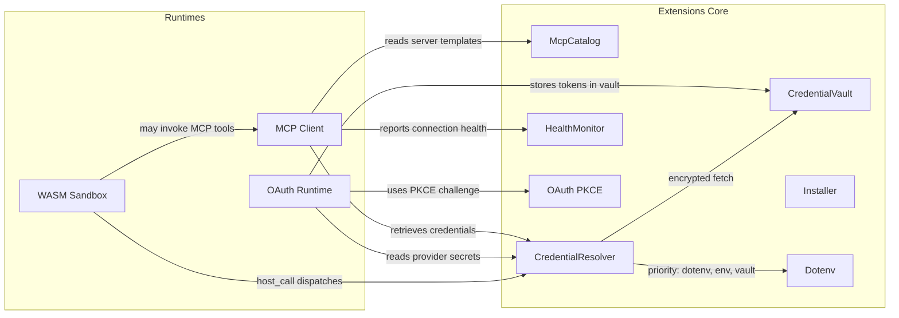

# Extensions & MCP

# Extensions & MCP

Manages external integrations for LibreFang: MCP server lifecycle, credential storage, OAuth authentication across providers, and sandboxed plugin execution.

## Sub-modules

| Module | Responsibility |
|--------|---------------|
| [librefang-extensions](librefang-extensions-src.md) | MCP catalog templates, encrypted credential vault, OAuth2 PKCE utilities, health monitoring, dotenv loading, installation transforms |
| [librefang-runtime-mcp](librefang-runtime-mcp-src.md) | MCP client — connection establishment, tool discovery, argument taint scanning, and invocation across Stdio/SSE/HTTP transports |
| [librefang-runtime-oauth](librefang-runtime-oauth-src.md) | OAuth 2.0 authentication runtime for ChatGPT and GitHub Copilot (browser callback + device flows) |
| [librefang-runtime-wasm](librefang-runtime-wasm-src.md) | WASM sandbox for executing untrusted skills/plugins with deny-by-default capabilities and fuel metering |

## How they connect

## Key cross-module workflows

**MCP server installation → invocation:** The [installer](librefang-extensions-src.md) scaffolds server configuration from catalog templates. The [MCP client](librefang-runtime-mcp-src.md) reads these templates, resolves credentials via `CredentialResolver` (which chains dotenv → environment variables → vault), establishes a transport connection, and begins tool discovery. Namespaced tools (`mcp_{server}_{tool}`) are then available to the agent through `tool_runner`.

**OAuth token acquisition → storage:** [librefang-runtime-oauth](librefang-runtime-oauth-src.md) orchestrates browser-based PKCE flows for ChatGPT and device-code flows for Copilot. Completed tokens are persisted through the `CredentialVault` (AES-256-GCM), which itself derives wrapping keys from the OS keyring via the vault infrastructure in [librefang-extensions](librefang-extensions-src.md). Downstream drivers and CLI commands retrieve these tokens through `CredentialResolver`.

**Sandboxed skill execution:** The [WASM sandbox](librefang-runtime-wasm-src.md) isolates untrusted plugin code. Guest modules can call `librefang.host_call`, which dispatches through capability-checked host functions. These host functions may in turn resolve credentials or invoke MCP tools, connecting all three runtime layers.

**Health and credential flow for TOTP/admin actions:** System-level flows like TOTP setup and revocation traverse from the kernel through `vault_get` → `CredentialVault::unlock` → keyring-derived master key resolution, then back up to the frontend for finalization — illustrating how the vault acts as a shared dependency across the entire stack.