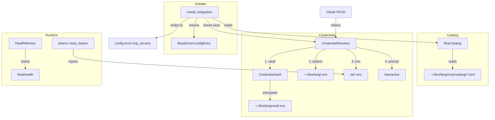

# Extensions & MCP

# Extensions & MCP

The `librefang-extensions` crate manages the full lifecycle of MCP (Model Context Protocol) server integrations: discovering catalog templates, storing credentials securely, installing servers into the user's config, and monitoring their health.

## Architecture Overview



## Module Layout

| Module | Visibility | Purpose |
|--------|-----------|---------|
| `catalog` | `pub` | Read-only MCP server template registry |
| `credentials` | `pub` | Multi-source credential resolution chain |
| `dotenv` | `pub` | Shared `.env` + vault → process environment loader |
| `health` | `pub` | MCP server health tracking with exponential backoff |
| `http_client` | `pub(crate)` | Shared `reqwest` client with bundled CA roots |
| `installer` | `pub` | Pure transform: catalog entry → `McpServerConfigEntry` |
| `oauth` | `pub` | OAuth2 PKCE localhost callback flows |
| `vault` | `pub` | AES-256-GCM encrypted secret storage |

## Core Types (`src/lib.rs`)

The crate root defines all shared types and the error enum used across modules.

### Error Handling

All fallible operations return `ExtensionResult<T>`, backed by `ExtensionError`:

```rust
match result {
    Err(ExtensionError::NotFound(id)) => { /* catalog entry missing */ },
    Err(ExtensionError::VaultLocked) => { /* need unlock */ },
    Err(ExtensionError::AlreadyInstalled(id)) => { /* duplicate */ },
    // ...
}
```

Key variants:
- **`NotFound`** / **`AlreadyInstalled`** / **`NotInstalled`** — catalog and config state queries
- **`CredentialNotFound`** — credential resolution found nothing
- **`Vault`** / **`VaultLocked`** — encryption errors or locked vault
- **`OAuth`** — PKCE flow failures
- **`Io`** / **`Http`** / **`TomlParse`** — infra-level errors

### MCP Catalog Entry Schema

`McpCatalogEntry` is the central type — a bundled template describing how to configure an MCP server:

```toml
id = "github"
name = "GitHub"
description = "GitHub API integration"
category = "devtools"
icon = ""
tags = ["github", "api"]

[transport]
type = "stdio"
command = "npx"
args = ["-y", "@modelcontextprotocol/server-github"]

[[required_env]]
name = "GITHUB_PERSONAL_ACCESS_TOKEN"
label = "Personal Access Token"
help = "Create at https://github.com/settings/tokens"
is_secret = true
get_url = "https://github.com/settings/tokens"

[health_check]
interval_secs = 60
unhealthy_threshold = 3
```

**`McpCatalogTransport`** has three variants: `Stdio`, `Sse`, and `Http`. Unlike the kernel's `McpTransportEntry`, there is no `HttpCompat` variant — that's a power-user transport that doesn't ship as a catalog template. The installer converts between the two types.

**`McpStatus`** represents the lifecycle of a server: `Available` → `Setup` (credentials missing) → `Ready` (running), with `Error` and `Disabled` as alternate states.

---

## Catalog (`catalog.rs`)

`McpCatalog` provides an in-memory view of all template files under `~/.librefang/mcp/catalog/`. It is purely read-only — installed servers live in `config.toml` under `[[mcp_servers]]` with an optional `template_id` pointing back to the catalog.

### File Layout

Two on-disk layouts are valid:

```
~/.librefang/mcp/catalog/
├── github.toml              # (A) flat file
├── slack.toml
└── complex-mcp/             # (B) directory-backed
    └── MCP.toml
```

For layout (A), the `id` comes from the filename minus `.toml`. For layout (B), the `id` is the directory name and the manifest is `MCP.toml` inside it.

### Loading

```rust
let mut catalog = McpCatalog::new(&home_dir);
let count = catalog.load(&home_dir);
```

`load()` performs a **full reload** — it clears the in-memory map first so deleted entries don't linger. Returns the number of entries loaded. Malformed files are skipped with a `warn!` log.

### Querying

```rust
// Get by exact ID
let entry = catalog.get("github").unwrap();

// List all, sorted by ID
let all = catalog.list();

// Filter by category
let devtools = catalog.list_by_category(&McpCategory::DevTools);

// Fuzzy search (id, name, description, tags)
let results = catalog.search("search");
```

Catalog entries are refreshed from the upstream registry by `librefang_runtime::registry_sync`. This crate does not perform network fetches itself.

---

## Credential Vault (`vault.rs`)

AES-256-GCM encrypted storage at `~/.librefang/vault.enc`. Secrets are zeroed on drop using `Zeroizing<String>`.

### Encryption Scheme

1. Master key (32 bytes) stored in OS keyring or `LIBREFANG_VAULT_KEY` env var
2. Per-save: random 16-byte salt + 12-byte nonce generated
3. Master key + salt → Argon2id → derived encryption key
4. Derived key encrypts the serialized JSON via AES-256-GCM
5. File written with `OFV1` magic header + JSON payload

### Keyring Fallback

When the OS keyring is unavailable, the master key is wrapped with AES-256-GCM using an Argon2id-derived key from a machine fingerprint (username + hostname hash). The wrapped key is stored at `<local data dir>/librefang/.keyring`. Legacy v1 XOR-obfuscated files are automatically migrated to v2 on first load.

### Lifecycle

```rust
let mut vault = CredentialVault::new(home_dir.join("vault.enc"));

// Initialize (generates random key, stores in keyring)
vault.init()?;

// Or with explicit key (testing / programmatic)
vault.init_with_key(master_key)?;

// Unlock (reads from keyring or env var)
vault.unlock()?;

// Or with explicit key
vault.unlock_with_key(master_key)?;

// Read / write
vault.set("GITHUB_TOKEN".to_string(), Zeroizing::new("ghp_xxx".to_string()))?;
let token = vault.get("GITHUB_TOKEN"); // Option<Zeroizing<String>>
vault.remove("GITHUB_TOKEN")?;

// List key names (not values)
let keys: Vec<&str> = vault.list_keys();
```

The vault caches the resolved master key after first unlock to avoid repeated keyring/env lookups.

### File Format Compatibility

The `load()` method handles both current format (`OFV1` + JSON) and legacy format (bare JSON starting with `{`). Unrecognized binary data produces an "Unrecognized vault file format" error.

---

## Credential Resolution (`credentials.rs`)

`CredentialResolver` tries multiple sources in priority order:

```
1. Vault (if unlocked)     ← highest priority
2. Dotenv file (~/.librefang/.env)
3. Process environment (std::env)
4. Interactive prompt       ← CLI only, when enabled
```

### Usage

```rust
let vault = CredentialVault::new(vault_path);
let resolver = CredentialResolver::new(
    Some(vault),
    Some(Path::new("~/.librefang/.env")),
).with_interactive(true);

// Resolve single credential
let token = resolver.resolve("GITHUB_TOKEN"); // Option<Zeroizing<String>>

// Check availability (no prompt)
if resolver.has_credential("GITHUB_TOKEN") { ... }

// Batch resolve
let creds = resolver.resolve_all(&["KEY_A", "KEY_B", "KEY_C"]);

// Find missing
let missing = resolver.missing_credentials(&["KEY_A", "KEY_B"]);
```

### Storing Credentials

```rust
// Store in vault via resolver
resolver.store_in_vault("GITHUB_TOKEN", Zeroizing::new("ghp_xxx".to_string()))?;
```

### Cache Invalidation

If a key is deleted externally (e.g., via the dashboard), call `clear_dotenv_cache(&mut resolver, "KEY")` to prevent stale values from the boot-time snapshot.

---

## Dotenv Loader (`dotenv.rs`)

Injects secrets into `std::env` so every entry point (CLI, desktop, kernel) loads them identically. **Must be called from synchronous `main()` before spawning any tokio runtime** — `std::env::set_var` is UB in Rust 1.80+ once other threads exist.

### Priority (highest first)

1. System environment variables (never overridden)
2. Credential vault (`vault.enc`)
3. `.env` file
4. `secrets.env` file

```rust
// Call once at startup
librefang_extensions::dotenv::load_dotenv();
```

Protected by `Once` — repeated calls are no-ops.

### Key Management

```rust
dotenv::save_env_key("MY_KEY", "my_value")?;  // upserts in .env + sets in process
dotenv::remove_env_key("MY_KEY")?;             // removes from .env + unsets in process
dotenv::list_env_keys();                        // key names only (no values)
```

Files are created with `0600` permissions on Unix. Values containing spaces, `#`, or `"` are automatically quoted on write.

---

## Installer (`installer.rs`)

Pure transforms — no side effects. The caller (API/CLI handler) decides when to persist the returned `McpServerConfigEntry` to `config.toml`.

### `install_integration`

```rust
let result: InstallResult = install_integration(
    &catalog,
    &mut resolver,
    "github",                           // catalog entry ID
    &provided_keys,                      // HashMap<String, String>
)?;
```

Steps:
1. Look up `McpCatalogEntry` by ID
2. Store provided credentials in vault (best effort — warns on failure)
3. Check which `required_env` keys still have no credential
4. Build `McpServerConfigEntry` with `template_id` set
5. Return `InstallResult` with status (`Ready` if all creds present, `Setup` if missing)

### `catalog_entry_to_mcp_server`

Converts any `McpCatalogEntry` into a `McpServerConfigEntry`. Sets `template_id`, maps transport types, copies env var names, and converts OAuth templates.

### Scaffolding

```rust
// Create a template TOML for a new custom MCP server
scaffold_integration(&dir)?;

// Create a skill scaffold (skill.toml + SKILL.md)
scaffold_skill(&dir)?;
```

---

## OAuth (`oauth.rs`)

OAuth2 PKCE flows for Google, GitHub, Microsoft, and Slack. Launches a temporary localhost HTTP server, opens the browser, receives the callback, and exchanges the authorization code for tokens.

### PKCE Flow

```rust
let tokens: OAuthTokens = run_pkce_flow(&oauth_template, &client_id).await?;
```

Flow:
1. Generate PKCE verifier + SHA-256 challenge
2. Bind to `127.0.0.1:0` (random port)
3. Build authorization URL with `code_challenge_method=S256`
4. Open browser (or print URL to stderr)
5. Serve `/callback` via axum with 5-minute timeout
6. Validate `state` parameter (CSRF protection)
7. Exchange code + verifier for tokens at the token endpoint
8. Shut down callback server, return `OAuthTokens`

All tokens are accessible as `Zeroizing<String>` via `access_token_zeroizing()` and `refresh_token_zeroizing()`.

### Client ID Resolution

```rust
let ids = resolve_client_ids(&oauth_config);
```

Default placeholder IDs are overridden by values from `librefang_types::config::OAuthConfig` fields (`google_client_id`, `github_client_id`, etc.). PKCE doesn't require a client secret, so embedded public IDs are safe.

---

## Health Monitor (`health.rs`)

Tracks MCP server status with auto-reconnect using exponential backoff.

### Configuration

```rust
let config = HealthMonitorConfig {
    auto_reconnect: true,
    max_reconnect_attempts: 10,
    max_backoff_secs: 300,
    check_interval_secs: 60,
};
let monitor = HealthMonitor::new(config);
```

### Tracking Health

```rust
monitor.register("github");
monitor.report_ok("github", 12);        // 12 tools available
monitor.report_error("github", "timeout".to_string());
monitor.mark_reconnecting("github");
```

### `McpHealth` Fields

| Field | Description |
|-------|-------------|
| `status` | Current `McpStatus` |
| `tool_count` | Number of tools from last successful check |
| `last_ok` | Timestamp of last successful check |
| `last_error` | Most recent error message |
| `consecutive_failures` | Unbroken failure streak |
| `reconnecting` | Whether a reconnect attempt is in progress |
| `reconnect_attempts` | Total reconnect attempts since last success |
| `connected_since` | Uptime since last successful connect |

### Backoff Calculation

```
attempt 0 → 5s
attempt 1 → 10s
attempt 2 → 20s
attempt 3 → 40s
...
capped at max_backoff_secs (default: 300s)
```

`should_reconnect(id)` returns `true` only when the server is in `Error` status and attempts haven't been exhausted.

### Thread Safety

`HealthMonitor` uses `Arc<DashMap<String, McpHealth>>` internally — safe to share across the health-check background task and API handlers. Access the raw map via `health_map()` for custom background loops.

---

## HTTP Client (`http_client.rs`)

Internal utility that builds a `reqwest::Client` with proper TLS roots. Tries native CA certificates first; falls back to `webpki-roots` if none are found. Use `new_client()` for a ready-built client or `client_builder()` to customize before building.

---

## Integration Points

### From the Kernel

The kernel's `mcp_oauth_provider` calls `vault.unlock()` → `resolve_master_key()` → `load_keyring_key()` → `machine_fingerprint()` when accessing OAuth tokens. This happens during TOTP setup/confirm/revoke and MCP auth callbacks.

### From the API Server

`librefang-api` calls `dotenv::load_dotenv()` at startup, then uses `vault.unlock()` during dashboard session token resolution for request authorization.

### From the Runtime

`librefang_runtime::registry_sync` populates the catalog files on disk. This crate reads them via `McpCatalog::load()`.