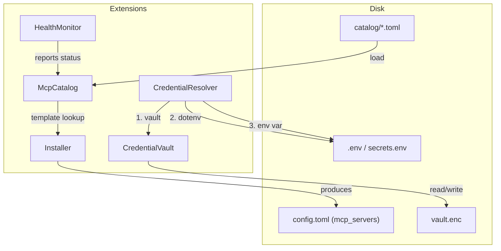

# Extensions System

# Extensions System (`librefang-extensions`)

## Overview

`librefang-extensions` provides the infrastructure for discovering, installing, and managing MCP (Model Context Protocol) server integrations. It handles everything from browsing a template catalog to securely storing credentials and monitoring server health.

The crate is organized around five concerns:

| Concern | Module | Purpose |
|---|---|---|
| Template discovery | `catalog` | Read-only catalog of MCP server templates cached at `~/.librefang/mcp/catalog/*.toml` |
| Secret storage | `vault`, `dotenv` | AES-256-GCM encrypted vault (`vault.enc`) plus `.env` file loading |
| Credential resolution | `credentials` | Unified resolution chain across vault, dotenv, env vars, and interactive prompts |
| Installation | `installer` | Pure transforms from catalog templates into `[[mcp_servers]]` config entries |
| OAuth & health | `oauth`, `health` | PKCE browser flows and background health monitoring with auto-reconnect |

## Architecture



## Core Types

All shared types live in the crate root (`src/lib.rs`).

### `McpCatalogEntry`

The central data model. Each catalog template describes one MCP server:

```rust
pub struct McpCatalogEntry {
    pub id: String,                          // e.g. "github"
    pub name: String,                        // e.g. "GitHub"
    pub description: String,
    pub category: McpCategory,               // DevTools, Productivity, Communication, etc.
    pub transport: McpCatalogTransport,       // Stdio, Sse, or Http
    pub required_env: Vec<McpCatalogRequiredEnv>,  // Credentials needed
    pub oauth: Option<OAuthTemplate>,         // OAuth config (None = API key only)
    pub health_check: HealthCheckConfig,      // Check interval & thresholds
    // ...
}
```

Transport templates use `McpCatalogTransport` — a subset of the kernel's `McpTransportEntry` that excludes `HttpCompat` (a power-user-only transport that never ships as a catalog template). The installer converts between the two during installation.

### `McpStatus`

Represents the lifecycle state of an MCP server:

- **Available** — Catalog entry exists, not yet installed
- **Setup** — Installed but credentials are missing
- **Ready** — Installed, credentials present, server running
- **Error(String)** — Server failed
- **Disabled** — User-disabled

### Error Handling

All operations return `ExtensionResult<T>` via the `ExtensionError` enum, covering catalog misses, vault errors, OAuth failures, IO, and HTTP errors.

---

## Module Reference

### `catalog` — MCP Template Catalog

`McpCatalog` holds an in-memory view of all template TOML files under `~/.librefang/mcp/catalog/`. It supports two directory layouts:

- **Flat**: `<id>.toml` — ID derived from filename
- **Directory**: `<id>/MCP.toml` — ID derived from directory name

```rust
let mut catalog = McpCatalog::new(&home_dir);
let count = catalog.load(&home_dir);  // Full reload — clears stale entries

// Lookup
let entry = catalog.get("github");          // Option<&McpCatalogEntry>

// Browsing
let all = catalog.list();                   // Vec<&McpCatalogEntry>, sorted by id
let tools = catalog.list_by_category(&McpCategory::DevTools);

// Search (matches id, name, description, tags, case-insensitive)
let results = catalog.search("slack");
```

Catalog entries are **read-only**. The user's installed servers live in `config.toml` under `[[mcp_servers]]` with an optional `template_id` field pointing back to the catalog entry. The catalog is refreshed from the upstream registry by `librefang_runtime::registry_sync`.

### `vault` — Encrypted Credential Storage

AES-256-GCM encrypted storage at `~/.librefang/vault.enc`. The vault file uses a custom format with an `OFV1` magic header followed by a JSON payload containing base64-encoded salt, nonce, and ciphertext.

**Key derivation chain:**

1. Master key is either stored in the OS keyring (Windows Credential Manager, macOS Keychain, Linux Secret Service) or read from `LIBREFANG_VAULT_KEY` env var
2. Master key + random salt → Argon2id → derived encryption key
3. Derived key encrypts the JSON-serialized secrets with AES-256-GCM

When the OS keyring is unavailable, a **file-based fallback** wraps the master key with AES-256-GCM using an Argon2id-derived key from a machine fingerprint (username + hostname). Legacy v1 XOR-obfuscated keyring files are automatically migrated to v2 on first load.

```rust
let mut vault = CredentialVault::new(home_dir.join("vault.enc"));

// Initialize (generates key, stores in OS keyring)
vault.init()?;

// Or use an explicit key (testing / programmatic)
vault.init_with_key(master_key)?;

// Unlock for read/write
vault.unlock()?;

// CRUD
vault.set("GITHUB_TOKEN".to_string(), Zeroizing::new("ghp_...".into()))?;
let token = vault.get("GITHUB_TOKEN");  // Option<Zeroizing<String>>
vault.remove("GITHUB_TOKEN")?;
let keys = vault.list_keys();  // Vec<&str>
```

All secret values are wrapped in `Zeroizing<String>` — memory is zeroed on drop. The `CredentialVault`'s `Drop` implementation clears all entries and the cached master key.

### `dotenv` — Environment Loading

Loads secrets into the process environment from multiple sources. Must be called from synchronous `main()` **before** spawning any Tokio runtime — `std::env::set_var` is undefined behavior once other threads exist in Rust 1.80+.

**Priority order** (highest first — earlier sources win):

1. System environment variables (already present — never overridden)
2. Credential vault (`vault.enc`) — loaded and decrypted first
3. `~/.librefang/.env`
4. `~/.librefang/secrets.env`

```rust
// Call once from main() before tokio
librefang_extensions::dotenv::load_dotenv();

// Key management
librefang_extensions::dotenv::save_env_key("MY_API_KEY", "sk-...")?;  // Upserts into .env + process env
librefang_extensions::dotenv::remove_env_key("MY_API_KEY")?;
librefang_extensions::dotenv::list_env_keys();
```

`.env` files are written with `0600` permissions on Unix. Values containing spaces, `#`, or `"` are automatically double-quoted on write.

### `credentials` — Credential Resolution Chain

`CredentialResolver` provides a unified interface for looking up secrets across all sources:

```rust
let vault = CredentialVault::new(home_dir.join("vault.enc"));
let mut resolver = CredentialResolver::new(
    Some(vault),
    Some(&home_dir.join(".env")),
).with_interactive(true);  // Enable stdin prompt as last resort

// Resolve a single credential
let token = resolver.resolve("GITHUB_PERSONAL_ACCESS_TOKEN");  // Option<Zeroizing<String>>

// Bulk resolution
let creds = resolver.resolve_all(&["KEY_A", "KEY_B", "KEY_C"]);

// Check what's missing (without prompting)
let missing = resolver.missing_credentials(&["KEY_A", "KEY_B"]);
// e.g. ["KEY_B"]

// Store a new credential
resolver.store_in_vault("KEY_B", Zeroizing::new("value".into()))?;

// Invalidate dotenv cache after external modification
resolver.clear_dotenv_cache("STALE_KEY");
```

Resolution order: vault → dotenv → `std::env` → interactive prompt (if enabled).

### `installer` — Catalog-to-Config Transform

The installer is a set of **pure functions** — no side effects. Callers (API handlers, CLI commands) decide when to persist results.

`install_integration` takes a catalog, credential resolver, template ID, and any user-provided key-value pairs. It:

1. Looks up the catalog template
2. Stores provided credentials in the vault (best-effort)
3. Checks which required env vars are still missing
4. Converts the template into an `McpServerConfigEntry`
5. Returns an `InstallResult` with the entry, status, and user message

```rust
let result = install_integration(
    &catalog,
    &mut resolver,
    "github",
    &provided_keys,  // HashMap<String, String>
)?;

// result.id = "github"
// result.server = McpServerConfigEntry { name: "github", template_id: Some("github"), ... }
// result.status = Ready or Setup (depending on missing credentials)
// result.missing_credentials = vec![] or vec!["GITHUB_PERSONAL_ACCESS_TOKEN"]
// result.message = human-readable status

// Caller persists:
config.mcp_servers.push(result.server);
save_config(&config)?;
```

The `template_id` field on `McpServerConfigEntry` records which catalog entry was installed, allowing the kernel and dashboard to link back to the catalog.

**Scaffolding helpers** are also provided:

- `scaffold_integration(dir)` — Creates a template `mcp.toml` for a new custom MCP server
- `scaffold_skill(dir)` — Creates `skill.toml` + `SKILL.md` for a new prompt-only skill

### `oauth` — OAuth2 PKCE Flows

Implements browser-based OAuth2 authorization with PKCE (Proof Key for Code Exchange) for Google, GitHub, Microsoft, and Slack. PKCE doesn't require a client secret, so public client IDs are safe to embed.

`run_pkce_flow` performs the complete flow:

1. Generates PKCE verifier + S256 challenge
2. Binds a temporary localhost TCP listener on a random port
3. Opens the browser to the authorization URL (falls back to printing the URL)
4. Serves a one-shot callback handler via Axum with CSRF state validation
5. Exchanges the authorization code for tokens (5-minute timeout)
6. Returns `OAuthTokens` with `Zeroizing`-wrapped access/refresh tokens

```rust
let oauth = OAuthTemplate {
    provider: "github".into(),
    scopes: vec!["repo".into(), "read:org".into()],
    auth_url: "https://github.com/login/oauth/authorize".into(),
    token_url: "https://github.com/login/oauth/access_token".into(),
};

let tokens = run_pkce_flow(&oauth, client_id).await?;
let access = tokens.access_token_zeroizing();
let refresh = tokens.refresh_token_zeroizing();
```

Client IDs are resolved from `OAuthConfig` with defaults overridden by user-configured values.

### `health` — Server Health Monitoring

`HealthMonitor` tracks the health of configured MCP servers using a `DashMap<String, McpHealth>` for concurrent access from background tasks.

```rust
let monitor = HealthMonitor::new(HealthMonitorConfig {
    auto_reconnect: true,
    max_reconnect_attempts: 10,
    max_backoff_secs: 300,
    check_interval_secs: 60,
});

monitor.register("github");

// Background task reports status
monitor.report_ok("github", 12);  // 12 tools available
monitor.report_error("slack", "Connection refused".into());

// Query
let health = monitor.get_health("github");  // Option<McpHealth>
let all = monitor.all_health();             // Vec<McpHealth>

// Reconnect logic
if monitor.should_reconnect("slack") {
    monitor.mark_reconnecting("slack");
    let backoff = monitor.backoff_duration(attempt);  // Exponential: 5s → 10s → 20s → ... → 5min max
    // ... attempt reconnect ...
}
```

`McpHealth` tracks consecutive failures, reconnect attempts, last success/error timestamps, tool count, and uptime.

### `http_client` — Shared HTTP Client

Provides a preconfigured `reqwest::Client` with CA certificate fallback:

```rust
let client = librefang_extensions::http_client::new_client();
```

Tries native system certificates first (`rustls_native_certs`). If none are found, falls back to Mozilla's `webpki_roots` bundle. Uses `aws_lc_rs` as the TLS crypto provider.

---

## File Layout

```
~/.librefang/
├── config.toml              # [[mcp_servers]] entries live here
├── vault.enc                # AES-256-GCM encrypted credentials (OFV1 format)
├── .env                     # User-managed environment keys
├── secrets.env              # Additional secrets (lower priority than .env)
└── mcp/
    └── catalog/
        ├── github.toml      # Flat template
        ├── slack/
        │   └── MCP.toml     # Directory-backed template
        └── ...

<system-local-dir>/librefang/.keyring   # File-based keyring fallback (if OS keyring unavailable)
```

## Thread Safety Notes

- `HealthMonitor` uses `DashMap` — safe to call `register`, `report_ok`, `report_error`, `get_health` from multiple Tokio tasks concurrently.
- `CredentialVault` and `CredentialResolver` are **not** `Sync` — create per-task or protect with a `Mutex`.
- `dotenv::load_dotenv` uses a `Once` gate and must be called from single-threaded `main()` before spawning async tasks.
- `CredentialResolver::clear_dotenv_cache` is for post-boot invalidation from a single task (e.g., after a dashboard deletes a key).