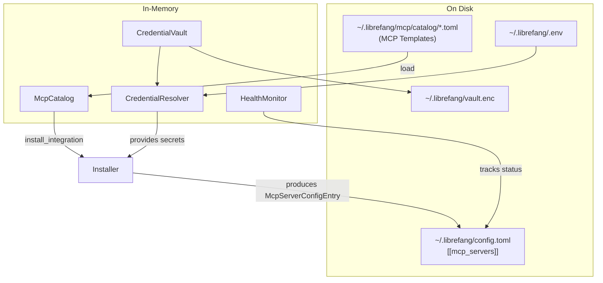

# Extensions System

# Extensions System (`librefang-extensions`)

MCP server catalog, encrypted credential vault, OAuth2 PKCE flows, health monitoring, and installation transforms. This crate provides the infrastructure for discovering, configuring, authenticating, and monitoring MCP (Model Context Protocol) server integrations.

## Architecture



## Core Types (`lib.rs`)

The root module defines the shared types used across all submodules.

**`McpCatalogEntry`** — A bundled MCP server template (e.g., "github", "slack"). Deserialized from TOML files in the catalog directory. Fields include:

- `id` — Unique identifier matching the filename or directory name
- `name`, `description`, `icon`, `tags` — Display metadata
- `category` — One of `DevTools`, `Productivity`, `Communication`, `Data`, `Cloud`, `AI`
- `transport` — How to launch the server (`McpCatalogTransport::Stdio`, `Sse`, or `Http`)
- `required_env` — List of `McpCatalogRequiredEnv` describing each credential the server needs
- `oauth` — Optional `OAuthTemplate` for servers requiring OAuth2
- `health_check` — `HealthCheckConfig` with interval and failure threshold

**`McpStatus`** — Lifecycle state of an MCP server:

| Variant | Meaning |
|---------|---------|
| `Available` | Catalog entry exists, not yet installed |
| `Setup` | Installed but credentials are missing |
| `Ready` | Configured and running |
| `Error(String)` | Server errored |
| `Disabled` | User-disabled |

**`ExtensionError`** — Unified error type covering `NotFound`, `AlreadyInstalled`, `VaultLocked`, `OAuth`, `Io`, and others. All fallible operations return `ExtensionResult<T>`.

---

## MCP Catalog (`catalog`)

Read-only in-memory index of MCP server templates cached at `~/.librefang/mcp/catalog/`. Templates are refreshed from the upstream registry by `librefang_runtime::registry_sync`.

### File Layout

Two layouts are valid:

```
catalog/
  github.toml          # Flat file — id = "github"
  slack/
    MCP.toml           # Directory-backed — id = "slack"
```

### API

**`McpCatalog::new(home_dir)`** — Creates an empty catalog rooted at `home_dir/mcp/catalog/`.

**`catalog.load(home_dir)`** — Full reload: clears existing entries, scans the catalog directory, parses all TOML files. Returns the count loaded. Malformed files emit a `warn!` and are skipped.

**`catalog.get(id)`** — Look up a single entry by ID.

**`catalog.list()`** — All entries sorted by ID.

**`catalog.list_by_category(category)`** — Filter by `McpCategory`.

**`catalog.search(query)`** — Case-insensitive substring match against `id`, `name`, `description`, and `tags`.

Reload semantics are full (not incremental): `load()` clears the map first so deleted files don't linger.

---

## Credential Management

Credentials are resolved from multiple sources through a priority chain. The three modules (`vault`, `credentials`, `dotenv`) work together but serve distinct roles.

### Credential Vault (`vault`)

AES-256-GCM encrypted file storage at `~/.librefang/vault.enc`.

**Key management:**

1. **OS keyring** (preferred) — Windows Credential Manager, macOS Keychain, or Linux Secret Service. When the OS keyring is unavailable, falls back to a file at `$LOCAL_DATA_DIR/librefang/.keyring` encrypted with AES-256-GCM using a key derived from a machine fingerprint (username + hostname via Argon2id).
2. **Environment variable** — `LIBREFANG_VAULT_KEY` (base64-encoded 32-byte key) for headless/CI environments.

**File format:** `OFV1` magic header + JSON containing base64-encoded salt, nonce, and ciphertext. Legacy JSON-only files (without the magic header) are still accepted for backward compatibility.

**Encryption chain:**
- Master key + random salt → Argon2id → derived key
- Derived key + random nonce → AES-256-GCM → ciphertext
- The vault is re-encrypted on every `set()` or `remove()` call with fresh salt and nonce

**Key API:**

```rust
let mut vault = CredentialVault::new(path);
vault.init()?;                    // Generate key, store in keyring, create empty vault
vault.unlock()?;                  // Load and decrypt from disk
vault.set(key, value)?;           // Insert + re-encrypt
vault.get(key)                    // Returns Zeroizing<String>
vault.remove(key)?;               // Delete + re-encrypt
vault.list_keys()                 // Key names only (no values)
```

For programmatic/test use, `init_with_key` and `unlock_with_key` accept an explicit `Zeroizing<[u8; 32]>`.

All secret values use `Zeroizing<String>` to ensure memory is zeroed on drop. The `Drop` implementation for `CredentialVault` clears the entries map and cached key.

### Credential Resolver (`credentials`)

Tries multiple sources in priority order:

```
1. Encrypted vault (~/.librefang/vault.enc)
2. Dotenv file (~/.librefang/.env) — boot-time snapshot
3. Process environment variable
4. Interactive prompt (CLI only, opt-in)
```

**Usage:**

```rust
let resolver = CredentialResolver::new(vault, Some(dotenv_path))
    .with_interactive(true);

// Single credential
if let Some(val) = resolver.resolve("GITHUB_TOKEN") { ... }

// Batch resolution
let creds = resolver.resolve_all(&["KEY_A", "KEY_B"]);

// Check what's missing
let missing = resolver.missing_credentials(&["KEY_A", "KEY_B"]);
```

`store_in_vault` persists a credential through the vault. `clear_dotenv_cache` evicts a stale entry from the in-memory dotenv snapshot (e.g., after a dashboard deletion).

### Dotenv Loader (`dotenv`)

Loads secrets into `std::env` so every entry point (CLI, desktop, kernel) behaves identically.

**Priority (highest first):**

```
1. System environment variables (never overridden)
2. Credential vault (vault.enc)
3. ~/.librefang/.env
4. ~/.librefang/secrets.env
```

**Critical timing constraint:** `load_dotenv()` must be called from synchronous `main()` before spawning any tokio runtime. `std::env::set_var` is undefined behavior in Rust 1.80+ once other threads exist. A `Once` guard prevents double-loading.

**File management functions:**

- `save_env_key(key, value)` — Upsert into `.env`, set in process env, creates file with 0600 permissions on Unix
- `remove_env_key(key)` — Remove from `.env` and process env
- `list_env_keys()` — Key names only
- `env_file_exists()` — Check if `.env` is present

---

## Health Monitor (`health`)

Thread-safe health tracking for configured MCP servers using `DashMap` for concurrent access from background tasks.

**`McpHealth`** tracks per-server state: status, tool count, last successful check timestamp, consecutive failures, reconnect state, and connected-since timestamp.

**`HealthMonitor`** API:

```rust
let monitor = HealthMonitor::new(HealthMonitorConfig::default());
monitor.register("github");
monitor.report_ok("github", 12);          // Mark healthy, record tool count
monitor.report_error("github", err_msg);   // Increment failure count
monitor.should_reconnect("github");        // true if errored and attempts remain
monitor.mark_reconnecting("github");       // Increment attempt counter
monitor.get_health("github");              // Clone of current state
monitor.all_health();                      // All servers
```

**Auto-reconnect with exponential backoff:**

| Attempt | Delay |
|---------|-------|
| 0 | 5s |
| 1 | 10s |
| 2 | 20s |
| 3 | 40s |
| ... | Capped at 5 minutes |

Default config: `max_reconnect_attempts: 10`, `max_backoff_secs: 300`, `check_interval_secs: 60`. Set `auto_reconnect: false` to disable.

`mark_ok` resets the failure counter and reconnect state. `report_error` increments `consecutive_failures` and clears `connected_since`.

---

## Installer (`installer`)

Pure transforms — no I/O side effects. Converts a catalog template into a `McpServerConfigEntry` suitable for writing into `config.toml`.

**`install_integration(catalog, resolver, id, provided_keys)`**:

1. Looks up the template by `id` in the catalog
2. Stores any `provided_keys` in the vault (best-effort, warns on failure)
3. Checks which `required_env` keys are still unresolved
4. Returns `InstallResult` with the constructed `McpServerConfigEntry`, status (`Ready` or `Setup`), missing credential names, and a user-facing message

The caller (API handler or CLI command) is responsible for persisting the entry to `config.toml` and triggering a kernel reload.

**`catalog_entry_to_mcp_server(entry)`** — Lower-level transform that maps `McpCatalogTransport` → `McpTransportEntry`, sets `template_id`, and populates env var names from `required_env`. Used internally by `install_integration`.

**Scaffolding:**

- `scaffold_integration(dir)` — Creates a `mcp.toml` template for a custom MCP server
- `scaffold_skill(dir)` — Creates `skill.toml` + `SKILL.md` for a new skill

---

## OAuth (`oauth`)

OAuth2 Authorization Code flow with PKCE (Proof Key for Code Exchange) for providers that support it (Google, GitHub, Microsoft, Slack). PKCE eliminates the need for a client secret.

**`run_pkce_flow(oauth_template, client_id)`** — Async function that:

1. Generates a PKCE verifier/challenge pair (S256)
2. Binds a temporary localhost HTTP server on a random port
3. Opens the browser to the authorization URL
4. Waits up to 5 minutes for the callback with the authorization code
5. Exchanges the code for tokens via POST to the token endpoint
6. Returns `OAuthTokens` (access token, optional refresh token, expiry, scopes)

The callback server uses `axum` with a single `/callback` route. CSRF protection is handled via a random `state` parameter. Tokens are available as `Zeroizing<String>` via `access_token_zeroizing()` and `refresh_token_zeroizing()`.

**Client ID resolution:** `resolve_client_ids(config)` merges defaults with overrides from `OAuthConfig` (per-provider `*_client_id` fields). Defaults are placeholders — production deployments should configure real client IDs.

---

## HTTP Client (`http_client`)

Shared `reqwest::Client` builder that handles TLS certificate verification in environments where the system cert store may be incomplete or missing.

**Strategy:**

1. Load native certificates via `rustls_native_certs`
2. If zero certs were loaded, fall back to `webpki_roots` (Mozilla's bundled CA set)
3. Build a `reqwest::Client` with the resulting `rustls::ClientConfig`

**API:**

- `client_builder()` — Returns a `ClientBuilder` for further customization
- `new_client()` — Returns a fully built `Client` (panics on failure, which should never happen with bundled roots)

---

## Integration Points

The extensions crate is consumed by:

- **`librefang-kernel`** — Uses `CredentialVault` for OAuth token storage, `HealthMonitor` for MCP server lifecycle, `CredentialResolver` for credential injection
- **`librefang-api`** — Calls `install_integration` from MCP management endpoints, uses `McpCatalog` for browsing/searching templates
- **CLI** — Calls `dotenv::load_dotenv()` at startup, uses `CredentialResolver::with_interactive(true)` for prompts, calls `install_integration` from `mcp add` commands
- **`librefang-skills`** — Calls `vault::exists()` as a general-purpose filesystem existence check at various skill loading/validation points

### Key convention

All installed MCP servers are stored as `[[mcp_servers]]` entries in `~/.librefang/config.toml`. An optional `template_id` field links back to the catalog entry. There is no separate `integrations.toml` — that file format has been removed.