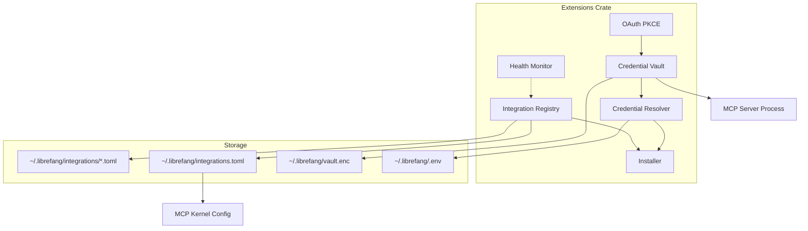
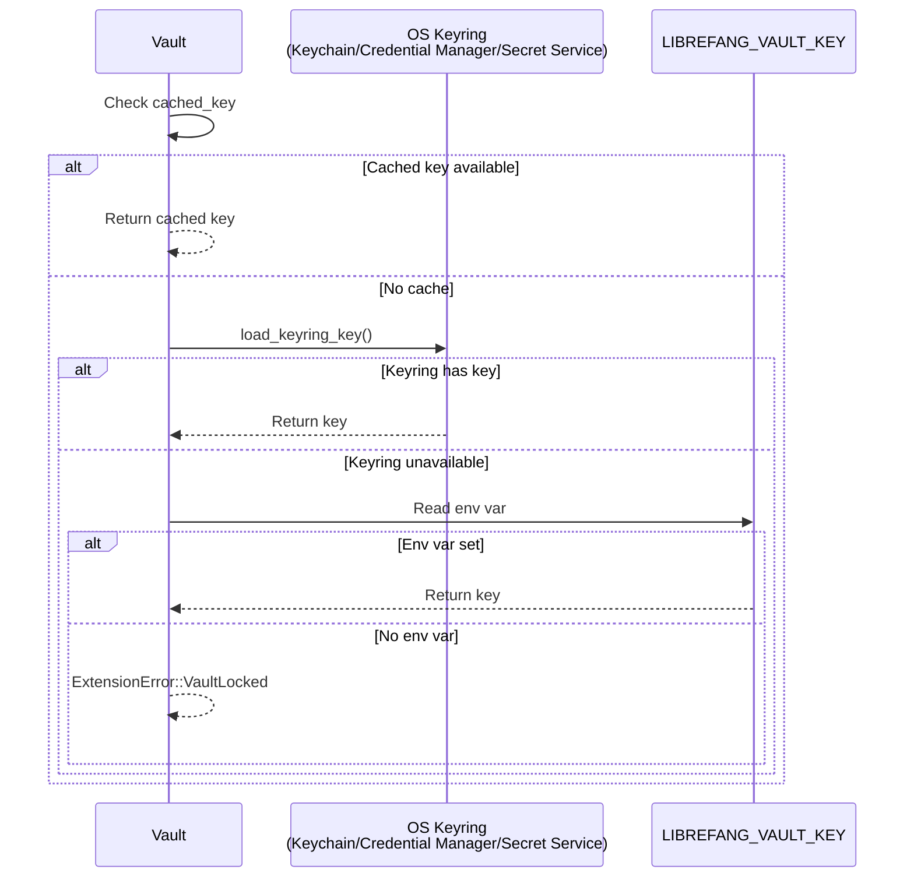
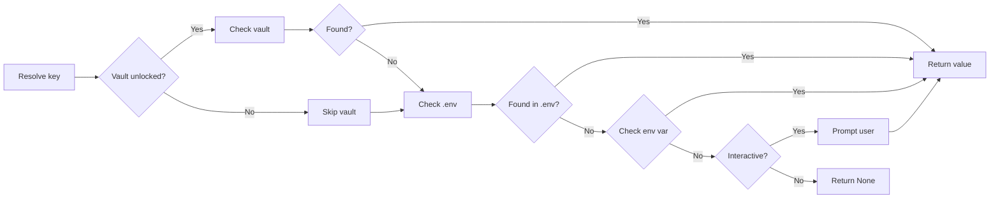
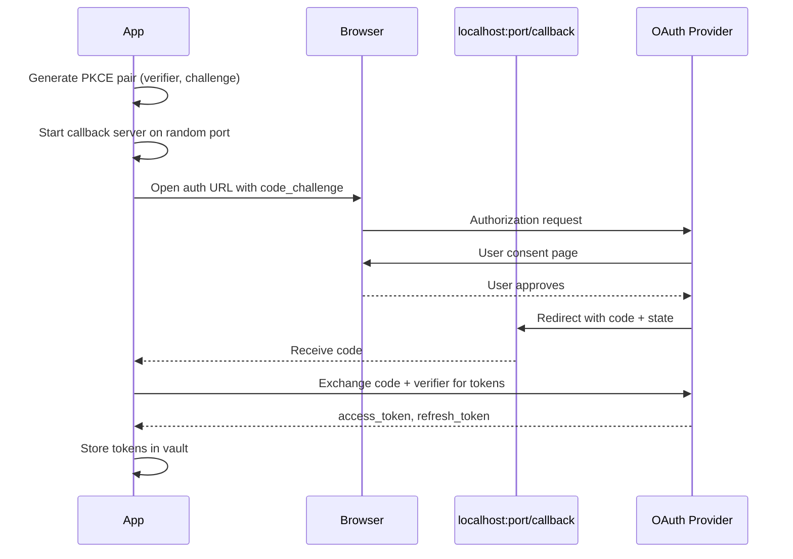
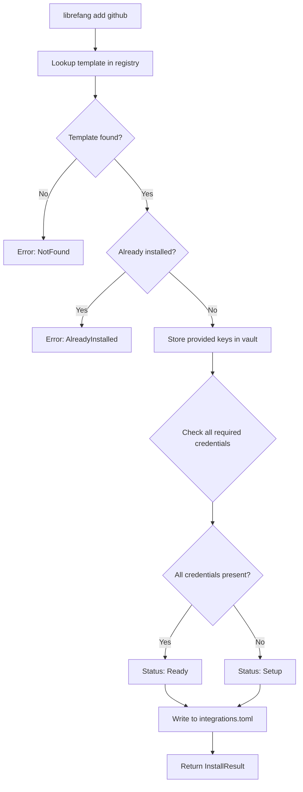

# Extensions System


# LibreFang Extensions System

The Extensions System (`librefang-extensions`) provides one-click integration for MCP (Model Context Protocol) servers. It handles the complete lifecycle: discovering available integrations, authenticating with credentials, running OAuth flows, persisting install state, and monitoring server health with automatic reconnection.

## Architecture Overview



## Core Types

### IntegrationTemplate

Describes a bundled MCP server integration:

```rust
pub struct IntegrationTemplate {
    pub id: String,                    // "github", "slack", etc.
    pub name: String,                  // Human-readable name
    pub description: String,
    pub category: IntegrationCategory,
    pub transport: McpTransportTemplate,
    pub required_env: Vec<RequiredEnvVar>,
    pub oauth: Option<OAuthTemplate>,
    pub health_check: HealthCheckConfig,
}
```

**Transport templates** define how the MCP server is launched:

```rust
pub enum McpTransportTemplate {
    Stdio { command: String, args: Vec<String> },
    Sse { url: String },
    Http { url: String },
}
```

### IntegrationStatus

Represents the current state of an integration:

| Status | Meaning |
|--------|---------|
| `Ready` | Configured and MCP server running |
| `Setup` | Installed but credentials missing |
| `Available` | Not installed |
| `Error(msg)` | MCP server errored |
| `Disabled` | User disabled the integration |

## Component Details

### Integration Registry (`registry.rs`)

Manages integration templates and install state.

**Key operations:**

```rust
impl IntegrationRegistry {
    // Load templates from ~/.librefang/integrations/*.toml
    pub fn load_templates(&mut self, home_dir: &Path) -> usize;

    // Load/save installed state from integrations.toml
    pub fn load_installed(&mut self) -> ExtensionResult<usize>;
    pub fn save_installed(&self) -> ExtensionResult<()>;

    // Template lookups
    pub fn get_template(&self, id: &str) -> Option<&IntegrationTemplate>;
    pub fn search(&self, query: &str) -> Vec<&IntegrationTemplate>;
    pub fn list_by_category(&self, category: &IntegrationCategory) -> Vec<&IntegrationTemplate>;

    // Install management
    pub fn install(&mut self, entry: InstalledIntegration) -> ExtensionResult<()>;
    pub fn uninstall(&mut self, id: &str) -> ExtensionResult<()>;
    pub fn set_enabled(&mut self, id: &str, enabled: bool) -> ExtensionResult<()>;

    // Convert to kernel config for MCP server spawning
    pub fn to_mcp_configs(&self) -> Vec<McpServerConfigEntry>;
}
```

**Template loading:** Templates are TOML files in `~/.librefang/integrations/` with the integration ID as the filename (e.g., `github.toml`). Each file contains a complete `IntegrationTemplate` struct.

**Persistence:** Install state lives in `~/.librefang/integrations.toml`:

```toml
[[installed]]
id = "github"
installed_at = "2026-02-23T10:00:00Z"
enabled = true
oauth_provider = null

[[installed]]
id = "google-calendar"
installed_at = "2026-02-23T10:05:00Z"
enabled = true
oauth_provider = "google"
```

### Credential Vault (`vault.rs`)

AES-256-GCM encrypted secret storage. Secrets persist in `~/.librefang/vault.enc`.

**File format:**
- Magic bytes: `OFV1` (Older Fang Vault v1)
- JSON body with `version`, `salt`, `nonce`, `ciphertext` (all base64)

**Key derivation:** Argon2id derives a 256-bit encryption key from the master key + random salt.

**Master key resolution order:**



**Keyring storage:** When OS keyring access fails, the system falls back to a file-based keyring (`~/.local/share/librefang/.keyring`) that wraps the master key with AES-256-GCM using a machine-specific wrapping key derived from username, hostname, and Argon2id.

**Vault operations:**

```rust
impl CredentialVault {
    // Initialize new vault (generates and stores master key)
    pub fn init(&mut self) -> ExtensionResult<()>;

    // Unlock existing vault
    pub fn unlock(&mut self) -> ExtensionResult<()>;

    // Secret management
    pub fn get(&self, key: &str) -> Option<Zeroizing<String>>;
    pub fn set(&mut self, key: String, value: Zeroizing<String>) -> ExtensionResult<()>;
    pub fn remove(&mut self, key: &str) -> ExtensionResult<bool>;
    pub fn list_keys(&self) -> Vec<&str>;

    // State queries
    pub fn is_unlocked(&self) -> bool;
    pub fn exists(&self) -> bool;
}
```

### Credential Resolver (`credentials.rs`)

Resolves credentials from multiple sources in priority order:



```rust
impl CredentialResolver {
    pub fn resolve(&self, key: &str) -> Option<Zeroizing<String>>;
    pub fn has_credential(&self, key: &str) -> bool;
    pub fn resolve_all(&self, keys: &[&str]) -> HashMap<String, Zeroizing<String>>;
    pub fn missing_credentials(&self, keys: &[&str]) -> Vec<String>;
    pub fn store_in_vault(&mut self, key: &str, value: Zeroizing<String>) -> ExtensionResult<()>;
}
```

### OAuth2 PKCE (`oauth.rs`)

Handles OAuth flows for Google, GitHub, Microsoft, and Slack.

**Flow:**



```rust
pub async fn run_pkce_flow(
    oauth: &OAuthTemplate,
    client_id: &str,
) -> ExtensionResult<OAuthTokens>
```

**Configuration:** Client IDs are resolved from `librefang_types::config::OAuthConfig` with fallback defaults. Users should configure their own client IDs in the config file for production use.

### Health Monitor (`health.rs`)

Tracks MCP server health and manages reconnection with exponential backoff.

```rust
impl HealthMonitor {
    pub fn register(&self, id: &str);
    pub fn unregister(&self, id: &str);

    pub fn report_ok(&self, id: &str, tool_count: usize);
    pub fn report_error(&self, id: &str, error: String);

    pub fn get_health(&self, id: &str) -> Option<IntegrationHealth>;
    pub fn all_health(&self) -> Vec<IntegrationHealth>;

    pub fn should_reconnect(&self, id: &str) -> bool;
    pub fn backoff_duration(&self, attempt: u32) -> Duration;
}
```

**Backoff schedule:** `5s → 10s → 20s → 40s → ...` capped at 5 minutes, with a maximum of 10 reconnect attempts.

**IntegrationHealth struct:**

```rust
pub struct IntegrationHealth {
    pub id: String,
    pub status: IntegrationStatus,
    pub tool_count: usize,
    pub last_ok: Option<DateTime<Utc>>,
    pub last_error: Option<String>,
    pub consecutive_failures: u32,
    pub reconnecting: bool,
    pub reconnect_attempts: u32,
    pub connected_since: Option<DateTime<Utc>>,
}
```

### Installer (`installer.rs`)

Provides the one-click installation experience:

```rust
pub fn install_integration(
    registry: &mut IntegrationRegistry,
    resolver: &mut CredentialResolver,
    id: &str,
    provided_keys: &HashMap<String, String>,
) -> ExtensionResult<InstallResult>

pub fn remove_integration(
    registry: &mut IntegrationRegistry,
    id: &str,
) -> ExtensionResult<String>

pub fn list_integrations(
    registry: &IntegrationRegistry,
    resolver: &CredentialResolver,
) -> Vec<IntegrationListEntry>

pub fn search_integrations(
    registry: &IntegrationRegistry,
    query: &str,
) -> Vec<IntegrationListEntry>
```

**Install flow:**



## Usage Example

```rust
use librefang_extensions::{IntegrationRegistry, CredentialResolver, CredentialVault};
use std::path::Path;

// Initialize components
let home = Path::new("~/.librefang");
let mut registry = IntegrationRegistry::new(home);
registry.load_templates(home)?;
registry.load_installed()?;

// Set up credential resolution
let mut vault = CredentialVault::new(home.join("vault.enc"));
vault.unlock().ok(); // May fail if vault not initialized
let resolver = CredentialResolver::new(Some(vault), Some(&home.join(".env")));

// List available integrations
let integrations = installer::list_integrations(&registry, &resolver);
for entry in &integrations {
    println!("{} {} [{}]", entry.icon, entry.name, entry.status);
}

// Search and install
let results = installer::search_integrations(&registry, "git");
if !results.is_empty() {
    let result = installer::install_integration(
        &mut registry,
        &mut resolver,
        &results[0].id,
        &HashMap::new(),
    )?;
    println!("{}", result.message);
}

// Convert to MCP kernel config
let mcp_configs = registry.to_mcp_configs();
// mcp_configs can be merged into the kernel's server list
```

## Error Handling

```rust
pub enum ExtensionError {
    NotFound(String),              // Integration not in registry
    AlreadyInstalled(String),     // Attempted duplicate install
    NotInstalled(String),         // Uninstall target missing
    CredentialNotFound(String),  // Secret resolution failed
    Vault(String),                // Vault operation failed
    VaultLocked,                  // Vault locked, needs unlock
    OAuth(String),                // OAuth flow error
    TomlParse(String),            // TOML parsing failed
    Io(std::io::Error),
    Http(String),
    HealthCheck(String),
}
```

## Key Design Decisions

### 1. Vault-First Credential Storage

Credentials default to the encrypted vault, with fallbacks for convenience. This balances security (credentials at rest are encrypted) with usability (env vars and dotenv work for development).

### 2. Template-Based Integration Discovery

Templates live on disk as TOML files, making them:
- Easy to browse without loading the crate
- Simple to add custom integrations
- Debuggable with standard tools

### 3. PKCE-Only OAuth

The OAuth implementation uses PKCE (Proof Key for Code Exchange), which:
- Doesn't require a client secret
- Protects against authorization code interception
- Works with public/client-side applications

### 4. Non-Blocking Vault Unlock

The vault caches the master key after first unlock to avoid repeated OS keyring or env var lookups during credential resolution. The key is zeroized on drop.

### 5. OFV1 Magic Bytes

The vault file format starts with `OFV1` magic bytes to distinguish it from plain JSON and provide forward compatibility for future format changes.