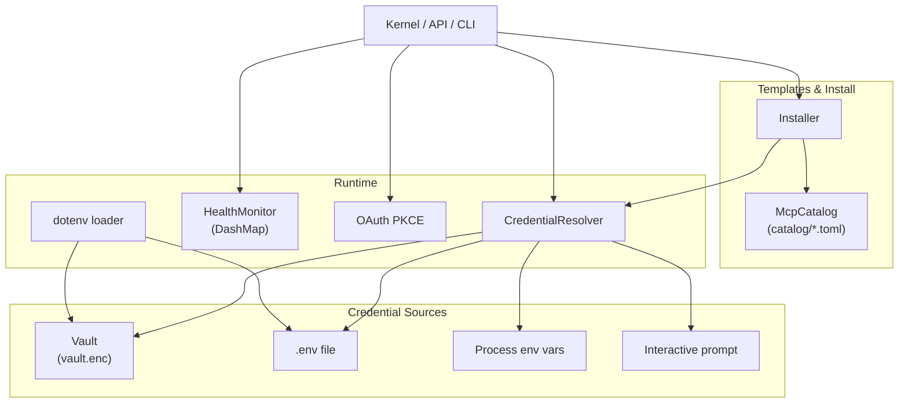

# Extensions & Vault

# Extensions & Vault (`librefang-extensions`)

## Purpose

`librefang-extensions` manages everything related to connecting LibreFang to external services: discovering MCP server templates, securely storing the credentials those services require, monitoring their health, and installing them into the user's config. It owns no side effects beyond disk I/O for the vault and `.env` files — the kernel, CLI, and API layer drive all writes.

All installed MCP servers are stored as `[[mcp_servers]]` entries in `~/.librefang/config.toml`, each with an optional `template_id` linking back to the catalog entry it came from.

## Architecture



---

## Key Components

### Credential Vault (`vault.rs`)

AES-256-GCM encrypted secret storage at `~/.librefang/vault.enc`. The vault provides at-rest encryption with path-bound AAD (additional authenticated data) so a ciphertext cannot be moved between file paths.

**Master key resolution** (in priority order):

1. `LIBREFANG_VAULT_KEY` environment variable
2. OS keyring (macOS Keychain / Windows Credential Manager / Linux Secret Service via `libsecret`)
3. File-based fallback at `<data_local_dir>/librefang/.keyring` — AES-256-GCM wrapped with an Argon2id key derived from a machine fingerprint

On macOS, the OS keyring is **opt-in** by default because the Keychain ACL is bound to the per-binary code signature — every `cargo build` invalidates the ACL and triggers a re-authorization prompt. Set `LIBREFANG_VAULT_NO_KEYRING=false` or configure `use_os_keyring: true` in config to override.

**Key operations:**

| Method | Description |
|---|---|
| `CredentialVault::new(path)` | Create a locked vault handle |
| `init()` | Generate a master key, store it, create an empty vault |
| `init_with_key(key)` | Initialize with an explicit 32-byte key (testing/programmatic) |
| `unlock()` | Decrypt and load entries using the resolved master key |
| `unlock_with_key(key)` | Unlock with an explicit key |
| `get(key)` / `set(key, value)` / `remove(key)` | CRUD on secrets |
| `rewrap_with_new_key(new_key)` | Re-encrypt the entire vault under a new master key |
| `verify_or_install_sentinel()` | Validate the startup sentinel (#3651) |

**Startup Sentinel (#3651):** Every vault contains a reserved `__sentinel__` key with a known plaintext value (`librefang-vault-sentinel-v1`). After `unlock()`, the boot path calls `verify_or_install_sentinel()` — if the sentinel decrypts to the wrong value, the daemon refuses to start with `VaultKeyMismatch`. This catches the case where `LIBREFANG_VAULT_KEY` points to the wrong key before any credential is silently lost. The sentinel key is write-protected: `set()` and `remove()` reject it.

**On-disk format:** `OFV1` magic header + JSON with `version`, `salt`, `nonce`, `ciphertext` (all base64), and `schema_version`. Schema version 0 uses path-only AAD (legacy compat); version 1 prepends the schema version as little-endian bytes to the AAD. Writes are atomic via `<path>.tmp` + `fsync` + `rename`, created with mode 0600.

**Keyring file migration:** Version 2 keyring files (raw `random_id` fingerprint) are auto-migrated to version 3 (SHA-512 mixed fingerprint) on first load.

### Credential Resolver (`credentials.rs`)

Resolves secrets from multiple sources in a fixed priority chain:

1. **Encrypted vault** (`vault.enc`) — if unlocked
2. **Dotenv file** (`~/.librefang/.env`) — loaded at construction time
3. **Process environment variables**
4. **Interactive prompt** — CLI only, opt-in via `.with_interactive(true)`

The resolver wraps the vault through a `VaultSource` enum that is either `Owned` (standalone vault for CLI/tests) or `Shared` (an `Arc<RwLock<CredentialVault>>` from the kernel's cached vault handle). The shared path avoids re-running Argon2id KDF on every API request.

```rust
// Short-lived (CLI, tests)
let resolver = CredentialResolver::new(Some(vault), Some(dotenv_path));

// Long-lived (API handlers) — reuses the kernel's cached vault
let resolver = CredentialResolver::with_vault_handle(
    Some(kernel_vault_handle),
    Some(dotenv_path),
);
```

**Key methods:**

- `resolve(key)` → `Option<Zeroizing<String>>` — try all sources in order
- `resolve_all(&[keys])` → `HashMap<String, Zeroizing<String>>` — batch resolve
- `missing_credentials(&[keys])` → `Vec<String>` — identify gaps
- `has_credential(key)` → `bool` — check without prompting
- `store_in_vault(key, value)` — write-through to the vault
- `clear_dotenv_cache(key)` — evict a stale dotenv entry after dashboard deletion

### Dotenv Loader (`dotenv.rs`)

Loads secrets into the process environment from multiple files, called once from synchronous `main()` before the tokio runtime starts (required because `std::env::set_var` is UB once other threads exist).

**Load priority** (highest first — earlier sources never override later ones):

1. Existing system environment variables
2. Credential vault (`vault.enc`)
3. `~/.librefang/.env`
4. `~/.librefang/secrets.env`

The `load_dotenv()` function is gated by a `Once` guard — repeated calls are no-ops.

**File management functions:**

- `save_env_key(key, value)` — upsert a key in `.env` with atomic write (PID-uniquified temp file, 0600 at creation time, `fsync` + `rename`)
- `remove_env_key(key)` — delete a key from `.env`
- `list_env_keys()` — enumerate key names (no values)
- `escape_env_value` / `unescape_env_value` — handle `\`, `\n`, `\r`, `"` inside double-quoted values; single-quoted values are literal

### MCP Catalog (`catalog.rs`)

Read-only in-memory index of MCP server templates stored at `~/.librefang/mcp/catalog/`. Templates are refreshed from the upstream `librefang-registry` by `librefang_runtime::registry_sync`.

**Two valid layouts:**

- **Flat:** `<id>.toml` — ID from filename minus extension
- **Directory:** `<id>/MCP.toml` — for multi-file MCP packages, ID from directory name

`load()` performs a full reload — existing entries are cleared before reading disk so deleted templates don't linger.

**Query methods:**

- `get(id)` — lookup by ID
- `list()` — all entries sorted by ID
- `list_by_category(category)` — filter by `McpCategory` (DevTools, etc.)
- `search(query)` — fuzzy match against ID, name, description, and tags

### Health Monitor (`health.rs`)

Tracks the operational status of configured MCP servers using a `DashMap<String, McpHealth>` for lock-free concurrent access from background health-check tasks and foreground API handlers.

**`McpHealth` fields:** `status` (Ready/Error/Available/Setup), `tool_count`, `last_ok`, `last_error`, `consecutive_failures`, `reconnecting`, `reconnect_attempts`, `connected_since`.

**Auto-reconnect** uses exponential backoff: 5s → 10s → 20s → 40s → ... capped at 300s (configurable via `max_backoff_secs`), with a maximum of 10 attempts. The monitor only suggests reconnection via `should_reconnect()` — the actual reconnect logic lives in the kernel.

```rust
let monitor = HealthMonitor::new(HealthMonitorConfig::default());
monitor.register("github");
monitor.report_ok("github", 12);
let should = monitor.should_reconnect("github"); // false — healthy
```

### OAuth2 PKCE (`oauth.rs`)

Implements the complete Authorization Code + PKCE flow for Google, GitHub, Microsoft, and Slack. Each flow:

1. Generates a PKCE code verifier/challenge pair (S256)
2. Binds an ephemeral localhost HTTP server to a random port
3. Constructs an HMAC-signed state token binding the flow to `(auth_url, client_id, redirect_uri, nonce, expiry)`
4. Opens the browser to the authorization URL
5. Waits for the callback (5-minute timeout)
6. Exchanges the authorization code for tokens

**State token security (#3791):** The state is `base64url(json_payload).base64url(hmac)`. The HMAC key is a per-process random 32-byte value (`OnceLock`), so a daemon restart invalidates any in-flight flows. Verification checks the HMAC in constant time, confirms the payload hasn't expired (10-minute TTL), and validates that the `provider`, `client_id`, and `redirect_uri` match the expected values. Only the first valid callback wins; subsequent hits get a "Gone" response.

Client IDs are resolved from defaults (embedded placeholders) with config-file overrides via `resolve_client_ids()`.

### HTTP Client (`http_client.rs`)

A shared `reqwest::ClientBuilder` configured with:

- Native CA roots (via `rustls_native_certs`) with `webpki_roots` fallback
- `aws_lc_rs` TLS provider
- 10-second connect timeout, 30-second read timeout
- Maximum 5 redirects

Use `client_builder()` for custom configuration or `new_client()` for the default built client.

### Installer (`installer.rs`)

Pure transforms from catalog templates to `McpServerConfigEntry` values. No side effects — the caller decides when to persist the result.

**`install_integration(catalog, resolver, id, provided_keys)`** pipeline:

1. Look up the template by ID in the catalog
2. Store any user-provided credentials in the vault (best-effort)
3. Check which required env vars are still missing
4. Convert the template transport into a `McpTransportEntry`
5. Return an `InstallResult` with status (`Ready` if all creds present, `Setup` if missing), the server entry, and a human-readable message

**`catalog_entry_to_mcp_server(entry)`** maps transport types:

- `McpCatalogTransport::Stdio { command, args }` → `McpTransportEntry::Stdio`
- `McpCatalogTransport::Sse { url }` → `McpTransportEntry::Sse`
- `McpCatalogTransport::Http { url }` → `McpTransportEntry::Http`

The resulting entry gets `template_id` set to the catalog ID so the dashboard can trace it back.

**Scaffolding:** `scaffold_integration(dir)` and `scaffold_skill(dir)` generate starter TOML templates for custom MCP servers and skills respectively.

---

## Integration Points

### Daemon Boot Sequence

The vault is central to daemon startup. The typical flow:

1. `dotenv::load_dotenv()` runs from synchronous `main()` — injects vault secrets + `.env` into process env
2. `run_daemon()` → `check_bind_auth_safety()` → `resolve_dashboard_credential()` → `vault.unlock()`
3. After unlock, `verify_or_install_sentinel()` validates the key
4. The kernel caches the unlocked vault as an `Arc<RwLock<CredentialVault>>` for API request handlers

### API Request Path

API handlers (terminal operations, skill routes) call `resolve_dashboard_credential()` which reads from the cached vault. The `CredentialResolver` with `VaultSource::Shared` routes through this cache to avoid Argon2id on every request.

### TUI / CLI

The init wizard (`tui/screens/init_wizard.rs`) and free provider guide (`tui/screens/free_provider_guide.rs`) call `save_env_key()` directly. The CLI `vault rotate-key` subcommand uses `decode_master_key()`, `init_with_key()`, `rewrap_with_new_key()`, and `verify_or_install_sentinel()`.

---

## Error Handling

All operations return `ExtensionResult<T>` (`Result<T, ExtensionError>`). Key error variants:

| Variant | Meaning |
|---|---|
| `NotFound(id)` | Catalog entry doesn't exist |
| `VaultLocked` | Vault hasn't been unlocked yet |
| `VaultKeyMismatch { hint }` | Sentinel failed — wrong master key |
| `Vault(msg)` | Encryption/decryption/IO failure |
| `OAuth(msg)` | PKCE flow failure |
| `Io(err)` | Filesystem errors |

---

## File Layout

```
~/.librefang/
├── vault.enc              # AES-256-GCM encrypted credentials
├── .env                   # User-managed secrets (0600)
├── secrets.env            # Additional secrets (0600)
├── config.toml            # [[mcp_servers]] entries live here
└── mcp/catalog/           # Template files
    ├── github.toml        # Flat layout
    ├── slack.toml
    └── my-server/         # Directory layout
        └── MCP.toml

<data_local_dir>/librefang/
└── .keyring               # File-based keyring fallback (0600)
```